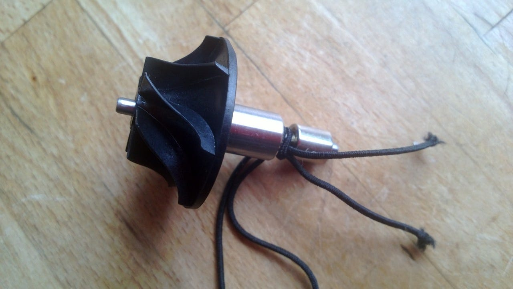

# Digital motors, software, and the rise of the internet of things

Software gets everywhere, even into the motors that drive vacuum cleaners, fans and hand dryers. 

Written by [Simon Bisson, Contributor](https://www.zdnet.com/meet-the-team/simon-bisson/)  on  Aug. 2, 2013 

There are many technologies that underpin modern society, from the  internal combustion engine to the microprocessor. But there's one that  looks set to become even more important: the electric motor.

With the Tesla S making the electric car a visible alternative, and an  electric plane completing a transcontinental flight for the first time,  the humble electric motor is making a play for the big leagues again.  And software is playing a key role.

 

​        A selection of Dyson digital motors (including a prototype control board) alongside a traditional electric motor.      

It's not just the visible  motors, of course. Electric motors are everywhere, and in everything.  Powerful and efficient, they're able to deliver torque where and when we need it. But there's one downside: they're often bulky, and the carbon  brushes used to switch between the coils of the motor's rotor erode  away, leaving a fine dust. They also need to be kept cool.

I've always been fascinated by electric motors, and I recently had the opportunity to meet with [Dyson](http://www.dyson.co.uk/default.aspx) to take a look at the latest version of [their motor design](http://content.dyson.co.uk/insidedyson/?basketTotal=0.00&basketQty=0&logged=false#ddm) — one they say is a significant improvement over the traditional electric motor. It's certainly compact, about half the size of an equivalent  traditional motor. The design has been around a while, but it's now in  nearly every device Dyson makes, and the company has set up a factory  just to make motors.

 

​        Dyson's switched reluctance motor  

    

Dyson's 'digital' motor is what’s known as a [switched reluctance motor](http://en.wikipedia.org/wiki/Switched_reluctance_motor). Instead of powering the rotor, a switched reluctance motor has a  magnetic core — so as power is switched through the coils of the stator  the magnetic core is dragged around to line up with the magnetic field  they generate. With more coils than magnetic poles on the rotor it's  possible to set up a switching pattern in the coils that pulls the rotor around. That means using sensors and complex switching circuitry, as  controlling the magnetic fields in the motor is the key to delivering an efficient motor.

Switched reluctance motors like this can be very efficient, and Dyson claim that their motor is 84 percent efficient (compared to 40 percent for a  traditional electric motor). There’s a lot to be said for a compact,  high power, motor like this — not just for vacuum cleaners and hand  driers. It also meant using a lot of design tools — much of it using  Dyson's own simulation software.

The rotor in Dyson’s motor is relatively simple — with just two poles. That simplifies the control problem, and reduces the number of windings  needed to create the pattern of field pulses used to pull the rotor  round, here at over 100,000 rpm. Normally the magnets in a switched  reluctance motor are quite weak. That's not the case with Dyson's motor, where we’ve ended up using an early model’s rotor as a fridge magnet.

 

​        The magnetic rotor from one of Dyson's motors. We use this one as a fridge magnet.      

More powerful magnets means a more complex control problem, but also lets Dyson make the motors  much smaller and lighter. That’s where the digital comes in, as solving  that problem has meant using an off-the-shelf microcontroller and  writing software, rather than developing specific control circuitry.  Using a simple Hall effect magnetic sensor to determine where the rotor  is, the control software makes more than 3,000 adjustments to the  magnetic field pattern every second.

Getting software into a motor like this is key to making it economically.  Designing your own control hardware is expensive, and if you're trying  to develop a general purpose motor, taking a software route adds  flexibility — as you can modify the code to take into account different  loads and usage models. That means the same control module will work in a vacuum cleaner, in a hand dryer, and in a fan. You can also take  advantage of modern control theory, which focuses on keeping systems  inside boundary conditions, rather than implementing a closed loop  classical control model — which could easily become unstable.

If the new design of motor is so good, that out to show through in the  products that use it, like the Hot+Cool fan. We've been testing this  since the bitterly cold snap that hit the UK in February and March this  year, and in the recent heatwave. It uses the motor to suck in air  through the base and push it out through a 2.5mm gap that runs all round the oval loop at the top. That means no fan blades to get dirty and  rattle (or trap your fingers or the cats tail if they get too close).

The sound of the motor is both quieter and is more regular than the beat  interference you can hear with a fan blade going round, and it's a far  more efficient and continuous flow — which means you rarely need to run  it on high, keeping things quieter still. It's quiet enough to leave on  during a conference call and at low speeds it's quiet enough that you  can forget the fan is on — apart from it keeping you comfortably warm or cool.

If you run a server in a small office, you can get away  without air conditioning and if you're working from home in the winter  you can run the Hot+Cool in one room rather than putting the heating on  in the whole house all day.

The same new motor is in the latest  model of the handheld Dyson vacuum, the DC44, which has a similar  combination of efficiency and smart design. On hard floors, it's hard to pick up fine dust; static electricity builds up as you walk around and  keeps the dust clinging to the floor. The brush bar on the DC44 has  carbon fibre filaments; they're not only touch enough to last several  years, they also discharge the static so more dust gets sucked up.

The Dyson handhelds have battery lifecycles we'd love to see in notebooks  as well. We've been using the original Dyson Root handheld since it came onto the market in the late 90s and even our original model still  charges up and holds a charge for a good ten minutes of cleaning.  Compare that to laptop batteries that lose a few percent of their  charging capacity every year and you can tell Dyson really does do good  engineering.

**Dyson’s digital motor** is another example of the  importance of software, and of digital controllers. As we move into the  future of the Internet of Things, it’s controllers like this that are  going to provide information that improves the design of hardware and of control software. It's easy to imagine a future version of such motors  that sends data back to a cloud service that can detect the early stages of failures, or that can send back optimised control routines based on your device  usage.

It's a brave new world indeed when traditional electrical engineering turns into software.