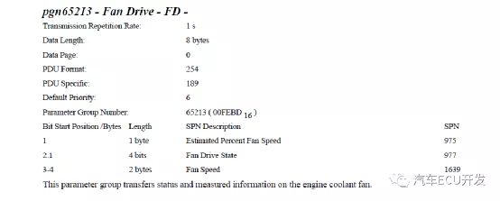
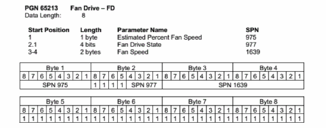

# 浅析J1939协议：CAN2.0应用层协议

SAE J1939协议是基于CAN2.0B协议之上的应用层协议，但是SAE  J1939协议并不仅仅是个应用层协议，她对物理层，数据链路层，网络层，应用层，故障诊断，  网络层管理层等都做了详细的规定,只不过这其中很多规定都跟CAN2.0B一致。我们这里只介绍J1939的应用层，对软件开发来说已经足够。对熟悉CAN2.0B协议的小伙伴来说，其实只要掌握下面几个关键点，J1939就瞬间不再神秘。

J1939协议是基于CAN2.0B的应用层协议，所有J1939报文都是使用29位标志符。

CAN报文中我们有11位标志符的标准帧也有29位标志符的扩展帧，在J1939协议中，我们所有报文都是29位标志符, 数据域则跟CAN报文的数据没有区别。

CAN报文是基于ID的，而J1939协议是基于**PGN**的。

这一点几乎就是J1939协议的全部内容。CAN2.0B使用29位的标志符来区分不同的报文，J1939对这29标志符进行了重新的分类和解释。打个不是很恰当的比方，  以前CAN2.0B协议根据人的体重来区分不同的人，只要一样重(ID)就认为是相同的人群，体重越瘦的就越是受CAN2.0B协议喜欢(优先级越高),现在J1939也是测量体重，  只不过是把人的脑袋，躯干，双手，双腿分别测量，然后对这几个重量进行某种运算(比如脑袋重量的平方，躯干重量与双手重量乘积，以及双腿重量这三个数字之和), 只要运算的结果(**PGN**)一致，就认为这些人是一个人群。

也就是说,J1939对CAN2.0B中的29位标志进行了重新解释,我们使用下面这张图来说明一下:

J1939对CAN ID进行了重新划分，加上最多**8**个字节的数据域，构成了J1939 的协议数据单元(Protocol Data Unit, PDU)，其中前3位表示优先级位(Priority, P)， 之后是扩展数据页位(Extended Data Page, EDP),数据页位(Data Page,DP), PDU格式位(PDU Format, PF), PDU特定域位(PDU Specific,  PS), 源地址位(Source Address,SA) 以及数据域(Data Filed)。

J1939的协议数据单元与CAN 报文帧相比要少一部分，比如SOF, SRR, IDE等，这是因为这部分完全由CAN 2.0B控制，J1939并未对这部分做任何修改。J1939与CAN报文帧的对比可参考下图:

如上图所示，J1939重新划分了29位的CAN ID,中间18位共同组成了参数组编号(**Parameter Group Number,** ***PGN***),在CAN 报文中，我们根据CAN  ID来区分不同报文，在J1939中，  我们根据PGN来区分不同的报文。J1939-71中对不同的PGN做了一系列详细的规定，不同的PGN来表示不同的数据或者功能。J1939-71对PGN的规定非常详细,足足有六百多页， 对于用户来说，可能熟悉自己常用的一些PGN就足够了，具体需要某些功能时去查询就好了。

总结一下就是，J1939跟CAN 2.0B不同的地方就在于，J1939是以PGN为中心，通过不同的PGN来区分不同的类型,比如有些PGN传输<u>控制命令</u>，有些PGN<u>传输数据</u>，  有些传输<u>请求</u>，有些传输<u>响应</u>等等。在使用CAN传输数据时，CAN协议往往是我们自己定义的，  而J1939-71中对不同的PGN做了详细的规定，相当于已经帮我们做好了协议。当然实际情况中我们也可以自定义PGN。理解了这些后，学习J1939就会变得很简单， 之后再对J1939的细节做一些介绍。

**J1939 PDN各部分介绍**

下面分别对协议数据单元的几个部分做简单介绍:

**优先级(P)**

根据CAN2.0B  的仲裁机制,ID越小优先级越高，按照J1939协议的划分，优先级在整个ID的最前面，实际上依然控制着ID大小,即CAN报文的优先级。只不过在***J1939协议中优先级仅仅用于优化发送数据时的报文延迟，接收报文时则完全忽略优先级***。J1939中的优先级可以从最高的0(000b)到最低优先级7(111b)。默认情况下控制类报文的优先级为3,其他报文的优先级为6。当分配新的PGN或总线上流量改变时，允许提高或者降低优先级。

**扩展数据页(Extended Data Page, EDP,保留位)**

扩展数据页(EDP)联合数据页(DP)可以决定CAN报文帧中CAN ID的结构，目前为保留位，均设置为0。

**数据页(Data Page,DP)**

用于联合扩展数据页来决定CAN ID结构，当EDP为0时，DP为0或者1分别表示第0页或者第1页PGN。如下图所示:

**PDU格式(PF)**

PF用来确定PDU的格式，两种格式计算得到PGN的方式不同，我们会在后面介绍这两种计算方式。

**PDU特定域(PS)**

PS的定义取决于PF, 它可能表示目标地址(Source Address, SA)，可能表示组扩展(Group Extension,GE), 如果PF < 0xF0则表示为DA，否则表示为GE。如下图所示:

**目标地址(SA)**

DA是报文的目标地址，除目标地址的设备外，其他设备应该忽略此报文。如果目标地址为0x**FF**,则表示为<u>全局地址</u>，此时所有设备都应该监听此报文并在收到报文后做出响应。

**PGN 计算方法**

有了上面的概念后我们再介绍一下PGN的计算方法，PGN的计算方法其实非常简单，用下面的公式即可:

if (PF < 0xF0){
  PGN = (DP << 9) + (PF << 8);
}else{
  PGN = (DP << 9) + (PF << 8) + PS;
}

让我们来计算一下两种PF下各有多少个PGN,对于PF < 0xF0的情况，PGN数目应该等于 2 * 0xF0 = 480, 对于PF >= 0xF0的情况, PGN数目应等于2 *  16 * 256 = 8192, 所以两种情况PGN总数应为480 + 8192 = 8672。

**多帧传输机制**

当传输的数据大于8个字节时，无法通过一帧CAN报文来装载，此时就需要使用多帧传输。J1939多帧传输的规则很简单，就是把数据域的**第一个字节**拿出来当作**编号**，  这样原来每帧CAN报文最多可传输8个字节内容，由于现在被编号占用了1个字节，只能传输7个字节。由于编号范围为1-255,所以多帧传输的最大数据长度是255 * 7 =  1785个。需要注意，最后一帧报文实际需要传输的内容可能不足7字节，比如一共要传输9个字节，第一帧CAN报文传输了7个字节，第二帧CAN报文只能传输2个字节，  这样加上1个编号字节，还剩5个字节，这5个字节要全部设置为**0xFF**。发送数据时，按照编号把数据拆装成多帧报文，接收数据时，则按照编号重新组装成完整的数据。

**可疑参数编号(Suspect Parameter Number,SPN)**

SPN是指数据域中的某个参数，J1939-71不仅对PGN做了详细的规定，对SPN也做了详细的规定，并对每个参数做了编号。通过下面的例子可能更好理解一些。

PGN 与 SPN 的例子

我们以PGN65213为例(为什么用这个例子？为什么其他博客也用这个例子？因为J1939-71里面就是用的这个例子)。J1939-71中PGN65213的例子如下:

这表示PGN65213只用了4个字节，其中第1个参数Estimated Percent Fan Speed占用1个byte，起始位为第1个字节，SPN为975。第二个参数Fan Drive State  占用了第2个字节的前4位, SPN 为977, 第3个参数Fan  Speed占用2个字节，SPN为1639。目前我们只知道这三个参数每个参数存储的位置，长度，但是并不知道每个参数的分辨率, 偏移量，范围等信息，要知道具体每个参数的详细规定，需要查看具体SPN的规定。三个SPN的规定都能在J1939-71中找到，如下所示:

根据SPN975的内容，如果风扇估计的百分比转速为50%, 由于分辨率为 0.4%/bit, 偏移量为0,则这个字节的数值应为 40% / 0.4% = 100 = 0x64

根据SPN977, 如果风扇当前因油温过高而运转，则风扇驱动状态为3。

根据SPN1639, 如果风扇当前转速为1500 rpm,由于分辨率为 0.125 rpm/bit,偏移量为0, 则这两个字节的数值应为: 1500 / 0.125 = 12000 = 0x2EE0

在上面假设都成立的情况下，我们进一步假设ECU地址为0x9C, 优先级为默认值6, 且此ECU需要往VCU发送PGN65213(0xFEBD) PGN65213在J1939-71中的详细描述如下图:

根据定义，EDP = 0, DP = 0, PF = 0xFE, PS = 0xBD, 由于ECU地址为0x9C,则CAN报文ID为 0x18FEBD9C,  数据域Byte1 = 0x64, Byte2 = 0xF3, Byte3 = 0xE0, Byte4 = 0x2E, Byte5 = Byte6 = Byte7 = Byte8 = 0xFF。