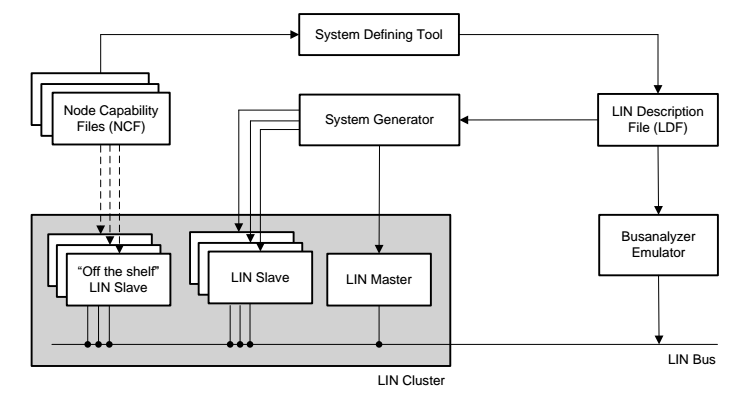
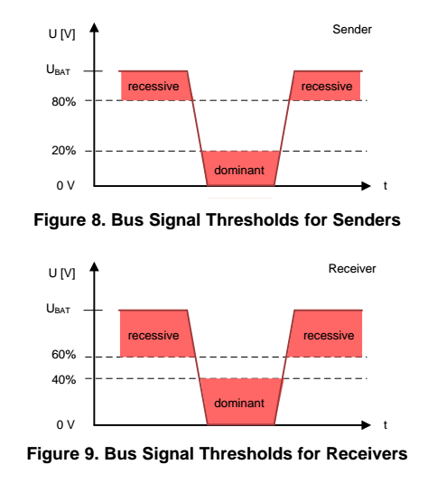

### LIN Bus Explained - A Simple Intro (2021)


In this guide we introduce the Local Interconnect Network (LIN) protocol  basics incl. LIN vs. CAN, use cases, how LIN works and the six LIN frame types.

## What is LIN bus?

**LIN bus is a supplement to [CAN bus](https://www.csselectronics.com/screen/page/simple-intro-to-can-bus)**.

It offers lower performance and reliability - but also  drastically lower costs. Below we provide a quick overview of LIN bus  and a comparison of LIN bus vs. CAN bus.

- Low cost option (if speed/fault tolerance are not critical)
- Often used in vehicles for windows, wipers, air condition etc..
- LIN clusters consist of 1 master and up to [16 slave nodes](https://en.wikipedia.org/wiki/Local_Interconnect_Network#Overview)
- Single wire (+ground) with 1-20 kbit/s at max 40 m bus length
- Time triggered scheduling with guaranteed latency time
- Variable data length (2, 4, 8 bytes)
- LIN supports error detection, checksums & configuration
- Operating voltage of 12V
- Physical layer based on ISO 9141 (K-line)
- Sleep mode & wakeup support
- Most newer vehicles have [10+ LIN nodes](https://www.electronicdesign.com/automotive/lin-interface-and-automotive-interconnects-perfect-match)

### LIN bus vs CAN bus

- LIN is lower cost (less harness, no license fee, cheap nodes)
- CAN uses twisted shielded dual wires 5V vs LIN single wire 12V
- A LIN master typically serves as gateway to the CAN bus
- LIN is deterministic, not event driven (i.e. no bus [arbitration](https://en.wikipedia.org/wiki/CAN_bus#Data_transmission))
- LIN clusters have a single master - CAN can have multiple
- CAN uses 11 or 29 bit identifiers vs 6 bit identifiers in LIN
- CAN offers up to 1 Mbit/s vs. LIN at max 20 kbit/s


### LIN bus history

Below we briefly recap the history of the LIN protocol:

- **1999:** LIN 1.0 released by the [LIN Consortium](https://en.wikipedia.org/wiki/Local_Interconnect_Network) (BMW, VW, Audi, Volvo, Mercedes-Benz,        Volcano Automotive & Motorola)
- **2000:** The LIN protocol was updated (LIN 1.1, LIN 2.2)
- **2002:** LIN 1.3 released, mainly changing the physical layer
- **2003:** LIN 2.0 released, adding major changes (widely used)
- **2006:** [LIN 2.1](https://www.lin-cia.org/fileadmin/microsites/lin-cia.org/resources/documents/LIN-Spec_Pac2_1.pdf) specification released
- **2010:** [LIN 2.2A](https://www.lin-cia.org/fileadmin/microsites/lin-cia.org/resources/documents/LIN_2.2A.pdf) released, now [widely implemented](https://www.lin-cia.org/en/standards/) versions
- **2010-12:** [SAE](https://en.wikipedia.org/wiki/SAE_International) standardized LIN as SAE J2602, based on LIN 2.0
- **2016:** CAN in Automation standardized LIN (ISO 17987:2016)


### IN bus future

The LIN protocol serves an increasingly important role in providing low cost feature expansion in modern vehicles.

As such, LIN bus has **exploded in popularity** in the last decade with >700 million nodes expected in automotives by 2020 vs ~200 million in 2010.


***Cybersecurity & new protocols***

However, with the rise of LIN also comes increased scrutiny in regards to cyber security. [LIN faces           similar risk exposures](https://www.jstage.jst.go.jp/article/ipsjjip/25/0/25_220/_pdf) as CAN - and since LIN plays a role in e.g. the seats and steering wheel, a resolution to these risks may be necessary.

The future automotive vehicle networks are seeing a rise in CAN FD, FlexRay and automotive Ethernet. While there's uncertainty  regarding the role each of these systems        will play in future automotives, it's expected that LIN bus  clusters will remain vital as the low cost solution for an ever  increasing demand for features in modern   vehicles.

However, with the rise of LIN also comes increased scrutiny in regards to cyber security. [LIN faces           similar risk exposures](https://www.jstage.jst.go.jp/article/ipsjjip/25/0/25_220/_pdf) as CAN - and since LIN plays a role in e.g. the seats and steering wheel, a resolution to these risks may be necessary.

***Master/Slave vs commander/responder***

The future automotive vehicle networks are seeing a rise in CAN FD, FlexRay and automotive Ethernet. While there's uncertainty  regarding the role each of these systems        will play in future automotives, it's expected that LIN bus  clusters will remain vital as the low cost solution for an ever  increasing demand for features in modern        vehicles.


## LIN bus applications

Today, LIN bus is a de facto standard in practically all modern vehicles - with examples of **automotive use cases** below:

- **Steering wheel:** Cruise control, wiper, climate control, radio
- **Comfort:** Sensors for temperature, sun roof, light, humidity
- **Powertrain:** Sensors for position, speed, pressure
- **Engine:** Small motors, cooling fan motors
- **Air condition:** Motors, control panel (AC is often complex)
- **Door:** Side mirrors, windows, seat control, locks
- **Seats:** Position motors, pressure sensors
- **Other:** Window wipers, rain sensors, headlights, airflow

Further, LIN bus is also being used in [**other industries**](http://ww1.microchip.com/downloads/en/market_communication/analogoct02.pdf):

- **Home appliances:** Washing machines, refrigerators, stoves
- **Automation:** Manufacturing equipment, metal working


### Example: LIN vs CAN window control

LIN nodes are typically bundled in clusters, each with a master that interfaces with the backbone CAN bus.

*Example: In a car's right seat you can roll down the left seat  window. To do so, you press a button to send a message via one LIN  cluster to another LIN cluster via the CAN    bus. This triggers the second LIN cluster to roll down the left seat window.*


## How does LIN bus work?

LIN communication at its core is relatively simple:

A master node loops through each of the slave nodes, sending a  request for information - and each slave responds with data when polled. The data bytes contain LIN bus      signals (in raw form).

However, with each specification update, new features have been added to the LIN specification - making it more complex.

Below we cover the basics: The LIN frame & six frame types.

​      


### The LIN frame format

In simple terms, the LIN bus message frame consists of a **header** and a **response**.

Typically, the LIN master transmits a header to the LIN bus. This triggers a slave, which sends up to 8 data bytes in response.

This overall LIN frame format can be illustrated as below:


***LIN frame fields***

**Break:** The Sync Break Field  (SBF) aka Break is minimum 13 + 1 bits long (and in practice most often  18 + 2 bits). The Break field acts as    a “start of frame" notice to all LIN nodes on the bus.

**Sync:** The 8 bit Sync field has a predefined value of 0x55 (in binary, 01010101). This structure allows the LIN nodes to determine the time    between rising/falling edges and thus the baud rate used by the  master node. This lets each of them stay in sync.

**Identifier:** The Identifier is 6 bits, followed by 2 parity bits. The ID acts as an identifier for each LIN message sent and which nodes    react to the header. Slaves determine the validity of the ID field (based on the parity bits) and act via below:

1. Ignore the subsequent data transmission
2. Listen to the data transmitted from another node
3. Publish data in response to the header

Typically, one slave is polled for information at a time - meaning zero collision risk (and hence no need for arbitration).
 Note that the 6 bits allow for 64 IDs, of which    ID 60-61 are used for diagnostics (more below) and 62-63 are reserved.

**Data:** When a LIN slave is polled by the master, it can respond by transmitting 2, 4 or 8 bytes of data.  Since LIN 2.0, the data length    depends on the ID range (ID 0-31: 2 bytes, 32-47: 4 bytes, 48-63: 8  bytes). The data bytes contain the actual information being communicated in the form of LIN signals. The LIN    signals are packed within the data bytes and may be e.g. just 1 bit  long or multiple bytes.

**Checksum:** As in CAN, a checksum field ensures the validity of the LIN frame. The **classic** 8 bit checksum is based on summing    the data bytes only (LIN 1.3), while the **enhanced** checksum algorithm also includes the identifier field (LIN 2.0).

***Inter byte & response space***

 Since the low cost LIN slaves are often low performing, delays may occur. To mitigate  this, inter byte space can optionally be added as illustrated below.  Further, between the    header and response, there is a ‘response space' that allows slave  nodes sufficient time to react to the master's header.


## Six LIN frame types

Multiple types of LIN frames exist, though in practice the vast majority of communication is done via “unconditional frames".

Note also that each of the below follow the same basic LIN frame  structure - and only differ by timing or content of the data bytes.

Below we briefly outline each LIN frame type:

##### Unconditional Frames

The default form of communication where the master sends a  header, requesting information from a specific slave. The relevant slave reacts accordingly

##### Event Trigger Frames

The master polls multiple slaves. A slave responds if its  data has been updated, with its protected ID in the 1st data byte. If  multiple respond, a collision occurs and          the master defaults to unconditional frames.

##### Sporadic Frames

Only sent by the master if it knows a specific slave has  updated data. The master "acts as a slave" and provides the response to  its own header - letting it provide          slave nodes with "dynamic" info.

##### Diagnostic Frames

Since LIN 2.0, IDs 60-61 are used for reading diagnostics  from master or slaves. Frames always contain 8 data bytes. ID 60 is used for the master request, 61 for the  slave response.

##### User Defined Frames

ID 62 is a user-defined frame which may contain any type of information.

##### Reserved Frames

Reserved frames have ID 63 and must not be used in LIN 2.0 conforming LIN networks


## Advanced LIN topics

Below we include two advanced topics 

***The LIN Node Configuration File (NCF) and LIN Description File (LDF)***

To quickly set up LIN bus networks, off-the-shelf LIN nodes  come with Node Configuration Files (NCF). The NCF details the LIN node  capabilities and is a key part of the LIN topology.

An OEM will then combine these node NCFs into a cluster file,  referred to as a LIN Description File (LDF). The master then sets up and manages the LIN cluster based on        this LDF - e.g. the time schedule for headers.

Note that the LIN bus nodes can be re-configured by using the  diagnostic frames described earlier. This type of configuration could be done during production - or e.g.        everytime the network is started up. For example, this can be  used to change node message IDs.

If you're familiar with [CANopen](https://www.csselectronics.com/screen/page/canopen-tutorial-simple-intro), you may see parallels to the [Device Configuration File](https://www.csselectronics.com/screen/page/canopen-tutorial-simple-intro#object-dictionary) used to pre-configure CANopen nodes - and        the role of Service Data Objects in updating these configurations.

***LIN Sleep & Wakeup***

A key aspect of LIN is not only saving costs, but also power.

To achieve this, each LIN slave can be forced into sleep mode  by the master sending a diagnostic request (ID 60) with the first byte  equal to 0. Each slave also        automatically sleeps after 4 seconds of bus inactivity.

The slaves can be woken up by either the master or slave nodes  sending a wake up request. This is done by forcing the bus to be  dominant for 250-5000 microseconds,        followed by a pause for 150-250 ms. This is repeated up to 3  times if no header is sent by the master. After this, a pause of 1.5  seconds is required before sending a 4th        wake up request. Typically nodes wake up after 1-2 pulses.


## LIN Description File (LDF) vs. DBC files

As part of your LIN data logger workflow, you may need to decode  your raw LIN bus data to physical values. Specifically, this involves  extracting LIN signals from the LIN      frame payload and decoding these to human-readable form.

This process of LIN bus decoding is similar to CAN bus decoding and requires the same information:

- ID: Which LIN frame ID contains the LIN bus signal
- Name: The LIN signal name should be known
- Start bit: Start position of the LIN signal in the payload 
- Length: Length of the LIN bus signal
- Endianness: LIN signals are little endian (Intel byte order)
- Scale: How to multiply the decimal value of the LIN signal bits
- Offset: By what constant should the LIN signal value be offset
- Unit/Min/Max: Additional supporting information (optional)

​      

This information is typically available as part of the LIN  Description File (LDF) for a local interconnect network. However, since  many software tools do not natively support the LDF format, we explain  below how to use DBC files as an alternative.

***LIN Description File (LDF) vs DBC file***

As evident from our [CAN bus intro](https://www.csselectronics.com/screen/page/simple-intro-to-can-bus) and [DBC file intro](https://www.csselectronics.com/screen/page/can-dbc-file-database-intro), the above entries are equivalent to the information stored in a CAN DBC    file. This means that a simple method for storing LIN bus decoding  rules is to use the DBC file format, which is supported by many software and API tools (incl. the CANedge [software tools](https://www.csselectronics.com/screen/page/can-logger-software-api) like asammdf). For example, you can load a LIN DBC file and your raw LIN bus data    from the [CANedge](https://www.csselectronics.com/screen/product/can-lin-logger-wifi-canedge2/language/en) in [asammdf](https://www.csselectronics.com/screen/page/asammdf-gui-api-mdf4) to extract LIN bus signals from the data, which you can then plot, analyze or export.

In many cases, you may not have a LIN DBC file directly available,  but instead you may have a LIN description file (LDF). Below we  therefore focus on how you can convert the relevant LIN signal  information into the DBC format.

Note: The LDF typically contains various other information relevant to the operation of the LIN bus, which we do not focus on here. For a  full deep-dive on the LIN protocol and the a detailed description of the LDF specification, see the [LIN protocol PDF standard](https://lin-cia.org/fileadmin/microsites/lin-cia.org/resources/documents/LIN_2.2A.pdf).

***How to convert a LIN Description File (LDF) to DBC*** 

Below we provide an example to showcase how you can extract LIN  signal information from an LDF and enter it into a DBC file. We use a  very simplified LIN description file    (with only one signal and excluding some sections).

You can expand the below examples to see the LIN signal, **BatteryVoltage**, in the LDF format and in the DBC format. You can also download a raw [LIN bus log file](https://canlogger1000.csselectronics.com/files/lin-intro/LIN_voltage_example.MF4) ([MF4](https://www.csselectronics.com/screen/page/mdf4-measurement-data-format)) from    the [CANedge2](https://www.csselectronics.com/screen/product/can-lin-logger-wifi-canedge2/language/en) with data for this signal, which you can open and DBC decode in asammdf:

#### Example: BatteryVoltage signal (LDF)

```ldf
/*************************************************************************************/
//                                                                                     
// Description: Example LIN description file (CSS Electronics LIN bus intro)
// Created:     11 December 2020 09:00:00
// Author:      CSS Electronics
//                                                                                     
/*************************************************************************************/

LIN_description_file;
LIN_protocol_version = "2.0";
LIN_language_version = "2.0";
LIN_speed = 19.2 kbps;

Nodes {
  Master: SG, 10 ms, 0 ms ;
  Slaves: IBS ;
}

Signals {
  BatteryVoltage: 16, 65535, IBS, SG ;
}


Frames {
  IBS_DataAcquisition: 33, IBS, 8 {
    BatteryCurrent, 0 ;
    BatteryVoltage, 16 ;
    CentreTapVoltage, 32 ;
    InChipTemperature, 48 ;
    CurrentRangeMeas, 57 ;
  }
}

Signal_encoding_types {
  Enc_BatteryVoltage {
    physical_value, 0, 32000, 0.001, 0, "Volt" ;
    physical_value, 32001, 65533, 1, 0, "invalid" ;
    logical_value, 65534, "BatteryVoltage_Error" ;
    logical_value, 65535, "LIN_INIT" ;
  }
}

Signal_representation {
  Enc_BatteryVoltage: BatteryVoltage ;
}
```

#### Example: BatteryVoltage signal (DBC)

```dbc
VERSION ""


NS_ : 
	NS_DESC_
	CM_
	BA_DEF_
	BA_
	VAL_
	CAT_DEF_
	CAT_
	FILTER
	BA_DEF_DEF_
	EV_DATA_
	ENVVAR_DATA_
	SGTYPE_
	SGTYPE_VAL_
	BA_DEF_SGTYPE_
	BA_SGTYPE_
	SIG_TYPE_REF_
	VAL_TABLE_
	SIG_GROUP_
	SIG_VALTYPE_
	SIGTYPE_VALTYPE_
	BO_TX_BU_
	BA_DEF_REL_
	BA_REL_
	BA_DEF_DEF_REL_
	BU_SG_REL_
	BU_EV_REL_
	BU_BO_REL_
	SG_MUL_VAL_

BS_:

BU_:


BO_ 33 IBS_DataAcquisition: 8 Vector__XXX
 SG_ BatteryVoltage : 16|16@1+ (0.001,0) [0|32] "Volt" Vector__XXX
 


BA_DEF_  "LinProtocolType" ENUM  "LDF","DBC";
BA_DEF_  "BusType" STRING ;
BA_DEF_  "LinSpeedDefinition" FLOAT 0.2 20;
BA_DEF_ BU_  "LinMaster" ENUM  "No","Yes";
BA_DEF_  "LinTimeBase" FLOAT 1 100;
BA_DEF_  "LinJitter" FLOAT 0 10;
BA_DEF_ BU_  "LinSlave" ENUM  "No","Yes";
BA_DEF_ SG_  "LinInitValue" INT 0 65535;
BA_DEF_DEF_  "LinProtocolType" "DBC";
BA_DEF_DEF_  "BusType" "";
BA_ "BusType" "LIN";
```

#### Guide to LDF to DBC conversion

In short, to convert an LDF file to DBC, you'll go through the following steps for each LIN signal:

- Get the LIN signal name and length from the Signals section
- Get the LIN signal message name, ID and length from the Frames section
- Get the LIN signal bit start from the Frames section
- Go to the LDF Signal_encoding_types section and find "Enc_[signal_name]"
- Get remaining info via the syntax: 'physical_value, [min], [max], [scale], [offset], "[unit]" ;'

If you're looking to create your own LIN DBC file, we suggest you review our [DBC file introduction](https://www.csselectronics.com/screen/page/can-dbc-file-database-intro/language/en) for details on the syntax, as well as DBC editor tools.

#### Minor pitfalls

The conversion from LDF to DBC is not entirely 1-to-1. In  particular, note how the LIN signal BatteryVoltage has 2 entries for the physical value, one for the decimal range 0    to 32000 and one for 32001 to 65533. In this specific case, only the data in the first range are valid (the unit is "invalid" for the 2nd  range). However, in some cases there    can be multiple ranges that require separate scaling factors -  something which is not possible to handle in the DBC file format. In  this case, you will need to choose one of    the ranges and e.g. treat results outside this range as invalid.

This is also the simplest way to handle the LIN signal  'logical_value' entries in the Signal_encoding_types    section. These typically reflect how specific values of the LIN  signal should be treated (e.g. as errors). One way of treating these  entries would be to ignore them and    possibly exclude them as part of your data post processing - similar to how FF byte values in CAN bus are often excluded as they represent  invalid or N/A data.

#### LIN workflow



The configuration of the entire network cluster is defined and standardized, which is where the LIN Description File (LDF) comes in.  The LDF is what differentiates the LIN clusters from each other, defining the specific use and properties for that cluster (node amount, amount and the description of message frames, message rate, and so forth). This allows the generation of software files by developers to establish what task each node in the cluster performs. The LDF can be used to automatically generate the software involved in communication, as well as supply information for measurement and test tools involved in the LIN cluster analysis.

The LDF is written using syntax defined by the *LIN Configuration Language Specification*. This syntax is used in combination with the *System Defining Tool* to create the LDF, and thus define the whole network. Along with these tools, there is the *LIN Node Capability Language*, which allows the developer to define and describe the implementation of Off-the-Shelf Nodes, which are easily-implementable, general-purpose LIN nodes designed for typical applications that can be bought in large quantities.

In every ***cluster***, there is one master node, and up to 16 slave nodes. 

#### Threshold Values

For *dominant* pulses (low), the sender must drive the voltage level down to **20%** of the battery voltage level, while the receiver will interpret a dominant bit when the voltage level reaches **40%** on their end. 

For *recessive* pulses (high), the sender must drive the voltage to **80%** of the battery voltage, while the receiver interprets a recessive bit when the voltage level reaches **60%** on the bus. 



#### BIT-Rate Tolerance

The bit rate for LIN ranges from 1 to 20 kilobits per second, with a bit rate tolerance ***±14%***. This 14% value comes from the fact that low-cost on-chip oscillators are used, and with internal calibration, better than ±14% can be achieved. 

