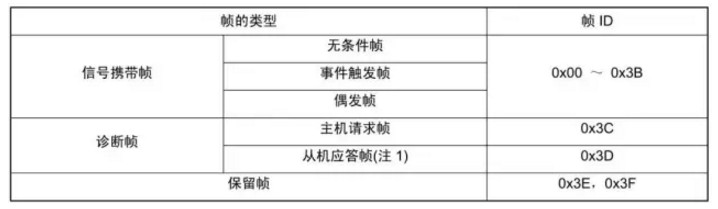
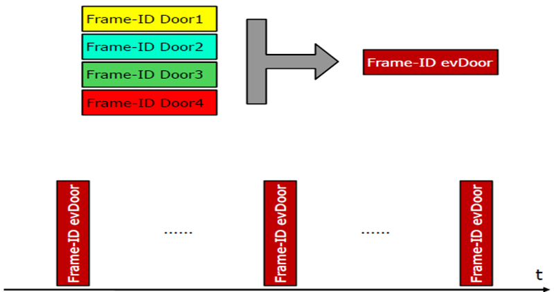
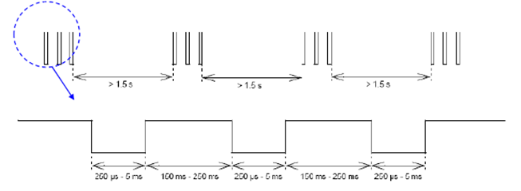
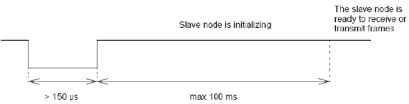
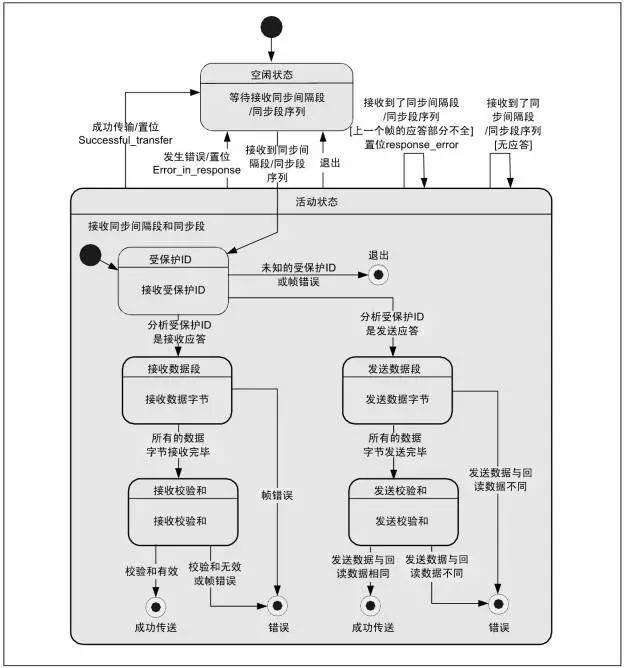

# [LIN总线详解](https://www.2cto.com/kf/201806/754227.html)

### 1. 什么是LIN总线?

**LIN(Local Interconnect Network)总线是基于UART/SCI(通用异步收发器/串行接口)的低成本串行通讯协议**。其目标定位于车身网络模块节点间的低端通信，主要用于智能传感器和执行器的串行通信，而这正是CAN总线的带宽和功能所不要求的部分。

  

### 2. CAN/LIN总线区别

**由于LIN网络在汽车中一般不独立存在，通常会与上层CAN网络相连，形成CAN-LIN网关节点**。

#### 2.1.LIN总线的主从关系

LIN总线采用的是单线传输形式，应用了**单主机多从机**(有无主动上报的支持？)的概念，**总线电平一般为12V**，传输速率**最高限制为20kbps**。由于物理层的限制，一个LIN网络最多可以连接**16个节点**。

**总线任务负责**：

1. 调度总线上帧的传输次序
2. 监测数据，处理错误
3. 作为标准时钟参考(不是异步通信？)
4. 接收从机节点发出的总线唤醒命令

**从机任务**不能直接向总线发送数据，需要接受到主节点发送的帧头后，根据帧头所包含的信息来判断：

1. 发送应答
2. 接收应答
3. 既不接收也不应答

**LIN的特点**

1. 网络由一个主节点与若干个从节点构成
2. 使用LIN总线可以大幅度削减成本(CAN和Lin都需要收发器，但是Lin属于单线制在线束上节省)
3. 传输具有确定性，传播时间可以提前计算
4. LIN具有可预测的EMC(电磁兼容性)性能，为了限制EMC的强度，LIN协议规定最大传输速率为20kbps
5. LIN总线提供信号的配置、处理、识别和诊断功能(这些都是UART不具备的，可LIN是怎么实现的呢？)

### **3.LIN报文帧结构**

**LIN报文帧包括帧头(hearder)与应答(response)两部分**。主机负责发送至帧头;从机负责接收帧头并作出解析，然后决定是发送应答，还是接收应答或不回复。

**（主机）帧头结构包括同步间隔段、同步段、PID段(受保护ID)段，应答部分包括数据段与效验和段**。其中**值“0”为显性电平、“1”为隐性电平**，这点与CAN总线相类似。在总线上实行“线-与”：当总线有至少一个节点发送显性电平时，总线呈现显性电平;所有节点均发送隐性电平或者不发送信息时，总线呈隐性电平，即显性电平起着主导作用。

##### 3.1.1.同步间隔段

同步间隔段**至少**是由13位的显性电平组成，由于帧中的所有间隙或者总线空闲时总线均保持隐性电平状态。所以同步间隔段可以标志一个帧的开始。其中同步间隔段的间隔符至少为1位隐性电平。

##### 3.1.2.同步段

LIN同步以下降沿为判断标志，**采用字节0x55(01010101b)进行同步**。在从机节点上可以不采用高精度的时钟，由此带来的偏差，需要通过同步段来进行调整。

##### 3.1.3.PID段

受保护的ID的前6位叫做**帧ID**，加上两个奇偶效验码后称作受保护的ID。帧ID的取值范围为0x00~0x3f总共64个，**帧ID标识了帧的类别和目的地**。从机任务会根据帧头ID作出反应(接收/发送/忽略应答)。其中P0与P1效验如下：

LIN总线根据帧ID号的不同，把报文分为信号携带帧、诊断帧、保留帧。

PS：从机应答帧是一个完整的帧，与（主节点）帧结构中的“应答”不同!

##### 3.1.4.数据段

数据段可以包含1-8个字节，其中包含有两种数据类型，信号(singal)和诊断消息(diagnostic messages)。信号由信号携带帧传递，诊断消息由诊断帧传递。

协议中并没有规定哪一部分显示数据长度码的信息(这点与CAN总线不同)，**数据的内容与长度均是由[系统](https://www.2cto.com/os/)设计者根据帧ID事先约定好的**。

总线上的数据是以广播形式发出，任何节点均可以收到，但并非对每个节点有用(与CAN相同)。**具体到发布与接听是由哪个节点进行完成这个取决于应用层的软件配置**，一般情况下，对于一个帧中的应答，总线上只存在一个**发布节点**，否则就会出现错误。事件触发帧例外，可能出现0,1，多个发布节点。

##### 3.1.5.效验和段

效验和段是为了对帧传输内容进行效验。效验分为标准型效验与增强型效验。采用标准型还是增强型是由主机节点管理，发布节点和收听节点根据帧ID来判断采用哪种效验和。

##### 3.1.6.帧长度

**最小帧长度**

THEADER_NOMINAL=34*TBIT

TRESPONSE_NOMINAL=10*(NDATA+1)*TBIT  

TFRAME_NOMINAL=THEADER_NOMINAL+TRESPONSE_NOMINAL

**最大帧长度**

THEADER_MAX=1.4*THEADER_NOMINAL

TRESPONSE_MAX=1.4*TRESPONSE_NOMINAL

TFRAME MAX=THEADER MAX+TRESPONSE MAX

### 4.LIN总线波形

### 5.LIN总线的通讯

上图展示的是LIN总线的通讯方式，可以看出**无论什么时候帧头总是由主机节点发布**，**当主机节点想发布数据时**，整个帧全部由主机节点发送。**当从机节点想发布数据时**，帧头部分由主机节点发布，应答部分由从机节点发布(主机怎么知道从机节点想发布数据，那肯定是主机节点无数据可发，故只发了帧头？)，这样其余节点都能收到一个完整的报文帧。可以很直接的观察到，LIN总线的通讯都是由主机节点发起的，只要合理的规定要每个节点的配置，这样就不会存在总线冲突的情况(事件触发帧冲突时采用采用冲突解决进度表)。

帧类型

#### 5.1.无条件帧

无条件帧是具有单一发布节点的，无论信号是否发生变化，帧头均会被无条件应答的帧。

  

如上图中帧ID=0x30应答部分的发布节点为从机节点1，收听节点为主机节点，应用在从机节点向主机节点报告自身状态;帧ID=0x31中，应答部分为主机节点，收听部分为从机节点，应用在主机节点向从机节点发送消息;帧ID=0x32中应答部分的发送节点为从机节点2，收听节点为从机节点1，应用与从机节点之间的通信。

#### 5.2.事件触发帧

事件触发帧是主机节点在一个帧间隙中查询各从机节点的信号是否发生变化时使用的帧。当存在多个发布节点时，通过冲突解决进度表来解决冲突。

**当从机节点信号发生变化的频率较低的时候，主机任务一次次地查询各个节点信息会占用一定的带宽。为了减小带宽的占用，引入了事件触发帧的概念**。其主要原理就是：当从机节点信息状态没有发生变化的时候，从机节点可以不应答主机发出的帧头;当有多个节点信息同时发生变化的时候，同时应答事件触发帧头会造成总线的冲突。当主机节点检测到冲突时，便会查询冲突解决进度表来依次向各个节点发送无条件帧(无条件帧只有能1个节点应答)来确定从机节点的信息状态。

与事件触发帧关联的多个无条件帧需要满足以下5个条件：

数据段所包含的数据字节数等长 使用相同的效验与类型 数据段的第一个字节为该无条件帧的受保护ID，这样才能够知道应答是哪个关联的无条件帧发送出来的 由不同的从机节点发布 不能与时间触发帧处于同一个进度表中

引入事件触发帧的目的是节省带宽。

BCM(Master)需要获取4个车门的状态，该如何实现？

**第一种方式：**

每次向四个车门请求状态，浪费带宽，因为车门状态不是经常发生。

**第二种方法：**

将请求四个车门状态的帧合并为一个事件触发帧，Master不需要每次发送四个帧请求车门的状态，只需要发送一个事件触发帧即可，哪个车门状态发生变化，对应的车门将响应该事件触发帧。

事件触发帧的响应会出现如下三种情况：

第一种：没有车门状态变化。

第二种：一个车门状态发生变化：

第三种：多个车门状态发生变化，此时将出现冲突，冲突处理时，Master需要像第一种处理方式一样，重新发送四帧分别请求单个车门状态。LIN1.3与LIN2.0、LIN2.1处理方式有所区别，区别在于LIN1.3不切换调度表，占用事件触发帧的时隙发送，LIN2.0、LIN2.1将切换冲突调度表处理，如下图：

##### 5.2.1.偶发帧

偶发帧是主机节点在同一帧时隙中当自身信号发生变化时向总线启动发送的帧。当存在多个关联的应答信号变化时，通过预先设定的的优先级来仲裁。与事件触发帧类似，偶发帧也定义了一组无条件帧。规定偶发帧只有由主机节点发布。

偶发帧的传输可能出现三种情况：

1. 当关联的无条件帧没有信号发生变化，这是主机连帧头也不需要发送。
2. 当关联的一个无条件帧信号发生变化则发送该帧。
3. 当有多个无条件帧发生信号变化时，则按照事先规定要的优先级依次发送。

引入零星帧的目的也是为了节省带宽，如：BCM(Master)需要发送对4个车窗的控制指令，但是，两个车窗的控制命令很少被同时执行，同样大量的带宽被浪费。

具体方案如下：

##### 5.2.2.诊断帧

诊断帧包括主机请求帧和从机应答帧，主要用于配置、识别和诊断。主机请求帧ID=0x3c，应答部分的发布节点为主机节点;从机应答帧ID=0x3d，应答部分的发布节点为从机节点。数据段规定为8个字节，一律采用标准效验和。

##### 5.2.3.保留帧

保留帧的ID=0x3e与0x3f，为将来扩张需求用。

#### 5.3.进度表

1）负责调度网络各报文发送的顺序；

2）为每帧报文分配发送时隙（slot）；

3）发送时隙：报文可以被发送的时间；

4）不同报文的发送时隙可能不同；

5）调度表在网络系统设计阶段确定；

6）调度表使得LIN通信具有可预测性；

进度表是帧的调度表，规定了总线上帧的传输次序以及传输时间。**进度表位于主机节点**，主机任务根据应用程需要进行调度。**进度表可以有多个**，一般情况下，轮到某个进度表执行的时候，从该进度表的入口处开始执行，到进度表的最后一个帧时，如果没有新的进度表启动则返回到当前进度表的第一个帧开始执行;也有可能在执行到某个进度表时发生中断，跳到另一个进度表后再返回，如事件触发帧就是一个典型的例子。

#### 

#### 5.4.Jitter

偏移(jitter)是指一帧报文实际开始发送的时刻与帧时隙起点的时间差（该值在LDF文件中定义）**。
**

  TFrame_Slot> jitter + TFrame_Maximum

#### 5.5.网络管理

#### 5.6 **睡眠（Go To Sleep）**

睡眠指令只有主节点可以发送，从节点在接到睡眠指令之后，也可以选择不进入睡眠状态而继续工作，这根据应用层协议而定。

#### 5.7 wakeup

在一个处于睡眠状态的LIN网络中，任何一个节点都可以发送唤醒信号。

发送节点发送的唤醒信号:

接收节点检测的唤醒信号:

### 6.状态机的实现

#### 6.1.主机状态机

  

#### 6.2.从机状态机

从机任务负责发布或者接听帧的应答状态，包括连两个状态机：同步间隔段与同步段检查器、帧处理器。

#### 6.3.从机任务状态机

#### 6.4.帧处理任务状态机

