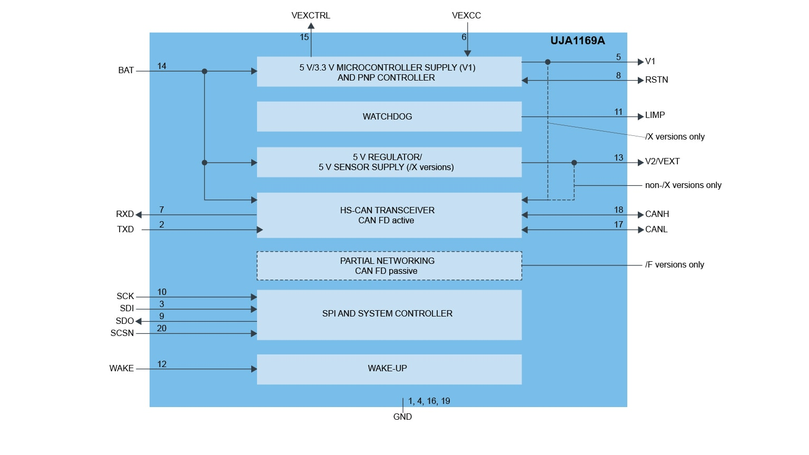
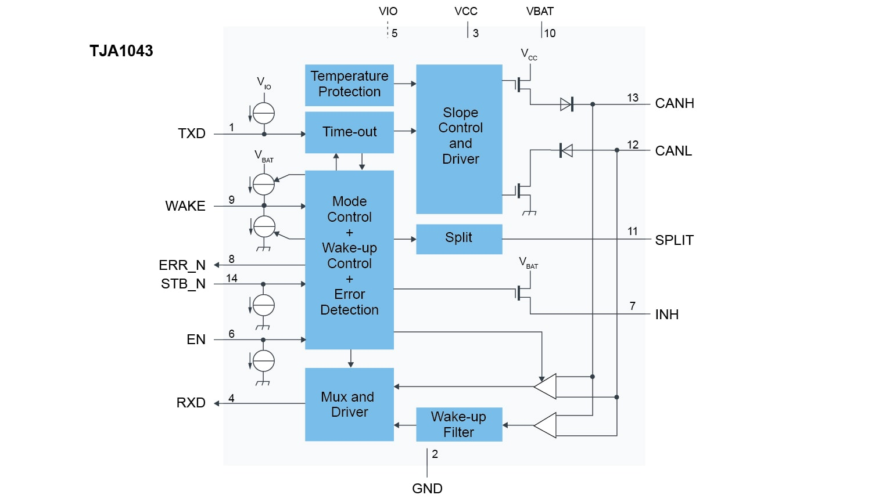
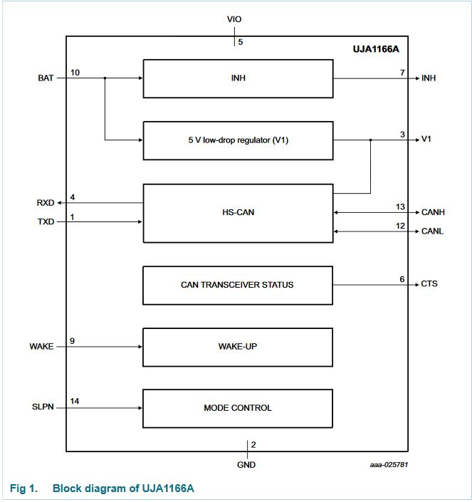
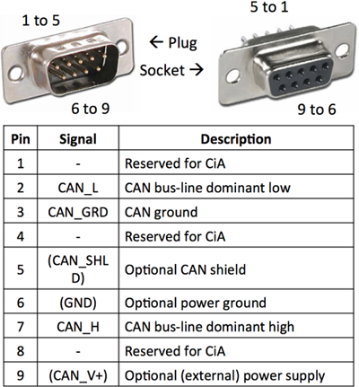

# Automatic Guide

<!-- vim-markdown-toc GFM -->

* [In-Vehicle Networking](#in-vehicle-networking)
* [FOC OpenSource Platform](#foc-opensource-platform)
* [Dyson's Motor](#dysons-motor)
* [CAN Bus](#can-bus)
* [Ethernet](#ethernet)
* [AutoSAR](#autosar)
* [Safty Manual](#safty-manual)
* [LIN](#lin)

<!-- vim-markdown-toc -->

## Glossary

* ADAS: advanced driver-assistance systems 
* ADS: autonomous driving systems 
* IVI: in-vehicle infotainment

## Automotive Serdes

* [ASA](https://auto-serdes.org/)
* [MIPI A-PHY](https://www.mipi.org/specifications/a-phy)
* [The Next Automotive Networks: ASA SerDes Links, 10BASE-T1S and CAN XL](https://www.nxp.com/design/training/the-next-automotive-networks-asa-serdes-links-10base-t1s-and-can-xl:TIP-TD-AUT226)
* 

## [ISO Document Stages](https://www.iest.org/Standards-RPs/ISO-Standards/ISO-Document-Stages)

The key stage in the development of an ISO Standard is the **DIS** (Draft International Standard) stage. A **DIS** is the end result of the work produced by a Working Group and approved by a Technical Committee. A document in the DIS stage is more than 95% technically accurate. A DIS goes out for a five-month approval vote by all 89 voting nations of ISO. Any suggested changes offered as a result of this voting process must be addressed by the Technical Committee and may be incorporated or rejected.

The newly modified DIS is sent to the voting nations as an FDIS (Final Draft International Standard) for a final approval vote (yes or no). Approval of the FDIS automatically instructs ISO to issue the document as a formal ISO Standard within 60 days of FDIS approval.

It should be noted that DIS and FDIS documents may be used as trade references per agreement between a buyer and a seller. It should also be noted that the European community, through cooperation between CEN (European Committee for Standardization) and ISO/TC 209, has been developing companion CEN Standards on cleanrooms. The new ISO Standards replace the CEN Standards as soon as ISO Standards are formally published. In addition, six months after the formal publication of an ISO Standard, European nations’ national standards on the same criteria are made obsolete or rescinded.

With the formal publication of ISO 14644, Parts 1 and 2, the U.S. Federal Standard 209E, Airborne Particulate Cleanliness Classes in Cleanrooms and Clean Zones, became both redundant and obsolete. As official technical caretaker of FED-STD-209E, IEST recommended cancellation of FED-STD-209E to the U.S. Government (GSA). The document was canceled in November 2001.

## [In-Vehicle Networking](https://www.nxp.com.cn/docs/en/brochure/BRINVEHICLENET.pdf)

  [local file](./Automotive/BRINVEHICLENET.pdf)
  
## FOC OpenSource Platform

  [ODrive](https://odriverobotics.com/)    
  [VESC](https://vesc-project.com/)    
  [zhihui](https://www.bilibili.com/video/BV11V41127pq/?spm_id_from=888.80997.embed_other.whitelist)  
  [motor control for industrial and IoT applications from NXP](./INDUSTRIAL-IOT-MOTOR-CONTROL-BR.pdf)
  
## Dyson's Motor

  [local file](./Digital_motors_software_and_the_rise_of_the_internet_of_things.md)

## CAN Bus

1. [UJA1169ATK: Mini High-Speed CAN System Basis Chip](https://www.nxp.com/products/power-management/pmics-and-sbcs/mini-sbcs/mini-high-speed-can-system-basis-chip:UJA1169ATK)

  

2. [TJA1043: High-speed CAN transceiver](https://www.nxp.com/products/interfaces/can-transceivers/can-with-flexible-data-rate/high-speed-can-transceiver:TJA1043)

  

3. [UJA1166ATK: self-supplied high-speed CAN transceiver with Sleep mode](https://www.nxp.com/part/UJA1166ATK#/)

  

4. [AH138 Application Hints - Standalone high-speed CAN transceivers Mantis
TJA1044/TJA1057 and Dual-Mantis TJA1046](https://www.nxp.com.cn/docs/en/supporting-information/AH1308_Application_Hints_Mantis.pdf)

5. [AH1014 Application Hints - Standalone high speed CAN transceivers TJA1042/TJA1043/TJA1048/TJA1051](https://www.nxp.com.cn/docs/en/supporting-information/AH1014_v1_4_Application_Hints_TJA1042_43_48_51.pdf)

6. Major Differences in CAN 2.0 and CAN FD

| Classical CAN or CAN 2.0 | CAN FD |
| -------------------------| -------|
| Data bit rate is max 1 Mbps | Max Data bit rate is 8Mbps|
|A max of 8 bytes of data can be  sent in   one frame without Transport Protocol |64 bytes of data can be sent in one frame without the TP layer|
| Multiple CAN nodes can broadcast message frames | Only one transmites at a time. May to increased bit rate|
| No BRS or FDF to switch the speed to higher or lower levels | Bit Rate Switch(BRS),Flexible Data Rate Format(FDF) and  Error State Indicator together ensure higher speed|
| Cyclic Redundancy Code contains a 15 bit code | CRC field has 17 or 21 check codes|
| Less secured due to less data payload capacity | Enhanced security of data as CAN FD data can be encrypted using the extra memory|

7. Mixed Networks and Partial Networking

Mixed networks where both CAN 2.0 and CAN FD nodes exist, on the same network bus, are quite common. Although CAN FD transceivers are compatible with Classical CAN, the data link layer is not.

This implies that if a CAN FD node sends a signal, the CAN 2.0 node will not be able to receive it, causing error and interruption in the communication.

One of the most widely used methods to fix this compatibility issue is **partial networking**. The **partial networking** functionality makes use of a CAN transceiver standard, called CAN with selective wake.

When a CAN FD is communicating, the CAN 2.0 nodes are passive i.e. invisible to the network. This condition is akin to putting the CAN 2.0 nodes to sleep while CAN FD communicates. However, the CAN 2.0 nodes are not completely inactive; they are selectively awake.

A **Partial Networking** (PN) transceiver comes into picture in such a scenario. This transceiver keeps the CAN 2.0 disconnected from the network during CAN FD communication. As soon as a valid CAN 2.0 wake up message appears, the transceiver will wake up the CAN 2.0 nodes and route the message to them. It is interesting to note that this wake up message frame is sent by CAN FD node itself.

8. [CAN Tutorial](https://www.computer-solutions.co.uk/info/Embedded_tutorials/can_tutorial.htm)

Three specifications are in use:

* 2.0A sometimes known as **Basic** or **Standard CAN** with 11 bit message identifiers which was originally specified to  operated at a maximum frequency of 250Kbit/sec and is  ISO11519.
* 2.0B known as **Full CAN** or extended frame CAN with 29 bit message identifier which can be used at up to 1Mbit/sec and is  ISO 11898.
* **CAN FD**  increases the max data throughput to ~ 3.7 Mbits/sec. It does this by retaining much of the 2.0 packet structure (which it is compatible with) but using one reserved bit to indicate that the data part of the packet is using the new standard. Once an FD enabled device or interface detects this it can do two things..... Transmits/receives the data part at a secondary frequency of up to 12 Mbits/sec (v 1Mbits/sec for CAN 2.0) and also it allows the data part of the package to consist of up to 64 bytes (v 8 bytes for CAN 2.0). 

**CAN 2.0 Data Frames**

For CAN 2.0 all bits are sent at the speed setting for the bus - max 1MBits/sec. They contain the following fields......

<pre>
    <b>Start of frame   (SOF)</b>

    <b>Message Identifier  (MID)</b>     the Lower the value the Higher the priority of the message
           its length is either 11 or 29 bits long depending on the standard being used (Basic or Fast).
    
    <b>Remote Transmission Request (RTR) = 0</b>  ----- see "Remote Frames" para below for non zero value
    
    <b>Control field  (CONTROL)</b>  This specifies
    
          <b>EDL</b> that this is a CAN 2.0 or FD transaction (see below for FD Data Frames details)
    
          <b>DLC</b> this specifies the number of bytes of data to follow (0-8 for 2.0)
    
    <b>Data Field (DATA)</b> length 0 to 8 bytes for CAN 2.0
    
    <b>CRC field</b>  containing a fifteen bit cyclic redundancy check code
    
    <b>Acknowledge field  (ACK)</b>   an empty slot which will be filled by every node that receives the frame
      it does NOT say that the node you intended the data for got it, just that at least one node on the whole network got it.
    
    <b>End of Frame   (EOF)</b>
</pre>

The way in which message collision is avoided is that each node as it transmits its MID looks on the bus to see what everyone else is seeing.  If it is in conflict with a higher priority message identifier (one with a lower number) then the higher priority messages bit will hold the signal down (a zero bit is said to be dominant) and the lower priority node will stop transmitting. 

If you are writing diagnostic code and wish to not "exist" on the network as a node, just to spy on what is happening, then you will need to ensure that the interface you use can be set to a mode where it does not automatically set the ACK bit.

**Error checking**

CAN is a very reliable system with multiple error checks ( below is the CAN 2.0 the CAN FD is more complex

    Stuffing error  -  a transmitting node inserts a high after five consecutive low bits (and a low after five consecutive high). A receiving node that detects violation will flag a bit stuffing error.
    
    Bit error  -  A transmitting node always reads back the message as it is sending. If it detects a different bit value on the bus than the one it sent, and the bit is not part of the arbitration field or in the acknowledgement field, an error is detected.
    
    Checksum error - each receiving node checks CAN messages for checksum errors (different rules apply for CAN 2.0 and CAN FD).
    
    Frame error - There are certain predefined bit values that must be transmitted at certain points within any CAN Message Frame. If a receiver detects an invalid bit in one of these positions a Form Error (sometimes also known as a Format Error) will be flagged.
    
    Acknowledgement Error - If a transmitter determines that a message has not been ACKnowledged then an ACK Error is flagged.

9. [The CAN wiki](http://www.can-wiki.info/doku.php)

10. [CAN bus wikipedia](https://en.wikipedia.org/wiki/CAN_bus)

11. DB9 for CAN

  

12. [CiA for CAN FD](https://www.can-cia.org/can-knowledge/can/can-fd/)

13. [STM32 CANFD](./dm00625700-fdcan-peripheral-on-stm32-devices-stmicroelectronics.pdf)

14. [STM32 BOOT from CAN](./dm00660346-fdcan-protocol-used-in-the-stm32-bootloader-stmicroelectronics.pdf)

15. [STM32 CAN Prestation](./en.STM32G4-Peripheral-Flexible_Datarate_Controller_Area_Network_FDCAN.pdf)

16. [keil CAN test](./apnt_236.pdf)

17. [CAN introduction from CSDN](https://blog.csdn.net/weifengdq/article/details/113891879)

18. [bitime Calculation](http://www.bittiming.can-wiki.info/)

19. [CAN stack factsheet](./CAN-STACK-Factsheet-1.pdf)

19. [CAN Protocol](./what_is_ISO11898_based_CAN_protocol_and_why_it_is_critical_software_solution_for_Vehicle_NetWorking.md)

20. CANopen

    a. [wiki](https://en.wikipedia.org/wiki/CANopen)

    b. [introduction](https://www.can-cia.org/can-knowledge/canopen/canopen/)

21. [VH6501 webinar](https://assets.vector.com/cms/content/events/2018/Webinars18/Vector_Webinar_VH6501_20180220.pdf)

22. [CAN bus-off using VH6501 from zhihu](https://zhuanlan.zhihu.com/p/164987820)

23. [A System Evaluation of CAN Transceivers from TI](https://www.ti.com/lit/an/slla109a/slla109a.pdf?ts=1629930573034&ref_url=https%253A%252F%252Fwww.google.com%252F) 

24. [AN754 understanding microchip's CAN bit timing](./AN754_understanding_microchip_CAN_Bit_timing.pdf)

25. [CAN Stack introduce PART2](./CAN_Bus_Protocol_Stack_Part2.pdf)

26. [Model 3 DBC](https://github.com/da895/model3dbc)

27. [CSS electronics for automitive bus](https://www.csselectronics.com/)

28. [UDS introduce from CSS](./UDS/UDS_Explained_a_simple_intro.md)

29. UDS from Github

    a. [iso15765-canbus](https://github.com/devcoons/iso15765-canbus)  
    b. [python-udsoncan](https://github.com/pylessard/python-udsoncan)  
    c. [ECU-simulator for OBD](https://github.com/lbenthins/ecu-simulator)  
    d. [py-uds is ongoing](https://github.com/mdabrowski1990/uds)  
    e. [isotp implemented by C](https://github.com/lishen2/isotp-c)  
    f. [ISO14229](https://github.com/driftregion/iso14229)  
    g. [CAN Resource collection](https://gist.github.com/Semant1ka/59f4ac0dc899e1501d36936188374246)  
    h. [UDS-C](https://github.com/openxc/uds-c)  
    i. [UDSdemo on freesacle s12g128](https://github.com/da895/UDSDemo)  

30. [ISO15765 part 2](./UDS/ISO15765_study.md)

## Ethernet

1. [KSZ9131: Gigabit Ethernet Transceiver with Power Saving Features](https://www.microchip.com/wwwproducts/en/ksz9131)
2. [Marvell Alaska 88E1512 - Integrated 10/100/1000 Mbps Energy Efficient Ethernet Transceiver](https://www.marvell.com/search.html?search=88E1512)
3. [RTL8211F:INTEGRATED 10/100/1000M ETHERNET PRECISION TRANSCEIVER](https://www.realtek.com/en/products/communications-network-ics/item/rtl8211f-i-cg)
4. [Marvell Automotive Ethernet](https://www.marvell.com/products/automotive.html)
5. [MII from wikipedia](https://en.wikipedia.org/wiki/Media-independent_interface)
6. [Go through the Internet -- MAC/PHY and MII(GMII/SGMII/RGMII)](http://blog.chinaaet.com/justlxy/p/5100064094)
7. [Impedance Matching Resistors on MII Ethernet Lines](https://electronics.stackexchange.com/questions/392368/impedance-matching-resistors-on-mii-ethernet-lines)

    The RMII signals are treated as lumped signals rather than transmission lines; no termination or controlled impedance is necessary; output drive (and thus slew rates) need to be as slow as possible (rise times from 1–5 ns) to permit this. Drivers should be able to drive 25 pF of capacitance which allows for PCB traces up to 0.30 m. At least the standard says the signals need not be treated as transmission lines. However, at 1 ns edge rates a trace longer than about 2.7 cm (1ns5.9>nsm⋅3.7m0.0254m⋅>16=4.115m), transmission line effects could be a significant problem; at 5 ns, traces can be 5 times longer. The IEEE version of the related MII standard specifies 68 Ω trace impedance. National recommends running 50 Ω traces with 33 Ω (adds to driver output impedance) series termination resistors for either MII or RMII mode to reduce reflections.[citation needed] National also suggests that traces be kept under 0.15 m long and matched within 0.05 m on length to minimize skew.

8. [Impedance/Termination of Marvell PHY](https://electronics.stackexchange.com/questions/524620/impedance-termination-of-marvell-phy)
9. [RTL8211](./Realtek-Semicon-RTL8211EG-VB-CG_C69264.pdf)
10. [RFC standard](https://www.rfc-editor.org/)

## AutoSAR

1. [AUTOSAR org](https://www.autosar.org/)
2. [Acceptance Test Specification of Communication Management](https://www.autosar.org/fileadmin/user_upload/standards/tests/1-1/AUTOSAR_ATS_CommunicationManagement.pdf)
3. [Experiences with a CANoe-based Fault Injection Framework for AUTOSAR](https://users.ece.cmu.edu/~planigan/research/lanigan-dsn10.pdf)
3. [Experiences with CANoe-based Fault Injection for AUTOSAR](https://users.ece.cmu.edu/~planigan/research/lanigan-dsn10.key.pdf)
3. [Autosar tutorial](https://autosartutorials.com/what-is-autosar/)

## Safty Manual

1. [S32K1xx Saft Manual](./S32K1xx20Series_Safety_Manual.pdf)

## LIN

1. [LIN Bus Explained - A Simple Intro (2021)](./LIN_Bus_Explained_A_Simple_Intro_2021.md)

2. [Introduction to the Local Interconnect Network (LIN) Bus](./introduction_to_the_LIN_bus_ni.md)

3. [Introduction to the LIN bus](./introduction_to_the_LIN_bus_kvaser.md)

4. [LIN conformance test](./LIN_conformance_test.md)

5. [LIN_explain_chinese](./LIN_explain_Chinese.md)

6. [ISO 9141 ( K Line )](https://www.nxp.com/products/no-longer-manufactured/automotive-iso-9141-serial-link-k-and-l-lines-driver:MC33199)

   It is the interface between the microcontroller and the special K and L  Lines of the ISO diagnostic port. The MC33199D has been designed to meet the "Diagnosis System ISO 9141" specification. The device has a  bi–directional bus K Line driver, fully protected against short circuits and over temperature. It also includes the L Line receiver, used during the wake up sequence in the ISO transmission. The MC33199 also has a  feature which allows transmission baud rate up to 200 k baud.

7. [LIN Transceiver](./LIN_Transceiver.md)

