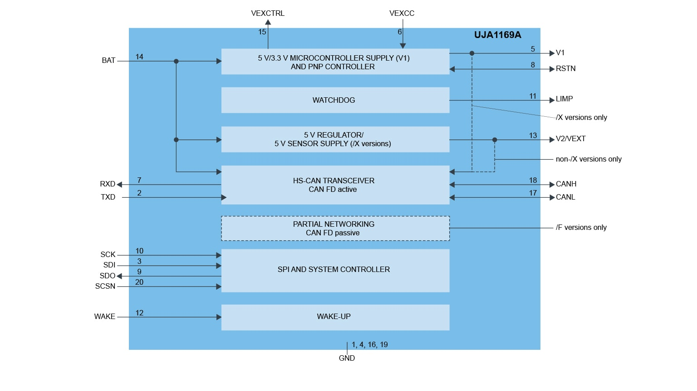
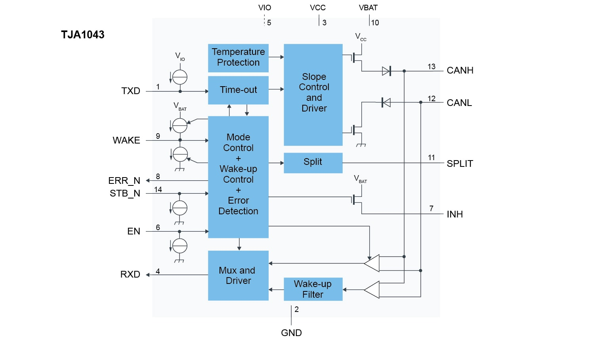
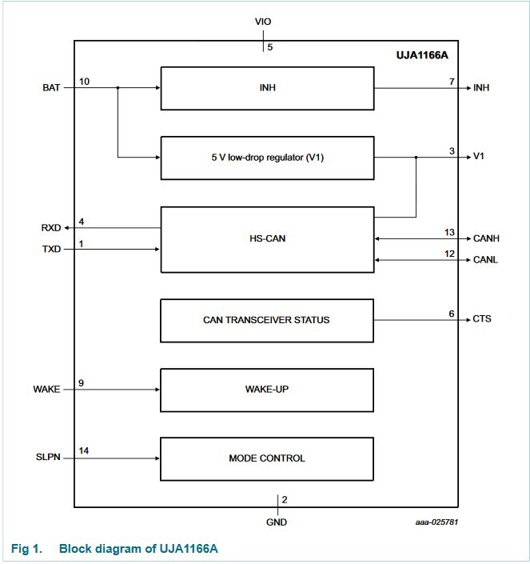

# Automatic Guide

## CAN Bus

1. [UJA1169ATK: Mini High-Speed CAN System Basis Chip](https://www.nxp.com/products/power-management/pmics-and-sbcs/mini-sbcs/mini-high-speed-can-system-basis-chip:UJA1169ATK)

  

2. [TJA1043: High-speed CAN transceiver](https://www.nxp.com/products/interfaces/can-transceivers/can-with-flexible-data-rate/high-speed-can-transceiver:TJA1043)

  

3. [UJA1166ATK: self-supplied high-speed CAN transceiver with Sleep mode](https://www.nxp.com/part/UJA1166ATK#/)

  

## Ethernet

1. [KSZ9131: Gigabit Ethernet Transceiver with Power Saving Features](https://www.microchip.com/wwwproducts/en/ksz9131)
2. [Marvell Alaska 88E1512 - Integrated 10/100/1000 Mbps Energy Efficient Ethernet Transceiver](https://www.marvell.com/search.html?search=88E1512)
3. [RTL8211F:INTEGRATED 10/100/1000M ETHERNET PRECISION TRANSCEIVER](https://www.realtek.com/en/products/communications-network-ics/item/rtl8211f-i-cg)
4. [Marvell Automotive Ethernet](https://www.marvell.com/products/automotive.html)

## Safty Manual

1. [S32K1xx Saft Manual](./S32K1xx20Series_Safety_Manual.pdf)

