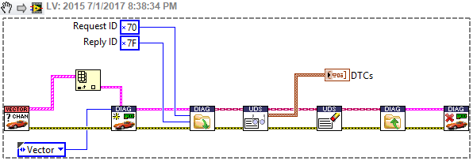

# [CAN Part 8 - ISO 15765, KWP2000, ODB, and UDS (Automotive Diagnostic Command Set)](http://hooovahh.blogspot.com/2017/07/can-part-8-iso-15765-kwp2000-odb-and.html)


In the earlier parts of this blog we CAN hardware, software, APIs,  databases, CAN Signals and CAN Frames.  In this part we are going to  talk more about one of the software techniques that has been developed  to get around some of the technical limitations to CAN to help allow for other types of data, with larger payloads, to be sent and received.

[TOC]

## Standard CAN Example

As defined by the CAN 2.0 spec, a standard or extended CAN Frame  consists of up to 8 bytes of payload, in 1 byte increments.  This is a  hard limitation and cannot be changed, without changing to a new  specification like CAN FD which also requires new hardware from multiple devices.  But often times when we start getting into automotive ECU  development we find ourselves wanting to use CAN in ways that maybe it  wasn't intended to be used for.  For example the CAN data we've been  talking about so far has primarily been periodic information.  A device  may send out the status of an analog input every 100ms by sending out a  single frame that contains this signal information.  This information is great for looking at values that may change rapidly over time, and  having a waveform of all data at small time increments like that is very useful.

## Engine Trouble Codes Example (DTC)

But lets say for a moment that I want to use CAN for something else.  Let say for instance my check engine light has turned on in my car and I want to know why.  An automotive technician will plug in a device on  the CAN bus and it will ask the ECU what is wrong.  The ECU will then  respond and tell the scanner what the list of things are that are  currently wrong, and a list of things that were wrong but aren't any  more, to give some history of issues to the technician.  These trouble  codes are known as Diagnostic Trouble Code (DTC), and aren't  periodically sent, and instead only are sent when another device asks it to.  DTCs are the kind of data that should not be sent every 100ms  because over the life of the ECU there is a small chance that a device  that wants to know what the DTCs are, is even listening.  So this type  of data is sent only on the event that it was requested.  Standard and  Extended CAN data can be sent this way but there is another issue with  DTCs.

 The list of potential DTCs any ECU can have set could be in the  hundreds.  And we cannot know how many are set, or which ones are set,  until the ECU tells us.  This causes the response from the ECU to vary  the amount of data it is going to send back depending on other  conditions, and it will likely need to be able to send back more than  just 8 bytes of data which a CAN frame is limited to.

## ISO 15765 Multi Frame Messaging

This is where the ISO 15765 protocol comes in.  The protocol is used in  places where more than 8 bytes of data need to be received, or more than 8 bytes of data needs to be sent as a response.  It is also used in  places were the data that needs to be sent or received is not the kind  of data that should be blindly broadcasted on a network autonomously.

### How does it work?

The basics of the 15765 are pretty simple.  A device will send out a  single frame telling another device that it has something it wants to  say.  Now if the thing it wants to say is small in size, it can be all  contained in that one frame.  But often times we need to send more data  so the sender will wait for the receiver to get the data, and then  respond.  In the response the receiver will state how many frames the  sender can send at once, and how much time can be between each frame.  Older CAN devices had a small buffer size, and wouldn't be able to  receive data too fast.  So the sender is supposed to receive this one  frame, known as a flow control, and then send back more data in with the timing specified.  This helps prevent the device receiving the data  from being overloaded, since the sender will only send the specified  number of frames requested.  Once all of the data gets received, the  receiving device will act on it, and then send a reply back.  Just like  the request, the response can also be a single frame, or multiple  frames.  If it is multiple frames then it will send the first frame, and then the original sender device will send back a frame stating how many frames it can receive, and what timing should be between them.  These  steps are a bit confusing so here is a flow diagram explaining it,  generated using the NI [State Diagram Toolkit](https://forums.ni.com/t5/Reference-Design-Content/LabVIEW-State-Diagram-Toolkit/ta-p/3606081).  The state machine starts on the green node, and ends on the red one.


Looking at this flow diagram things might be a bit confusing, so lets  break it down a bit more and talk about the various components and  checks that go into using raw frames for performing 15765 queries.

### CAN IDs

So in [Part 2](http://hooovahh.blogspot.com/2017/03/can-part-2-can-basics.html) we first talked about CAN Frames and mentioned the payload limitation,  as well as the fact that each frame has an ID.  Well when using ISO  15765 there are only two IDs ever used.  One ID is for the request and  one ID is for the reply.  The ID performing the request is known as the  Command Receive Object (**CRO**), and the ID for the response is known as  the Data Transmission Object (**DTO**). 

 This means that all requests from other devices on the bus will have the same IDs, and the same priority.  This also means that the reply sent  back will go to all devices on the bus, and it is the the responsibility of the device to look at the payload sent back to determine if the  reply it found was intended for that device, or if the this response was to another devices request that was issued.  On a normal automotive CAN bus these 15765 messages aren't going out often, and as mentioned with  our **DTC** example is something that is useful for debugging but isn't  intended to be part of normal operation.  As a result this issue of  multiple requester at once is probably a rare case and in most  situations every reply you see to an ISO 15765 message, is going to be  from a request your device issued.

 The CAN IDs used in 15765 can vary from device to device, and will be  specific to your device.  It is common to have different request and  response IDs for each device on the bus so this information needs to be  looked up in the documentation for the device you are trying to talk to.  In the following examples we will use CAN ID 0x70 for the request and  0x7F for the response.


## Simple Example

The following is a simple example where we send a small amount of  request data, and we receive a small reply following the state machine  from above.

### Write Single Frame

At the start of our state machine we have a state where we either write a Single Frame if our payload is less than or equal to 7 bytes, or we  will write the first frame in many if it is more.  Lets start with  writing the single frame and how it looks.  Lets say we intend on  writing the following 3 bytes of data 0x22 00 02, when we do this using  15765 our Single Frame we send will look like this:

```
 --> ID 0x70 Payload 0x03 22 00 02 00 00 00 00
```

 The padding of the frame to 8 bytes isn't always required and from now  on will not be included but some hardware may expect it.  The rest of  the payload is pretty simple.  The first byte represents the number of  bytes in our transmission.  Because this first byte always says how many bytes to expect, it leaves us with only 7 bytes of usable payload.

 Some messages don't require a response, and if we are sending a Single  Frame, and we don't care about the response we are done.  If we do care  about the response we then go and start reading frames looking for the  response in the Read Reply state.

### Read Reply

So in our example we have successfully sent one frame which contained  all the data we wanted to send.  The next step is to look for a reply.  The only reply we care about, is one on the CAN ID associated with a  response and in our case is 0x7F.  All other frames can be ignored.  If  too much times goes on and we haven't seen a frame with ID 0x7F we go to **Done** where we can throw an error.  This timeout is usually on  the order of 1 second but can vary depending on hardware.  Assuming we  do see a frame with ID 0x7F the next step is to identify what kind of  frame it is.

### Process Read (Single Request)

So we sent a frame, and we just got one back that is in response to what we sent.  Now lets identify what kind of frame it is in **Process Read** state.  Just like the first step in our state machine, the reply could be a  single frame taking 7 or less bytes, or it may need to be multiple  frames.  For simplicity lets say the reply is also 7 bytes or less and  consists of the following data, 0x01 02 03 04.  As a result the reply  may look something like this:


```
<-- ID 0x7F Payload 0x62 04 01 02 03 04
```


The first byte of the response is 0x62 because the first byte of the  request was 0x22, and the response needs to be the same as the request,  but with 0x40 added.  This helps us know the response we found was to a  request we issued.  If the first byte was anything else we know the  message was not for us.  The only other valid first byte that is for us  is 0x7F which is a negative response which we'll get into later.


So 0x62 means the reply is for us, and 0x04 means we have 4 bytes of  data to receive, and then after that we have the 4 bytes of data.  So in this example we sent the three bytes of data 0x22 00 02, and we  received four bytes of data 0x01 02 03 04.  Using another protocol on  top of 15765 known as UDS (ISO 14229), this example data corresponds to  asking the device to read an identifier (memory address) 0x00 02, and  the device returning the memory at that address which was 0x01 02 03 04

```
 --> ID 0x70 Payload 0x03 22 00 02 00 00 00 00   #Request to read data at address 0x00 02
<-- ID 0x7F Payload 0x62 04 01 02 03 04        #Response data at that address 0x01 02 03 04
```

###  Negative Response

If we got a negative response from the device it would look something like this:


```
<-- ID 0x7F Payload 0x7F 22 11
```


The 0x7F means this is a negative response, to the request 0x22, and the status of the response is 0x11.  There can be many custom response  codes but there are a set of them that are mostly standard.


| Response Code | Response                                           |
| ------------- | -------------------------------------------------- |
|               |                                                    |
| 0x10          | General reject                                     |
| 0x11          | Service not supported                              |
| 0x12          | Sub-Function not supported                         |
| 0x13          | Incorrect message length or invalid format         |
| 0x14          | Response too long                                  |
| 0x21          | Busy repeat request                                |
| 0x22          | Conditions not correct                             |
| 0x24          | Request sequence error                             |
| 0x25          | No response from sub-net component                 |
| 0x26          | Failure prevents execution of requested action     |
| 0x31          | Request out of range                               |
| 0x33          | Security access denied                             |
| 0x35          | Invalid key                                        |
| 0x36          | Exceeded number of attempts                        |
| 0x37          | Required time delay not expired                    |
| 0x38 - 0x4F   | Reserved by Extended Data Link Security            |
| 0x70          | Upload/Download not accepted                       |
| 0x71          | Transfer data suspended                            |
| 0x72          | General programming failure                        |
| 0x73          | Wrong Block Sequence Counter                       |
| 0x78          | Request correctly receive, but response is pending |
| 0x7E          | Sub-Function not supported in active session       |
| 0x7F          | Service not supported in active session            |


Looking at the state machine the only other option is needing to reissue the request.  If this happens the sender should send the request again.  One other negative response that doesn't end the state machine is if  the device asked for more time 0x78.  If this negative response is seen  the receiver should reset the timeout value and continue looking for  the next positive, or negative response.

## More Complicated Example

The following example is a bit more complicated and will involve sending a larger amount of request data, and we receive a larger amount of data in a reply, again using the state machine from earlier.

### Write First Frame

The example listed above is a very simple one.  We send a single frame,  and we get a single frame.  but 15765 is more useful when sending large  amounts of data.  So lets walk through an example of sending more data.  If we want to send more than 7 bytes of data we still need to start by  sending the First Frame and then we will send more when we are ready.  Lets say for instance we want to write the following 17 bytes of data  0x2E 00 02 00 01 02 03 04 05 06 07 08 09 0A 0B 0C 0D, our First Frame  will look like this:


```
--> ID 0x70 Payload 0x10 11 2E 00 02 00 01 02
```


Here the first two bytes are used telling the receiver what the  transmission will contain.  The second nibble in the first byte of the  payload being a 1 is telling the receiver that there is more data than  just this one frame.  This leave the remaining lower nibble, and 2nd  byte to be used to tell the receiver how many bytes to expect and in our case it is 0x00 11 or decimal 17 which is the full payload we need to  send.  Since the first two bytes of the payload are taken by the number  of bytes to be sent, this leaves us with only 6 bytes to send usable  data through, and so we take the first 6 bytes of our 17 bytes and send  it.

### Reply is Flow Control

So after sending the first frame, we will wait reading new frames just  like the previous example, but we expect to see a flow control frame.  This is a frame that tells us how many frames the device can read at  once, and how much time needs to be between each one.  The reply will  look something like this:

```
 <-- ID 0x7F Payload 0x30 05 0A
```

 Here the 0x30 tells us this is a flow control message, 0x05 means the  device can accept the next 5 frames before needing to reissue the flow  control.  This helps so that we don't overload the device and we know  that we are sending data to a device that is still listening.  And 0x0A  is the separation time needed between each frame.  The units of this are in milliseconds from 0 to 127, and in microseconds from 100 to 900.  This doesn't need to be precise and is a lower bounds, so the device  should be fine if we send them a little slower than that, but we  shouldn't send it faster than requested.  A zero for the number of  frames means just send them all, and a zero for the separation time  means no delay between frames is needed.

### Write Chunk of Data

After we sent the first frame, and we received the flow control  response, we are now able to start sending chunks of data.  We need to  abide by the flow control rates, and number of frames.  In this case we  are only going to need to send 2 more frames and the device said we can  send up to 5, as long as we separate them by 10 milliseconds.  Because  of that our next two frames we write will look like this:

```
 --> ID 0x70 Payload 0x21 03 04 05 06 07 08 09
 --> ID 0x70 Payload 0x22 0A 0B 0C 0D
```

 The first byte in the payload here goes from 0x21 and increments to 0x2F then back around to 0x21 with each frame sent in this chunk.  In our  case we only needed to send 2 frames.

### Read First Frame Reply

So we sent some data, waited for the device to reply, then we were able  to send the rest of our payload.  Now we need go into perform similar  work as we did in the first example.  We continue to read data looking  for a reply.  Just as in the earlier example the reply may tell us to  re-transmit a request, wait longer for a reply, or get the reply.  The  reply can be a single frame as in the previous example, or we can have a multi frame reply, just like our multi frame request.  We've already  seen a single frame reply example so lets look at the multi frame reply.  In this example lets assume the device wants to reply with the  following 21 bytes of data 0x6E 01 02 03 04 05 06 07 08 09 0A 0B 0C 0D  0E 0F 10 11 12 13 14.  This will start with the first few bytes of the  payload as before:


```
<-- ID 0x7F Payload 0x10 15 6E 01 02 03 04 05
```


Here we see the second nibble telling us this is the first frame of many because it is a 1, and the first nibble and second byte is 0x00 15  telling us there are 21 bytes total to receive.  Then the remaining 6  bytes is the first 6 of the reply.

### Write Flow Control

So we've sent our request, and we got the first frame of the reply, but  now we need to tell the device how many frames it can send us, and how  much time can be between each frame.  In most cases our hardware can  just read as many frames as possible since they will sit in our hardware buffer, and we don't really need any time between.  But just for an  example we will tell the device we can only read 4 frames at a time, and we need 20 milliseconds between each:


```
--> ID 0x70 Payload 0x30 04 14
```


 After we send this the device is free to send up to 4 frames with 20  milliseconds between them.  To tell the device to send all frames with  no delay replace the last two bytes to 0.

### Read Consecutive

So we sent a request, and we got the first 6 bytes of the reply, and we  sent the flow control telling the device to send the rest which will  look like this, which mirrors how the request message sent multiple  frames earlier:


```
<-- ID 0x7F Payload 0x21 06 07 08 09 0A 0B 0C

<-- ID 0x7F Payload 0x22 0D 0E 0F 10 11 12 13

<-- ID 0x7F Payload 0x23 14
```


After this it is the responsibility of our software to concatenate all  of the data into the request and response.  Here is the full transaction that takes place:


```
--> ID 0x70 Payload 0x10 11 2E 00 02 00 01 02   #First frame of multiple in request

<-- ID 0x7F Payload 0x30 05 0A               #Flow control telling us how to send the request

--> ID 0x70 Payload 0x21 03 04 05 06 07 08 09   #More data in request
 --> ID 0x70 Payload 0x22 0A 0B 0C 0D         #More data in request

<-- ID 0x7F Payload 0x10 15 6E 01 02 03 04 05   #First frame of multiple in reply

--> ID 0x70 Payload 0x30 04 14                #Flow control telling how we can receive data

<-- ID 0x7F Payload 0x21 06 07 08 09 0A 0B 0C  #More data in response

<-- ID 0x7F Payload 0x22 0D 0E 0F 10 11 12 13   #More data in response

<-- ID 0x7F Payload 0x23 14                   #More data in response
```


*(If you made it this far congratulations, that was a very large wall of text in those two basic examples.)*


## Other Protocols

The ISO 15765 just defines how to read and write multi-frame data, but  doesn't define what that data is.  The Unified Diagnostic Services ([UDS](https://en.wikipedia.org/wiki/Unified_Diagnostic_Services)), Keyword Protocol 2000 ([KWP2000](https://en.wikipedia.org/wiki/Keyword_Protocol_2000)), and On-Board Diagnostic ([OBD](https://en.wikipedia.org/wiki/OBD-II_PIDs)) and three software layers that each sit on ISO 15765 to perform operations like reading and clearing DTCs.

## Automotive Diagnostic Command Set (ADCS)

The NI toolkit [ADCS](http://sine.ni.com/nips/cds/view/p/lang/en/nid/203554) is basically the software implementation of ISO 15765, KWP2000, OBD, and  UDS for NI-CAN and NI-XNet devices.  This is fine if you have these  hardware options, but the software to implement this in any other  language is laid out before you.  So I decided to take the ADCS toolkit, and replace the core calls to the NI DLL driver, which is locked down,  and replace it with my G implementation.  I posted this idea on the [Idea Exchange](http://forums.ni.com/t5/LabVIEW-Idea-Exchange/G-Implementation-ECU-M-amp-C-and-Automotive-Diagnostic-Command/idi-p/3266149).  I also ran into several bugs with the toolkit and getting support  wasn't easy, so I eventually posted the basic G implementation of the  toolkit for NI-CAN hardware[ here](http://forums.ni.com/t5/Automotive-and-Embedded-Networks/Automotive-Diagnostic-Command-Set-USB-Transfer-Data-Error/m-p/3343381#M8117).  With the G implementation before us, all that is needed to this  functionality in other hardware is to just replace the CAN Read, and CAN Write functions with the hardware API of your choice.  This means that  ISO 15765, and really the ADCS functionality is now available for any  CAN hardware in LabVIEW.  I've created a set of code and wrappers and  inlcuded them in the [Hooovahh CAN ISO 15765](https://drive.google.com/file/d/0Bx36EXOz8jqXVW1WSUN1TnY3Sm8/view?usp=sharing&resourcekey=0-naXY7J-t5XIQBhoLX5p03Q) package, which works with the CAN Drivers package for 3rd party devices from earlier.


So with this newly created G code and palette, what steps are needed to  read the DTCs on an ECU, and then clear the DTCs?  Take a look at the  following example.





Here we open the first Vector port, initialize the protocol based on the request and reply ID, read the DTCs, Clear DTCs, then close the  references  There are some default values on some subVIs but the values  used are the most common.  All of the ISO15765 protocol, and the UDS  protocol that sits on top of it is all available in the G implementation inside those VIs.  These protocols and APIs work with any KVaser,  Vector, or Intrepid CAN hardware device, since it uses the [Hooovahh CAN Drivers](https://drive.google.com/file/d/0Bx36EXOz8jqXSGl4Q3dGWFZoYVU/view?usp=sharing&resourcekey=0-xRcLBg-R-nmD5xqGN0C-rQ) package from earlier to perform the raw CAN frame reading and writing.  The hardware drivers aren't wrapped into a nice hardware abstraction  class, but they probably should be, I just didn't get around to it.  Regardless the point of this code is not to give a working solution for your project, but instead to demonstrate how ISO 15765 operates, and  demonstrate that it can be used on any CAN hardware as long as you can  read and write raw CAN frames.  This means adding support for other  hardware types like NI-CAN, NI-XNet, or any other device can be done  without too much extra work.

## Part 9...

In this blog series we've covered a lot of information.  From hardware,  to APIs, to CAN Frames, CAN Signals, databases, advanced XNet features,  and now a software layer on top of CAN to help facilitate multi frame  data, and event based communication.  What else could we possibly talk  about?  The subjects are now going to get a bit more specific.  So in [Part 9](https://hooovahh.blogspot.com/2017/07/can-part-9-crcs-and-incrementing.html) we will have a quick discussion on the availability of what I call the  bucket filling problem in XNet, and how to handle functions like CRC,  and incrementing counter signals.
