# ISO 15765 -2 (2016)

Road vehicles -- Diagnostic communication over Controller Area Network (DoCAN) ---

Part 2:  Transport protocol and network layer services

[TOC]

## 6.2 Illustration of CAN parameters for transport protocol and network layer services

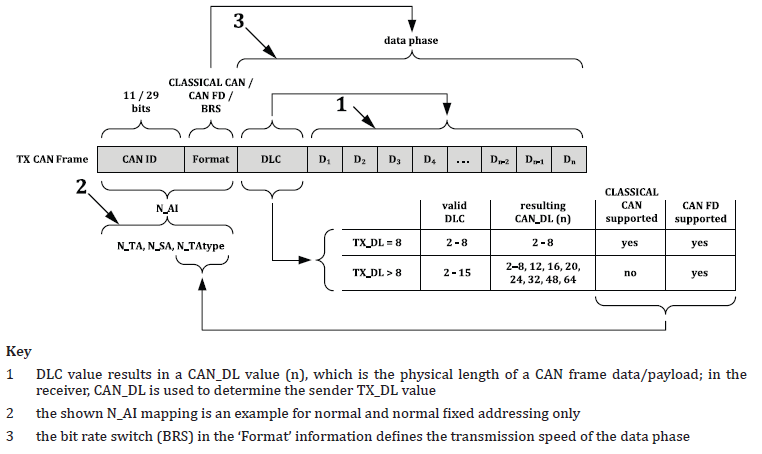

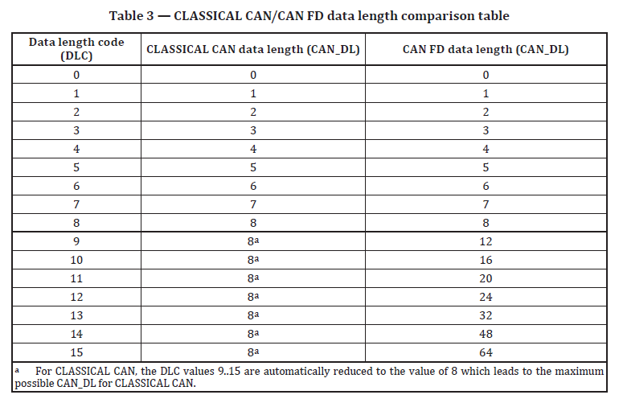

# 7 Network layer overview

## 7.1 General

***unconformed*** network layer communication protocol for the exchange of data between network nodes, eg from ECU to ECU, or between external test equipment and an ECU.

## 7.2 Services provided by network layer to higher layers

two types of services are defined.

a) Communication services

1) N_USData.request : request the transfer of data. may segments the data
2) N_USData_FF.indication : signal the beginning of a segmented message reception to the upper layer
3) N_USData.indication : provide received data to the higher layers
4) N_USData.confirm : comfirms to higher layers that the requested services has been carried out (successfully or not)

b) Protocol parameter setting services

1) N_ChangeParameter.request : request the dynamic setting of specific internal parameters.
2) N_ChangeParameter.confirm : confirms to the upper layer that the request to change a specific protocol has completed (successfully or not)

## 7.3 Internal operation of network layer

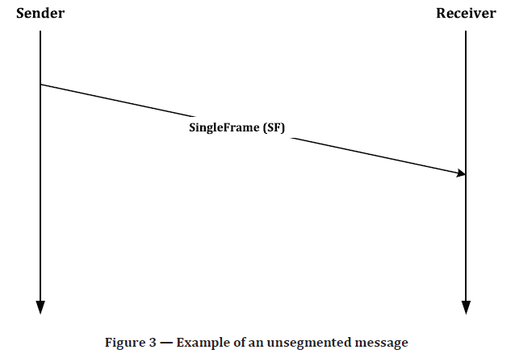

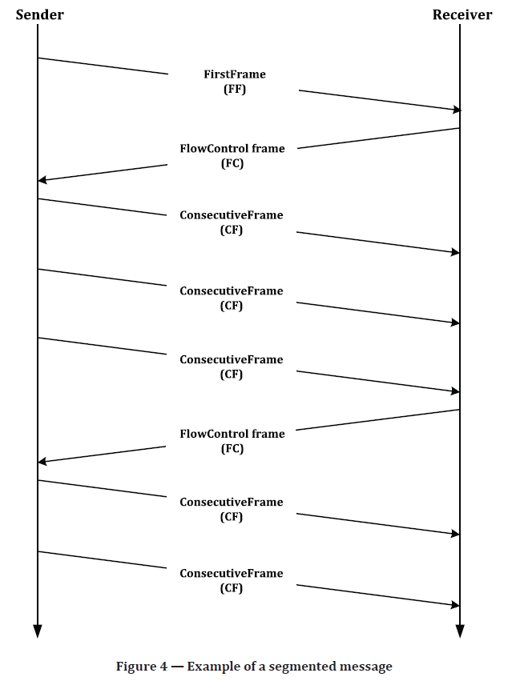

# 8 Network layer services

# 8.1 General

three types of service primitive list as below

* *request*, used by higher communication layers or the application to pass **control information** and **data** required to be transmitted to the network layer
* *indication*, used by the network layer to pass **status information** and **received data** to upper communication layer or the application
* *confirmation*, used by the network  layer to pass **status information** to higher communication or the application

## 8.2 Specification of network layer service primitives

### 8.2.1 N_USData.request

N_USData.request (

​	Mtype

​	N_SA

​	N_TA

​	N_TAtype

​	[N_AE]

​	\<MessageData>

​	\<Length>

)

### 8.2.2 N_USData.confirm

N_USData.confirm(

​	Mtype

​	N_SA

​	N_TA

​	N_TAtype

​	[N_AE]

​	<N_Result>

)

### 8.2.3 N_USData_FF.indication

N_USData_FF.indication(

​	Mtype

​	N_SA

​	N_TA

​	N_TAtype

​	[N_AE]

​	\<Length>

)

The N_USData_FF.indication service shall always be followed by an U_USData.indication service all from the network layer, indicating the completion (or failure) of message reception. 

only issued by the network layer if a correct FF message segment has been received.

### 8.2.4 N_USData.indication

N_USData.indication(

​	Mtype

​	N_SA

​	N_TA

​	N_TAtype

​	[N_AE]

​	\<MessageData>

​	\<Length>

​	<N_Result>

)

only issued  after reception of a SF message or as an indication of the completion (or failure) of a segmented message reception.

### 8.2.5 N_ChangeParameters.request

N_ChangeParameter.request (

​	Mtype

​	N_SA

​	N_TA

​	N_TAtype

​	[N_AE]

​	\<Parameter>

​	<Parameter_Value>

)

A parameter change is always possible, except after reception of the FF (N_USData_FF.indication) and until the end of reception of the corresponding mesasge (N_USData.indication)

### 8.2.6 N_ChangeParameter.confirm

N_ChangeParameter.request (

​	Mtype

​	N_SA

​	N_TA

​	N_TAtype

​	[N_AE]

​	<Parameter>

​	<Result_ChangeParameter>

)

## 8.3 Service data unit specification

### 8.3.1 Mtype, message type

enumeration, range: 

* diagnotics,  N_AI consist of N_SA, N_TA, and N_TAtype
* remote diagnotics, N_AI consist of N_SA, N_TA, N_TAtype and N_AE

### 8.3.2 N_AI, address information

#### 8.3.2.1 N_AI description

N_SA, N_TA, N_TAtype, N_AE

#### 8.3.2.2 N_SA, source address

8 bits

#### 8.3.2.3 N_TA, target address

8 bits

#### 8.3.2.4 N_TAtype, network target address type

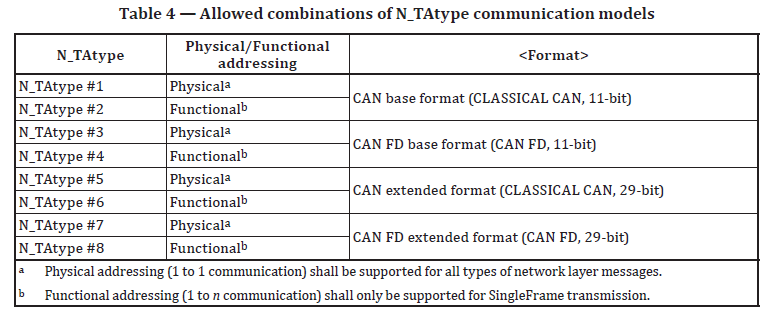

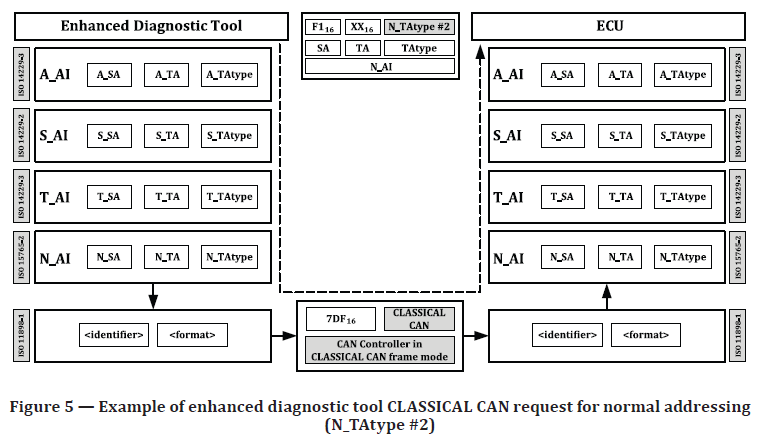

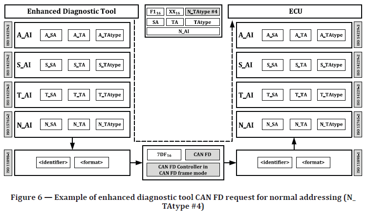

#### 8.3.2.5 N_AE, address externsion

8 bits, only part of the addressing information if [Mtype](#8.3.1 Mtype, message type) is set to remote diagnostics.

### 8.3.3 \<Length>

32bits

### 8.3.4 \<MessageData>

string of bytes

### 8.3.5 \<Parameter>

enumeration, Range: STmin, BS

### 8.3.6 <Parameter_Value>

8bits

### 8.3.7 <N_Result>
| Type           | Cause                                                        | Issue to      | Issue by          |
  | -------------- | ------------------------------------------------------------ | ------------- | ----------------- |
  | N_OK           |                                                              | service user  | sender + receiver |
  | N_TIMEOUT_A    | timer N_Ar/N_As exceed the N_Asmax/N_Armax                   | protocol user | sender + receiver |
  | N_TIMEOUT_Bs   | timer N_Bs exceed N_Bsmax                                    | service user  | sender            |
  | N_TIMEOUT_Cr   | timer N_Cr exceed N_Crmax                                    | service user  | receiver          |
  | N_WRONG_SN     | receipt an unexpected SequenceNumber(PCI.SN)                 | service user  | receiver          |
  | N_INVALID_FS   | received an invalid or unkown Flowstatus value               | service user  | sender            |
  | N_UNEXP_PDU    | receipt an unexpected protocol data unit                     | service user  | receiver          |
  | N_WFT_OVRN     | receiver has transmitted N_WFTmax FlowControl N_PDUs with FlowStatus= WAIT in a row and following this | service user  | receiver          |
  | N_BUFFER_OVFLW | receipt a FlowControl (FC) with FlowStatus = OVFLW.          | service user  | sender            |
  | N_ERROR        |                                                              | service user  | sender + receiver |

### 8.3.8 <Result_ChangeParameter>

| Type              | Cause                                                        | Issue to     | Issue by          |
| ----------------- | ------------------------------------------------------------ | ------------ | ----------------- |
| N_OK              |                                                              | service user | sender + receiver |
| N_RX_ON           | reception of the message identified by <N_AI> was taking place | service user | receiver          |
| N_WRONG_PARAMETER | an undefined <Parameter>                                     | service user | sender + receiver |
| N_WRONG_VALUE     | an out of range <Parameter_Value>                            | service user | sender + receiver |

# 9 Transport layer protocol

## 9.1 Protocol functions

* transmission/reception of message up to 232   - 1 data bytes
* reporting of transmission/reception completion (or failure)

## 9.2 SingleFrame transmission

### 9.2.1 SF with TX_DL=8

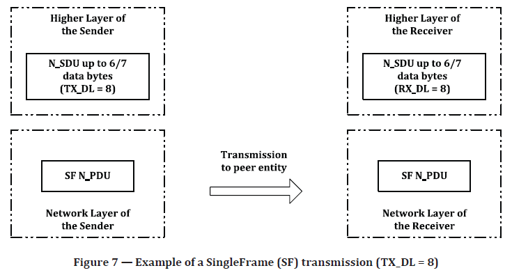

* six (TX_DL - 2) : extended or mixed addressing
* seven (TX_DL - 1 ) : normal addressing

### 9.2.2 SF with TX_DL > 8 

* TX_DL  - 3 : extended or mixed addressing
* TX_DL - 2 : normal addressing

### 9.3 Multiple-frame transmission

FlowControl mechanism as follows

* BlockSize (BS) : The maximum number of N_PDUs the receiver allows the sender to send before waiting for an authorization to continue transmission of the following N_PDUs. When BS is ZERO, not waiting to continuce transmission

* SeparationTime minmum (STmin) : The minimum time the sender is to wait between transmission of two CF N_PDUs.

two different modes for the adoption of above values for the receiver of a segmented message:

* dynamic : BS and STmin are updated for the subsequent PDU
* static : constant BS and STmin

ALL blocks , except the last one , will consist of BS N_PDUs. the last one will contain the remaining N_PDUs (from 1 up to BS)

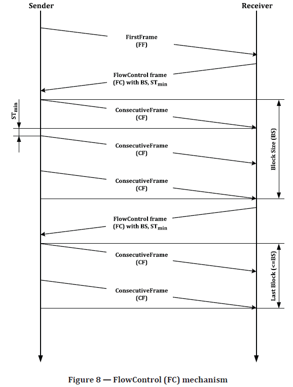

## 9.4 Transport layer protocol data units

### 9.4.1 Protocol data unit types

four different types of transport layer protocol data units,

* SingleFrame (SF N_PDU)
* FirstFrame (FF N_PDU)
* ConsecutiveFrame (CF N_PDU)
* FlowControl (FC N_PDU)

### 9.4.2 SF N_PDU

sent out by the sending network entity and can be received by one or multiple receiving network entities.

### 9.4.3 FF N_PDU

sent out by the sending network entity and received by a unique network entity for the duration of the segmented message transmission.

### 9.4.4 CF N_PDU

sent out by the sending network entity and received by a unique network entity for the duration of the segmented message transmission.

pass the assembled message to the service user of the network receiving entity **after** *the last* CF N_PDU has been received.

### 9.4.5 FC N_PDU

sent by the receiving network layer entity to the sending network layer entity, when ready to receive more data, after correct reception of 

* an FF N_PDU or 
* the last CF N_PDU of a block of CF, if further CF need to be sent

except to start, stop and resume transmission of CF N_PDUs, the FC can also inform to pause transmission of CF during a segmented message transmission or to abort the transmission of a segmented message if the length information (FF_DL)  exceeds the buffer size of the receiving entity.

### 9.4.6 Protocol data unit field description

#### 9.4.6.1 N_PDU format

| Address information | Protocol control information | Data field |
| ------------------- | ---------------------------- | ---------- |
| N_AI                | N_PCI                        | N_Data     |

#### 9.4.6.2 N_AI

the N_AI received in the N_SDU (N_SA, N_TA, N_TAtype [and N_AE]) should be copied and include in the N_PDU. if the message data (\<MessageData> and \<Length>) received in the N_SDU  requires segmentation for the network layer to transmit the complete message, the N_AI shall be copied and included (repeated ) in every N_PDU that is transmitted. 

* N_SA, network source address, 8 bits
* N_TA, network target address, 8 bits
* [N_TAtype](#8.3.2.4 N_TAtype, network target address type), network target address type, enumeration

* N_AE, network address extension, 8 bits, only for Mtype is set to remote diagnostics
* \<Length>, 32bits
* \<MessageData>,string of bytes

* \<parameter>, enumeration, range:  STmin ~ BS

* <parameter_Value>, 8 bits

* [<N_Result>](#8.3.7 <N_Result>), enumeration, error priority: 

  

  

#### 9.4.6.3 N_PCI

refer to [9.6.1](#9.6.1 N_PCI)

#### 9.4.6.4 N_Data

the size of N_Data depends on the N_PDU type, the address format chosen, and the value of TX_DL.

## 9.5 TX_DL configuration

### 9.5.1 definition of TX_DL

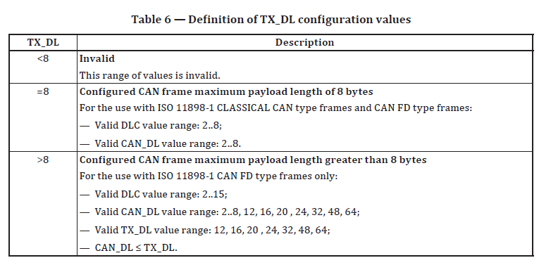

### 9.5.2 Creating CAN frames based on N_TAtype and TX_DL

CAN frames are generated based upon **N_AI**, the configured **addressing format** for the given N_AI, the configured **TX_DL** value, and the size of the message to be transmitted.

### 9.5.3 Verifying the correctness of received CAN Frames

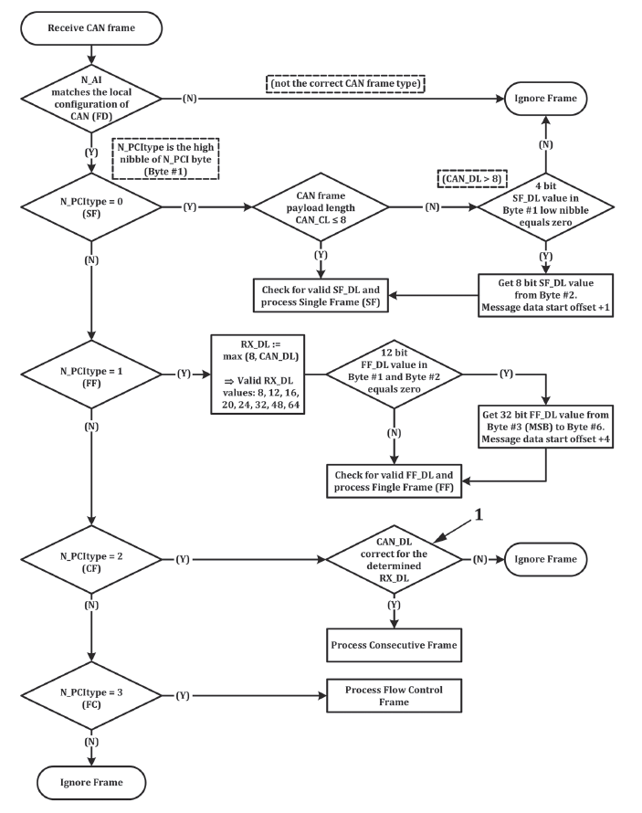

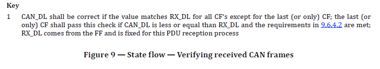

### 9.5.4 Receiver determination RX_DL

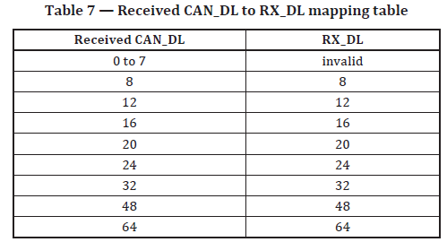

## 9.6 Protocol control information specification

### 9.6.1 N_PCI

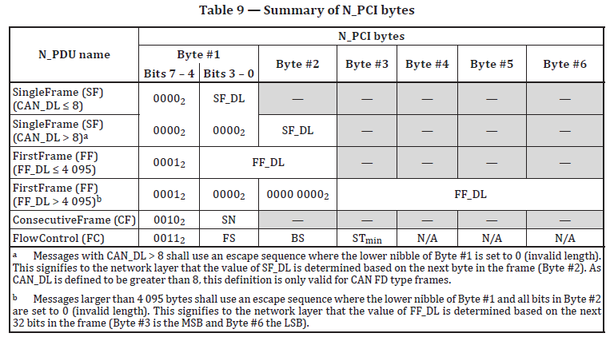

### 9.6.2 SF N_PCI parameter definition

#### 9.6.2.1 SF N_PCI byte

**SF_DL** is used to specify the number of service message data bytes. The ranges of valid SF_DL values depend on the configured transmit data link layer data length (**TX_DL**) and the **actual payload** to be transmitted.

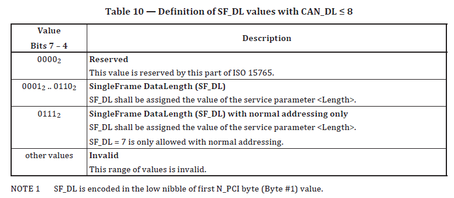

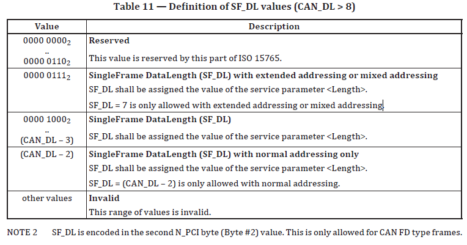

#### 9.6.2.2 SF_DL error handling

* Received CAN_DL is less or equal to 8

  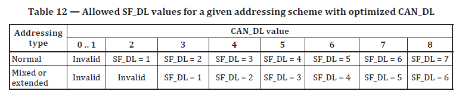

* Received CAN_DL is greater than 8

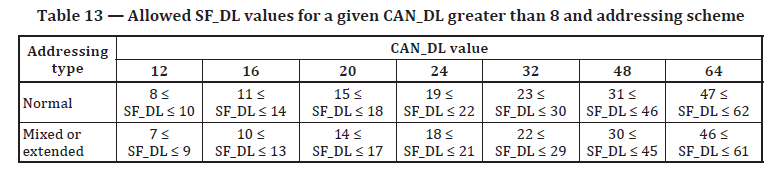

### 9.6.3 FF N_PCI parameter definition

#### 9.6.3.1 FF_DL definition

for the sender, the range of valid **FF_DL** values depends on the addressing scheme and the configured transmit data link layer data length (**TX_DL**). The minimum values of FF_DL (**FF_DLmin**) based on addressing scheme and TX_DL are specified in below Table

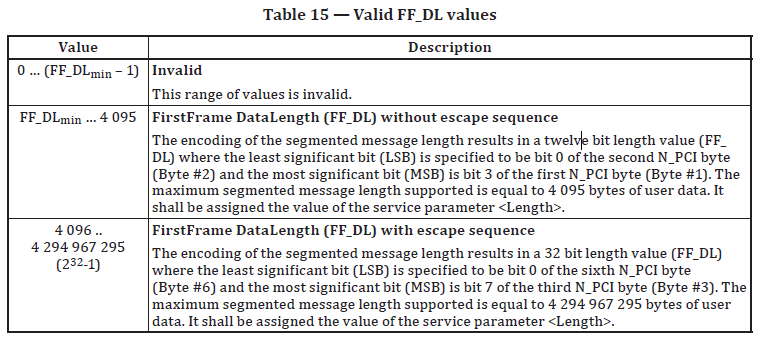

#### 9.6.3.2 FF_DL error handling

* FF and CAN_DL < 8, ignore the FF N_PDU
* FF_DL greater than the available receiver buffer size, abort and send FC N_PDU with the parameter FlowStatus = Overflow
* FF_DL less than FF_DLmin, ignore
* FF with the escape sequence and the FF_DL =< 4095, ignore

### 9.6.4 CF N_PCI parameter definition

#### 9.6.4.1 CF N_PCI byte

the payload data length CAN_DL of the received CAN frame has to match the RX_DL value which was determined in the reception process of the FirstFrame. Only the last CF in the multi-frame transmission may contain less than RX_DL bytes.

#### 9.6.4.2 Transmitter requirements for last consecutive frame

#### 9.6.4.3 SequenceNumber (SN) parameter definition

* the number ascending order of the ConsecutiveFrames

* the SN shall start with zero for all segmented message, include FF

* the SN of the first CF immediately following the FF shall be set to one

* the SN shall be incremented by one for each new CF 

* the SN value shall not be affected by any FlowControl (FC) frame

* when the SN reaches the value of 15, it shall wrapparound and be set to zero for the next CF.

  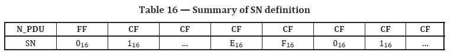

#### 9.6.4.4 SN error handling

when violated the above SN rule, abort the receipt message and the network layer shall make an N_USData.indication service call with the parameter <N_Result> = N_WRONG_SN to the adjacent upper layer.

### 9.6.5 FlowControl N_PCI parameter definition

#### 9.6.5.1 FlowStatus (FS) parameter definition

A **sending** network entity shall support all specified (not reserved )values of the FS parameter.

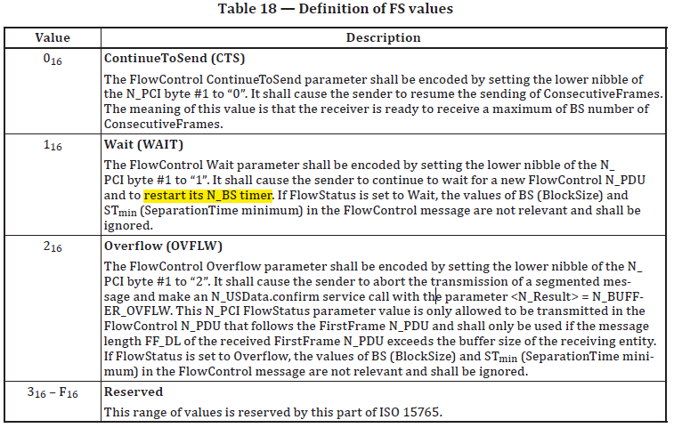

#### 9.6.5.2 FlowStatus (FS) error handling 

aborted and the network layer shall make an N_USData.confirm service call with the parameter <N_Result>= N_INVALID_FS to the adjacent upper layer.

#### 9.6.5.3 BlockSize (BS) parameter definition

the units of BS are the absolute number of CF N_PDUs per block.

eg, If BS is 20, then the block will consist of 20 CF N_PDUs.

Only the last block of CF in a segmented data transmission may have less than the BS number of frames.

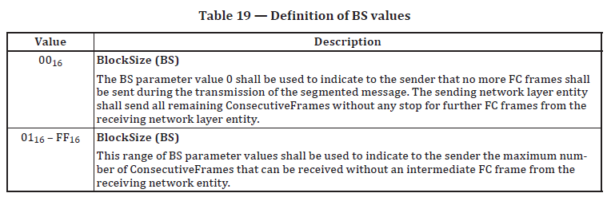

#### 9.6.5.4 SeparationTime minimum (STmin) parameter definition

specified by the receiving entity, which is the minimum time gap allowed between the transmissions of two CFs.

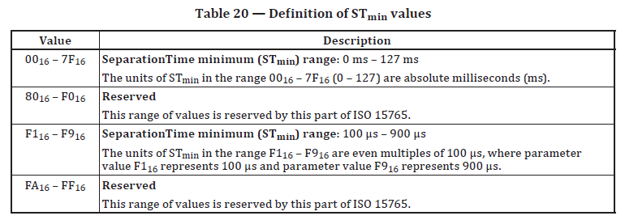

The measurement of the STmin starts after completion of transmission of a CF and ends at the request for the transmission of the next CF.

#### 9.6.5.5 STmin error handling

if got a reserved STmin value, the sending network entity shall use the longest STmin value (0x7F = 127ms).

if the time between two subsequent CFs of a segmented data transmission (N_As + N_Cs)  is smaller than the value commanded by the receiver via STmin, there is no guarantee that the receiver of the segmented data transmission will correctly receive and process all frames.

 In any case, the receiver of the segmented data transmission is not required to monitor adherence to the STmin value.

#### 9.6.5.6 Dynamic BS/STmin values in subsequent FlowControl frames

## 9.7 Maximum number of FC.WAIT frame transmissions (N_WFTmax)

avoid sender nodes within while_1_loop. This parameter is local to communication peers and is not transmitted and is hence not part of the FC protocol data unit.

* The N_WFTmax shall indicate how many FC N_PDU WAITs can be transmitted by the receiver in a row
* the upper limit shall be user defined at system generation time
* only be used on the receiving network entity during message reception
* if set to zero, then FlowControl shall reply upon FlowControl continue to send FC N_PDU CTS only.

## 9.8 Network layer timing

### 9.8.1 Timing parameters

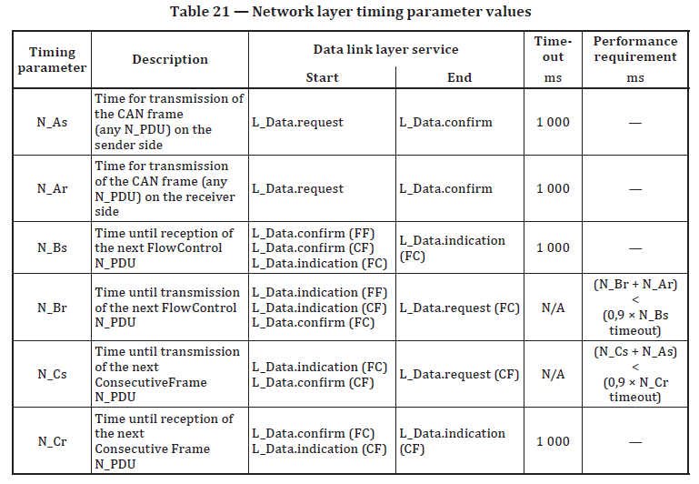

* .req  -> request
* .con -> confirm
* .ind -> indication

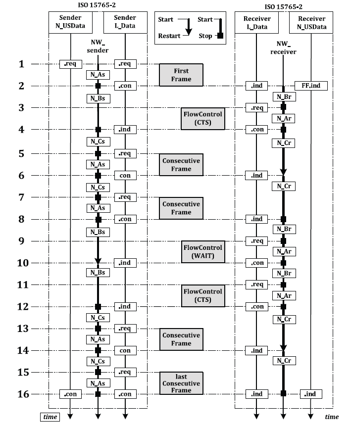

### 9.8.2 Network layer timeouts

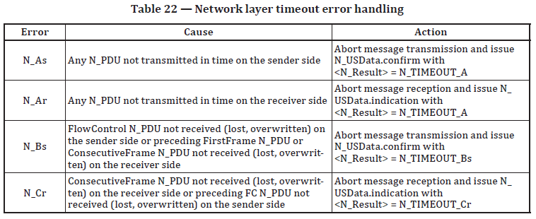

| Error | Cause | Action | Comments                           |
| ----- | ----- | ------ | ---------------------------------- |
| N_As  |       |        | report to upper layer with confirm |
|       |       |        | TODO                               |
|       |       |        | ??                                 |
|       |       |        |                                    |

### 9.8.3 Unexpected arrival of N_DPU

* out of the normal expected order
* it could be an unkown N_PDU that cannot be interpreted by the definitions given in the ISO 15765

### 9.8.4 Wait frame error handling

* *Receiver*: has  tranmitted N_WFTmax in a row. the receiver side shall abort the message reception and issue an N_USData.indication with <N_Result> set to N_WFT_OVRN to the higher layer.
* *Sender*: informed about the aborted message reception via an N_USData.confirm with <N_Result> set to N_TIMEOUT_Bs. (Because of the missing FC from the receiver, an N_Bs timeout occurs in the sender.) TODO

## 9.9 Interleaving of message

use case of gateway need this feature.

# 10 Data link layer usage

## 10.1 Data link layer service parameters

defined in ISO11898-1：

* \<Data> : CAN frame data
* \<DLC> : data length code
* \<Identifier> : CAN identifier
* <Transfer_Status> : status of a transmission
* \<Format> : frame format (CAN, CAN_FD, base: 11-bit, extend: 29-bit)

## 10.2 Data Link layer interface services

### 10.2.1 L_Data.request

L_Data.request (

​		\<Identifier>

​		\<Format>

​		\<DLC>

​		\<Data>	

)

### 10.2.2 L_Data.confirm

L_Data.confirm(

​		\<Identifier>

​		<Transfer_Status>

)

### 10.2.3 L_Data.indication

L_Data.indication(

​		\<Identifier>

​		\<Format>

​		\<DLC>

​		\<Data>	

)

## 10.3 Mapping of the N_PDU fields

### 10.3.1 Addressing formats

three addressing formats

* normal
* extended
* mixed addressing

### 10.3.2 Normal addressing

Base on [N_TAtype](#8.3.2.4 N_TAtype, network target address type), [Table 9](#9.6.1 N_PCI)

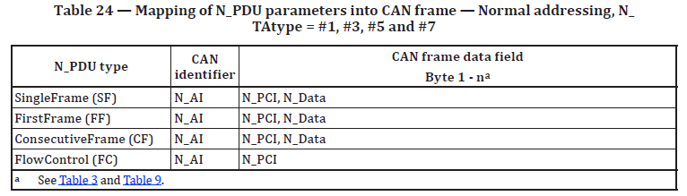

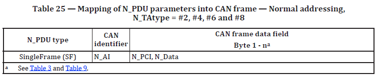

### 10.3.3 Normal fixed addressing

only 29 bit CAN identifiers are allowed. Base on [N_TAtype](#8.3.2.4 N_TAtype, network target address type), [Table 9](#9.6.1 N_PCI)

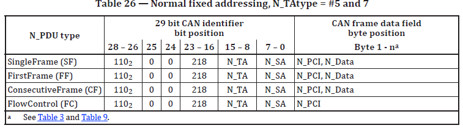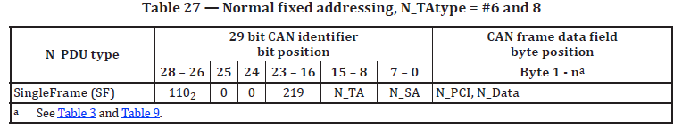

### 10.3.4 Extended addressing

Base on [N_TAtype](#8.3.2.4 N_TAtype, network target address type), [Table 9](#9.6.1 N_PCI)

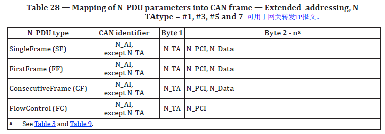

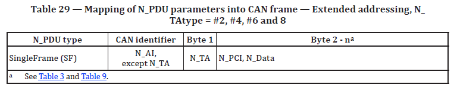

### 10.3.5 Mixed addressing

#### 10.3.5.1 29 bit CAN identifier

Mixed addressing is the addressing format to be used if [*Mtype*](#8.3.1 Mtype, message type) is set to **remote diagnostics**

Base on [N_TAtype](#8.3.2.4 N_TAtype, network target address type),

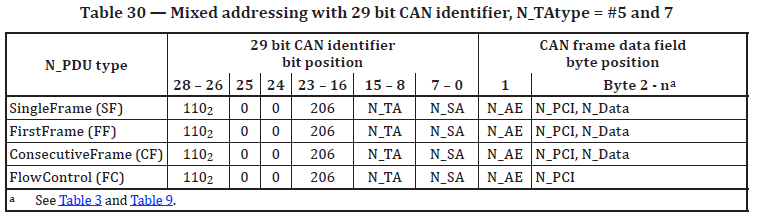

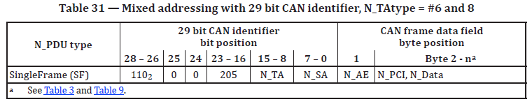

#### 10.3.5.2 11 bit CAN identifier

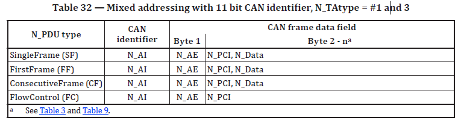

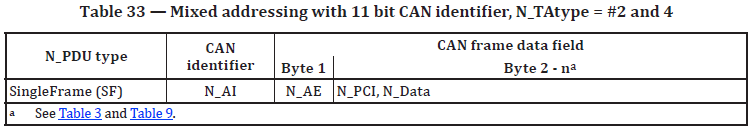

## 10.4 CAN frame data length code (DLC)

### 10.4.1 DLC parameter

### 10.4.2 CAN frame data

#### 10.4.2.1 CAN frame data padding (TX_DL = 8)

DLC is always set to 8. this can be the case for an SF, FC frame or the last CF of a segmented message. The default value 0xCC should be used for frame padding.

DLC parameter cannot be used to determine the message length; this information shall be extracted from the N_PCI information at the beginning of a message.

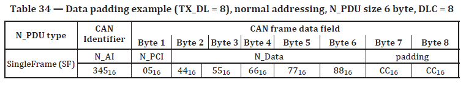

#### 10.4.2.2 CAN frame data optimization (TX_DL = 8)

DLC is **not** always need to be  8. this can **only** be the case for an SF, FC frame or the last CF of a segmented message. 

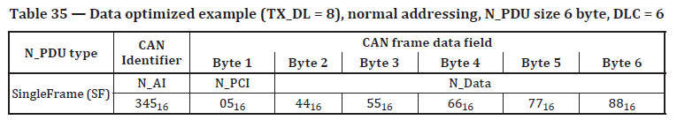

#### 10.4.2.3 Mandatory padding of CAN FD frames (TX_DL > 8)

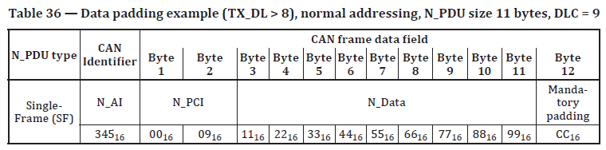

### 10.4.3 DLC error handling

ignore

For details, see specific error handling in [9.6](#9.6 Protocol control information specification).
