# [UDS Explained - A Simple Intro (Unified Diagnostic Services)](https://www.csselectronics.com/pages/uds-protocol-tutorial-unified-diagnostic-services)

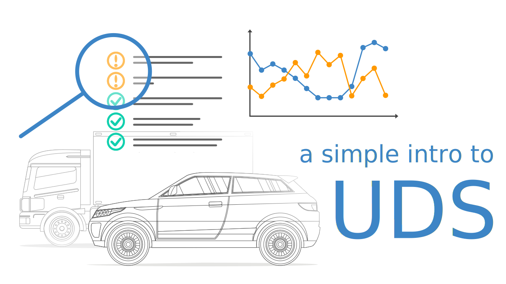

​      **Need a simple intro to UDS (Unified Diagnostic Services)?**     

In this practical tutorial, we introduce the UDS basics with  focus on UDS on CAN bus (UDSonCAN) and Diagnostics over CAN (DoCAN). We  also introduce the ISO-TP protocol and explain the difference between  UDS, OBD2, WWH-OBD and OBDonUDS. 

Finally, we'll explain how to request, record & decode UDS  messages - with practical examples for logging EV State of Charge and  the Vehicle Identification Number (VIN). 

[TOC]

## What is the UDS protocol?

Unified Diagnostic Services (UDS) is a  communication protocol used in automotive Electronic Control Units  (ECUs) to enable diagnostics, firmware updates, routine testing and  more. 

The UDS protocol (ISO 14229) is standardized across both manufacturers *and* standards (such as CAN, KWP 2000, Ethernet, LIN). Further, UDS is today used in ECUs across all tier 1 Original Equipment Manufacturers (OEMs). 

In practice, UDS communication is performed in a client-server  relationship - with the client being a tester-tool and the server being a vehicle ECU. For example, you can connect a [CAN bus](https://www.csselectronics.com/pages/can-bus-simple-intro-tutorial) interface to the [OBD2 connector](https://www.csselectronics.com/pages/obd2-explained-simple-intro) of a car and      send UDS requests into the vehicle. Assuming the targeted ECU supports UDS services, it will respond accordingly. 

​    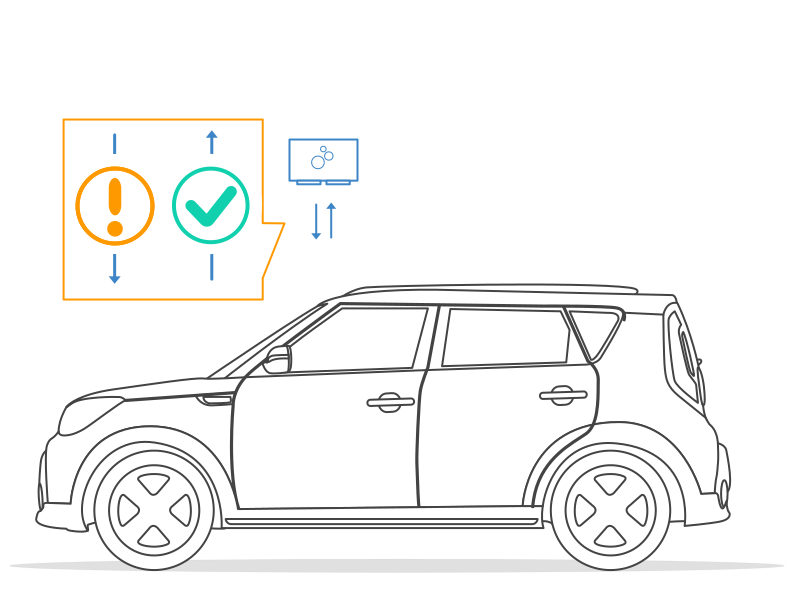  

In turn, this enables various use cases: 

- Read/clear diagnostic trouble codes (DTC) for troubleshooting vehicle issues 
- Extract parameter data values such as temperatures, state of charge, VIN etc 
- Initiate diagnostic sessions to e.g. test safety-critical features 
- Modify ECU behavior via resets, firmware flashing and settings modification 

UDS is sometimes referred to as '*vehicle manufacturer enhanced diagnostics*' or '*enhanced diagnostics*' - more on this below. 

## Example: Nissan Leaf SoC% 

UDS and CAN ISO-TP are complex topics. As motivation, we've done a case study to show how it can be useful. Specifically, we use a [CANedge2](https://www.csselectronics.com/products/can-bus-data-logger-wifi-canedge2) to request data on State of Charge (SoC%) and battery temperatures from a Nissan Leaf EV.

In the example, we also add a [CANmod.gps](https://www.csselectronics.com/products/gps-to-can-bus-gnss-imu) and [CANmod.temp](https://www.csselectronics.com/products/thermocouple-to-can-bus) to add GNSS, IMU and temperature data.

The multiframe ISO-TP responses and CANmod signals are DBC decoded via our [Python API](https://www.csselectronics.com/pages/python-can-bus-api#void) and written to a database for visualization in [Grafana dashboards](https://www.csselectronics.com/pages/telematics-dashboard-open-source). Check it out below!

[nissa leaf can bus uds case study soc](UDS_Explained_a_simple_intro.assets/nissan-leaf-can-bus-uds-case-study-soc.mp4)

[playground](https://grafana.csselectronics.stellarhosted.com/d/yBc5x90nk/css-playground-uds-temperature-gps?orgId=1)           

[case study](https://www.csselectronics.com/pages/nissan-leaf-can-bus-obd2-soc-state-of-charge)

## UDS message structure 

UDS is a request based protocol. In the illustration we've outlined an example of an **UDS request frame** (using CAN bus as basis):

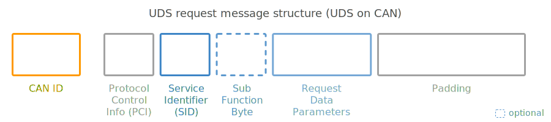

A diagnostic UDS request on CAN contains various fields that we detail below:

### Protocol Control Information (PCI)

The **PCI** field is not per se related to the UDS  request itself, but is required for diagnostic UDS requests made on CAN  bus. In short, the PCI field can be 1-3 bytes long and contains  information related to the transmission of messages that do not fit  within a single CAN frame. We will detail this more in the section on  the CAN bus transport protocol (ISO-TP). 

### UDS Service ID (SID) 

The use cases outlined above relate to different UDS services.  When you wish to utilize a specific UDS service, the UDS request message should contain the **UDS Service Identifier (SID)** in the data payload. Note that the identifiers are split between request SIDs  (e.g. 0x22) and response SIDs (e.g. 0x62). As in OBD2, the response SIDs generally add 0x40 to the request SIDs.    

See also the overview of all standardized UDS services and SIDs.  We will mainly focus on UDS service 0x22 in this article, which is used  to read data (e.g. speed, SoC, temperature, VIN) from an ECU. 

​    [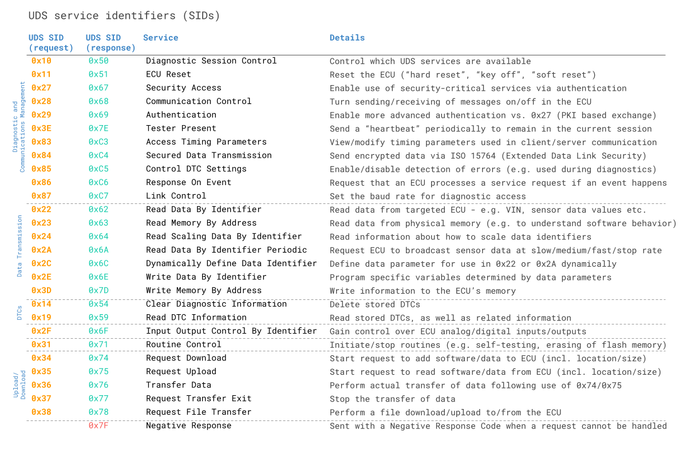](https://cdn.shopify.com/s/files/1/0579/8032/1980/files/Unified-Diagnostic-Services-UDS-overview-0x22-0x19.png)  

**UDS SIDs vs other diagnostic services**

The standardized UDS services shown above are in practice a subset of a larger set of diagnostic services - see below overview. Note here  that the SIDs 0x00 to 0x0F are reserved for legislated OBD services  (more on this later).

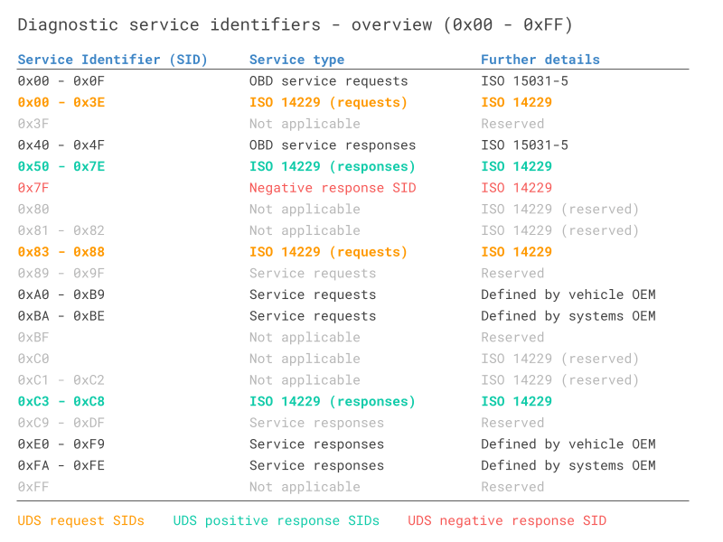

**UDS security via session-control (authentication)**

As evident, UDS enables extensive control over the vehicle ECUs. For  security reasons, critical UDS services are therefore restricted through an authentication process. Basically, an ECU will send a 'seed' to a  tester, who in turn must produce a 'key' to gain access to  security-critical services. To retain this access, the tester needs to  send a 'tester present' message periodically. 

In practice, this authentication process enables vehicle  manufactures to restrict UDS access for aftermarket users and ensure  that only designated tools will be able to utilize the security-critical UDS services. 

Note that the switching between authentication levels is done  through diagnostic session control, which is one of the UDS services  available. Vehicle manufactures can decide which sessions are supported, though they must always support the 'default session' (i.e. which does  not involve any authentication). With that said, they decide what  services are supported within the default session as    well. If a tester tool switches to a non-default session, it must  send a 'tester present' message periodically to avoid being returned to  the default session. 

### UDS Sub Function Byte 

The **sub function byte** is used in *some* UDS request frames as outlined below. Note, however, that in some UDS services, like 0x22, the sub function byte is not used. 

Generally, when a request is sent to an ECU, the ECU may respond  positively or negatively. In case the response is positive, the tester  may want to suppress the response (as it may be irrelevant). This is  done by setting the 1st bit to 1 in the sub function byte. Negative  responses cannot be suppressed. 

The remaining 7 bits can be used to define up to 128 sub function values. For example, when reading DTC information via SID 0x19 (Read  Diagnostic Information), the sub function can be used to control the  report type - see also below table. 

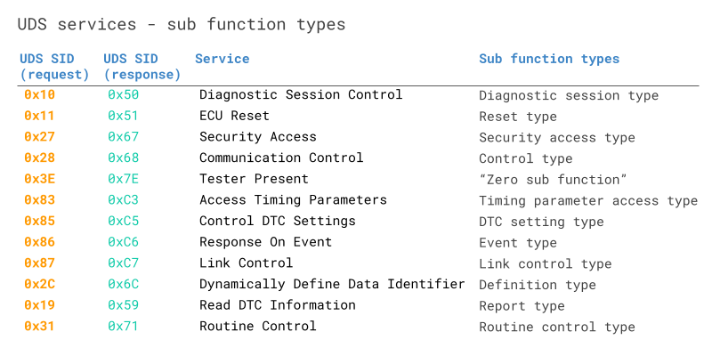

**Example: Service 0x19 sub functions**

If we look specifically at service 0x19, we can see an example of the various sub functions below: 

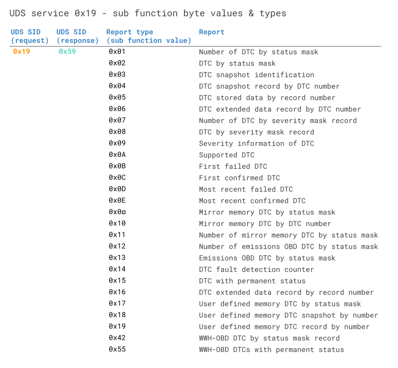      

### UDS 'Request Data Parameters' - incl. Data Identifier (DID) 

In most UDS request services, various types of **request data parameters** are used to provide further configuration of a request beyond the SID  and optional sub function byte. Here we outline two examples. 

**Service 0x19 (Read DTC information) -request configuration**

For example, service **0x19** lets you read DTC  information. The UDS request for SID 0x19 includes a sub function byte - for example, 0x02 lets you read DTCs via a status mask. In this  specific case, the sub function byte is followed by a 1-byte parameter  called DTC Status Mask to provide further information regarding the  request. Similarly, other types of sub functions within    0x19 have specific ways of configuring the request. 

**Service 0x22 (Read data by Identifier) - Data Identifiers**

Another example is service **0x22** (Read Data by  Identifier). This service uses a Data Identifier (DID), which is a  2-byte value between 0 and 65535 (0xFFFF). The DID serves as a parameter identifier for both requests/responses (similar to how the parameter  identifier, or PID, is used in OBD2). 

For example, a request for reading data via a single DID in UDS over CAN would include the PCI field, the UDS service 0x22 and the  2-byte DID. Alternatively, one can request data for additional DIDs by  adding them after the initial DID in the request. 

We will look further into this in the section on how to record and decode UDS communication. 

Data Identifiers can be proprietary and only known by OEMs,  though some DIDs are standardized. This is for example the case for the  WWH-OBD DIDs (more on this later) and the Vehicle Identification Number  (VIN) is 0xF190. See the separate table for a list of standardized DIDs  across UDS. 

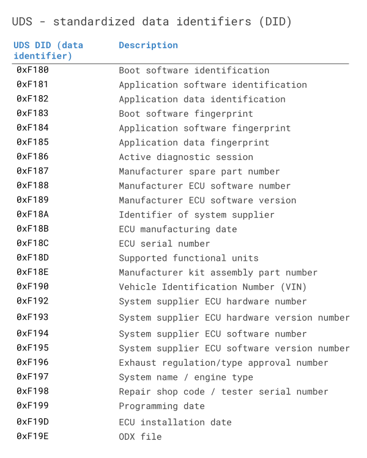

### Positive vs. negative UDS responses

When an ECU responds positively to an UDS request, the response frame is structured with similar elements as the request frame. For example, a 'positive' response to a service 0x22 request will contain the response SID 0x62 (0x22 + 0x40) and the 2-byte DID, followed by the actual data  payload for the requested DID. Generally, the structure of a positive  UDS response message depends on the  service. 

However, in some cases an ECU may provide a negative response to an  UDS request - for example if the service is not supported. A negative  response is structured as in below CAN frame example: 

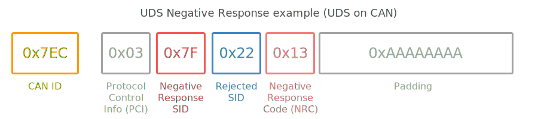

**Details + Negative Response Code table**

Below we briefly detail the negative response frame with focus on the NRC:

- The 1st byte is the PCI field 
- The 2nd byte is the Negative Response Code SID, 0x7F 
- The 3rd byte is the SID of the rejected request 
- The 4th byte is the Negative Response Code (NRC) 

In the negative UDS response, the NRC provides information regarding the cause of the rejection as per the table below. 

## UDS vs CAN bus: Standards & OSI model 

To better understand UDS, we will look at how it relates to CAN bus and the OSI model. 

As explained in our [CAN bus tutorial](https://www.csselectronics.com/pages/can-bus-simple-intro-tutorial), the Controller Area Network serves as a basis for communication.  Specifically, CAN is described by a data-link layer and physical layer  in the OSI model (as per ISO 11898). In contrast to CAN, UDS (ISO 14229) is a '**higher layer protocol**' and utilizes both the  session layer (5th) and application layer (7th) in the OSI model as shown below: 

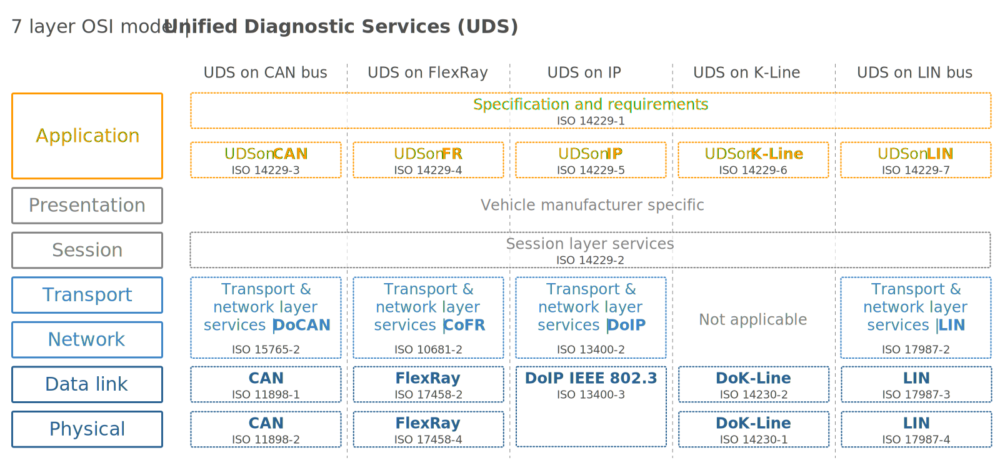

### Overview of UDS standards & concepts

UDS refers to a large number of standards/concepts, meaning it can be a  bit overwhelming. To give you an overview, we provide a high level  explanation of the most relevant ones below (with focus on CAN as the  basis). 

**Quick overview of the UDS OSI model layers**

In the following we provide a quick breakdown of each layer of the OSI model: 

- **Application**: This is described by ISO 14229-1 (across  the various serial data link layers). Further, separate ISO standards  describe the UDS application layer for the various lower layer protocols - e.g. ISO 14229-3 for CAN bus (aka UDSonCAN) 
- **Presentation**: This is vehicle manufacturer specific 
- **Session**: This is described in ISO 14229-2 
- **Transport + Network**: For CAN, ISO 15765-2 is used (aka ISO-TP) 
- **Data Link**: In the case of CAN, this is described by ISO 11898-1 
- **Physical**: In the case of CAN, this is described by ISO 11898-2 

As illustrated, multiple standards other than CAN may be used as  the basis for UDS communication - including FlexRay, Ethernet, LIN bus  and K-line. In this tutorial we focus on CAN, which is also the most  common lower layer protocol. 

**ISO 14229-1 (Application Layer)**

The ISO 14229-1 standard describes the application layer requirements for UDS (independent of what lower layer protocol is used). In  particular, it outlines the following: 

- Client-server communication flows (requests, responses, ...) 
- UDS services (as per the overview described previously) 
- Positive responses and negative response codes (NRCs) 
- Various definitions (e.g. DTCs, parameter data identifiers aka DIDs, ...) 

**ISO 14229-3 (Application Layer for CAN)**

The purpose of 14229-3 is to enable the implementation of Unified  Diagnostic Services (UDS) on Controller Area Networks (CAN) - also known as UDSonCAN. This standard describes the application layer requirements for UDSonCAN. 

This standard does not describe any implementation requirements for the in-vehicle CAN bus architecture. Instead, it focuses on some  additional requirements/restrictions for UDS that are specific to  UDSonCAN. 

Specifically, 14229-3 outlines which UDS services have CAN specific requirements. The affected UDS services are ResponseOnEvent and  ReadDataByPeriodicIdentifier, for which the CAN specific requirements  are detailed in 14229-3. All other UDS services are implemented as per  ISO 14229-1 and ISO 14229-2. 

ISO 14229-3 also describes a set of mappings between ISO 14229-2  and ISO 15765-2 (ISO-TP) and describes requirements related to 11-bit  and 29-bit CAN IDs when these are used for UDS and legislated OBD as per ISO 15765-4. 

**ISO 14229-2 (Session Layer)**

This describes the session layer in the UDS OSI model. Specifically, it  outlines service request/confirmation/indication primitives. These  provide an interface for the implementation of UDS (ISO 14229-1) with  any of the communication protocols (e.g. CAN). 

**ISO 15765-2 (Transport + Network Layer for CAN)**

For UDS on CAN, ISO 15765-2 describes how to communicate diagnostic  requests and responses. In particular, the standard describes how to  structure CAN frames to enable communication of multi-frame payloads. As this is a vital part of understanding UDS on CAN, we go into more depth in the next section. 

**ISO 11898 (Physical + Data Link Layer for CAN)**

When UDS is based on CAN bus, the physical and data link layers are  described in ISO 11898-1 and ISO 11898-2. When UDS is based on CAN, it  can be compared to a higher layer protocol like [J1939](https://www.csselectronics.com/pages/j1939-explained-simple-intro-tutorial), OBD2, [CANopen](https://www.csselectronics.com/pages/canopen-tutorial-simple-intro), [NMEA 2000](https://www.csselectronics.com/pages/marine-telematics-boat-data) etc. However, in contrast to these protocols, UDS could alternatively  be based on other communication protocols like FlexRay, Ethernet, [LIN](https://www.csselectronics.com/pages/lin-bus-protocol-intro-basics) etc. 

**UDSonCAN vs DoCAN**

When talking about UDS based on CAN bus, you'll often see two terms  used: UDSonCAN (UDS on CAN bus) and DoCAN (Diagnostics on CAN bus). Some UDS tutorials use these terms interchangeably, which may cause  confusion. 

In ISO 14229-1 the terms are used as in our OSI model illustration. In other words, UDSonCAN is used to refer to ISO 14229-3, while DoCAN  is used to refer to ISO 15765-2 aka ISO-TP. 

However, part of the confusion may arise because ISO 14229-3 also  provides an OSI model where DoCAN is both used in relation to ISO  15765-2 *and* as an overlay across OSI model layers 2 to 7. In  ISO 14229-2, DoCAN is referred to as the communication protocol on which UDS (ISO 14229-1) is implemented. This is in sync with the illustration from ISO 14229-3. In this context, DoCAN can be    viewed as a more over-arching term for the implementation of UDS on  CAN, whereas UDSonCAN seems consistently to refer to ISO 14229-3 only. 

**ISO 15765-3 vs ISO 14229-3**

UDS on CAN bus (UDSonCAN) is sometimes referred to through ISO 15765-3.  However, this standard is now obsolete and has been replaced by ISO  14229-3. 

## CAN ISO-TP - Transport Protocol (ISO 15765-2) 

When implementing diagnostics on CAN, one challenge is the size of  the CAN frame payload: For Classical CAN frames, this is limited to 8  bytes and for CAN FD the payload is limited to 64 bytes. Vehicle  diagnostics often involves communication of far larger payloads. 

ISO 15765-2 was established to solve the challenge of large payloads for CAN based vehicle diagnostics. 

The standard specifies a transport protocol and network layer  services for use in CAN based vehicle networks. The most common use  cases include UDS (ISO 14229-1), OBD (SAE J1979, ISO 15031-5) and  world-wide harmonized OBD aka WWH-OBD (ISO 27145). 

The ISO-TP standard outlines how to communicate CAN data payloads up to 4095 bytes through **segmentation**, **flow control** and **reassembly**. ISO-TP defines specific CAN frames for enabling this communication as shown below: 

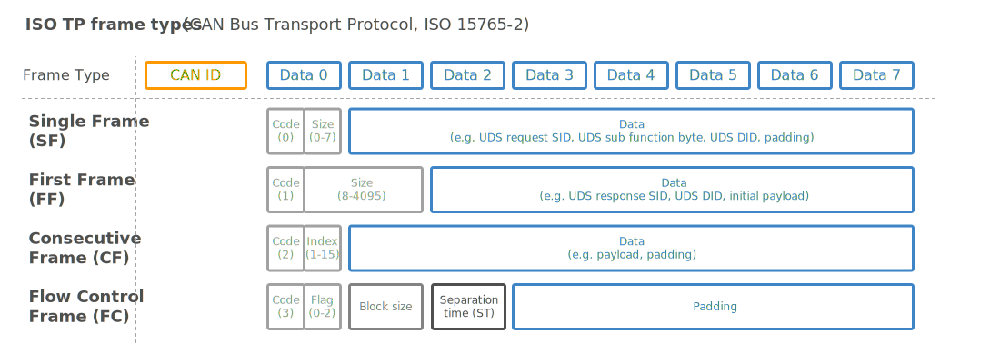

**Regading the Flow Control frame**

The flow control frame is used to 'configure' the subsequent communication. It can be constructed as below:

**Other ISO-TP frame comments**

- The ISO-TP frame type can be identified from the first nibble of the first byte (0x0, 0x1, 0x2, 0x3) 
- The total frame size can be up to 4095 bytes (0xFFF) as evident from the FF frame 
- The CF index runs from 1 to 15 (0xF) and is then reset if more data is to be sent 
- Padding (e.g. 0x00, 0xAA, ...) is used to ensure the frame payloads equal 8 bytes in length

Below we outline how the ISO-TP protocol works for single-frame and multi-frame communication:

### ISO-TP: Single-frame communication 

In vehicle diagnostics, communication is initiated by a tester tool sending a request. This request frame is a **Single Frame (SF)**. 

In the simplest case, a tester tool sends a Single Frame to  request data from an ECU. If the response can be contained in a 7-byte  payload, the ECU provides a **Single Frame response**. 

​      

### ISO-TP: Multi-frame communication 

When the payload *exceeds 7 bytes*, it needs to be split across multiple CAN frames. 

As before, a tester starts by sending a **Single Frame (SF)** request to an ECU (sender). However, in this case the response exceeds 7 bytes. 

Because of this, the ECU sends a **First Frame (FF)** that contains information on the total packet length (8 to 4095 bytes) as well as the initial chunk of data. 

When the tester receives the FF, it will send a **Flow Control (FC)** frame, which tells the ECU how the rest of the data transfer should be transmitted. 

Following this, the ECU will send **Consecutive Frames (CF)** that contain the remaining data payload. 

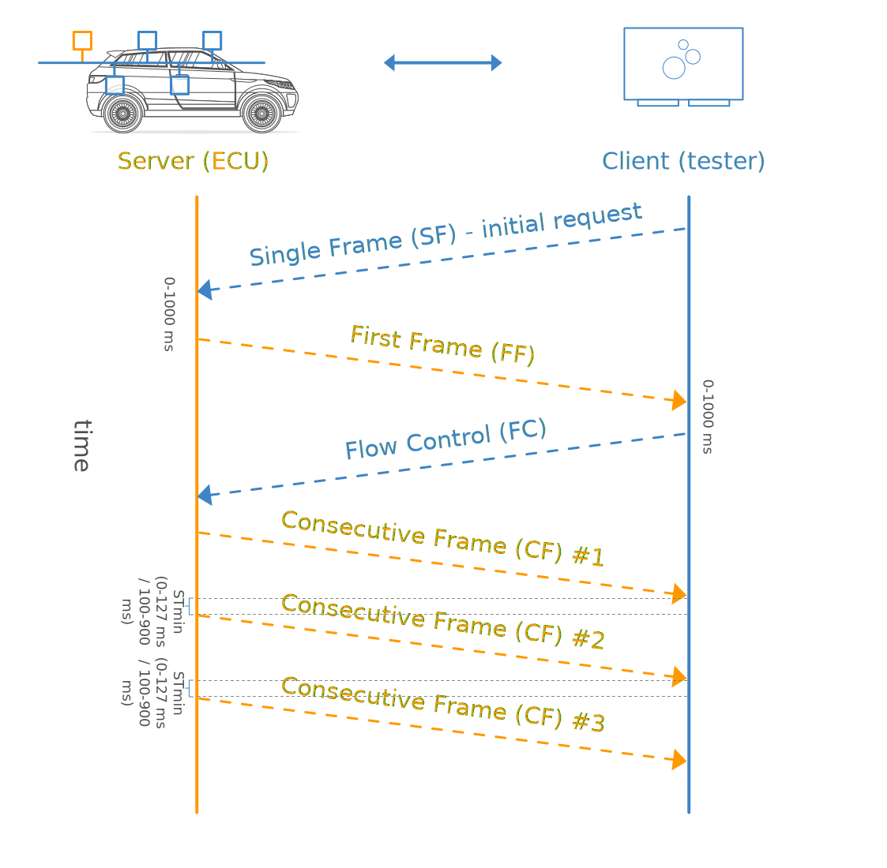

ISO-TP plays an important role in most CAN based diagnostics protocols.  Before we show practical examples of such communication flows, it is  useful to get an overview of the most common vehicle diagnostic  protocols. 

## UDS vs. OBD2 vs. WWH-OBD vs. OBDonUDS

A common question is how UDS relates to On-Board Diagnostics (OBD2), World-Wide Harmonized OBD (WWH-OBD) and OBDonUDS. 

To understand this, it is important to first note the following:

OBD (On-Board Diagnostics) is today implemented in different ways across countries and vehicles.

This is illustrated via the below OSI model comprising CAN based vehicle diagnostic protocols in use today:

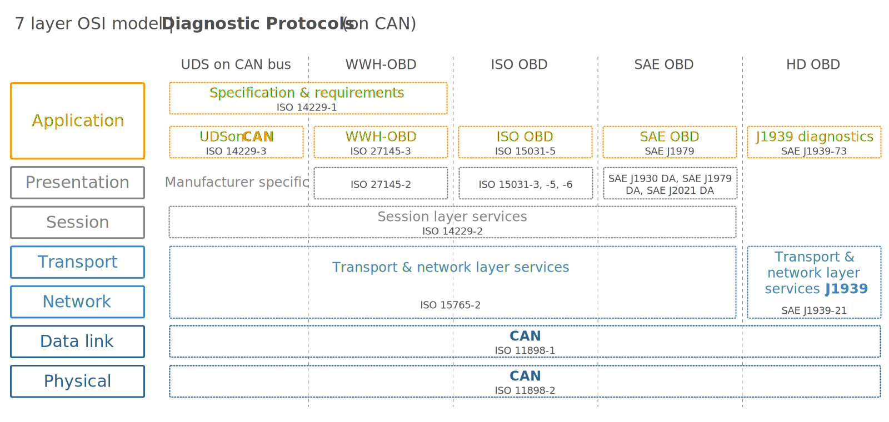

Let's look at each diagnostic protocol: 

- **ISO OBD** (or EOBD) refers to the OBD protocol specification legislated for use in EU cars, while **SAE OBD** refers to the OBD protocol specification legislated for use in US. The  two are technically equivalent and hence often referred to simply as OBD or OBD2
- **HD OBD** (SAE J1939) typically refers  to heavy duty OBD and is commonly implemented through the J1939 protocol in both US and EU produced vehicles with J1939-73 specifying diagnostic messages
- **UDS** (ISO 14229) has been implemented  by vehicle manufacturers to serve the need for richer diagnostics  data/functionality - beyond the limits of the emissions-focused OBD  protocols. It is implemented in most ECUs today, across markets and  vehicle types - though in itself, UDS does not offer the necessary  standardization required to serve as an alternative    to OBD
- **WWH-OBD** (and/or possibly **OBDonUDS**) provide an updated version of OBD2 for emissions-related diagnostics - based on UDS

To understand UDS, it is useful to better understand WWH-OBD and OBDonUDS:

### What is WWH-OBD (ISO 27145)? 

WWH-OBD is a global standard for vehicle diagnostics, developed  by the UN under the Global Technical Regulations (GTR) mandate. It aims  to provide a single, future-proof alternative to the existing OBD  protocols (ISO OBD, SAE OBD, HD OBD). Further, WWH-OBD is based on UDS  in order to suit the enhanced diagnostics functionality already deployed by most automotive OEMs today. 

**Advantages of WWH-OBD**

Moving from OBD2 to WWH-OBD will involve a number of benefits, primarily derived from using the UDS protocol as the basis. 

First of all, the data richness can be increased. OBD2  parameter identifiers (PID) are limited to 1 byte, restricting the  number of unique data types to 255, while the UDS data identifier (DID)  is 2 bytes, enabling 65535 parameters. 

For diagnostic trouble codes (DTCs), OBD2 would allow for  2-byte DTCs. Here, WWH-OBD allows for 'extended DTCs' of 3 bytes. This  allows for grouping DTCs by 2-byte types and using the 3rd byte as a  failure mode indicator to specify the DTC sub type. 

Further, WWH-OBD enables a classification of DTCs based on how severe an issue is in regards to the exhaust emissions quality. 

WWH-OBD also seeks to take potential future requirements into  account by allowing for the Internet Protocol (IP) to be used as an  alternative to CAN, meaning that UDSonIP will also be possible in future implementations of WWH-OBD. One potential benefit from this will be the ability to one day perform remote diagnostics through the same  protocol. 

**What is the status on WWH-OBD roll-out?**

The intent of WWH-OBD is to serve as a global standard, across  all markets and across all vehicle types (cars, trucks, buses, ...).  Further, the aim is to potentially expand the standardized functionality beyond just emissions-control. 

In practice, WWH-OBD has been required in EU since 2014 for  newly developed heavy duty vehicles (as per the Euro-VI standards). Note in this case that HD OBD (as per J1939) remains allowed in these  vehicles. 

Beyond this, however, the roll-out of WWH-OBD has been limited. One challenge is that WWH-OBD is currently not accepted by EPA/CARB in  USA. See e.g. [this discussion](https://www.xing.com/communities/posts/wwh-obd-1009991653) for potential motivations. However, recently OBDonUDS (SAE J1979-2) is being adopted in US. 

​    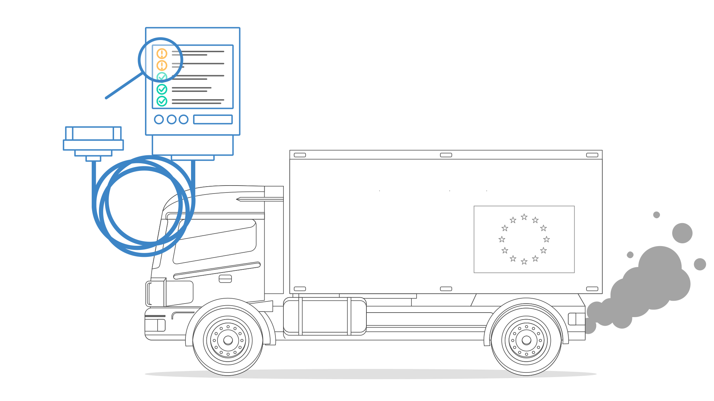

### What is OBDonUDS (SAE J1979-2)? 

Similar to how OBD2 has been split into 'SAE OBD' (SAE J1979) for US and 'ISO OBD' (ISO 15031) for EU, the 'next generation' of OBD2 may  again be regionally split. 

Specifically, WWH-OBD (ISO 21745) has been adopted in EU for  heavy duty vehicles already - but not yet in the US. Instead, it has  recently been decided to adopt OBD on UDS in US vehicles in the form of  the SAE J1979-2 standard, which serves as an update to the SAE J1979.  The new SAE J1979-2 standard is also referred to as OBDonUDS. The aim is to initiate a transition phase starting in 2023,      where ECUs are allowed to support either OBD2 or OBDonUDS. From  2027, OBDonUDS will be a mandatory requirement for all vehicles produced in the US. 

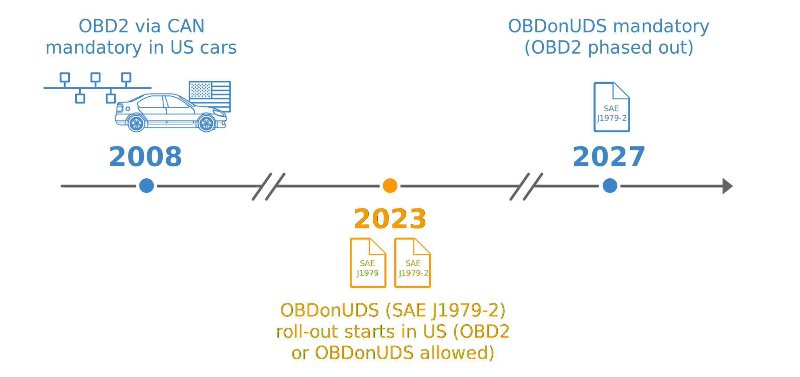

**Looking ahead: WWH-OBD vs OBDonUDS**

To recap, WWH-OBD and OBDonUDS both serve as possible solutions for  creating a 'next generation" protocol for emissions-related on-board  diagnostics. It remains to be seen if the two will exist in parallel  (like ISO/SAE OBD), or if one of the protocols will become the de facto  standard across both US, EU and beyond. 

In either case, the basis for emissions-related diagnostics will be UDS, which will serve to simplify ECU programming as the  emissions-related diagnostics can increasingly be implemented within the same UDS based structure as the manufacturer specific enhanced  diagnostics. 

## FAQ: How to request/record UDS data 

We have now gone through the basics of UDS and the CAN based transport protocol.

With this in place, we can provide some concrete guidance on how  you can work with UDS data in practice. In particular, we will focus on  how UDS can be used to log various data parameters - like state of  charge (SoC) in electric vehicles. 

Before the examples, we'll cover frequently asked questions on UDS data logging: 

​    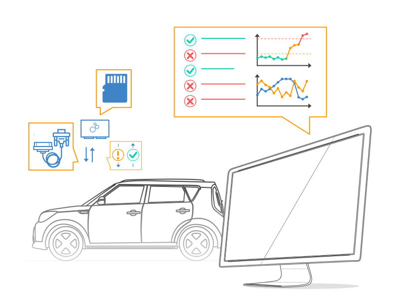

**Can the CANedge record UDS data**

Yes, as we'll show further below, the CANedge can be configured to request UDS data. Effectively, the device can be configured to  transmit up to 64 custom CAN frames as periodic or single shot frames.  You can control the CAN ID, CAN data payload, period time and delay. 

For **single-frame** UDS communication, you simply configure the CANedge with the request frame, which will trigger a  single response frame from the ECU. 

For **multi-frame** communication, you can again  configure the CANedge with a request frame and then add the Flow Control frame as a separate frame to be transmitted X milliseconds after the  request frame. By adjusting the timing, you can set this up so that the  Flow Control is sent after the ECU has sent the First Frame response. 

​      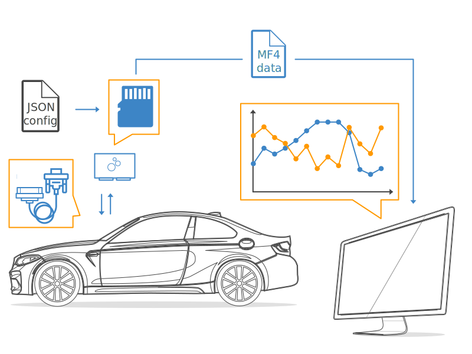    

Note that the CANedge will record the UDS responses as raw CAN  frames. You can then process and decode this data via your preferred  software (e.g. [Vector tools](https://www.csselectronics.com/pages/mdf4-converters-mf4-asc-csv)) or our [CAN bus Python API](https://www.csselectronics.com/pages/python-can-bus-api) to reassemble and decode the frames.

*Note: In future firmware updates, we may enhance the transmit  functionality to enable the CANedge to transmit custom CAN frames based  on a trigger condition, such as receiving a specific frame. This would  allow for sending the Flow Control frame with a set delay after  receiving the First Frame, providing a simpler and more robust  implementation. With that said, the current functionality      will serve to support most UDS communicated related to services  0x22 (Read Data by Identifier) and 0x19 (Read DTC Information).*

**What data can I log via UDS**

A very common use case for recording UDS data via 'standalone' data  loggers will be to acquire diagnostic trouble code values, e.g. for use  in diagnosing issues. 

In addition to the trouble codes, UDS lets you request the 'current value" of various sensors related to each ECU. This allows e.g. vehicle fleet managers, researchers etc. to collect data of interest such as  speed, RPM, state of charge, temperatures etc. from the car (assuming  they know how to request/decode the data, as explained below). 

Beyond the above, UDS can of course also be used for more low-level control of ECUs, e.g. resets and flashing of firmware, though such use  cases are more commonly performed using a CAN bus interface - rather  than a 'standalone' device. 

**Is UDS data proprietary - or are there public parameters**

Importantly, UDS is a manufacturer specific diagnostic protocol. 

In other words, while UDS provides a standardized structure for  diagnostic communication, the actual 'content" of the communication  remains proprietary and is in most cases only known to the manufacturer  of a specific vehicle/ECU. 

For example, UDS standardizes how to request parameter data from an ECU via the 'Read Data By Identifier" service (0x22). But it does not  specify a list of standardized identifiers and interpretation rules. In  this way, UDS differs from OBD2, where a public list of OBD2 PIDs enable almost anyone to interpret OBD2 data from their car. 

With that said, vehicles that support WWH-OBD or OBDonUDS may  support some of the usual OBD2 PIDs like speed, RPM etc via the usual  PID values - but with a prefix of 0xF4 as shown in Example 1 below.

Generally, only the manufacturer (OEM) will know how to request  proprietary parameters via UDS - and how to interpret the result. Of  course, one exception to this rule is cases where companies or  individuals successfully reverse engineer this information. Engaging in  such reverse engineering is a very difficult task, but you can sometimes find public information and DBC files where others    have done this exercise. Our [intro to DBC files](https://www.csselectronics.com/pages/can-dbc-file-database-intro) contain a list of public DBC/decoding databases. 

**Who benefits from logging UDS data?**

Because of the proprietary nature of UDS communication, it is  typically most relevant to automotive engineers working at OEMs. Tools  like the CANedge CAN bus data logger allow these users to record raw CAN traffic from a vehicle - while at the same time requesting diagnostic  trouble codes and specific parameter values via UDS. 

Further, some after market users like vehicle fleet managers and  even private persons can benefit from UDS assuming they are able to  identify the reverse engineered information required to request and  decode the UDS parameters of interest. 

Logging UDS data will also become increasingly relevant assuming  WWH-OBD gets rolled out as expected. Already today, WWH-OBD is used in  EU heavy duty vehicles produced after 2014, meaning UDS communication  will be relevant for use cases related to on-board diagnostics in these  vehicles. 

**Central Gateway (CGW): Why log sensor data via UDS vs CAN? **

If you're looking to request UDS-based diagnostic trouble codes (DTC), you'll of course have to use UDS communication for this purpose. However, if your aim is to record current sensor values it is less  clear. 

Typically, data parameters of interest for e.g. vehicle  telematics (speed, state of charge etc) will already be communicated  between ECUs on the CAN bus in the form of raw CAN frames - without the  need for a diagnostic tool requesting this information. That is because  ECUs rely on communicating this information as part of their operation  (as explained in our [intro to CAN bus](https://www.csselectronics.com/pages/can-bus-simple-intro-tutorial)). 

If you have direct access to the CAN bus, it would thus appear  easier to simply log this raw CAN traffic and process it. If you are the vehicle manufacturer, you will know how to interpret this raw CAN data  either way - and it'll be simpler to perform your device configuration  and post processing in most cases. If you're in the aftermarket, it'll  also be simpler to reverse engineer the        raw CAN frames as you can focus on single frames - and avoid the request/response layer of complexity. 

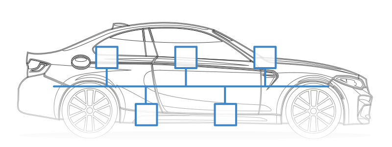

However, one key reason why UDS is frequently used for  extracting sensor values despite the above is due to 'gateways'.  Specifically, an increasing share of modern cars have started to block  the access to the raw CAN bus data via the OBD2 connector. This is  particularly often the case for German vehicles, as well as electric  vehicles. 

To record the existing CAN traffic in such a car, you would  need to e.g. use a CANCrocodile adapter and 'snap' it onto the CAN  low/high wiring harness. This in turn will require exposing the wiring  harness by removing a panel, which is often prohibitive for many use  cases. In contrast, the OBD2 connector gateways typically still allow  for UDS communication - incl. sensor value        communication. 

A secondary - and more subtle - reason is that most reverse  engineering work is done by 'OBD2 dongle manufacturers'. These develop  tools that let you extract data across many different cars through the  OBD2 connector. Increasingly, the only way for these dongles to get  useful information through the OBD2 connector is through UDS  communication, which drives a proportionally higher        availability of information/databases related to UDS parameters  vs. raw CAN parameters. 

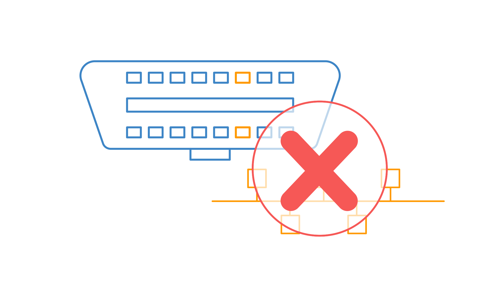

**Does my vehicle support UDS?**

Since most ECUs today support UDS communication, the answer is in "yes, most likely". 

If you're the vehicle manufacturer, you will in most cases have the information required to construct UDS requests for whatever data you  need - and you'll also know how to decode it. 

For the specific case of recording WWH-OBD data in EU trucks,  standardized DID information can be recorded by both OEMs and  after-market users - similar to how you can record public OBD2 PIDs from cars/trucks. 

Beyond the above, if you are in the after market and wish to record proprietary UDS information from a car/truck, it will be difficult. In  this case, you would either have to contact the OEM (e.g. as a system  integrator/partner) or identify the request/decoding information through reverse engineering. The latter is in practice impossible for most  people. 

In select cases you may be able to utilize public information  shared on e.g. github to help in constructing UDS requests - and  decoding the responses. Just keep in mind that public resources are  based on reverse engineering efforts - and may risk being incorrect or  outdated. You should therefore take all information with a significant  grain of salt. 

**Why is UDS increasingly important?**

If your use case involves recording data from cars produced between  2008 and 2018, you will most often be interested in data that can be  collected via OBD2 data logging. This is because most ICE cars after  2008 support a large share of the public OBD2 parameter identifiers like speed, RPM, throttle position, fuel level etc. 

However, the availability of OBD2 data is expected to decrease over time for multiple reasons. 

First of all, as we explained in the previous section, WWH-OBD  (based on UDS) or OBDonUDS are expected to gradually replace OBD2 as the de facto standard for vehicle diagnostics. 

Second, with the rise of electric vehicles, legislated OBD2 is not  necessarily supported at all. And even if an EV supports some OBD2 PIDs, you'll note from our OBD2 PID list that some of the most relevant EV  parameters like State of Charge (SoC) and State of Health (SoH) are not  available via OBD2. In contrast, UDS remains supported in most EVs and  will provide access to a far broader range    of data - although without the after-market convenience of a public  list of UDS parameters (at least yet). It is expected that EV sales will overtake ICE car sales between [2030 and 2040](https://www.csselectronics.com/pages/electric-vehicle-data-logger-cloud-battery-telematics) - and thus UDS communication will become increasingly relevant. 

## Example 1: Record single frame UDS data (Speed via WWH-OBD)

To show how UDS works in practice, we will start with a basic  example. As outlined before, WWH-OBD is based on UDS - and is mandated  in all EU trucks after 2014. 

As part of this, many EU heavy duty trucks will let you request  parameters like speed, RPM, fuel level etc in a way similar to how you'd request this information via OBD2 PID requests in a car - see our OBD2  intro and OBD2 data logger intro for details. However, under WWH-OBD  (ISO 21745-2), the OBD2 PIDs are replaced by the **WWH-OBD DIDs**. 

For service 01, WWH-OBD PIDs are equivalent to the OBD2 PIDs, except that **0xF4** is added in front.

For example, the OBD2 PID Vehicle Speed is **0x0D** - which becomes **0xF40D** in the WWH-OBD context. 

​    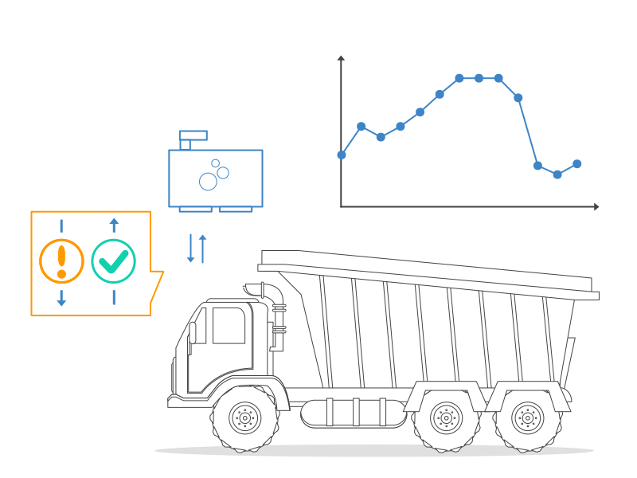  

In this case, we will use a [CANedge2 CAN bus data logger](https://www.csselectronics.com/products/can-bus-data-logger-wifi-canedge2) as our "tester" tool. This tool lets you record raw CAN bus data, as  well as transmit custom CAN frames. To request WWH-OBD Vehicle Speed, we will use the UDS service 0x22 (Read Data by Identifier) and the Data  Identifier 0xF40D. The request/response  looks as below: 

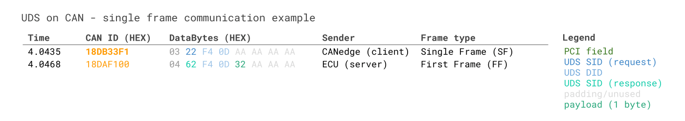

**Communication flow details**

Note how the request is sent with CAN ID 0x18DB33F1. This is the same 29-bit CAN ID that would be used to perform a functionally addressed  OBD2 PID request in heavy duty vehicles and can be compared with the  11-bit 0x7DF CAN ID used for OBD2 requests in cars. 

The response has CAN ID 0x18DAF100, an example of a physical  response ID matching the IDs you'd see in regular OBD2 responses from  heavy duty vehicles. 

Let's break down the communication flow message payloads: 

First, the CANedge2 sends a **Single Frame (SF)** request: 

- The initial 4 bits of the PCI field equal the frame type (0x0 for SF) 
- The next 4 bits of the PCI field equal the the length of the request (3 bytes) 
- The 2nd byte contains the Service Identifier (SID), in this case 0x22 
- The 3rd and 4th bytes contain the DID for Vehicle Speed in WWH-OBD (0xF40D) 
- The remaining bytes are padded 

In response to this request, the truck responds with a Single Frame (SF) response: 

- The 1st byte again reflects the PCI field (now with a length of 4 bytes)
- The 2nd byte is the response SID for Read Data by Identifier (0x62, i.e. 0x22 + 0x40) 
- The 3rd and 4th bytes again contain the DID 0xF40D 
- The 5th byte contains the value of Vehicle Speed, 0x32 

Here we can use the same decoding rules as for ISO/SAE OBD2,  meaning that the physical value of Vehicle Speed is simply the decimal  form of 0x32 - i.e. **50 km/h**. See also our OBD2 PID conversion tool. 

If you are familiar with logging OBD2 PIDs, it should be evident  that WWH-OBD requests are very similar, except for using the UDSonCAN  payload structure for requests/responses. 

## Example 2: Record & decode multi frame UDS data (SoC) 

In this section, we illustrate how multi frame UDS communication works in the context of CAN ISO-TP. 

Specifically, we will use the CANedge2 and the UDS service SID  0x22 (Read Data By Identifier) to request the current value of State of  Charge (SoC%) from a Hyundai Kona electric vehicle. 

First, the CANedge is configured to send two CAN frames: 

1. A Single Frame (SF) request (period: 5000 ms, delay: 0 ms) 
2. A Flow Control (FC) frame (period: 5000 ms, delay: 100 ms) 

A subset of the resulting communication flow looks as below: 

[       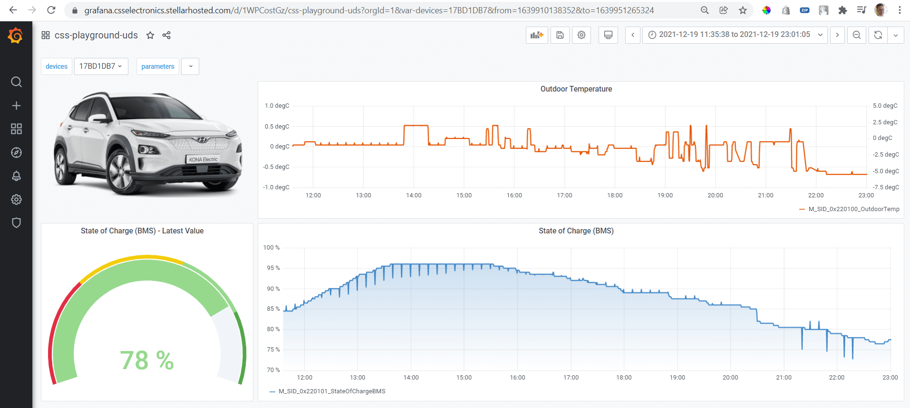](https://www.csselectronics.com/pages/telematics-dashboard-open-source)

*The CANedge2 can be used to request UDS data from e.g. a Hyundai Kona EV for visualization in dashboards - learn more in our [telematics dashboards intro](https://www.csselectronics.com/pages/telematics-dashboard-open-source).*

**Commnication flow details**

In the following we explore this communication between the CANedge and ECU in detail. 

First of all, the initial **Single Frame (SF)**  request is constructed via the same logic as in our previous example -  containing the PCI field, the SID 0x22 and the DID. In this case, we use the DID 0x0101. 

In response to the initial SF request, the targeted ECU sends a **First Frame (FF)** response: 

- The initial 4 bits equal the frame type (0x1 for FF) 
- The next 12 bits equal the data payload size, in this case 62 bytes (0x03E) 
- The 3rd byte is the response SID for Read Data by Identifier (0x62, i.e. 0x22 + 0x40) 
- The 4th and 5th bytes contain the Data Identifier (DID) 0x0101 
- The remaining bytes contain the initial part of the data payload for the DID 0x0101 

Following the FF, the tester tool now sends the **Flow Control (FC)** frame: 

- The initial 4 bits equal the frame type (0x3 for FC) 
- The next 4 bits specifies that the ECU should "Continue to Send" (0x0) 
- The 2nd byte sets remaining frames to be sent without flow control or delay 
- The 3rd byte sets the minimum consecutive frame separation time (ST) to 0 

Once the ECU receives the FC, it sends the remaining **Consecutive Frames (CF)**: 

- The initial 4 bits equal the frame type (0x2 for CF) 
- The next 4 bits equal the index counter, incremented from 1 up to 8 in this case 
- The remaining 7 bytes of each CF contain the rest of the payload for the DID 

**Regarding proprietary UDS data**

Part of the information used here is proprietary. In particular, it  is generally not known what Data Identifier (DID) to use in order to  request e.g. State of Charge from a given electric vehicle, unless  you're the vehicle manufacturer (OEM). Further, as explained in the next section, it is not known how to decode the response payload. 

However, various online resources exist e.g. on github, where  enthusiasts create open source databases for specific parameters and  certain cars (based on reverse engineering). The information we use for  this specific communication is taken from one such database. 

**Regarding the CAN IDs used**

In this case we use the CAN ID 0x7E4 to request data from a specific  ECU, which in turn responds with CAN ID 0x7EC. This is known as a  physically addressed request. 

In contrast, functionally addressed request would use the CAN ID 0x7DF (or 0x18DB33F1 in heavy duty vehicles). 

Generally, request/response CAN IDs are paired (as per the table  below) and you can identify the physical request ID corresponding to a  specific physical response ID by subtracting the value 8 from the  response ID. In other words, if an ECU responds via CAN ID 0x7EC, the  physical request ID targeting that ECU would be 0x7E4 (as in our EV  example). 

Since you may not know what address to target initially, you can in some cases start by sending out a functional request using the CAN ID  0x7DF, in which case the relevant ECU should provide a positive First  Frame response if the initial request payload is structured correctly.  In some vehicles, you may be able to also send the subsequent Flow  Control frame using the same CAN ID, 0x7DF, in    order to trigger the ECU to send the remaining Consecutive Frames.  However, some implementations may require that you instead utilize the  physical addressing request ID for the Flow Control frame. 

Implementing a request structure with dynamically updating CAN IDs  may be difficult. If you're the manufacturer, you will of course know  the relevant CAN IDs to use for sending physically addressed service  requests. If not, you may perform an analysis using e.g. a CAN bus  interface to identify what response CAN IDs appear when sending  functionally addressed service requests - and using this    information to construct your configuration. 

On a separate note, ISO 15765-4 states that enhanced  diagnostics requests/responses may utilize the legislated OBD2 CAN ID  range as long as it does not interfere - which is what we are seeing in  this specific Hyundai Kona example where the IDs 0x7EC/0x7E4 are used  for proprietary data. 

See also the table from ISO 15765-4 for an overview of the  legislated OBD CAN identifiers for use in functional and physical OBD  PID requests: 

​      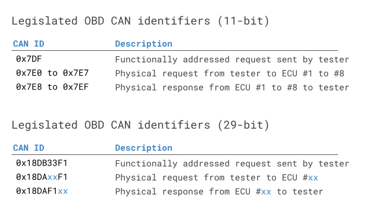    

**Regarding timing parameters**

In the above  example, we generally focus on the sequence of CAN frames. The sequence  is important: For example, if your tester tool sends the Flow Control  frame before receiving the First Frame, the Flow Control frame will  either be ignored (thus not triggering the Consecutive Frames) or cause  an error. 

However, in addition to this, certain timing thresholds will also  need to be satisfied. For example, if your tester tool receives the  First Frame from an ECU of a multi frame response, the ECU will 'time  out' if the Flow Control frame is not sent within a set timeperiod. 

As a rule of thumb, you should configure your tester (e.g. the  CANedge) so that the Flow Control frame is always sent after the First  Frame response is received from the ECU (typically this happens within  10-50 ms from sending the initial request) - but in a way so that it is  sent within a set time after receiving the First Frame (e.g. within 0-50 ms). For details on this, feel free to    contact us. 

### How to reassemble and decode multi-frame UDS data? 

We've now shown how you can request/record a multi-frame UDS response to collect proprietary ECU sensor data. In order to extract 'physical  values' like State of Charge, you need to know how to interpret the  response CAN frames. 

As explained, the 'decoding' information is typically proprietary and only known to the OEM. 

However, in the specific case of the Hyundai Kona EV, we know the following about the SoC signal from [online resources](https://www.csselectronics.com/pages/can-dbc-file-database-intro#public-dbc-files): 

- The signal is in the 8th byte of the data payload 
- The signal is Unsigned 
- The signal has a scale 0.5, offset 0 and unit "%" 

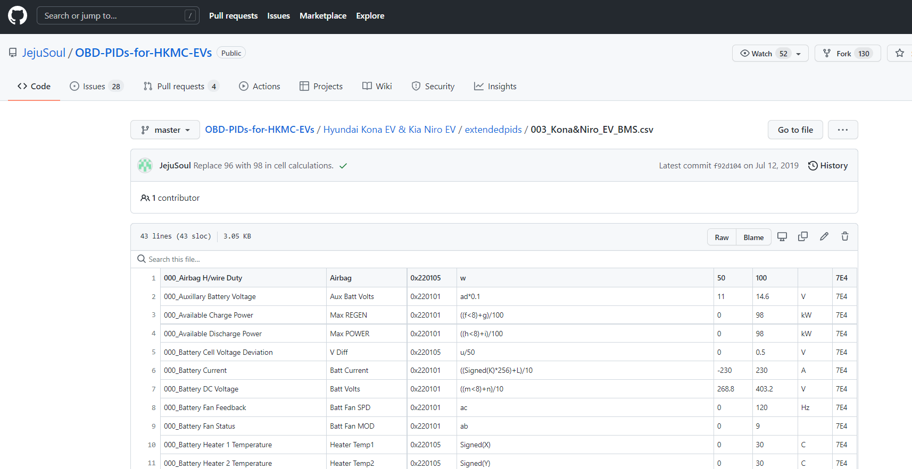

*Many online github repos exist with reverse engineered decoding rules for e.g. electric vehicles via UDS - see our [DBC intro](https://www.csselectronics.com/pages/can-dbc-file-database-intro#public-dbc-files) for an overview*

​      

So how do we use this knowledge to decode the signal? 

First, we need to **reassemble the segmented CAN frames**. The result of this is shown in the previous communication example. 

Via reassembly, we get a "CAN frame" with ID 0x7EC and a payload  exceeding 8 bytes. The payload in this case contains the SID in the 1st  byte and DID in the 2nd and 3rd bytes. 

You could process the reassembled CAN frame manually in e.g. Excel. However, we generally recommend to use [CAN databases (DBC files)](https://www.csselectronics.com/pages/can-dbc-file-database-intro) to store decoding rules.

In this particular case, you can treat the reassembled CAN frame as a case of **extended multiplexing**. We provide an [example UDS DBC file](https://github.com/CSS-Electronics/api-examples/blob/master/examples/data-processing/dbc_files/tp_uds.dbc) for the Hyundai Kona incl. State of Charge and temperature signals, which can be useful as inspiration.

Our [CAN bus Python API](https://www.csselectronics.com/pages/python-can-bus-api) enables reassembly & DBC decoding of multi-frame UDS responses - see our [API examples](https://github.com/CSS-Electronics/api-examples/tree/master/examples/data-processing) repository for more details incl. the Hyundai Kona sample data. 

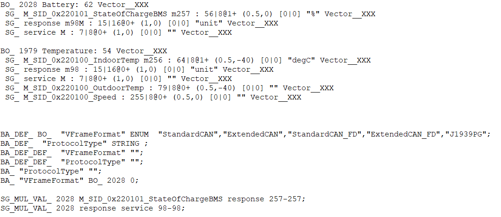

*The above shows an extract of a 'UDS  DBC file' using extended multiplexing to filter responses based on the  response SID and DID.* 

## Example 3: Record the Vehicle Identification Number (VIN)

The **Vehicle Identification Number** (aka VIN, chassis  number, frame number) is a unique identifier code used for road  vehicles. The number has been standardized and legally required since  the 1980s - for details see the [VIN page on Wikipedia](https://en.wikipedia.org/wiki/Vehicle_identification_number). 

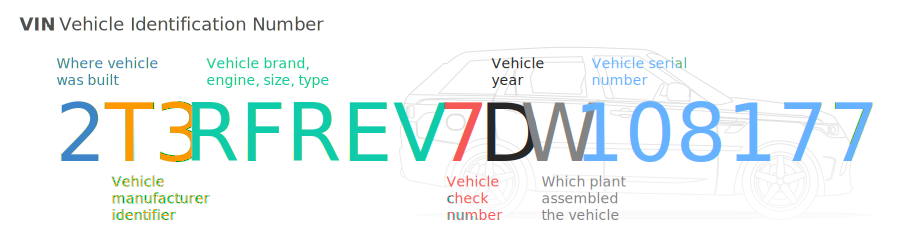

A VIN consists of 17 ASCII characters and can be extracted  on-request from a vehicle. This is useful in e.g. data logging or  telematics use cases where a unique identifier is required for  association with e.g. CAN bus log files.

CAN data bytes can be converted from HEX to ASCII via tables, online [HEX to ASCII converters](https://www.rapidtables.com/convert/number/hex-to-ascii.html), [Python packages](https://www.kite.com/python/answers/how-to-convert-a-string-from-hex-to-ascii-in-python) etc. 

For example, the byte 0x47 corresponds to the letter "G". 

Since a VIN is 17 bytes (17 ASCII characters) long, it does not  fit into a single CAN frame, but has to be extracted via a multi frame  diagnostic request/response as in Example 2. Further, the VIN is  extracted differently depending on the protocol used.

Below we provide three examples on how to record the VIN.

​    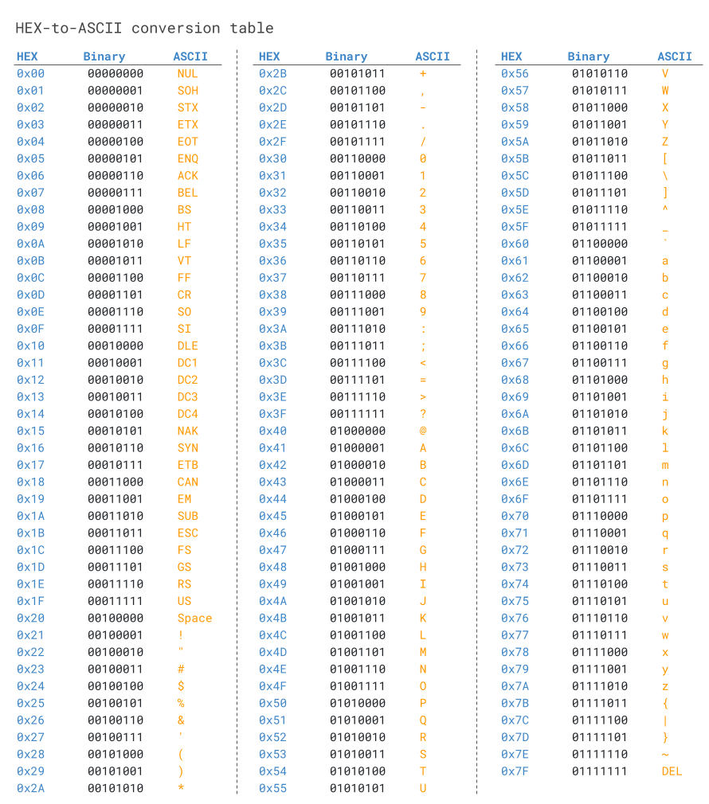  

### 3.1: How to record the VIN via OBD2 (SAE J1979) 

To extract the Vehicle Identification Number from e.g. a passenger  car using OBD2 requests, you use Service 0x09 and the PID 0x02:

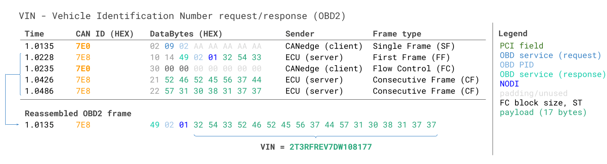

**Commnication flow details**

The logic of the frame structure is identical to Example 2, with the  tester tool sending a Single Frame request with the PCI field (0x02),  request service identifier (0x09) and data identifier (0x02). 

The vehicle responds with a First Frame containing the PCI, length  (0x014 = 20 bytes), response SID (0x49, i.e. 0x09 + 0x40) and data  identifier (0x02). Following the data identifier is the byte 0x01 which  is the Number Of Data Items (NODI), in this case 1 (see SAE J1979 or ISO 15031-5 for details). 

The remaining 17 bytes equal the VIN and can be translated from HEX to ASC via the methods previously discussed. 

### 3.2: How to record the VIN via UDS (ISO 14229-2) 

To read the Vehicle Identification Number via UDS, you can use the UDS SID 0x22 and the DID 0xF190:

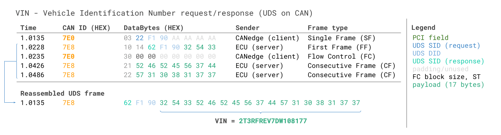

**Commnication flow details**

As evident, the request/response communication flow looks similar to the OBD2 case above. The main changes relate to the use of the UDS service  0x22 instead of the OBD2 service 0x09 - and the use of the 2-byte UDS  DID 0xF190 instead of the 1 byte OBD2 PID 0x02. Further, the UDS  response frame does not include the Number of Data Items (NODI) field  after the DID, in contrast to what we saw in    the OBD2 case. 

### 3.3: How to record the VIN via WWH-OBD (ISO 21745-3) 

If you need to request the Vehicle Identification Number from an EU  truck after 2014, you can use the WWH-OBD protocol. The structure is  identical to the UDS example, except that WWH-OBD specifies the use of  the DID 0xF802 for the VIN. 

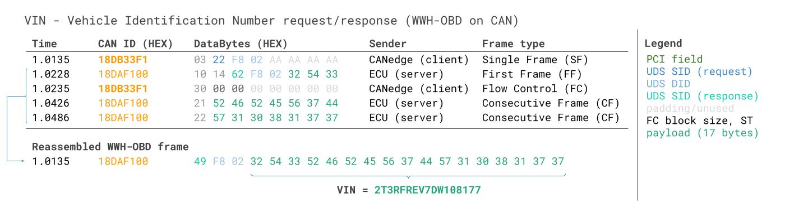

## UDS data logging - applications 

In this section, we outline example use cases for recording UDS data. 

### UDS telematics for prototype electric vehicles 

As an OEM, you may need to get data on various sensor parameters  from prototype EVs while they are operating in the field. Here, the  CANedge2 can be deployed to request data on e.g. state of charge, state  of health, temperatures and more by transmitting UDS request frames and  flow control frames periodically. The data can e.g. be combined with  GNSS/IMU data from a CANmod.gps and sent via a      3G/4G access point to your own cloud server for analysis via  Vector tools, Python or MATLAB. 

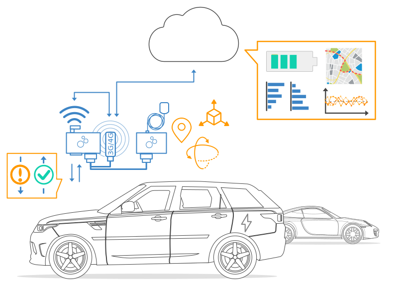

### Training a predictive maintenance model

If you're looking to implement predictive maintenance across  fleets of heavy duty vehicles, the first step is typically to "train  your model". This requires large amounts of training data to be  collected, including both sensor data (speed, RPM, throttle position,  tire pressures etc) and "classification results" (fault / no fault). One way to obtain the latter is by periodically requesting      diagnostic trouble codes from the vehicle, providing you with log  files that combine both types of data over time. You can use the  CANedge1 to collect this data offline onto SD cards, or the CANedge2 to  automatically offload the data - e.g. when the vehicles return to  stationary WiFi routers in garages. 

​    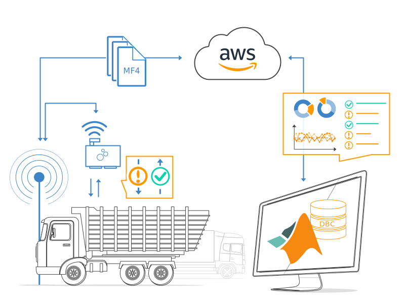  