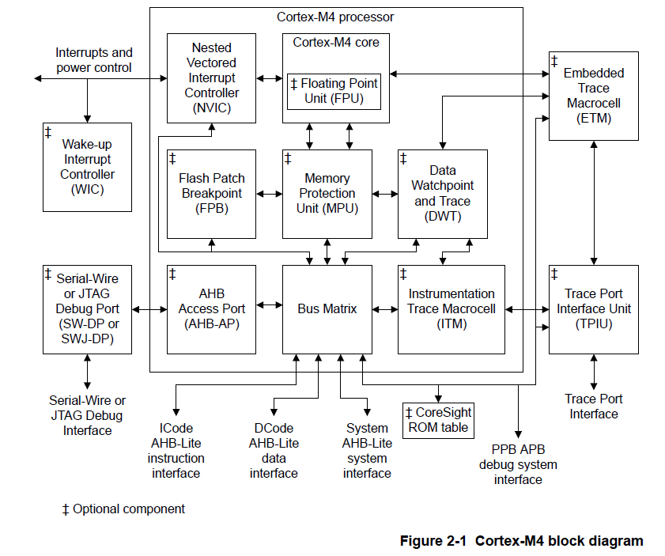

# Cortex-M4

### ARM instruments

http://www.ee.ic.ac.uk/pcheung/teaching/ee2_computing/

http://www.ee.ic.ac.uk/pcheung/teaching/ee2_computing/Lecture_7.pdf
https://www.csie.ntu.edu.tw/~cyy/courses/assembly/10fall/lectures/handouts/lec09_ARMisa_4up.pdf

### Function Description



### Programmers Model

#### Modes of operation and execution

The Cortex-M4 processor supports **Thread** and **Handler** operating modes, and may be run in **Thumb** or **Debug** operating states. In addition, the processor can limit or exclude access to some resources by executing code in **privileged** or **unprivileged** mode.

* Operating modes

  <u>**Thread mode**</u> is the normal mode that programs run in. Thread mode can be privileged or        unprivileged software execution. **<u>Handler mode</u>** is the mode that exceptions are handled in. It  is always privileged software execution.

  The conditions which cause the processor to enter Thread or Handler mode are as follows:

  * The processor enters **Thread mode** on Reset, or as a result of an exception return. Privileged and Unprivileged code can run in Thread mode.
  * The processor enters **Handler mode** as  a result of an exception. All code is privileged in Handler mode.

* Operating states

  The processor can operate in thumb or debug state:

  *  **Thumb state**. This is normal execution running 16-bit and 32-bit halfword aligned Thumb instructions.
  *  **Debug State**. This is the state when the processor is in halting debug.

* Privileged access and user access

  Handler mode is always **privileged**. Thread mode can be **privileged** or **unprivileged**

#### Processor memory model

a bus matrix that arbitrates accesses to both the <u>external memory system</u> and to
the <u>internal System Control Space</u> (SCS) and <u>debug components</u>, supports <u>Armv7 unaligned accesses</u>, and performs all accesses as <u>single, unaligned accesses</u>.


##### Unaligned access that cross regions

The Cortex-M4 processor supports Armv7 unaligned accesses, and performs all accesses as single, unaligned accesses. They are converted into two or more aligned accesses by the **DCode** and **System** bus interfaces.

Unaligned support is only available for load/store singles (**LDR**, **LDRH**, **STR**, **STRH**). Load/store double already supports word aligned accesses, but does not permit other unaligned accesses, and generates a fault if this is attempted.

* Unaligned accesses that cross memory map boundaries are architecturally UNPREDICTABLE.
* Unaligned accesses that cross into the bit-band alias regions are also architecturally UNPREDICTABLE.
* Unaligned loads that match against a literal comparator in the **FPB** are not remapped. 

##### Write Buffer

To prevent bus wait cycles from stalling the processor during data stores, buffered stores to the **DCode** and **System** buses go through a one-entry write buffer. If the write buffer is full, subsequent accesses to the bus stall until the write buffer has drained.

The write buffer is only used if the **bus waits the data phase** of the buffered store, otherwise the transaction completes on the bus.

**DMB** and **DSB** instructions wait for the write buffer to drain before completing. If an <u>**interrupt**</u> comes in while DMB or DSB is waiting for the write buffer to drain, the processor returns to the instruction following the DMB or DSB after the interrupt  completes. *This is because interrupt processing acts as a memory barrier op*.

##### Exclusive monitor ?

##### Bit-Banding

It also enables individual bits to be toggled without performing a ***read-modify-write*** sequence of instructions

The processor memory map includes two bit-band regions. These occupy the <u>lowest 1MB</u> of the **SRAM** and **Peripheral** memory regions respectively. 

 ***1bit within Bit-Banding region map to SRAM/Peripheral memory region word access***,  the remap such as 

```c
0x2000_0000[0] -> 0x2200_0000 + (0<<2) -> 0x2200_0000
0x2000_0000[7] -> 0x2200_0000 + (7<<2) -> 0x2200_001c
0x200F_FFFF[7] -> 0x2200_0000 + (0xfffff<2) -> 0x223F_FFFC
```

Writing to a word in ***the alias region*** has the same effect as a read-modify-write operation on the targeted
bit in the bit-band region.

You can directly access the ***bit-band region*** with normal reads and writes to that region.

##### Process core register summary


**Handler mode** always uses SP_main, but you can configure **Thread mode** to use either SP_main or SP_process.

The ***LR*** receives the return address from PC when a Branch and Link (**BL**) or Branch and Link with Exchange (**BLX**) instruction is executed. The ***LR*** is also used for <u>exception return</u>.

##### Exceptions

 the processor implements both interrupt **late-arrival[^1] ?**  and interrupt **tail chaining [^2]** mechanisms

* The first instructions to be executed are fetched in parallel to the stack push.

> **20** cycles latency while **29** cycles latency when FPU context is actived and the lazy stacking is not enabled.

* the first instructions to be executed are fetched in parallel to the stack pop.

> **10** cycles latency while **27** cycles latency when FPU context is actived.

* the processor abandons any **divide** instruction to take any pending interrupt.
*  Load multiple (**LDM**) operations and store multiple (**STM**) operations are interruptible. 

### Memory Protection Unit ?

You can use the MPU to:

* enforce privilege rules
* Separate processes
* Enforce access rules

### NVIC

 The NVIC provides configurable interrupt handling abilities to the processor, <u>facilitates low- latency exception</u> and <u>interrupt handling</u>, and <u>controls power management</u>.

The NVIC supports up to 240 interrupts, each with up to 256 levels of priority that can be changed dynamically. The processor and NVIC can be put into a very low-power sleep mode, leaving the Wake Up Controller (WIC) to identify and prioritize interrupts. Also, the processor supports both **level** and **pulse** interrupts.

You can only fully access the NVIC from *privileged* mode, but you can cause interrupts to enter a pending state in *user mode* if you enable the *Configuration and Control Register*. Any other user mode access causes a bus fault.

#### Low power mode

**WIC**:  This enables the processor and NVIC to be put into a very low-power sleep mode leaving the WIC to identify and prioritize interrupts.

**WFI, WFE, SEV**

**SLEEPONEXIT**:  causes the processor core to enter sleep mode when it returns from an exception handler to Thread mode.

#### Level versus pulse interrupts

You must ensure that the pulse is sampled on the **<u>rising edge</u>** of the Cortex-M4 clock, **FCLK**, instead of being asynchronous.

For *level* interrupts, if the signal is not deasserted before the return from the interrupt routine, the interrupt again enters the pending state and re-activates.  This is particularly useful for FIFO and buffer-based devices.

If another *pulse* arrives while the interrupt is still pending, the interrupt remains pending and the ISR runs only once.

### FPU

The FPU fully supports single-precision add, subtract, multiply, divide, multiply and accumulate, and square root operations. It also provides conversions between fixed-point and floating-point data formats, and floating-point constant instructions.

### DEBUG

#### Reference

[Measuring code execution time on ARM Cortex-M MCUs](https://www.embeddedcomputing.com/technology/processing/measuring-code-execution-time-on-arm-cortex-m-mcus)

[Cycle Counting on ARM Cortex-M with DWT](https://mcuoneclipse.com/2017/01/30/cycle-counting-on-arm-cortex-m-with-dwt/)

[Step-through debugging with no debugger on Cortex-M](https://interrupt.memfault.com/blog/cortex-m-debug-monitor)

### Flash Patch and Breakpoint Unit (FPB) ?

[nrf52-flash-patch](https://github.com/NordicPlayground/nRF52-flash-patch)

### Data Watchpoint and Trace

A full DWT contains *four* comparators that you can configure as hardware watchpoint, an ETM trigger, a PC sampler event trigger, or a data address sampler event trigger.

The DWT, if present, contains counters for:

* Clock cycles (CYCCNT)
* Folded instructions
* *load Store Unit* (LSU) operations
* sleep cycles
* CPI, that is all instruction cycles except for the first cycle
* interrupt overhead

### Instrumentation Trace Macrocell Unit (ITM)

The ITM is a an optional application-driven trace source that supports *printf()* style debugging to trace operating system and application events, and generates diagnostic system information. The ITM generates trace information as packets from software traces, hardware traces, time stamping, and global system timestamping sources.

The ITM generates trace information as *packets*. There are four sources that can generate packets. The *four* sources in decreasing order of priority are:

* Software trace. Software can write directly to ITM stimulus registers to generate packets.
* Hardware trace. The DWT generates these packets, and the ITM outputs them.
* Time stamping. Timestamps are generated relative to packets. The ITM contains a *21-bit* counter to generate the timestamp. The Cortex-M4 clock or the bitclock rate of the *Serial Wire Viewer (SWV)* output clocks the counter.
* Global system timestamping. Timestamps can optionally be generated using a system-wide *48-bit* count value. The same count value can be used to insert timestamps in the ETM trace stream, permitting coarse-grain correlation.

###  Trace Port Interface Unit(TPIU)

The Cortex-M4 TPIU is an optional component that acts as a **bridge** between the on-chip trace data from the *Embedded Trace Macrocell* (ETM) and the *Instrumentation Trace Macrocell* (ITM), with separate IDs, to a data stream. The TPIU encapsulates IDs where required, and the data stream is then captured by a *Trace Port Analyzer* (TPA).


**TPIU formatter**

The TPIU formatter inserts source ID signals into the data packet stream so that trace data can be reassociated with its trace source.

You must enable synchronization packets in the DWT to provide synchronization for the formatter.

When the formatter is enabled, half-sync packets can be inserted if there is no data to output after a frame has been started. Synchronization, caused by the distributed synchronization from the DWT, ensures that any partial frame is completed, and at least one full synchronization packet is generated.

**Serial Wire Output format**

The TPIU can output trace data in **TPIU_DEVID** or **TPIU_SPPR** Serial Wire Output formats and can be configured to bypass the formatter for trace output if either SWO format is selected.


### ARM Streamline

#### Bare-metal application profiling

Streamline can profile bare-metal software running on Arm processors, emitting data over a CoreSight *ITM*, *ETM*, or *STM* data channel. It can also profile data captured to an on-device
<u>memory buffer</u>. Support is included for *PC sampling*, *performance counter sampling*, and *application-generated annotations*.

The target *agent* for bare-metal profiling is provided as a small source library that is integrated directly into the bare-metal application that is being profiled. This library - called ***Barman*** - is auto-generated based on the data channel configuration that is required. It provides optional hooks that allow for lightweight RTOS integration, such as annotation of thread or task context switches. This integration can supplement the basic performance information in the data visualizations.

#### Standards compliance

* Hardware

Streamline supports all Arm®v7-A and Armv8-A cores, and is tested on Arm® Cortex®-A cores. Arm Cortex-R and Arm Cortex-M cores are also supported for bare-metal profiling.

Streamline supports Mali™ GPUs implementing the Midgard (excluding Mali-T600 series), Bifrost, and Valhall architectures.

* ELF

Executable and Linking Format. Streamline can read executable images in ELF format.

* DWARF

Debugging With Attributed Record Formats. Streamline can read debug information from ELF images in the DWARF 2, DWARF 3, and DWARF 4 formats.

* CFI

Call Frame Information directives allow you to add stack unwinding information to support exception handling.


[^1]: A late-arriving interrupt is an interrupt which is recognized after the processor has started its exception entry procedure.    If the late-arriving interrupt has higher pre-empting priority than the  exception which the processor has already started to handle, then the  existing stack push will continue but the vector fetch will be  re-started using the vector for the late-arriving interrupt. This  guarantees that the interrupt with the highest pre-empting priority will be serviced first, but in some circumstances this results in some  wasted cycles from the original vector fetch which was abandoned.     If the late-arriving interrupt has only equal priority to (or lower  priority than) the exception which the processor has already started to  handle, then the late-arriving interrupt will remain pending until after the exception handler for teh current exception has run. This is  because the late-arriving behaviour is classed as a pre-empting  behaviour, and is therefore dependent only upon the pre-empting priority levels of the interrupts and exceptions.     Because the stack push  has already been initiated, the interrupt latency (meaning the number of cycles between the arrival of the interrupt request and execution of  the first instruction of its handler) might be less than the standard  interrupt latency for the particular processor and system. Some (but not all) Cortex-M processors provide an implementation-time option for the  chip designer to specify a minimum value for the interrupt latency,  reducing or removing the uncertainty in interrupt latency by adding  stall cycles in such cases. Documentation of the specific chip should  provide details of this setting, if applicable.
[^2]: Tail-chaining is back-to-back processing of exceptions without the  overhead of state saving and restoration between interrupts. The  processor skips the pop of eight registers and push of eight registers  when exiting one ISR and entering another because this has no effect on  the stack contents.The processor tail-chains if a pending interrupt has higher priority than all stacked exceptions.

