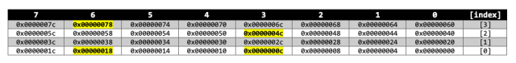

# Introduction to the ARM® Cortex®-M7 Cache – Part 1 Cache Basics


For many years, the majority of smaller microprocessor-based systems  have typically not used caches. With the launch of the ARMv7  architectures, caches were supported in the ARMv7-A family (e.g.  Cortex-A8, etc.) but not supported in the core design of the ARMv7-M  micro-controllers such as the Cortex-M3 and Cortex-M4. However, when the [Cortex-M7](https://www.arm.com/products/silicon-ip-cpu/cortex-m/cortex-m7) was announced, it broke that mould by offering cache support for the smaller embedded micro-controller.

This series is broken down in three parts:

1. Basic principles of cache
2. Cache replacement policies
3. Optimising software to use cache

## Why introduce caches into the architecture?

The purpose of a cache is to increase the average speed of memory  access. The most immediate and obvious benefit is one of improved  application performance, which in turn can lead to an enhanced power  model. Caches have been used for many years (dating back as far as the  1960s) in high-end processor-based systems.

The driver behind the development and use of a cache is based on **The Locality Principle**.

Caches operate on two principles of locality:

- Spatial locality
  - Access to one memory location is likely to be followed by accesses to adjacent locations.
- Temporal locality
  - Access to an area of memory is likely to be repeated within a short period.

Also of note is *Sequentiality* – Given that a reference has  been made to a particular location s it is likely that within the next  several references, a reference to the location of s + 1 will be made. *Sequentiality* is a restricted type of spatial locality and can be regarded as a subset of it.

In high-end modern systems, there can be many forms of cache,  including network and disk caches, but here we will focus on main memory caches. In addition, main memory caches can also be hierarchical, i.e.  there are multiple caches between the processor and main memory, often  referred too as L1, L2, L3, etc., with L1 being nearest to the processor core.

## The Cache

The simplest way to think of a cache is as a small, high-speed buffer placed between the central processor unit (CPU) and main memory that  stores blocks of recently referred to main memory.

[](https://i0.wp.com/feabhasblog.wpengine.com/wp-content/uploads/2020/10/fig1.png?ssl=1)

Once we’re using a cache, each memory read will result in one of two outcomes:

- A cache hit – the memory for the address is already in cache.
- A cache miss – the memory access was not in cache, and therefore we have to go out to main memory to access it.

The core processor architecture will  typically drive the supported cache implementation. In its simplest  form, there are two main architectures, that of [Harvard](https://en.wikipedia.org/wiki/Harvard_architecture) and [von Neumann](https://en.wikipedia.org/wiki/Von_Neumann_architecture). A von Neumann architecture has only one bus which is used for both data transfers and instruction fetches, and therefore different fetches must be interlaced as they cannot be performed at the same time. A Harvard  architecture has separate instruction and data bus-es, allowing  transfers to be performed simultaneously on both bus-es.

Von Neumann architectures usually have a single unified cache, which  stores both instructions and data. As Harvard architectures have  separate instruction and data busses, then it logically follows that  these typically have individual instruction and data caches.

[](https://i0.wp.com/feabhasblog.wpengine.com/wp-content/uploads/2020/10/fig2.png?ssl=1)

The Cortex-M7 is a variant of the Harvard Architecture, referred to as [**Modified Harvard**](https://en.wikipedia.org/wiki/Modified_Harvard_architecture). Like Harvard, it provides separate instruction and data bus-es, but  these buses access a unified memory space; allowing the contents of the  instruction memory to be accessed as if it were data space. This means  that modified Harvard can support both Unified and Harvard (separate)  caches.

Also of note is that the ARMv7-M family of cores are all based on a  load/store architecture. Significantly, this means that the only data  memory access allowed is through load and store operations (LDR/STR) and that all algorithmic data operations are performed using the  general-purpose registers (r0-r12).

## Cortex-M4 / Cortex-M7 Memory System

Unlike the other ARM families, the ARMv7-M architecture pre-divides  the memory map into 8 x 512MB sections, which are then assigned to code, RAM, Peripheral and System space.

[](https://i0.wp.com/feabhasblog.wpengine.com/wp-content/uploads/2020/10/fig3.png?ssl=1)

The Cortex-M4 and Cortex-M7 share the same system memory map but have quite differing memory systems. On a Cortex-M4 you would expect to see  on-chip Flash residing at address `0x00000000` and on-chip [SRAM](https://en.wikipedia.org/wiki/Static_random-access_memory) at address `0x20000000`. However, with the Cortex-M7 there are two differences in both the instruction and data address region.

First off, as expected we now have local (L1) instruction (I-Cache)  and data (D-Cache) caches. The Cortex-M7 memory system also includes  support for the connection of local [**Tightly Coupled Memory**](https://developer.arm.com/documentation/dui0203/j/developing-for-arm-processors/about-the-arm-architectures/tightly-coupled-memory) (TCM) for both instruction and data, called ITCM and DTCM respectively. We will return to the TCMs later in the series.

## Cache Basics

As stated already, our cache is a local, high-speed buffer between main memory and our central processing unit. In the [ARM Thumb-2 ISA](https://developer.arm.com/architectures/instruction-sets/base-isas/t32) (Instruction Set Architecture), load and store operations can transfer  bytes, half-words (2 bytes), or words (4 bytes) to and from memory. But  because of spatial locality, rather than just buffering a single read to a location, the cache controller will pull in a number of words  surrounding the currently accessed memory. The number of words in a  single transfer from main memory to the cache is called the cache line  length and the process of reading into the cache – is called a line  fill. The line length varies by design, but on the Cortex-M7 is fixed at 8 words (32 bytes).

For memory access reasons, each cache line is now bounded by a 32-byte boundary address. So a memory read from address `0x0000000c` is in the same cache line as address `0x00000018`.

[](https://i0.wp.com/feabhasblog.wpengine.com/wp-content/uploads/2020/10/fig4.png?ssl=1)

This means, that for an 8-word cache line if we mask off the bottom  five bits then all addresses in the same cache line will evaluate to the same result. If we now right-shift this result by five bits we get a  unique index for each address (e.g. `((address & ~0x1f)>>5)` ).

Of the remaining bottom five bits, bits 4-2 index into the word  within the cache line, and bits 1-0 give us a byte within the word (when byte and half-word access is required).

[](https://i0.wp.com/feabhasblog.wpengine.com/wp-content/uploads/2020/10/fig5.png?ssl=1)

Therefore, a read from `0x0000004c` is the same word offset as `0x0000000c` but would reside in a different cache line index, as would `0x00000078` and `0x00000018`.

[](https://i0.wp.com/feabhasblog.wpengine.com/wp-content/uploads/2020/10/fig6.png?ssl=1)

Of course, this model would only work if our cache size was the same  size as the Flash/SRAM, which sort of defeats the object (and wouldn’t  be cost-efficient). Therefore, the cache size will be significantly  smaller than the available Flash/SRAM; so we now need to modify our  index model.

The cache on a Cortex-M7 is optional, but assuming it is supported,  cache sizes can be either 4KB, 8KB, 16KB, 32KB or 64KB. Note that the  instruction and data caches may be of different sizes.

Assuming we have the smallest available cache size (4KB) then we can  calculate the number of independent cache lines. With an 8-word cache  line, this leaves us with a set of 128 unique cache lines, thus giving  us seven bits for the index [0-127].

[](https://i0.wp.com/feabhasblog.wpengine.com/wp-content/uploads/2020/10/fig7.png?ssl=1)

To calculate the index for an address, we simple mask bits 11-5 and right shift five places (`(address & 0xfe0)>>5`). However, this now means, that over a typical Flash address range,  multiple addresses will map onto the same index, for example:

```
(0x0000004c & 0xFe0) >> 5 = index 2, word 3
(0x0000204c & 0xFe0) >> 5 = index 2, word 3
```

So if we have read address `0x0000004c` then the cache controller will have filled cache line 2 with the bytes `0x00000040-0x0000005f`. As well as the memory values being stored, the cache controller stores an **address tag** along with the line. The tag is the remaining part of the address (i.e. `(address & ~0xfe0) >> 12`).

[](https://i0.wp.com/feabhasblog.wpengine.com/wp-content/uploads/2020/10/fig8.png?ssl=1)

So for our two address, we now get:

```
 0x0000004c : index 2, word 3, tag 0 
 0x0000204c : index 2, word 3, tag 2
```

If we subsequently read from the different address `0x0000204c`, this would match the same cache index. But the cache controller also  compares the cache lines address tag with that of the actual address  tag, which of course does not match, thus ensuring the cache controller  does not return the memory from the cache to the processor. When tags do not match, this is known as a **cache miss** and in this case, we require a plan of action – also known as a **policy**.