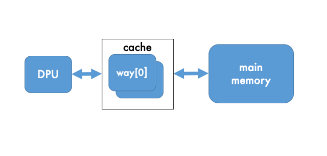
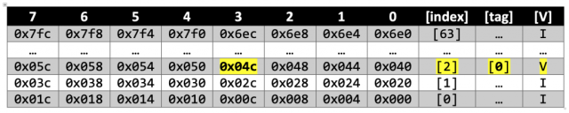
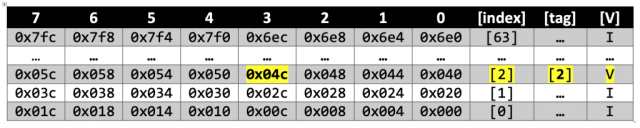
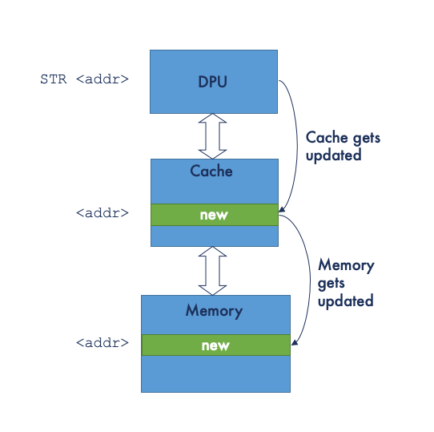
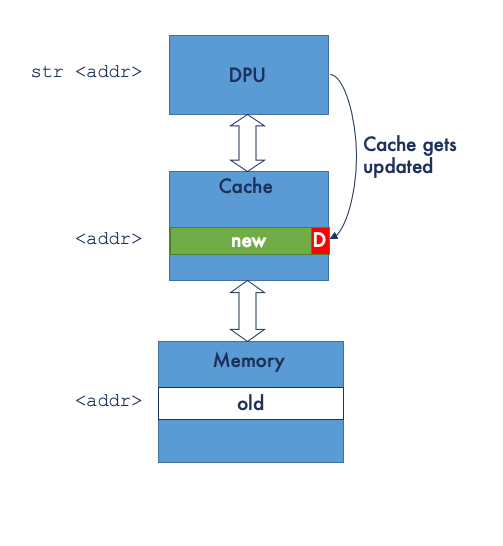

# Introduction to the ARM® Cortex®-M7 Cache – Part 2 Cache Replacement Policy


## Instruction Cache Replacement Policy

Starting with the simpler instruction cache case; when we encounter a cache miss the normal policy is to evict the current cache line and  replace it with the new cache line. This is known as a read-allocate  policy and is the default on all instruction caches.

## Cold start (first read)

It should also be noted that on system power-up the initial state of  the cache is unknown. On the ARMv7-M all caches are disabled at reset.  Before the cache is accessed, it needs invalidating. As well as each  line having a tag associated with it, each line also has a valid flag  (V-bit) which indicates whether the current cache line has been  populated from main memory or not.

The cache must be invalidated before being enabled. The method for  this is implementation-defined. In some cases, invalidation is performed by hardware, whereas in other cases it is a requirement of the boot  code. CMSIS- has added a specific instruction cache API to support these operations for the Cortex-M7:

```
void SCB_InvalidateICache(void);
void SCB_EnableICache(void);    
void SCB_DisableICache(void);
```

## Direct Mapped Cache

So far, we have assumed that the whole of the cache is mapped as one contiguous area, we call this a **Direct Mapped** cache. A lot of work in trying to improve cache performance has been  done over the years and the key metric has been found to be that of **cache hit/miss rate**, i.e. what is our ratio of reads that result is a cache fetch against  those requiring a main memory fetch and cache line eviction.

Studies have shown that the *Direct Mapped Cache* may not always achieve the best cache hit ratios. Take, for example, the following code:

```
// file1.c
int filter_algo(int p)
{
   ...
   return result;
}

// file2.c
void apply_filter(int* p, int N)
{
   ...
   for(int i = 0; i < N, ++i) {
     x[N] = filter_algo(*(p+i)) + k[N];
     ...
   }
   ...
}
```

If, unluckily, apply_filter was in the address range of `0x00004000` and `filter_algo` was around `0x00005000` then each time `apply_filter` called on `filter_algo`, this would result in an eviction of the `apply_filter` code and the filling of the `filter_algo` instructions. But upon return, we would have to evict `filter_algo code` and refill with `apply_filter` instructions. As the algorithm executed it would cause **cache thrashing**.

## Set-associative cache

Due to the principles of locality, research suggested that rather  than a single direct-mapped cache, a better approach is to split the  cache into an array of buffers, where two addresses with the same line  index can reside in different array indices.

[](https://i0.wp.com/feabhasblog.wpengine.com/wp-content/uploads/2020/10/Slide4-1.png?ssl=1)In cache terminology, each array index is known as a **way**, so we talk about **N-Way** caches. The number of ways can vary, typically ranging from 2 to 8. For the Cortex-M7 the instruction cache is a 2-way system. When we access  an address, we now have ‘N’ possible lines to make a tag match against.  The number of valid lines involved in the tag comparison is called the **set**.

Assuming our cache size stays the same, e.g. at 4KB, this means there are now 64-lines per way, on a 2-way instruction cache. To calculate  the index for an address, we now mask bits 10-5 and right shift five  places ((address & 0x7e0)>>5).

So returning to our previous example of reads from address `0x0000004c` followed by `0x0000204c`, The cache line for **way[0]/index[2]** after a read from `0x0000004c` would appear thus:

[](https://i0.wp.com/feabhasblog.wpengine.com/wp-content/uploads/2020/10/Screenshot-2020-10-16-at-10.03.02.png?ssl=1)

The cache line for **way[1]/index[2]** after a read from `0x0000204c` would appear thus:

[](https://i0.wp.com/feabhasblog.wpengine.com/wp-content/uploads/2020/10/Screenshot-2020-10-16-at-10.03.12.png?ssl=1)

As we’ve halved our number of cache lines, we appear to have twice as many possibilities of address clashes; but research has shown, due to  localization of access, an N-way cache will typically outperform a  direct cache.

## Set-associative replacement policy

Given the cache as shown above, if we now read address `0x0000284c`, using (`address & 0x7e0)>>5`) leads to an index of 2 as well. As both cache lines are valid, we now  need to choose between the ways to work out which line in which way to  evict.

There has been extensive research into different eviction algorithms, which has evolved into three primary strategies:

- Pseudo-random
- Round-robin / FIFO
- Least Recently Used (LRU)

The Cortex-M7 uses the **pseudo-random** algorithm. It has been said that using a pseudo-random rather than a fully random approach can help with debugging.

```
There is a further variant of cache architecture called fully-associative which
 will not be discussed here
```

## Data Cache

So far we have kept addressing relatively simple as we have focused  on read-only main memory access. Program data, of course, resides in  SRAM as we need to modify values during program execution. This,  naturally, has a knock-on effect to cache, adding a further level of  complexity, as we shall see.

Note, however, that because of the [Procedure Call Standard for the ARM® Architecture](https://developer.arm.com/documentation/ihi0042/j/?lang=en) (AAPCS) most function parameters and local variables typically reside  in the general-purpose registers (r0-r12), rather than in main memory.  Caching will, naturally, only apply to program data residing in main  memory. This will encompass any file scoped data objects (external and  internal) and dynamically allocated objects (i.e. heap and stack).

## Cortex-M7 D-Cache

The Cortex-M7 data cache is a **4-way set-associate cache**. As with the I-Cache, the D-Cache is also optional, but assuming it is  supported, cache sizes can be, again, either 4KB, 8KB, 16KB, 32KB or  64KB. As mentioned, the I-Cache and D-Cache do not need to be of the  same size.

Given a 4KB D-Cache, each way now maps onto a 1KB address range (32-lines of 8-words).

## D-Cache Replacement Policy

One major benefit of the Cortex-M family is that they share many  common architectural features. Significantly, all Cortex-M processors  have a built-in timer called `SysTick`. Typically, `SysTick` is used as the main system timer, simply incrementing a *tick* value on each interrupt.

The code would look something along these lines:

```
extern volatile uint32_t os_time;

void SysTick_Handler(void)          // SysTick interrupt Handler.
{       
  ++os_time;               
} 
```

As previously mentioned, ARM is a load/store architecture, thus the increment of os_time involves:

- reading the current os_time value from main memory into a register
- incrementing that value
- storing the register contents back in main memory

In assembler, it would look similar to the following (assuming r2 holds the address of os_time):

```
    ldr     r3, [r2, #0]
    adds    r3, #1
    str     r3, [r2, #0]
```

If we assume a cold start (i.e. the value is not already in the cache), then, as with the I-Cache, assuming we have enabled a **read-allocate** policy then we require a **linefill**. In a long-running system this linefill will likely also involve an eviction of the existing cache line.

An important aspect of a **read-allocate linefill** is that the memory is fetched into a **linefill buffer** before being written to the cache. The linefill buffers (there are two  of them) always fetch the requested data first, return it immediately to the processor, and then fetches the rest of the cache line. This  enables the data to be read without waiting for the linefill to complete and is known as **critical word first** and **non-blocking** behaviour.

Once loaded into a general-purpose register, the value can be  incremented. The next instruction to be executed stores the new value  back to main memory. Where the I-Cache and D-Cache behaviours differ, of course, is what happens when we want to write back a modified register  value that has been cached.

## Write-Back / Write-Through

When storing an updated value that resides in the cache, there are two policies:

- Write-Through (WT)
- Write-Back (WB)

With a **write-through** policy, when the store  instruction is executed, the new value in the register is written back  to the cache and then to main memory.

[](https://i0.wp.com/feabhasblog.wpengine.com/wp-content/uploads/2020/10/Slide10-1.png?ssl=1)

With a **write-back** policy (sometimes called **copy-back**), the value in the register is only written back to the cache and not to  main memory. We now have a situation where the value in main memory  doesn’t reflect the program state. In normal program execution, this is  not an issue, as any subsequent reads will result in a cache hit, giving us optimal performance.

But it does become important for two reasons. Firstly, we now need a  mechanism to handle the case where a cache line is being evicted, but  contains memory that isn’t coherent with the main memory and, secondly,  we need to handle the case where we have more than one bus master that  can access main memory (e.g. [DMA](https://en.wikipedia.org/wiki/Direct_memory_access)).

To handle cache line eviction, another flag (in addition to the V-flag) is associated with the cache line; call the **Dirty** flag (D-flag). When a value is written back to the cache from a  register, the dirty flag is set to indicate that the data in the cache  line is no longer coherent with main memory. When a dirty cache line is  evicted, the data is passed to a **write buffer** to be written to the external memory.

[](https://i0.wp.com/feabhasblog.wpengine.com/wp-content/uploads/2020/10/Slide9-1.png?ssl=1)

Choosing WB vs. WT is a system decision. Unsurprisingly, the WB  policy has better performance than WT, but WT eliminates any potential  issues with coherency; which may be a factor in higher integrity  applications.

- Write-Through
  - Advantages:
    - read miss never results in writes to main memory (no line is ever dirty)
    - main memory always has the most current copy of the data (coherent)
  - Disadvantages:
    - write is slower
    - every write needs main memory access thus using more memory bandwidth
- Write-Back
  - Advantages:
    - writes occur at the speed of the cache memory
    - multiple writes within a cache line require only one write to main  memory (when evicted) and as a result, uses less memory bandwidth
  - Disadvantages:
    - main memory is not always consistent with the cache
    - reads that result in eviction may cause writes of dirty lines to the main memory

We shall address the second case, memory consistency with multiple bus masters, later.

## Write-Allocate (WA)

There is one further case to consider:

```
dst = src;
```

where the memory for the stored value `dst` is currently not in cache. We have two choices:

- write the value back to main memory, bypassing the cache
- store the written value in cache.

It should be noted that the memory system also includes a **store buffer**. This holds data before it is written to the cache or passed to the bus interface ([AXIM](https://developer.arm.com/documentation/ddi0489/b/memory-system/axim-interface)) for writing to main memory. The store buffer has four entries and each entry can contain up to 64 bits of data.

Based on the principles of locality, it can be favourable to cache  the value, but this requires the cache line for the current main memory  to be linefill’ed before we can update the cache line. This policy is  referred to as **Write-Allocate** (WA).

For **Write-Allocate** stores that miss in the data  cache, a linefill is started using the linefill buffers. When the  linefill data is returned from the main memory system, the data in the  store buffer is merged into the linefill buffer and subsequently written into the cache.

It should be noted that when using a WT policy, typically we would also set it up as **no-write allocate**; since subsequent writes to that block will still have to go to memory.  Therefore, WA is usually only associated with a WB policy.

This, therefore, gives us three main cache policies:

- Write-Back, Read-Allocate, Write-Allocate. (WB-RA-WA)
- Write-Back, Read-Allocate only. (WB-RA)
- Write-Through, Read-Allocate only. (WT-RA)

## D-Cache Invalidation

As with the I-Cache, the D-Cache must also be invalidated at startup.

```
Note: a soft-reset may not need/want to invalidate the cache
```

Similar to the I-Cache, CMSIS supports the following API:

```
 void   SCB_EnableDCache (void);
 void   SCB_DisableDCache (void);
 void   SCB_InvalidateDCache (void);
```

However, the D-Cache can also be invalidated using an *address/size* combination

```
void SCB_InvalidateDCache_by_Addr(uint32_t *addr, int32_t dsize);
```

where `addr` is the address (aligned to a 32-byte boundary) and `dsize` is the size of the memory block (in the number of bytes).

## D-Cache Cleaning

Where the D-Cache also differs from the I-Cache is that assuming  we’re using a WB policy, then lines can be dirty. So as well as  invalidating the cache, we also may have a need to **clean the cache**. A cache clean operation ensures that all dirty lines are flushed out to the main memory, therefore making any changes visible to other memory  observers that need to access memory coherently.

The supported CMSIS functions are:

```
void    SCB_CleanDCache (void);
void    SCB_CleanDCache_by_Addr (uint32_t *addr, int32_t dsize);
```

In addition, CMSIS support both **Clean and Invalidate**:

```
void    SCB_CleanInvalidateDCache (void);
void    SCB_CleanInvalidateDCache_by_Addr (uint32_t *addr, int32_t dsize);
```

whereby a cache clean and invalidate operation behaves as the  execution of a clean operation followed immediately by an invalidate  operation.

## Cache Performance

Our key metrics for cache performance are:

- **hit/miss ratio**
- associated costs of a **miss penalty**
- **time for hit** (i.e. the N-way evaluation).

The costs of both the miss penalty and the time for a hit are pretty  much fixed. So, as a software application/firmware developer, the major  influence we can have on cache performance, and thus system performance, is improving the hit/miss *ratio*.