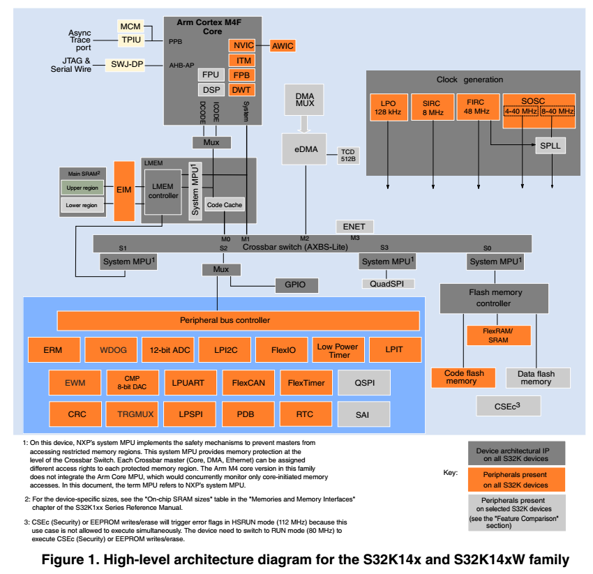

# S32K Study

## Reference

1. [hacking S32K1244](https://github.com/GreyZhang/g_s32k144)

## Key Features

* Operation Characteristics

  * HSRUN : -40 ~ 105
  * RUN : -40 ~ 150

* Arm Cortex-M4F/M0+  core, 32bit CPU

  * HSRUN : 122MHz with 1.25 Dhrystone MIPS per MHz
  * Integrated DSP
  * NVIC
  * Singe Precision FPU

* Clock interface

  * 4 ~ 40MHz fast external oscillator
  * ~ 50MHz DC external square input clock in external clock mode
  * 48MHz Fast Internal RC oscillator(FIRC)
  * 8MHz Slow internal RC oscillator(SIRC)
  * 128KHz Low power oscillator(LPO)
  * 112MHz (HSRUN) SPLL
  * TCLK: 20MHz
  * SWD_CLK: 25MHz
  * 32KHz RTC external clock (RTC_CLKIN)

* Power Management

  * PMC with multiple power mode: 
    * HSRUN (112MHz) : CSEc or EEPROM write/erase is invalid
    * RUN (80MHz)
    * STOP
    * VLPR
    * VLPS
  * Clock gating and low power operation supported on ***specific periphrals ?***

* Memory and Memory interfaces

  * 2MB flash with ECC
  * 64K FlexNVM for data flash with ECC and EEPROM emulation
  * 256KB SRAM with ECC
  * 4KB FlexRAM for use as SRAM and EEPROM emulation
  * 4KB ***Code ?***  cache(**ICACHE ?**)
  * QuadSPI with ***HyperBus ?***

* Mixed-signal analog

  * 2 x 12bit ADC with up to 32 channel anaog input per module
  * ***1 x CMP with internal 8-bit DAC ?***  

* ***Debug functionality ?***

  * SWJ-DP
  * DWT (debug watchpoint and Trace)
  * ITM (Instrumentation Trace Macrocell)
  * TPIU (Test Port Interface Unit)
  * FPB (Flash Patch and Breakpoint)

* HMI

  * 156 GPIO with interrupt 
  * NMI

* Communication interfaces

  * 3 x LPUART/ LIN + DMA + low power availablility
  * 3 x LPSPI  + DMA + low power availablility
  * 2 x LPI2C + DMA + low power availablility
  * 3 x FlexCAN
  * 1 x 10/100Mbps Ethernet with IEEE1588 support
  * 2 x SAI (synchronus Audio Interface)

* Safety and Security

  * CSEc (Cryptographic Services Engin) : a comprehensive set of cryptographic functions as described in the SHE (Secure Hardware Extension) Function Specification.
  * 128-bit UID
  * ECC on flash and SRAM
  * System MPU
  * CRC
  * Internal watchdog (WDOG)
  * External WatchDog monitor (EWM) module

* Timing and Control

  * 8  x 16bit FTM(***FlexTimer***), offering up to 64 standard channels(IC/OC/PWM)
  * 1 x 16 bit LPTMR with  flexible ***wake up control***
  * 2 x PDB (programmable delay Blocks) with flexible trigger system
  * 1 x 32 bit ***LPIT ?***(Low power interrupt timer) with 4 channels
  * 32-bit RTC
  * 16 channel DMA with up to 63 request sources using DMAMUX

* Package

  * 32-pin QFN

  * 48-pin QFN

  * 64-pin LQFP

  * 100-pin LQFG

  * 100-pin MAPBGA

  * 144-pin LQFP

  * 176-pin LQFP

    

## Block Diagram

## Feature Comparison

| Parameter                                | K142/4/6/8                       | K144W/142W             |
| ---------------------------------------- | -------------------------------- | ---------------------- |
| Core                                     | M4F                              | M4F                    |
| Frequency                                | 80MHz(RUNmode) or 112MHz (HSRUN) | 80MHz                  |
| FPU                                      | Y                                | Y                      |
| CSEc                                     | Y                                | Y                      |
| CRC                                      | 1x                               | 1x                     |
| ISO26262                                 | ASIL-B                           | ASIL-B                 |
| Peripheral Speed                         | 112MHz(HSRUN)                    | 80MH                   |
| Crossbar                                 | Y                                | Y                      |
| DMA                                      | Y                                | Y                      |
| EWM                                      | Y                                | Y                      |
| FIRC CMU                                 | **N**                            | **N**                  |
| MPU                                      | Y                                | Y                      |
| WatchDog                                 | 1x                               | Y                      |
| Low power mode                           | Y                                | Y                      |
| HSRUN mode                               | Y                                | **N**                  |
| Number of IO                             | 89/9/128/156                     | 43/58                  |
| Single Supply Voltage                    | 2.7 ~ 5.5V                       | 3.13～5.5V             |
| Flash                                    | 256K/512K/1M/2M                  | 512K/26K               |
| Temperature                              | -40~105/-40~125                  | -40~150                |
| ECC                                      | Y                                | Y                      |
| System memory(including FlexRAM and MTB) | 32K/64K/128K/256K                | 64K/32K                |
| FlexRAM                                  | 4K                               | 4K                     |
| Cache                                    | 4K                               | 4K                     |
| EEROM mulated by FlexRAM                 | 4KB(up to 64K D Flash)           | 4KB(up to 64K D Flash) |
| External memory interface                | **N**                            | **N**                  |
| LPIT                                     | 1x                               | 1x                     |
| FlexTimer(16bit) 8 channels              | 4x/4x/6x/8x                      | 4x(26)/4x(30)          |
| LPMR                                     | 1x                               | 1x                     |
| RTC                                      | 1x                               | 1x                     |
| PDB                                      | 1x                               | 2x                     |
| TRGMUX                                   | 1x(64)/1x(64)/1x(73)/1xx(81)     | 1x(59)                 |
| 12 SAR ADC (1M)                          | 2x(16)/2x(16)/2x(24)/2x(32)      | 14,9/16,13             |
| Comparator with8-bit DAC                 | 1x                               | 6/8                    |
| 10/100Mpbs Ethernet                      | **N/N/N/Y**                      | **N**                  |
| Serial Audio Interface(AC97/TDM/I2S)     | **N/N/N/2x**                     | **N**                  |
| LPUART                                   | 2x/2x/2x/3x                      | 2x/3x                  |
| LPSPI                                    | 2x/2x/2x/3x                      | 2x/3x                  |
| LPI2C                                    | 1x/1x/1x/2x                      | 1x                     |
| FlexCAN                                  | 2x/3x/3x/3x                      | 2x                     |
| FlexIO(8 pins as UART/SPI/I2S)           | 1x                               | 1x                     |
| Debug & trace                            | SWD,JTAG(ITM,SWV,SWO),,, **ETM** | SWD,JTAG(ITM,SWV,SWO)  |

​	
