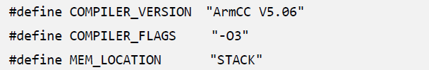

# 给你的MCU跑个分?CoreMark性能测试与移植

图1 CoreMark标志

CoreMark是处理器的性能基准测试，由嵌入式微处理器基准测试联盟（EEMBC）在2009年开发，为了取代过时的Dhrystone标准，ARM建议使用CoreMark而不是Dhrystone来进行基准测试。软件使用C语言编写，是一个免费使用，易于移植的基准测试程序。目前CoreMark已经成为测量与比较各类处理器性能的业界标准基准测试。CoreMark得分越高，意味着性能更高。

CoreMark的模拟工作负载主要包含几种常用的算法：

- 矩阵操作，模拟常用的运算；
- 链表操作，模拟指针的各种用法；
- 状态机操作，模拟程序分支运行操作；
- 循环冗余校验（CRC），嵌入式系统常见的功能。

**CoreMark与Dhrystone对比**

虽然Dhrystone的测试可以作为参考，但更容易受到其他因素的影响，CoreMark能接近实际地反应出工作能力。

**进入性能测试的世界**

图2 Cortex-M系列微控制器

我们在选择一款MCU时，一般会综合考虑各方面的指标，如功耗、外设丰富程度、计算性能等等。其中在我们谈论计算性能时，一般只是简单地对比一下内核主频，但这并不能直观对比出一款MCU的实际性能。相同主频的MCU，有可能性能差异要比你想象的大。而基准测试则可以很直观地对比出一款处理器的性能，不用在考虑性能时犹豫了，也可以让您发现您产品的瓶颈，优化产品的性能。在这里，我们将教您自己去移植CoreMark测试一款MCU的CoreMark性能。

**CoreMark移植到一款MCU上有几步**

- 获取CoreMark源码
- 实现平台打印输出函数
- 修改平台相关宏定义
- 实现计时相关函数
- 编译与运行CoreMark

我们将使用NXP的LPC54018平台作为我们的移植案例。测试的主角LPC54018为Cortex-M4内核，180MHz工作频率，软件平台为keil。评估板使用ZLG的EasyARM-LPC54018，板载SDRAM、SPI-Flash、以太网、USB等外设。

图3 ZLG的EasyARM-LPC54018评估板

**1、获取CoreMark源码**

CoreMark的源码可以在CoreMark的官网或者官方GitHub代码仓库获取。

CoreMark官网：https://www.eembc.org/coremark/

代码仓库：github.com/eembc/coremark

图4 EEMBC官网

源码主目录下需要添加到工程的文件：

除了以上的文件，barebones文件夹下为裸机移植需要的文件：

其中core_portme两个文件为移植必须修改的文件，ee_printf.c与cvt.c是为了在裸机平台实现printf打印输出。

**2、实现平台打印输出函数**

在CoreMark中，最终的结果需要使用printf格式化输出函数打印出来，如果你的MCU软件平台不能使printf函数，则需要ee_printf.c与cvt.c文件，其中只需要实现一个输出单个字符的函数。当然，如果你的平台提供有printf格式化输出函数，则可以将core_portme.h中的HAS_PRINTF宏修改为1，删除ee_printf.c与cvt.c文件即可。

LPC54018的库函数中已经实现了printf输出函数，所以我们就不需要ee_printf.c与cvt.c文件了，修改宏即可。

**3、修改平台相关宏定义**

CoreMark是支持跨平台的基准测试程序，从Windows、Linux到单片机，当然需要一些平台相关的基础定义，这里需要根据平台灵活配置。

在core_portme.h添加 #include "board.h"添加了对size_t等类型描述符的支持，"board.h"是NXP的SDK库函数中板级引用头文件，还包含了处理器相关的内容，比如后面会用到的SysTick定时器。

在core_portme.h文件中修改编译器版本、编译选项、储存位置的宏，这个仅作为输出结果，不影响实际测试性能。

core_portme.h中修改关于main函数的定义，针对裸机main函数无参数，修改宏：

此时在你原来的工程中已经有一个main函数了，将core_main.c中的main函数名改为core_main,添加到你自己的主函数main中调用。

**4、实现计时相关函数**

作为一个基准测试，当然需要知道自己执行了多少时间，我们需要实现CoreMark的定时相关接口，我们选择ARM平台通用的SysTick定时器来计时。这段代码需要修改SystemCoreClock为你自己平台的MCU主频即可，SystemCoreClock是NXP的SDK中提供的获取系统时钟频率的方法，不同平台会有不同。我们在这里实现的就是配置SysTick定时器以1000Hz的频率运行，也就是1ms产生一次中断，systick_count变量每1ms加1，以供后面获取时间的函数调用。

在core_port.c中portable_init函数中添加SysTick_Init()。portable_init的本意是去初始化与你平台相关的内容，我们在这里初始化SysTick定时器。删除这里“#error…”中的内容，这只是一个移植的提示。

补充barebones_clock()时间函数的内容，并删除这里“#error…”中的内容，这里只需要返回我们的全局计数值即可，例如：

定义CLOCKS_PER_SEC，CoreMark会使用这个参数将获取的计数值转化为秒数。定义为我们定时器的计数频率：

最后一步，添加迭代次数也就是算法运行次数的宏ITERATIONS，CoreMark会使用这个宏来执行计算次数，次数越多越准确，但同时需要的时间也更久。CoreMark如果执行10秒以下则认为结果无效，可以先设为1000，后面根据运行时间灵活调整，保证运行时间大于10秒即可。可以添加到Keil的C/C++选项卡的Define中或者在core_port.c中定义。

**5、编译与运行CoreMark**

为了测试数据的准确，将编译优化等级调整为-O3，对运行时间进行优化，配置为release版本。我们先使用在内部RAM中运行的方式先进行测试。编译，进入Debug，运行，等待少许时间。

运行后查看串口输出的结果，如果提示运行时间少于10秒则增大ITERATIONS的值，这次测试的LPC54018调整为5000后运行时间大于10秒，查看输出结果。

图5 测试输出结果

最后的结果就是“CoreMark 1.0 : 499.300979 / GCC4.2.1 Compatible Clang 9.0.0  -O3 / STACK”，其中“GCC4.2.1 Compatible Clang 9.0.0”是Keil的编译器的宏自动生成的结果，忽略即可。

499.300979就是我们测试得到的结果了，意思就是每秒运行了多少次CoreMark的基准测试程序。

图6 ARM官方数据</enter>

**不同储存介质运行速度的对比**

由于我们这次测试的LPC54018JET180没有片内Flash，我们选择三种储存介质来进行速度的对比，分别是片外SPI-Flash、片外SDRAM、片内SRAM。片外SPI-Flash的型号为IS25LP064，片外SDRAM为IS42S16160J。

图7 不同储存介质运行速度对比</enter>

注：本次测试具有局限性，结果仅供参考。实际使用中由于指令缓存等的存在，速度差异不会这么明显。

可以对比出，内部SRAM运行相较于其他运行方式对速度的提升很明显，但限于内部SRAM的大小，我们一般只能将部分对速度敏感的程序放在SRAM中运行，具体方法可以查看Keil分散加载文件的使用。

**编译器优化等级对比**

Keil的C/C++编译器的优化等级一般有四种-O0、-O1、-O2、-O3，其中-O0几乎不优化，-O3优化到最佳的性能，-O2为默认的优化等级，平衡性能和代码占用空间。我们测试几种优化等级对代码运行效率的影响。

图8 Keil的编译器优化对比</enter>

**结语**

了解了CoreMark基准测试的世界后，在纠结MCU的性能时，不如跑个分试试。CoreMark可以帮助我们了解自己产品的实际性能，找到系统的瓶颈，改善我们的产品。