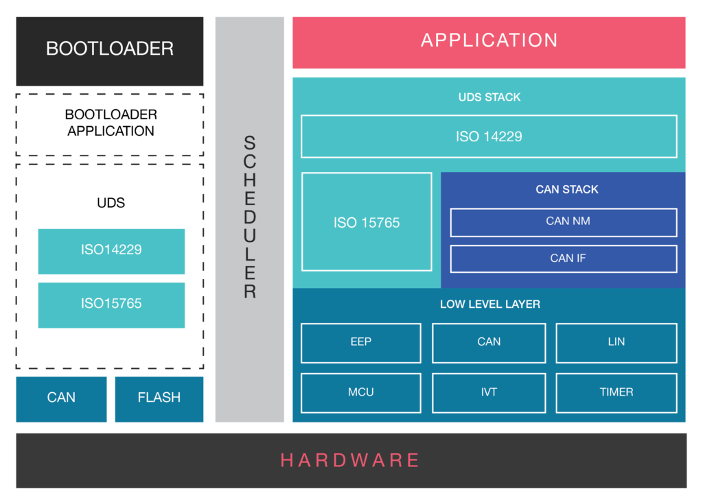

What is ISO 11898 based CAN Protocol and Why it is critical software solution for Vehicle Networking 
====================================================================================================

As an Automotive Software or Hardware Engineer, in this era of Cars with
Connectivity,
[Infotainment](https://www.embitel.com/product-engineering-2/automotive/infotainment),
Smart Features, you already have a first-hand experience of what drives
an automobile (beyond the engine and the four wheels).

As automotive enthusiasts and one of the stakeholders of this industry,
we all have interacted with the complex **network of [Electronic Control
Units](/product-engineering-2/automotive/control-units) (ECU)**, that
makes the modern-day vehicles, a powerhouse of smart features.

[Automotive
ECU](/blog/embedded-blog/automotive-control-units-development-innovations-mechanical-to-electronics)
is the component, designed by burning millions of lines of software
codes into a hardware platform, that supports features to make the
vehicle more fuel-efficient, smart, and functionally safe for the
drivers and passengers.

A gamut of such automotive control units, such as **ABS (Anti-braking
System),
[Telematics](https://www.embitel.com/product-engineering-2/automotive/telematics-platform),
Transmission Control, [Battery management
systems](https://www.embitel.com/iot-casestudies/industrial-iot-solution-for-ups-battery-monitoring-predictive-maintenance)**
and more, work in tandem to give end-users a great driving experience.

This communication is made possible by a robust in-vehicle networking.

Such coherent coordination between the various Automotive ECUs’ is made
possible by the software modules that ensure a seamless inter-ECU
communication.

And that brings us to the ISO 11898 based **CAN protocol** and
everything associated with it. Sit tight as we explore the **[CAN
protocol](/can-stack-software-solution-for-in-vehicle-network-communication)
and CAN Software** along with its layered technology architecture.

But first, let’s start with why a need was felt for an ECU communication
protocol.

Why Automotive Industry needs a CAN Software Stack?
---------------------------------------------------

The various control units in an automotive, are part of a closed loop
network, designed inside a car. In this system or network, it is
imperative for all the ECUs’ to communicate with each other and take
necessary actions.

For instance, a spark from the ignition system fires up the combustion
chamber. For optimum power and fuel-efficiency, the time at which the
ignition is initiated, by this closed loop system, is very critical.

To achieve this, the ignition system communicates with the engine
control unit with the help of in-vehicle networking. This is how exact
time of ignition initiation is calculated.

A more complex system that showcases the importance of communication
between the control units is Transmission Control Module, in automatic
cars.

The Transmission Control Unit changes the gear ratio with the changing
speed. To ensure smooth gear shifts, information from Engine Control
Unit and various other nodes are collected and processed.

While the need of communication is well established now. But to develop
a deeper perspective, let’s take a stroll down the lanes of the history.

In the early 70’s when electronics system had surpassed the nascent
stage of development, it started leaving an impact on the automotive
industry as well.

The electronic devices inside a vehicle rose in number and their
correlation also got complex. The different control units had
communication signals to send to each other and point-to-point wiring
was making the system clogged and hard to manage.

Moreover, the information exchange between the automotive ECUs had to be
in real-time. All this led to the release of CAN bus system in 1986.

CAN Bus with attributes like faster data transfer, low cost, error
diagnosis and more, was the ideal bus system that the control units
required. The limitations of adding new features to the vehicle that
emanated from complex dedicated wiring was mitigated by CAN protocol.
See also [this intro to CAN
bus](https://www.csselectronics.com/screen/page/simple-intro-to-can-bus).

Delving Deeper into CAN Protocol Stack and its Layered Architecture
-------------------------------------------------------------------

CAN protocol (as defined by I**SO11898**), is a well-defined framework,
based on which all the Automotive OEMS’s and Suppliers design
communication interface between the various control units. .

CAN Protocol defines, how the vehicle data like engine speed, vehicle
speed, diagnostics information etc. should be shared between the ECUs.

Every control unit (**known as a node of the network)** that needs to
communicate using CAN protocol is connected via a Serial BUS.

To enable the transmission and receiving of the data, there are certain
hardware and software components embedded in these nodes.

Typically, for a CAN node to be able to transmit and receive messages,
it needs to have following components:

-   **Host Controller (MCU):** Host controller is the Microcontroller
    Unit, which is integrated in the system in order to manage the
    execution of the functions and features of a specific Automotive
    Control Unit/ECU. For example, a Battery Management System (A
    control unit) is integrated to manage a specific task of monitoring
    the health of the battery in an Electric Vehicle. A Battery
    Management System (BMS) Microcontroller can request for information
    from other ECUs and sensors (via CAN), in order to handle this
    assigned responsibility.
-   **CAN Controller and CAN Transceiver:** CAN controller is a hardware
    chip/platform that can be added to the host controller as a separate
    component or can be embedded inside it. This CAN Controller has the
    responsibility to convert the messages in accordance with the CAN
    protocol.

The transceiver then transmits the messages over the CAN network. The
CAN transceiver along with some other layers such as ISOTP and
Bootloader, together comprise of a **CAN Stack.**

### Understanding CAN Protocol Stack Architecture

CAN protocol is based on the famous ISO- OSI reference model. There are
seven layers through which every data packet passes, before it is
transmitted or received.

This 7-layered structure is industry-accepted and widely adopted
approach used in communication protocols.

The CAN protocol leverages two such lower layers; viz. the Physical and
the Data link Layer.

When this protocol is packaged as a stack, few more modules are
integrated, in order to make it suitable for the particular
microcontroller platform.

Here is a snapshot of the [CAN stack
architecture](/blog/embedded-blog/automotive-control-units-development-innovations-mechanical-to-electronics)
to help you understand it better.

*CAN Stack Architecture Diagram Showcasing Different Layers and Modules*
Let’s talk about each of the modules one at a time.
1.  **CAN Drivers (Low Level Drivers):** CAN software or CAN stack, as
    it is usually referred to,s has a number of low-level device drivers
    like MCU, EE Prom. But we will limit our discussion to CAN drivers
    only.The CAN driver enables the access to hardware resources, for
    the upper software layers.It also offers access to the hardware
    independent API, to the application layer.Services for initiating
    the transmission and callback functions of the CAN IF module are
    stored in the CAN driver. The CAN driver also consists of software
    services that manage the behavior and state of the CAN controllers
    (if they are part of the hardware unit).Acceptance Filtering
    (Hardware Based) of signals and messages is also one of the
    functions of the CAN Drivers.
2.  **CAN Interface (CAN IF) Layer:** CAN IF is a critical software
    module, that helps in the hardware abstraction of the system.It is
    responsible for services like Transmit Request, Controller Mode
    Control etc. Essentially, it carries out all hardware independent
    tasks, related to the flow of data to the upper layer modules of the
    CAN stack.In a real-world application, this layer has to be
    configured based on the CAN matrix file. This file contains
    information related to all the Tx and Rx messages.Conversion of the
    CAN Matrix file, which is available mostly in the DBC format, can
    either be carried out manually or by using a **tooling
    solution**.However, for this conversion, the **DBC to Configuration
    File generator tool** is recommended, as it completes the conversion
    process in **a matter of few seconds**. Manual method often takes
    **1-2 weeks depending on the size of the matrix file size**.
3.  **CAN Network Management:** CAN NM, as this module is popularly
    known, handles the sleep/wake up functionalities. In simpler terms,
    it coordinates the transition from normal network operation to
    bus-sleep mode of the network.It also detects whether all the nodes
    in the CAN bus network are ready-to-sleep. In a scenario when no
    data units are received for a node, for certain pre-defined duration
    of time, CAN NM initiates the switch to BUS sleep mode. Once, the
    transmission of data units is restored, CAN NM wakes up the node.
    This helps in saving the power another resources of the system.
4.  **Bootloader Software:** Bootloader Module needs no introduction. It
    is a software module designed for the re-programming of an
    automotive ECU.The Bootloader part of the CAN stack has UDS
    (ISO 14229) and the ISOTP layer (ISO15765).
5.  **ISO TP Layer (ISO15765):** ISO Transport Protocol is a specialized
    protocol that shoulders the responsibility of the data transmission,
    when the data frames exceed the maximum payload of 8 bytes. ISOTP
    layer segments the message into multiple data frames and reassembles
    them in the correct order, by using the metadata.

**Conclusion**

CAN protocol has stood the test of time and has virtually replaced every
other communication protocol used in the automotive industry.

Its robustness and data handling capabilities, has made CAN a widely
used protocol in other industries including Railways, Aviation etc.

The inherent error handling capabilities also makes CAN, a protocol of
choice for the majority of the automotive OEMs.

