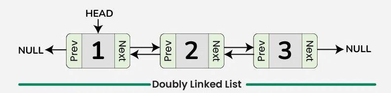

## Doubly Linked List

## diagram

 doubly linked list is a more complex data structure  than a singly linked list, but it offers several advantages. The main  advantage of a doubly linked list is that it allows for efficient  traversal of the list in both directions. This is because each node in  the list contains a pointer to the previous node and a pointer to the  next node. This allows for quick and easy insertion and deletion of  nodes from the list, as well as efficient traversal of the list in both  directions.

Doubly Linked List

### Representation of Doubly Linked List in Data Structure

In a data structure, a doubly linked list is represented using nodes that have three fields:

1. Data

2. A pointer to the next node (***\*next\****)

3. A pointer to the previous node (***\*prev\****)

   

Node Structure of Doubly Linked List

## dependence

* malloc
* 