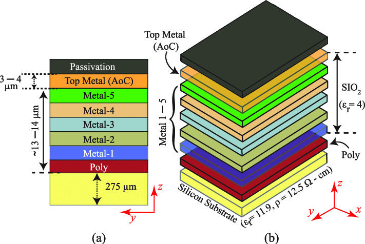
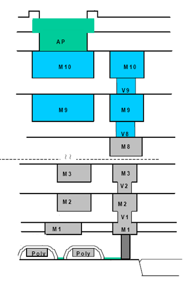
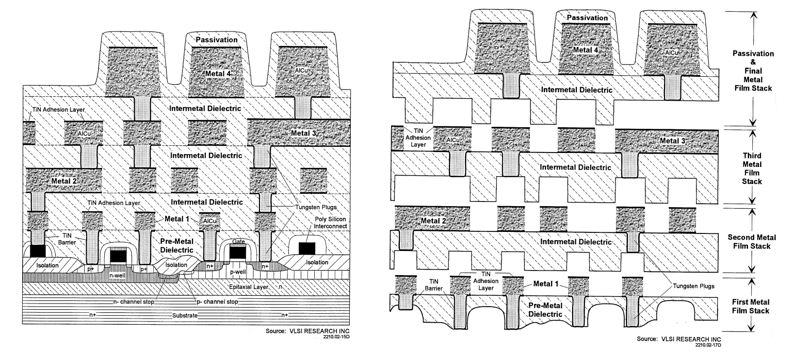
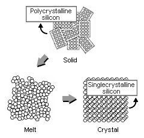
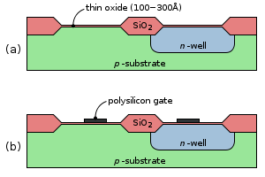
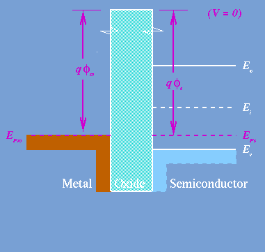
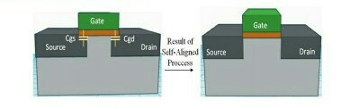

# IC Basic

## [VLSI-Expert](http://www.vlsi-expert.com/p/parasitic-extraction.html#other_topic)

## [CMOS Manufacture](IC_basic.assets/Lecture5-Manufacturing.pdf)

## Passivation Layer

Passivation layers should normally protect the active [semiconductor surface](https://www.sciencedirect.com/topics/engineering/semiconductor-surface) from the surrounding environment. In sensors the active surface is exposed to the environment and [passivation](https://www.sciencedirect.com/topics/engineering/passivation) is needed to protect the peripheral areas. Depending on the  environment, passivation layers need to have good adhesion, also during  stressing, they are usually chemically inert, corrosion-resistant [dielectrics](https://www.sciencedirect.com/topics/chemistry/dielectric-material) (acting as [diffusion barriers](https://www.sciencedirect.com/topics/engineering/diffusion-barrier) to water diffusion) and with wide bandgap (and thus high electrical breakdown strength). They are therefore in general Al2O3, SiO2, Si3N4, and nanocrystalline AlN in the case of diamond (McGoech *et al.* 1999). In [electrochemistry](https://www.sciencedirect.com/topics/chemistry/electrochemistry), epoxies are used extensively.

Passivation layers have been used as an effective strategy to improve the  charge-separation and transfer processes across semiconductor-liquid  interfaces. These thin layers can reduce the charge recombination at  surface states, increase the water [oxidation reaction](https://www.sciencedirect.com/topics/materials-science/oxidation-reaction) kinetics, and protect the semiconductor from chemical corrosion. Passivation layers are < 100 nm thick, but quite often, only 1–2 nm are used to allow charges transfer by means of tunneling. Passivation  layers have been fabricated by means of several techniques such as [atomic layer deposition](https://www.sciencedirect.com/topics/physics-and-astronomy/atomic-layer-epitaxy) (ALD), [spin-coating](https://www.sciencedirect.com/topics/materials-science/spin-coating), electrochemical deposition, sputtering, [electron beam](https://www.sciencedirect.com/topics/physics-and-astronomy/electron-beams) evaporation, floating transfer and dip-casting.

In order to overcome the degradation of BiVO4 under extreme pH conditions, some specific [passivation](https://www.sciencedirect.com/topics/materials-science/passivation) layers have been used on this material. A thin layer of amorphous TiO2 (80–120 nm thick deposited for 15–30 s) [79] resulted in a 5.5-fold increase in [photocurrent](https://www.sciencedirect.com/topics/physics-and-astronomy/photoelectric-emission) density as well as a shift in the photocurrent onset potential by − 0.5 V. The authors explained that the enhancement was due, in part, to the TiO2 layer passivating the FTO surface, which was not completely covered by the W-doped BiVO4. This reduced the back-reduction of the photo-oxidized intermediates on  the conducting substrate and passivated the defect sites on the surface  of the W-doped BiVO4 films. The authors also noted a possible improvement in charge collection may be due to band bending at the TiO2-BiVO4 interface.

Ultrathin dual layers of TiO2 and Ni have also been used to stabilize [polycrystalline](https://www.sciencedirect.com/topics/physics-and-astronomy/polycrystalline) BiVO4 photoanodes against photocorrosion in an aqueous alkaline (pH = 13) [electrolyte](https://www.sciencedirect.com/topics/physics-and-astronomy/electrolytes) [80]. The dual-layer coating extended the lifetime of the BiVO4 photoanodes during photoelectrochemical water oxidation from minutes (for the bare BiVO4), to hours (for the modified electrodes). ZnFe2O4 (10–15 nm thick) has also been used as a protection layer to stabilize BiVO4 in a 0.1 M KOH solution [81], generating a photocurrent density > 2 mA/cm2 at 1.23 V versus RHE, with a significantly improved stability compared to the pristine BiVO4 [electrode](https://www.sciencedirect.com/topics/physics-and-astronomy/electrodes). It was also suggested that the ZnFe2O4 protection layer could also contribute to photocurrent generation via an increased [photon absorption](https://www.sciencedirect.com/topics/physics-and-astronomy/photon-absorption) and [electron-hole](https://www.sciencedirect.com/topics/physics-and-astronomy/holes-electron-deficiencies) separation.

Although significant advantages are possible with a [surface passivation](https://www.sciencedirect.com/topics/physics-and-astronomy/surface-passivation) layer, the surface layer creates new interfaces that need to be  considered. The proper engineering of multiple component layers can  provide a solution for the many material problems encountered in  photoelectrochemical water splitting.

# 

## [Metal Layer Stack (Metallization Option) Part 1](http://www.vlsi-expert.com/2017/10/metal-layer-stack-nomenclature-part-1.html)

There are different metal layers which we uses in our design. As we move down the technology node number of standard cells increases or you can  say that number of connections increases drastically. As all of us know  that these connection are made of Metal wire, it means number of metal  wires increases. Below figure help you to understand the scenario.

**Case1** : I didn't decrease the size of the chip (despite change in the no of standard cells per unit area) as we go down the technology  node. You can see that number of metal wires increases. Silicon  utilization improves with improved routability. But these numbers  (standard cell) increases 4 times (per node if we are decreases the size by 1/2, overall area decreases by 1/2*1/2=1/4). With available options  of metal wire in higher node, it's difficult to route the same design in lower technology node. And that's the reason as we go down number of  metal wires increases (vertically also).

**Case 2**: This is the real scenario. As Technology node decreases,  no of standard cells increases and also chip size decreases. So you can  imagine how difficult it is to route the design with a single metal wire or say on a single level. That's the reason we have multiple levels of  metal wires. These levels are in vertical direction. As we go down the  technology node, these levels increases. So you can say that down the  technology node, size of the chip decreases in one dimension (in 2D) but increases in other dimension (vertically). :) :)

|  |
| ------------------------------------------------------------ |
| Technology Node Vs Routing Complexity                        |

To take care about the above options, foundry provides different option  of metal in every technology node. These options are based on metal  width, space, thickness or sometime other parameters. (You will get more clarity as we discuss more).

### Type of Metal Wire 

On the basis of Metal wire parameter or say property, foundry divide or  say categorize different metals. These metal wire are named differently  to distinguish from each other. Let's assume XYZ foundry have  nomenclature of Mx, My, Mz, Mr. Different technology node will have  different options. For example. 

**In Technology node X.**

Mx:   First Inter-layer Metal:   Min_width = 0.1um & Min_space = 0.1um.
My:   Second Inter-layer Metal:   Min_width = 0.4um & min_space = 0.4um.

**In Technology node Y.**

Mx:   First Inter-layer Metal:   Min_width = 0.08um & Min_space = 0.08um.
My:   Second Inter-layer Metal:   Min_width = 0.18um & min_space = 0.18um.
Mz:   Top Metal layer:       Min_width = 0.4um & min_space = 0.4um
Mr:   Top Metal layer:       Min_width = 0.5um & min_space = 0.5um

**In Technology node Z.**

Mx:   First Inter-layer Metal:   Min_width = 0.05um & Min_space = 0.05um.
Mya:   Second Inter-layer Metal:   Min_width = 0.12um & min_space = 0.12um & thickness = 2800A
Myb:  Top metal layer:   Min_width = 0.12um & min_space = 0.12um & thickness = 3200A
Mz:  Top Metal layer:       Min_width = 0.4um & min_space = 0.4um
Mr:     Top Metal layer:       Min_width = 0.5um & min_space = 0.5um

**Note: These min_width and min_spacing numbers are not related to any  technology node. I just picked these randomly to help you to understand  how different metal wires are categorized.**

As we go down these available options increases. Like Mx, My, Mz, Mu,  Mr, Mw and so on. For exact numbers of metal and their property plz  refer foundry provided documents.

Foundry also recommend based on the uses of metal wire. Like few metal wire options with a relaxed pitch (**minimum_width + minimum_spacing = Pitch**) for power, clock, busses and other important signal distribution.  Tighter pitched options for general signal routing. You can also see (In Technology Node Z) that Mya and Myb are also 2 different type of metal  wire because their Thickness values are different (even though their  min_width and min_spacing are same). So you can understand that as per  the uses, foundry provides a lot of options. Now it's upto designer how  to use those options. 

Foundry provide this (above) information in several ways so that user  can understand it very clearly. One thing I want to highlight here that  user have flexibility to choose metal layers but out of available  options. Stay tune to understand this point.

### Cross-section diagram of a Metal Stack:

First try to understand below pic :) 

This is basically a cross-section of different metal wire after the  fabrication. In the sense, how different metals are placed and how they  are connected. Sometime lot more details can be provided along with this pictorial view like min_width and min_spacing of every metal wire, name of the dielectric, thickness of metal wire and dielectric. It varies  from foundry to foundry & process to process. 

**Another representation of cross-section of Metal Stack (Source: VLSI Research INC - Downloaded from Internet)**

Here you can see, they have explained from real fabrication point of  view and also explained what are different components of first metal  film stack, second metal film stack and so-on as per their process.

**Note:** Above cross-section foundry can provide for maximum  available Metal stack. Now if you are confused what is the meaning of  "available" metal stack (refer below pic)

### Tabular diagram of Metal Stack:

Basically it's metallization option available or say provided by the  foundry. They can provide this in the table form to make things crystal  clear. Cross-section diagram can help you but drawing the cross-section  of each and every stack is not possible. So they created table something like this (below).

**Note:** I have only created a very small subset of actual table but it is sufficient to understand foundry data.

I have only captured 21 stack type. There can be more also. Now let's try to understand this table more closely. 

-  For 3 Metal layer - there is only 1 option available. (Stack type 1) 
-  For 4 Metal layer - there is only 1 option available. (Stack type 2) 
-  For 5 Metal layer - there is only 2 option available. (Stack type 3,4) 
-  For 6 Metal layer - there is only 3 option available. (Stack type 5,6,7) 
-  For 7 Metal layer - there is only 6 option available. (Stack type 8-13) 
-  For 8 Metal layer - there is only 8 option available. (Stack type 14-21) 
-  There are no other available options for any metal layer stack  apart from provided in the table. Like if you need any other  combinations of metals for 5 metal layer, it's not available.  (Restriction provided by foundry)
-  Metal layer "Mr" can not be used in case of 3, 4, 5 &6 metal layer stack. (Restriction provided by foundry)
-  Top Metal layer can be of either Mz or Mr (for metal stack more then 6). (Restriction provided by foundry)
-  My, Mx Layer can't be Top metal layer. These are always inter-layer metal. (Restriction provided by foundry) 
-  M1 is always First metal layer. (Restriction provided by foundry)
-  Sequence of Metal layer is M1 -> Mx -> My -> Mz/Mr. You can't change the sequence. (Restriction provided by foundry)

Following information can supplement above diagram (also provided by  foundry) and sometime easy to understand. If you can understand this  properly, you can form any stack diagram or say you can understand all  available options provided by foundry.

Similar type of table can be provided for VIA also.

Now from Foundry point of view, every things looks good. But you may be thinking 

-  How this information is going to use in the design?
-  How are designers going to communicate with each other about a certain metal stack? 
-  Is there any standard for communication point of view with in a Design Team? 

## [Metal Layer Stack (Nomenclature) Part 2](http://www.vlsi-expert.com/2017/10/metal-layer-stack-nomenclature-part-2.html)

In the last part we have discussed about the Metal Stack. The way  foundry provide data, different restrictions and available options. Now  it's time to understand the very next step - how to communicate the  complex Metal Stack information across the design team or groups or  companies. For this Foundry also provide Nomenclature of metal stack.

If you remember in the last article we have discussed that there are  different metal wires like Mx, My, Mz, Mr , Mu, etc (in XYZ Foundry).  Below diagram can help you to remind this very well.

Now, lets suppose you want to use Stack type 7 and same you want to  communicate to other user, then there is a standard way for this. (You  might be thinking that I will communicate directly that you are  referring Stack type 7. But if we do this - every time user has to refer this table to understand different metal layer optons. :) ).

If you will check closely the Stack Type 7, you will find below information.

-  There are Total 6 metal layers.
-  Metal 1 is of M1 type.
-  Metal 2, 3, 4 are of Mx type. Means next 3 Metal layers (After M1) are of Mx type.
-  Metal 5 is of My type. Means next 1 metal layer (after Mx) is of is of My type.
-  Metal 6 is of Mz type. Means next 1 metal layer (after My) is of is of Mz type.

Now, if I combine all this information and write something like this.

**M1_3Mx_My_Mz : 1 (M1 Type) + 3 (Mx type) + 1 (My Type) + 1 (Mz Type) = 6 Metal layer.**

Between 2 metal layers (e.g M1 and M2) - we will use VIA as per upper metal layer type (e.g Vx type)

The way I have defined the sequence also help to understand the sequence of Metal layer.

Any one can now interpret that :
 **Metal 1** = M1
 **Metal 2** = Mx1 (Mx Type)
 **Metal 3** = Mx2 (Mx Type)
 **Metal 4** = Mx3 (Mx Type)
 **Metal 5** = My1 (My Type)
 **Metal 6** = Mz1 (Mz Type)

**VIA 1** = Vx1 (Vx type)
 **VIA 2** = Vx1 (Vx type)
 **VIA 3** = Vx1 (Vx type)
 **VIA 4** = Vx1 (Vy type)
 **VIA 5** = Vx1 (Vz type)
 Remember, number of VIAs are always 1 less then the number of Metal layers. :)

Different companies uses different way to understand this. Like following are few examples.

1.  **M1_3Mx_My_Mz** : 1 (M1 Type) + 3 (Mx type) + 1 (My Type) + 1 (Mz Type) = 6 Metal layer. 
2.  **3Mx_My_Mz** : 1 (M1 Type) + 3 (Mx type) + 1 (My Type) + 1 (Mz Type) = 6 Metal layer. 
3.  **3MxMyMz** : 1 (M1 Type) + 3 (Mx type) + 1 (My Type) + 1 (Mz Type) = 6 Metal layer. 
4.  **6M_3MxMyMz** : 1 (M1 Type) + 3 (Mx type) + 1 (My Type) + 1 (Mz Type) = 6 Metal layer. 
5.  **1P6M_3MxMyMz** : 1 (M1 Type) + 3 (Mx type) + 1 (My Type) + 1 (Mz Type) = 6 Metal layer. 

**Note:**

-  In the 2nd, 3rd, 4th and 5th option, First Metal layer M1 is considered by default. 
-  In the 4th option, It was mentioned explicitly that stack has 6 metal layer (6M).
-  In the 5th option, It was mentioned explicitly that stack has 1 Poly layer (1P) and 6 metal layer (6M).

For the above figure, I have added all the nomenclature as per 5th  option. Also for your easiness, I have mentioned Stack name at the Top  and Bottom (both places same information). I am sure, after this there  will be no confusion. :)

In the last, I just wanted to highlight that above nomenclature and  metal stack options is for 1 foundry. But different Foundries may have  different ways to provide and representation their information. With in  the companies or group or team, they can also decide their own way to  represent Metal Stack but when they communicate with outside world,  either they have to use certain standard or they have to provide details of their nomenclature (which is very common).

## Polysilicon Layer

"Poly" refers to polysilicon, or a thin layer of silicon in polycrystalline  form.  This image explains the difference between polycrystalline and  crystalline:

*image from* [Tokuyama Malaysia Sdn Bhd](http://www.tokuyama.com.my/products.php) 

The purpose of a polysilicon layer in an integrated circuit is *most likely* to serve as the material for a FET gate.

*image from Wikipedia* 

The reason you would choose polysilicon for the gate is a matter of getting the metal-semiconductor work function to match up in order to get a  desired threshold voltage.

The work function (symbolized as phi) is how much energy it takes to remove a charge carrier from a solid.  When the metal gate's work function is  significantly different from the doped semiconductor's work function, it has a major impact on the transistor's threshold voltage -- what it  takes to switch it "on." Polysilicon is extremely convenient for matching to the silicon channel, which is  why it was used all the way up to the 65nm CMOS process node.  The  biggest trouble with using polysilicon is that its conductivity is very  poor when you want to make a computer system running at 3 GHz.  At 65nm  its conductivity is poor enough that the upper portion of the  polysilicon is alloyed with nickel to increase its conductivity.

### Why is polysilicon used as a gate contact instead of metal in CMOS?

In the early days of semiconductor industry, the metal, **Aluminum**, was generally preferred for gate material of MOS. But later on, **polysilicon** has been preferred as gate material. Two main reasons were behind this transition to polysilicon :During fabrication process, if the gate mask is misaligned, it creates a parasitic overlap input capacitance Cgd and Cgs.The capacitance **Cgd** is more harmful because it is a **feedback capacitance**.As a result of **miller** capacitance, there is a reduction in the transistor’s switching speed. One of the solutions to the misalignment of the gate mask is what is known as a “**Self-aligned Gate Process**”. This process starts with the creation of the gate region followed by the creation of the drain and source regions using **ion-implantation**. The thin gate oxide under the gate acts as a mask for doping process  preventing further doping under gate region (channel). So, this process  makes the gate self-aligned with respect to the source and drain. As a  result of all this, the source and drain do not extend under the gate.  Thereby reducing Cgd and Cgs. The doping process of the drain and source require very high temperature  annealing methods (>800°C). If Al is used as a gate material, it  would melt under such high temperature. This is because the melting  point of Al is approximately 660°C. But, if polysilicon is used as a gate material, it would not melt. Thus, the self-alignment process is possible with polysilicon gate. Undoped polysilicon has very high resistivity, approximately 108 ohm/Cm. So,  polysilicon is doped in such a way that its resistance is reduced.

The other reason for selecting polysilicon is that the threshold voltage of MOS transistor is correlated with the work function difference between  the gate and the channel.Earlier, metal gates were used when operating voltages were in the range of 3-5 volts. But, as the transistors were scaled down, which ensured that the operating voltages of the device were also brought down. A transistor with such high threshold voltage becomes non-operational under such conditions. Using metal as gate material resulted in high threshold voltage compared to  polysilicon, since polysilicon would be of the same or similar  composition as the bulk-Si channel. Also, as polysilicon is a semiconductor, its work function can be modulated by adjusting the level of doping.

### [Chapter 4 The active and Poly layer](IC_basic.assets/ch04-active-poly.pdf)