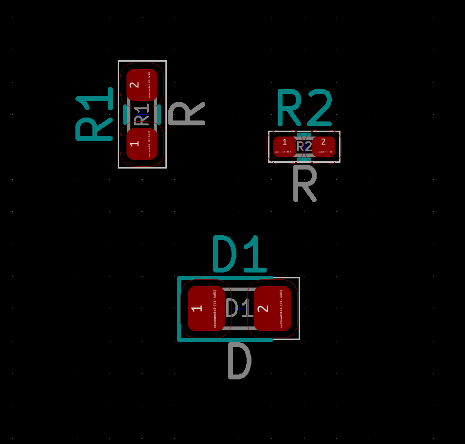
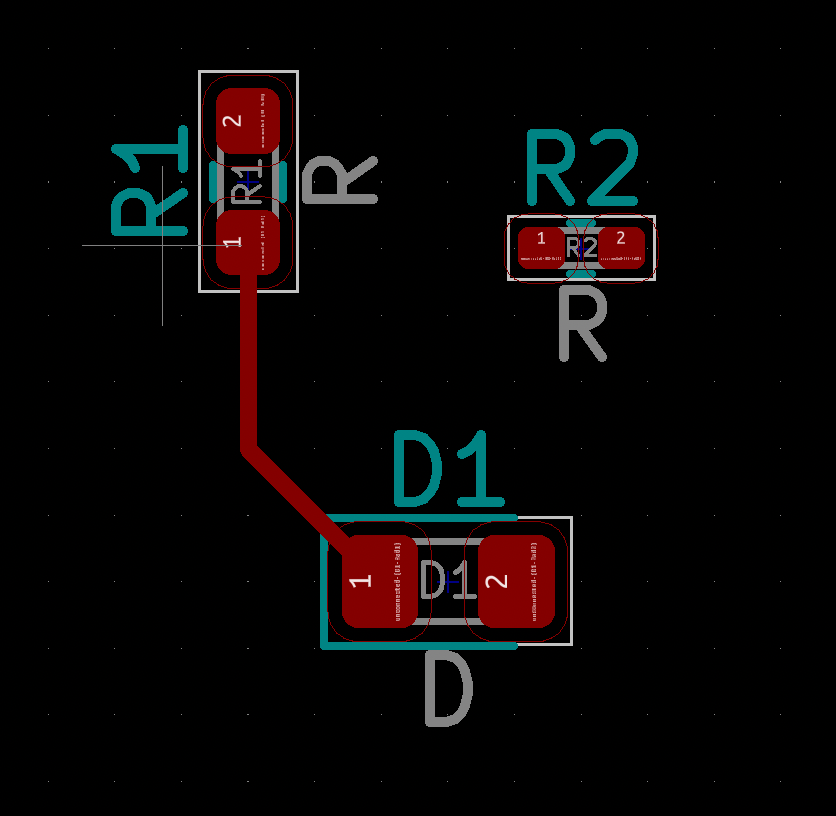
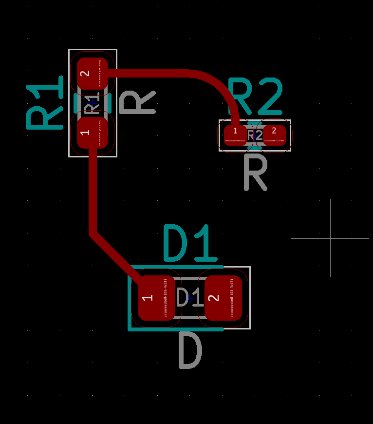
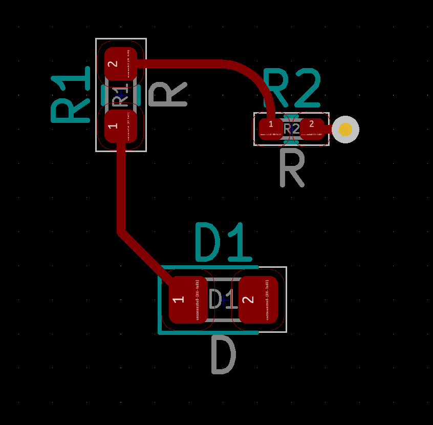
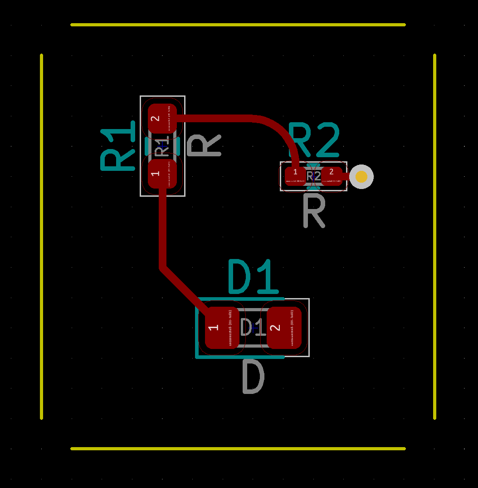
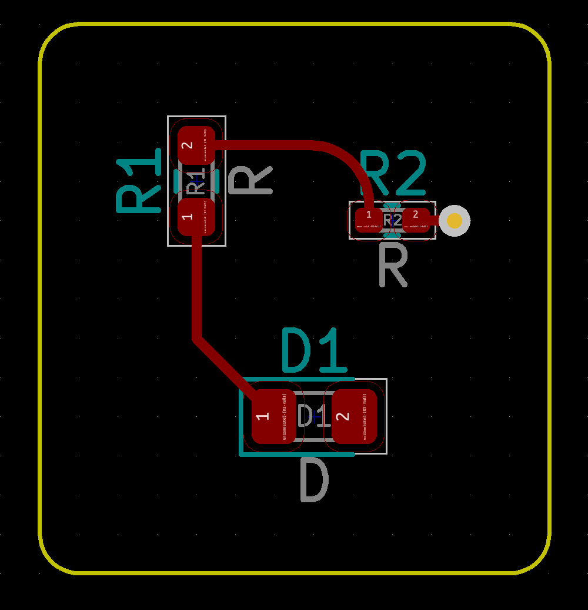

# KiCad 6 Python Scripting: Place Footprints, Create Tracks, Curved Tracks, Vias, and Edge Cut Lines


If you find yourself in a situation where you are placing component footprints at multiple locations on PCB using [KiCad](https://www.kicad.org/), or routing a pattern of tracks repeatedly (like in a keyboard) you’ll save time by automating through a Python script.


### Contents

- Introduction
  - [How to Run Python Script](https://girishji.github.io/2022/08/17/kicad-python-footprints-curved-tracks-edge-cuts.html#how-to-run-python-script)
  - [KiCad Coordinate System](https://girishji.github.io/2022/08/17/kicad-python-footprints-curved-tracks-edge-cuts.html#kicad-coordinate-system)
- Footprints
  - [Place Footprint](https://girishji.github.io/2022/08/17/kicad-python-footprints-curved-tracks-edge-cuts.html#place-footprint)
- Tracks
  - [Straight Track](https://girishji.github.io/2022/08/17/kicad-python-footprints-curved-tracks-edge-cuts.html#straight-track)
  - [Curved Track](https://girishji.github.io/2022/08/17/kicad-python-footprints-curved-tracks-edge-cuts.html#curved-track)
  - [Create Via](https://girishji.github.io/2022/08/17/kicad-python-footprints-curved-tracks-edge-cuts.html#create-via)
  - [Remove All Tracks and Vias](https://girishji.github.io/2022/08/17/kicad-python-footprints-curved-tracks-edge-cuts.html#remove-all-tracks-and-vias)
- Edge Cuts
  - [Draw Line](https://girishji.github.io/2022/08/17/kicad-python-footprints-curved-tracks-edge-cuts.html#draw-line)
  - [Draw Arc](https://girishji.github.io/2022/08/17/kicad-python-footprints-curved-tracks-edge-cuts.html#draw-arc)
  - [Remove All Lines](https://girishji.github.io/2022/08/17/kicad-python-footprints-curved-tracks-edge-cuts.html#remove-all-lines)


## Introduction

[KiCad 6](https://www.kicad.org/) has decent support for scripting but [documentation](https://docs.kicad.org/doxygen-python/index.html) can be hard to grok. Reading their code is often the only recourse. I’ll cover the basics of placing footprints and routing tracks with code examples.

### How to Run Python Script

Copy (or symlink) your python script to KiCad plugins directory, which (on a Mac) is located in `~/Documents/KiCad/6.0/scripting/plugins`. You can find out where KiCad looks for plugins and scripts by running `import pcbnew; print(pcbnew.PLUGIN_DIRECTORIES_SEARCH)` from Python Console in PCB Editor window (icon is at the right hand top corner).

In the console window simply import the python module using `import filename` (if your python script is named filename.py). This will execute the script. It works the first time, but Python interpreter will not import the same module twice. There is a solution. You reload the module again using `import importlib` followed by `importlib.reload(filename)`.

There is an alternate approach of using plugins, but above method is simpler; your print output appears in the console window instead of having it redirected to a file.

### KiCad Coordinate System

The Cartesian plane KiCad uses has Y-axis pointing down and X-axis pointing to the right. Moreover, distance is specified in millionth of millimeter, and angles are in tenths of a degree. These aspects will become clear later. Points in space are represented by [`wxPoint`](https://docs.kicad.org/doxygen-python/classpcbnew_1_1wxPoint.html). There is also a millimeter variant called [`wxPointMM`](https://docs.kicad.org/doxygen-python/namespacepcbnew.html#af68fa631c5cc3b5f30e869f9951ab920), and a conversion routine [`fromMM()`](https://docs.kicad.org/doxygen-python/namespacepcbnew.html#a3b6e68db767968e491ebb6c2cd82e9c1). Using mils instead of millimeter is also possible but not covered here.

## Footprints

[Footprints](https://docs.kicad.org/doxygen-python/classpcbnew_1_1FOOTPRINT.html) are needed to position components on pcb.

### Place Footprint

Get a reference to the footprint object from the [Board](https://docs.kicad.org/doxygen-python/classpcbnew_1_1BOARD.html) object. You can then place the footprint and set the orientation by calling the footprint object itself.

In the following example we have three (SMD) footprints, for 2 resistors and a diode.

```python
import pcbnew
from pcbnew import wxPoint, wxPointMM

board = pcbnew.GetBoard()

# Get reference to footprint objects
board = pcbnew.GetBoard()
r1 = board.FindFootprintByReference("R1")
r2 = board.FindFootprintByReference("R2")
d1 = board.FindFootprintByReference("D1")
assert(r1 and r2 and d1)

# Place footprints
r1.SetPosition(wxPointMM(20, 20))    # (x, y) = (20, 20) in mm
r1.SetOrientation(90 * 10)           # rotate by 90 deg
r2.SetPosition(wxPointMM(25, 21))
d1.SetPosition(wxPointMM(23, 26))

# Update display
pcbnew.Refresh()
```



## Tracks

[KiCad 6](https://www.kicad.org/) supports straight line as well as curved tracks.

### Straight Track

To route a track, you need a start and end [point](https://docs.kicad.org/doxygen-python/classpcbnew_1_1wxPoint.html). You need to also locate the center of the pads that terminate the track.

```python
import pcbnew
from pcbnew import wxPoint, wxPointMM

def add_track(start, end, layer=pcbnew.F_Cu):
    board = pcbnew.GetBoard()
    track = pcbnew.PCB_TRACK(board)
    track.SetStart(start)
    track.SetEnd(end)
    track.SetWidth(int(0.25 * 1e6))
    track.SetLayer(layer)
    board.Add(track)

# Route track from pad #1 of footprint R1 to pad #1 of D1 with 45-deg corner
board = pcbnew.GetBoard()
start = board.FindFootprintByReference("R1").FindPadByNumber("1").GetCenter()
end = board.FindFootprintByReference("D1").FindPadByNumber("1").GetCenter()
offset = end.x - start.x
thru = pcbnew.wxPoint(start.x, end.y - offset)
add_track(start, thru)
add_track(thru, end)

pcbnew.Refresh()
```



### Curved Track

[KiCad 6](https://www.kicad.org/) has support for drawing curved tracks, be it circular arcs or Bezier curves. Only circular arcs are covered here. Use [`PCB_ARC`](https://docs.kicad.org/doxygen-python/classpcbnew_1_1PCB__ARC.html) object and specify start, mid and end points of arc.

For low frequency applications, curved tracks are mostly for aesthetic reasons. Moreover, during manual routing if  you use the “shove” option KiCad may decide to convert rounded edges to sharp corners. To manually route a rounded track use *Ctrl-/* (or *Cmd-/* on Mac) shortcut to switch among following options: corners at 45 deg -> rounded corners at 45 deg -> corners at 90 deg -> rounded corners at 90 deg, after you click on the starting point of track.

The following example adds a rounded corner to two straight line tracks.

```
import pcbnew
import math
from pcbnew import wxPoint, wxPointMM

def add_track_arc(start, mid, end, layer=pcbnew.F_Cu):
    board = pcbnew.GetBoard()
    track = pcbnew.PCB_ARC(board)
    track.SetStart(start)
    track.SetMid(mid)
    track.SetEnd(end)
    track.SetWidth(int(0.25 * 1e6))
    track.SetLayer(layer)
    board.Add(track)

# Route track from pad #2 of footprint R1 to pad #1 of R2
#   with 90-deg arc of radius 1.5mm
board = pcbnew.GetBoard()
radius = 1.5 * pcbnew.IU_PER_MM
start = board.FindFootprintByReference("R1").FindPadByNumber("2").GetCenter()
end = board.FindFootprintByReference("R2").FindPadByNumber("1").GetCenter()
start1 = pcbnew.wxPoint(end.x - radius, start.y)
add_track(start, start1)
end1 = pcbnew.wxPoint(end.x, start.y + radius)
add_track(end1, end)
# Find the mid point of the arc by translating the origin to the center of arc
#   and rotating the axis by 45-deg
theta = 45
mid = wxPoint(
    start1.x + radius * math.cos(math.radians(theta)),
    end1.y - radius * math.sin(math.radians(theta)),
)
add_track_arc(start1, mid, end1)

pcbnew.Refresh()
```



### Create Via

Create a via at 1mm offset from pad #2 of footprint R2 and connect a track to it.

```python
import pcbnew
from pcbnew import wxPoint, wxPointMM
 
board = pcbnew.GetBoard()
pad = board.FindFootprintByReference("R2").FindPadByNumber("2").GetCenter()
via_location = wxPoint(pad.x + 1 * pcbnew.IU_PER_MM, pad.y)
add_track(pad, via_location)
via = pcbnew.PCB_VIA(board)
via.SetPosition(via_location)
via.SetDrill(int(0.4 * 1e6))
via.SetWidth(int(0.8 * 1e6))
board.Add(via)

pcbnew.Refresh()
```



### Remove All Tracks and Vias

You may need to remove stale tracks before adding new ones.

```python
import pcbnew

board = pcbnew.GetBoard()
for t in board.GetTracks():
    board.Delete(t)

pcbnew.Refresh()
```

## Edge Cuts

Edge Cut lines define the boundary of the pcb. [KiCad 6](https://www.kicad.org/) has support for drawing straight lines and arcs on any layer, not just on Edge Cuts. To draw a line you specify the end points. To draw an arc you specify starting point, center of the arc, and the angle. This API is slightly different from drawing curved tracks where you specify mid-point of the curve. There is also API to draw Bezier curves.

### Draw Line

Use [`PCB_SHAPE`](https://docs.kicad.org/doxygen-python/classpcbnew_1_1PCB__ARC.html) object and set the shape to `SHAPE_T_SEGMENT`. You can specify the layer and line width. Use the search box in the [documentation](https://docs.kicad.org/doxygen-python/index.html) to search for symbols.

Add an edge cuts border around the components. Draw lines on all four sides and connect them by rounded corners.

```python
import pcbnew
from pcbnew import wxPoint, wxPointMM

def add_line(start, end, layer=pcbnew.Edge_Cuts):
    board = pcbnew.GetBoard()
    segment = pcbnew.PCB_SHAPE(board)
    segment.SetShape(pcbnew.SHAPE_T_SEGMENT)
    segment.SetStart(start)
    segment.SetEnd(end)
    segment.SetLayer(layer)
    segment.SetWidth(int(0.1 * pcbnew.IU_PER_MM))
    board.Add(segment)

board = pcbnew.GetBoard()
border = 4 * pcbnew.IU_PER_MM
radius = 1 * pcbnew.IU_PER_MM
r1 = board.FindFootprintByReference("R1").GetPosition()
r2 = board.FindFootprintByReference("R2").GetPosition()
d1 = board.FindFootprintByReference("D1").GetPosition()
start = wxPoint(r1.x - border + radius, r1.y - border)
end = wxPoint(r2.x + border - radius, r1.y - border)
add_line(start, end)
start = wxPoint(end.x + radius, end.y + radius)
end = wxPoint(start.x, d1.y + border - radius)
add_line(start, end)
start = wxPoint(end.x - radius, end.y + radius)
end = wxPoint(r1.x - border + radius, start.y)
add_line(start, end)
start = wxPoint(end.x - radius, end.y - radius)
end = wxPoint(start.x, r1.x - border + radius)
add_line(start, end)

pcbnew.Refresh()
```



### Draw Arc

Use [`PCB_SHAPE`](https://docs.kicad.org/doxygen-python/classpcbnew_1_1PCB__ARC.html) object and set the shape to `SHAPE_T_ARC`.

```python
import pcbnew
from pcbnew import wxPoint, wxPointMM

def add_line_arc(start, center, angle=90, layer=pcbnew.Edge_Cuts):
    board = pcbnew.GetBoard()
    arc = pcbnew.PCB_SHAPE(board)
    arc.SetShape(pcbnew.SHAPE_T_ARC)
    arc.SetStart(start)
    arc.SetCenter(center)
    arc.SetArcAngleAndEnd(angle * 10, False)
    arc.SetLayer(layer)
    arc.SetWidth(int(0.1 * pcbnew.IU_PER_MM))
    board.Add(arc)

board = pcbnew.GetBoard()
border = 4 * pcbnew.IU_PER_MM
radius = 1 * pcbnew.IU_PER_MM
r1 = board.FindFootprintByReference("R1").GetPosition()
r2 = board.FindFootprintByReference("R2").GetPosition()
d1 = board.FindFootprintByReference("D1").GetPosition()
start = wxPoint(r2.x + border - radius, r1.y - border)
center = wxPoint(start.x, start.y + radius)
add_line_arc(start, center)
start = wxPoint(start.x + radius, d1.y + border - radius)
center = wxPoint(start.x - radius, start.y)
add_line_arc(start, center)
start = wxPoint(r1.x - border + radius, start.y + radius)
center = wxPoint(start.x, start.y - radius)
add_line_arc(start, center)
start = wxPoint(start.x - radius, r1.y - border + radius)
center = wxPoint(start.x + radius, start.y)
add_line_arc(start, center)

pcbnew.Refresh()
```



### Remove All Lines

You may want start with a fresh slate.

```python
import pcbnew

board = pcbnew.GetBoard()
for dr in board.GetDrawings():
   board.Delete(dr)

pcbnew.Refresh()
```

### Conclusion

KiCad 6 provides adequate scripting capability for designing pcb’s of moderate complexity.