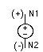
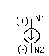
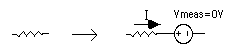
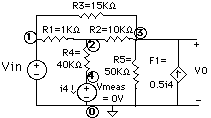
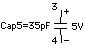
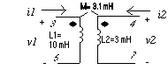
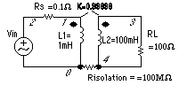
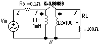
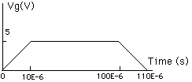
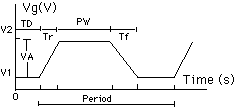

# SPICE - A Brief Tutorial

[This document](https://www.seas.upenn.edu/~jan/spice/spice.overview.html) gives a brief overview of SPICE. The description is far from complete, as SPICE is a powerful circuit simulator with many capabilities. However, this document will serve as a start for students in introductory classes. For more information, please refer to the SPICE user's manual or [books](https://www.seas.upenn.edu/~jan/spice/spice.guide.html#REFERENCES) listed at the end of the document.

Table of Contents
=================
**A. PSPICE with Capture - ORCAD):**

* PSpice [Quick Reference Guide](http://www.seas.upenn.edu/%7Eese216/handouts/PSpiceQuickGuide.pdf)
  * [local documents](./PSpiceQuickGuide.pdf)
* PSpice [Tutorial](http://www.seas.upenn.edu/%7Ejan/spice/PSpicePrimer.pdf)

**B. SPICE (without Schematic Capture)**

<!-- vim-markdown-toc GFM -->

* [Introduction](#introduction)
* [HOW TO SPECIFY THE CIRCUIT TOPOLOGY AND ANALYSIS?](#how-to-specify-the-circuit-topology-and-analysis)
   * [Data Statements to Specify the Circuit Components and Topology](#data-statements-to-specify-the-circuit-components-and-topology)
      * [a. Independent DC Sources](#a-independent-dc-sources)
      * [b. Dependent Sources](#b-dependent-sources)
      * [c. Resistors](#c-resistors)
      * [d. Capacitors (C) and Inductors (L)](#d-capacitors-c-and-inductors-l)
      * [e. Mutual Inductors](#e-mutual-inductors)
      * [f. Ideal Transformer](#f-ideal-transformer)
      * [g. Sinusoidal sources](#g-sinusoidal-sources)
      * [h. Piecewise linear source(PWL)](#h-piecewise-linear-sourcepwl)
      * [i. Pulse](#i-pulse)
      * [j. Voltage- and Current-controlled Switches](#j-voltage--and-current-controlled-switches)
      * [k. Operational Amplifiers, and other elements](#k-operational-amplifiers-and-other-elements)
      * [l. Subcircuits](#l-subcircuits)
      * [m. Semiconductor Devices](#m-semiconductor-devices)
         * [m1. Diode](#m1-diode)
         * [m2. Bipolar transistors](#m2-bipolar-transistors)
         * [m3. MOSFETS](#m3-mosfets)
         * [m4. JFETS](#m4-jfets)
   * [Commands or Control Statements to Specify the Type of Analysis](#commands-or-control-statements-to-specify-the-type-of-analysis)
      * [a. .OP Statement](#a-op-statement)
      * [b. .DC Statement](#b-dc-statement)
      * [c. .TF Statement](#c-tf-statement)
      * [d. .SENS Statement](#d-sens-statement)
      * [e. .TRAN Statement](#e-tran-statement)
      * [f. .IC Statement](#f-ic-statement)
      * [g. .AC Statement](#g-ac-statement)
      * [h. For .NOISE, .DISTO, and .FOUR statements](#h-for-noise-disto-and-four-statements)
   * [Output Statements](#output-statements)

<!-- vim-markdown-toc -->

## Introduction

SPICE is a powerful general purpose analog circuit simulator that is used to verify circuit designs and to predict the circuit behavior. This is of particular importance for _integrated circuits_. It was for this reason that SPICE was originally developed at the Electronics Research Laboratory of the University of California, Berkeley (1975), as its name implies: 

  **S**imulation **P**rogram for **I**ntegrated **C**ircuits Emphasis.

PSpice is a PC version of SPICE (MicroSim Corp.) and HSpice is a version (Avant!.) that runs on workstations and larger computers. [PSpice](https://www.seas.upenn.edu/~jan/spice/spice.guide.html#PSPICE) is available on the PCs in the SEAS PC computing Labs and [HSPICE](https://www.seas.upenn.edu/~jan/spice/spice.guide.html#hspice) is available on ENIAC or PENDER. A complete manual of the [Avant! Star- HSPICE](http://www.ece.orst.edu/~moon/hspice98/) (pdf document) is available as well. 

 SPICE can do several _types of circuit analyses_. Here are the most important ones:

* Non-linear DC analysis: calculates the DC transfer curve.
* Non-linear transient analysis: calculates the voltage and current as a function of time when a large signal is applied.
* Linear AC Analysis: calculates the output as a function of frequency. A bode plot is generated.
* Noise analysis
* Sensitivity analysis
* Distortion analysis
* Fourier analysis: calculates and plots the frequency spectrum.
* Monte Carlo Analysis

In addition, PSpice has analog and digital libraries of standard components (such as NAND, NOR, flip-flops, and other digital gates, op amps, etc). This makes it a useful tool for a wide range of analog and digital applications.

All analyses can be done at different temperatures. The default temperature is 300K.

The circuit can contain the following components:
  
* Independent and dependent voltage and current sources
* Resistors
* Capacitors
* Inductors
* Mutual inductors
* Transmission lines
* Operational amplifiers
* Switches
* Diodes
* Bipolar transistors
* MOS transistors
* JFET
* MESFET
* Digital gates (PSpice, version 5.4 and up)

## HOW TO SPECIFY THE CIRCUIT TOPOLOGY AND ANALYSIS?

A SPICE input file, called source file, consists of three parts.
 

1. _Data statements_: description of the components and the interconnections.
2. _Control statements_: tells SPICE what type of analysis to perform on the circuit.
3. _Output statements_: specifies what outputs are to be printed or plotted.

Although these statements may appear in any order, it is recommended that they be given in the above sequence. Two other statements are required: the _title statement_ and the _end statement_. The title statement is the first line and can contain any information, while the end statement is always .END. This statement must be a line be itself, followed by a carriage return! In addition, you can insert _comment statements_, which must begin with an asterisk (*) and are ignored by SPICE.
 
 

    TITLE STATEMENT
    ELEMENT STATEMENTS
    .
    .
    COMMAND (CONTROL) STATEMENTS
    OUTPUT STATEMENTS
    .END <CR>

_Format_: The statements have a free format and consist of fields separated by a blank. If one wants to continue a statement to the next line, one uses a "+" sign (continuation sign) at the beginning of the next line. Numbers can be integers, or floating points. For example,

    RES1 1 0 3500 or RES1 1 0 3.5E3

One can also use the following scale factors:

T(= 1E12 or 10+12); G(= E9); MEG(= E6); K(= E3); M(= E-3); U(= E-6); N(= E-9); P(= E-12), and F(= E-15)
 
Both upper and lower case letters are allowed in PSpice and Hspice (SPICE uses only uppercase characters). As an example, one can specify a capacitor of 225 picofarad in the following ways:
 
 

    225P, 225p, 225pF; 225pFarad; 225E-12; 0.225N, etc.

### Data Statements to Specify the Circuit Components and Topology

#### a. Independent DC Sources

Voltage source: `Vname N1 N2 Type Value`

Current source: `Iname N1 N2 Type Value`

    N1 is the positive terminal node
    N2 is the negative terminal node
    Type can be DC, AC or TRAN, depending on the type of analysis (see Control Statements)
    Value gives the value of the source
    The name of a voltage and current source must start with V and I, respectively.

Examples:

    Vin 2 0 DC 10

    Is 3 4 DC 1.5

The positive current direction through the current or voltage source is from the positive (N1) node to the negative (N2) node:

 

Voltage and Current Conventions:

1. Spice always assigns a positive reference mark to the 1st node and uses the passive sign convention to assign the current reference.
2. Spice uses the node-voltage analysis. It solves for the unknown node voltages and also the unknown currents through independent voltage sources. This gives us a way to find currents flowing in elements: one has to ask for the current through a voltage source. Thus one can insert an independent voltage source of zero value in series with the element in which one wants to know the current, as shown in the example below:

The value of the current will be positive if it flows from the positive to the negative terminal through the source, as in the above example. Some versions of PSpice allow you to ask for a current through a resistor without using a voltage source (EX: I(R1) gives the current in the resistor R1).

#### b. Dependent Sources

Voltage controlled voltage source:

    Ename N1 N2 NC1 NC2 Value

Voltage controlled current source:

    Gname N1 N2 NC1 NC2 Value

Current controlled voltage source:

    Hname N1 N2 Vcontrol Value

Current controlled current source:

    Fname N1 N2 Vcontrol Value

  1. N1 and N2 are the positive and negative terminals of the dependent source, respectively.
  2. NC1 and NC2 are the positive and negative terminals of the controlling voltage source, respectively.
  3. Vcontrol is the zero value voltage source used to measure the controlling current (the positive current flows into the positive terminal of the controlling voltage source!).

    Examples:

        F1 0 3 Vmeas 0.5

        Vmeas 4 0 DC 0

#### c. Resistors

    Rname N1 N2 Value

#### d. Capacitors (C) and Inductors (L)

    Cname N1 N2 Value <IC>

    Lname N1 N2 Value <IC>

    N1 is the positive node.
    N2 is the negative node.
    IC is the initial condition (DC voltage or current).
    The symbol < > means that the field is optional. If not specified, it is assumed to be zero. In case of an inductor, the current flows from N1 to N2.

Example:

    Cap5 3 4 35E-12 5

    L12 7 3 6.25E-3 1m

#### e. Mutual Inductors

A mutual inductance in SPICE is defined by specifying the coupling coefficient K between the two inductors. The syntax is as follows:
 
 

    Kname Inductor1 Inductor2 value_of_K

The value of K must be larger than 0 but smaller than 1. Spice does not support perfect coupling (k=1). The above statement must always be together with the statements for the two inductors. An example is given in the figure below. The coupling coefficient K can be calculated as K=M/sqrt(L1xL2)=0.81.
 
 

The SPICE statements to define the above coupled coils are as follows.

    L1 3 5 10M
    L2 4 7 3M
    K L1 L2 0.81

The DOTS are always associated with the first node of the inductances (i.e. node no. 3 of L1 and no. 4 of L2). Also SPICE will assign the positive node voltage to the first node of the inductance (i.e. the DOT) and use the passive sign convention for the current direction as indicated in the figure above. For an example circuit see under the section [Examples](https://www.seas.upenn.edu/~jan/spice/spice.mutualInductor.html).

#### f. Ideal Transformer

SPICE has no model for an ideal transformer. An ideal tranformer is simulated using mutual inductances such that the transformer ratio N1/N2 = sqrt(L1/L2). Make the coupling factor K close to one (ex. K=0.99999) and choose L such that wL >> the resistance seen be the inductor. The secondary circuit needs a DC connection to ground. This can be accomplished by adding a large resistor to ground or giving the primary and secondary circuits a common node. For an example circuit see under the section [Examples](https://www.seas.upenn.edu/~jan/spice/spice.transformer.html)

 

#### g. Sinusoidal sources

    Vname N1 N2 SIN(VO VA FREQ TD THETA PHASE)

     which is a damped sinusoidal voltage source:

     Vname = VO + VA exp[-THETA.(t - TD)] sin[2pi.f (t - TD) + (Phase/360)]

    VO - offset voltage in volt.
    VA - amplitude in volt.
    f = FREQ - the frequency in herz.
    TD - delay in seconds
    THETA - damping factor per second
    Phase - phase in degrees

If TD, THETA and PHASE are not specified, it is assumed to be zero.
 
 

    Example: VG 1 2 SIN(5 10 50 0.2 0.1)

    VG2 3 4 SIN(0 10 50)

The last example is an undamped, undelayed sinusoid with an amplitude of 10V and frequency of 50 Hz.
 
 

To generate a cosine function, you can make use of the phase relationship between the sinusoid and cosine. Here is an example of an undelayed cosine with an amplitude of 5V and frequency of 50 Hz.
 
 

    Vcos 1 2 SIN(0 5 50 0 0 90)

#### h. Piecewise linear source(PWL)

    Vname N1 N2 PWL(T1 V1 T2 V2 T3 V3 ...)

in which (Ti Vi) specifies the value Vi of the source at time Ti

 Example:

    Vgpwl 1 2 PWL(0 0 10U 5 100U 5 110U 0)

#### i. Pulse

    Vname N1 N2 PULSE(V1 V2 TD Tr Tf PW Period)

V1 - initial voltage; V2 - peak voltage; TD - initial delay time; Tr - rise time; Tf - fall time; pwf - pulse-wise; and Period - period.

Other sources such as polynominal controlled source, exponential source, FM-modulated source, etc. can be specified. For information on these components, check the SPICE manual.

#### j. Voltage- and Current-controlled Switches

Voltage Controlled:

    Sname N1 N2 C1 C2 Mname

Current Controlled:
 
 

    Wname N1 N2 Vname Mname

    N1 and N2 are the terminals of the switch.
    C1 and C2 are the controlling terminals.
    Vname is the zero-value voltage source whose current controls the switch.
    Mname refers to the switch model that is defined in another statement (see Model Statement below).

The .MODEL statement allows you to specify the parameters of a variety of devices used in SPICE, such as switches, diodes, transistors. In case of a switch, we have:
 
 

    .MODEL Mname Dname(Pvalues)

    Mname refers to the Mname in the data statement of the switch.
    Dname is the device name: Vswitch or Iswitch.
    Pvalues are the values of the switch parameters, such as RON (on - resistance), ROFF (off-resistance), VON (the control voltage for ON; default = 1V), VOFF (control voltage for OFF; default = 0V), etc.

Example:
 
 

    S15 3 5 8 9 SMOD

    .MODEL SMOD VSWITCH(RON = 10, VON = 0, ROFF = 100MEG)

#### k. Operational Amplifiers, and other elements

An operational amplifier can be simulated in different ways. The first method is to model the amplifier by resistors, capacitors and dependent sources. As an example an ideal opamp is easily simulated using a voltage dependent voltage source. The second option uses actual transistors to model the opamp. The device library contains nonlinear models of the most common op amps. The student version of PSpice has macromodels for the linear amplifiers LM324 and uA741 which are included in the EVAL.LIB file. The professional version comes with library files of many commercial amplifiers and devices.

An example of the first approach (linear AC model) is given below for the uA741 opamp. We defined [subcircuit](https://www.seas.upenn.edu/~jan/spice/spice.overview.html#Subcircuits) for the opamp.

    SPICE code for the 741 opamp (ref: Macromodeling with Spice, by J.A. Connelly/P. Choi)

    * Subcircuit for 741 opamp
    .subckt opamp741 1 2 3
    * +in (=1) -in (=2) out (=3)
    rin 1 2 2meg
    rout 6 3 75
    e 4 0 1 2 100k
    rbw 4 5 0.5meg
    cbw 5 0 31.85nf
    eout 6 0 5 0 1
    .ends opamp741

#### l. Subcircuits

A subcircuit allows you to define a collection of elements as a subcircuit (e.g. an operational amplifier) and to insert this description into the overall circui (as you would do for any other element).

**Defining a subcircuit**

 A subcircuit is defined bu a .SUBCKT control statement, followed by the circuit description as follows:
 
 

    .SUBCKT SUBNAME N1 N2 N3 ...
    Element statements
    .
    .
    .
    .ENDS SUBNAME

in which SUBNAME is the subcircuit name and N1, N2, N3 are the external nodes of the subcircuit. The external nodes cannot be 0. The node numbers used inside the subcircuit are stricktly local, except for node 0 which is always global. For an example, see Operational Amplifier above.

**Using a subcircuit**

 The element statement for a subcircuit is similar to any other element. The format is as follows:

    Xname N1 N2 N3 ... SUBNAME

in which Xname refers to the element (subcircuit) being used; N1, N2, N3 are the nodes to which the external nodes of the subcircuit are being connected, and SUBNAME is the name of the subcircuit being used.

 An example of an inverting opamp circuit using the subcircuit of the the uA741 (see operational amplifiers above) is given below. The subcircuit is called x1.
 
 

    vs 1 0 dc 5
    r1 1 2 200
    rf 2 3 1k
    x1 0 2 3 opamp741
    .dc vs 0 10 1
    .plot dc v(3)
    .end

#### m. Semiconductor Devices

Most of the elements that have been described above require only a few parameters to specify its electrical characteristics. However, the models for semiconductor devices require many parameter values. A set of device model parameters is defined in a separate .MODEL statement and assigned a unique name. This method alliaviates the need to specify all of the model parameters on each device element card. Thus a semiconductor device is specified by two command lines: an element and model statement.

The syntax for the model statement is:
 
 

    .MODEL MODName Type (parameter values)

MODName is the name of the model for the device. The Type refers to the type of device and can be any of the following:
 
 

    D: Diode
    NPN: npn bipolar transistor
    PNP: pnp bipolar transistor
    NMOS: nmos transistor
    PMOS: pmos transistor
    NJF: N-channel JFET model
    PJF: P-channel JFET model

The parameter values specify the device characteristics as explained below.

##### m1. Diode
Element line: Dname N+ N- MODName
 

Model statement:

    .MODEL MODName D (IS= N= Rs= CJO= Tt= BV= IBV=)

The element name starts with D to indicate that the element is a diode, N+ and N- are the two node numbers and MODName is the name of the model of the diode which is specified in the model line. The values one can specify include: the saturation current, IS (default=1E-14A), the emission coefficient, N (=1), the series resistance, RS (=0 ohm), junction capacitance, CJO (=0F), transit time, TT (=0sec), reverse bias breakdown voltage, BV (=infinite) and the reverse bias breakdown current, IBV (=1xE-10A). If a parameter is not specified the default value (given in parenthesis) is assumed.

 As an example, the model parameters for a 1N4148 commercial diode are as follows:
 
 

    .model D1N4148 D (IS=0.1PA, RS=16 CJO=2PF TT=12N BV=100 IBV=0.1PA)

##### m2. Bipolar transistors
Element: Qname C B E BJT_modelName
 
 

Model statement:

    .MODEL BJT_modName NPN (BF=val IS=val VAF=val)

in which BF is the common emitter current gain ß, IS is the saturation current and VAF is the Early voltage. If no values are specified, the default values are assumed (ß=100; IS=1E-16A, and VAF=[infinite]). Other parameters can be specified including the junction capacitances CJE (0pF) and CJC (0pF), the transit times TT (0sec) and TR (0sec), the base RB (0 Ohm), emitter RE (0 Ohm) and collector resistances RC (0 Ohm). For a complete list of the parameters please refer to one of the references. As an example, the model parameters for the 2N2222A NPN transistor is given below:
 
 

    .model Q2N2222A NPN (IS=14.34F XTI=3 EG=1.11 VAF= 74.03 BF=255.9 NE=1.307 ISE=14.34F IKF=.2847 XTB=1.5 BR=6.092 NC=2 ISC=0 IKR=0 RC=1 CJC=7.306P MJC=.3416 VJC=.75 FC=.5 CJE=22.01P MJE=.377 VJE=.75 TR=46.91N TF=411.1P ITF=.6 VTF=1.7 XTF=3 RB=10)

Notice that the continuation sign + should be added at the beginning of a new line. A circuit example with a npn transistor can be found under the section Examples
 
 
##### m3. MOSFETS
Element: Mname ND NG NS &ltNB> ModName L= W=
 
 

The MOS transistor name (Mname) has to start with a M; ND, NG, NS and NB are the node numbers of the Drain, Gate, Source and Bulk terminals, respectively. ModName is the name of the transistor model (see further). L and W is the length and width of the gate (in m).

 The above paramters are usually sufficient when specifying discrete transistors. However, for integrated circuit simulations one need to specify several other parameter values related to the transistor geomtry. These are optional.
 
 

    Mname ND NG NS NB ModName &ltL=VAL> &ltW=VAL> &ltAD=VAL> &ltAS=VAL> &ltPD=VAL> &ltPS=VAL> &ltNRD=VAL> &ltOFF> &ltIC=VDS.VGS.VBS>

in which

    AD and AS are the area of source and drain diffusion (in sq. m).
    PD and PS are the value (in m) of the perimeter of the source and drain.
    NRD is the number of squares of the drain diffusion for resistance calculations.
    OFF sets the starting condition to OFF.
    The initial condition specification using IC=VDS, VGS, VBS is intended for use with the UIC option on the .TRAN card, when a transient analysis is desired starting from other than the quiescent operating point. See the .IC card for a better and more convenient way to specify transient initial conditions.

**Model statement:**

    .MODEL ModName NMOS (KP= VT0= lambda= gamma=)

in which KP=uCox and VTO is the threshold voltage. The default values are KP=20uA/V2; and the rest is equal to 0. There are several other transistor parameters that can be specified, in particular when doing simulations of integrated circuits. The general form of the .MODEL statement is as follows:

    .MODEL ModName NMOS (&ltLEVEL=val> &ltkeyname=val> ... )

     .MODEL ModName PMOS (&ltLEVEL=val> &ltkeyname=val> ... )

LEVEL refers to the MOSFET model that describes the terminal I-V characteristics of the transistors. LEVEL 1 is the simplest Mosfet model and is in general sufficient for describing discrete transistors as is done in the EE216 and EE319 courses. However to simulate integrated circuit transistors, one need to use a more sophisticated models. LEVEL 2 includes extensive second-order models, while LEVEL 3 is a semi-empirical model that is better suited for short-channel transistors. Another model that is especially suited to model short-channel effects is called the BSIM model (LEVEL 13 in HSpice).

 For partial listing of the [MOSFET MODEL parameters click here](https://www.seas.upenn.edu/~jan/spice/spice.MOSparamlist.html). Refer to the references for a complete list of parameters.

An example of the model parameters of the [1.2um CMOS MOSIS](https://www.seas.upenn.edu/~jan/spice/spice.models.html#mosis1.2um) transistors can be found in section on Models of Selected Devices and Components later on.

##### m4. JFETS

Element: `Jname ND NG NS ModName`

ND, NG, and NS are the node numbers of the Drain, Gate, and Source terminals, respectively. ModName is the name of the transistor model
 
 

Model statement:

    .MODEL ModName NJF (parameter= )

    .MODEL ModName PJF (parameter= )

for the N-JFET and P-JFET respectively. A partial list of the parameters that can be specified is: VT0 (threshold voltage, -2V default for N_JFET), BETA (transconductance coefficient, 1E-4 A/V2), LAMBDA (channel length modulation, 0 /V), IS (gate p-n saturation current, 1E-14A), CGD and CGS (drain and source zero-bias junction capacitances, 0pf), RD and RS (drain and source ohmic resistances, 0 Ohm).

For an example of the model parameters of the [2N5459 N-JFET](https://www.seas.upenn.edu/~jan/spice/spice.models.html#JFETS) see section on Models of Selected Devices and Components later on.

### Commands or Control Statements to Specify the Type of Analysis

#### a. .OP Statement

This statement instructs Spice to compute the DC operating points:
 

* voltage at the nodes
* current in each voltage source
* operating point for each element

In PSpice it is usually not necessary to specify .OP as it gives you automatically the DC node voltages. However, HSpice does not give the DC voltages unless you have specified a certain analysis type, such as for instance .TRAN, or .AC analysis (Spice automatically does a DC analysis before doing a transient or AC analysis). Thus, if you are only interested in the DC voltages in HSpice, you should specify the .OP option, or the .DC option (see further).

#### b. .DC Statement
This statement allows you to increment (sweep) an independent source over a certain range with a specified step. The format is as follows:
 
 

    .DC SRCname START STOP STEP

in which SRC name is the name of the source you want to vary; START and STOP are the starting and ending value, respectively; and STEP is the size of the increment.
 
 

    Example: .DC V1 0 20 2

When the Start and Stop values are identical (and the Step is non-zero), the .DC command produces only one value. This may be usefull in HSpice when you do not want all the DC voltages and currents to be printed (with the .OP option), but are interested in a limited number of DC voltages and currents. In the .PRINT statement (see further) you would then also specify the node voltages you like to know (ex. `.DC Vs 3 3 1` and `.PRINT DC V(2), V(3), I(Vmeas)` ).

You can nest the DC sweep command which is often used to plot transistor characteristics, such as the Drain current ids versus the Drain-source voltage Vds for different gate voltages Vgs. This can be done as follows:
 
 

    .DC SRCname1 START STOP STEP SRCname2 START STOP STEP

    Example: .DC Vds 0 5 0.5 Vgs 0 5 1

In the example above, the voltage Vds will be swept from 0 to 5V in steps of 1V for every value of Vgs.

#### c. .TF Statement

The .TF statement instructs PSpice to calculate the following small signal characteristics:
 
 

    the ratio of output variable to input variable (gain or tranfer gain)
    the resistance with respect to the input source
    the resistance with respect to the output terminals

    .TF OUTVAR INSRC

in which OUTVAR is the name of the output variable and INSRC is the input source.
 
 

    Example: .TF V(3,0) VIN

The .TF statement can be used to find the Thevenin small signal equivalent resistance. (The Thevenin voltage is given by the node voltage at the open circuit terminal, as a result of the .OP statement). See also [Output Statements](https://www.seas.upenn.edu/~jan/spice/spice.overview.html#Output) later on.
 
 
#### d. .SENS Statement

This instructs PSpice to calculate the DC small-signal sensitivities of each specified output variable with respect to every circuit parameter.
 
 

    .SENS VARIABLE

    Example: .SENS V(3,0)

#### e. .TRAN Statement

This statement specifies the time interval over which the transient analysis takes place, and the time increments. The format is as follows:
 
 

    .TRAN TSTEP TSTOP <TSTART <TMAX>> <UIC>
     
     

    TSTEP is the printing increment.
    TSTOP is the final time
    TSTART is the starting time (if omitted, TSTART is assumed to be zero)
    TMAX is the maximum step size.
    UIC stands for Use Initial Condition and instructs PSpice not to do the quiescent operating point before beginning the transient analysis. If UIC is specified, PSpice will use the initial conditions specified in the element statements (see data statement) IC = value.

See also [Output Statements](https://www.seas.upenn.edu/~jan/spice/spice.overview.html#Output) later on.

#### f. .IC Statement

This statement provides an alternative way to specify initial conditions of nodes (and thus over capacitors).
 
 

    .IC Vnode1 = value Vnode2 = value etc.

#### g. .AC Statement

This statement is used to specify the frequency (AC) analysis. The format is as follows:
 
 

    .AC LIN NP FSTART FSTOP

    .AC DEC ND FSTART FSTOP

    .AC OCT NO FSTART FSTOP

in which LIN stands for a linear frequency variation, DEC and OCT for a decade and octave variation respectively. NP stands for the number of points and ND and NO for the number of frequency points per decade and octave. FSTART and FSTOP are the start and stopping frequencies in Herz
 
 

    Example: .AC DEC 10 1000 1E6

See also Output Statements later on. For an example circuit see under the section [Examples](https://www.seas.upenn.edu/~jan/spice/spice.filter.html).
 
 
#### h. For .NOISE, .DISTO, and .FOUR statements

Please consult the manual.

### Output Statements

These statements will instruct PSpice what output to generate. If you do not specify an output statement, PSpice will always calculate the DC operating points. The two types of outputs are the prints and plots. A print is a table of data points and a plot is a graphical representation. The format is as follows:
 
 

    .PRINT TYPE OV1 OV2 OV3 ...

    .PLOT TYPE OV1 OV2 OV3 ...

in which TYPE specifies the type of analysis to be printed or plotted and can be:
 
 

* DC
* TRAN
* AC

The output variables are OV1, OV2 and can be voltage or currents in voltage sources. Node voltages and device currents can be specified as magnitude (M), phase (P), real (R) or imaginary (I) parts by adding the suffix to V or I as follows:
 
 

* M: Magnitude
* DB: Magnitude in dB (deciBells)
* P: Phase
* R: Real part
* I: Imaginary part

Examples:
 
 

    .PLOT DC V(1,2) V(3) I(Vmeas)

    .PRINT TRAN V(3,1) I(Vmeas)

    .PLOT AC VM(3,0) VDB(4,2) VM(2,1) VP(3,1) IR(V2)
