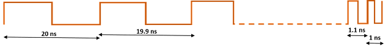
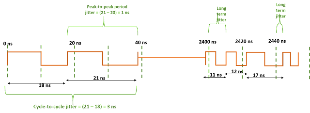

## Clock Jitter

**Clock jitter**: By definition, clock jitter is the deviation of a clock edge from its ideal position in time. Simply  speaking, it is the inability of a clock source to produce a clock with  clean edges. As the clock edge can arrive within a range, the difference between two successive clock edges will determine the instantaneous  period for that cycle. So, clock jitter is of importance while talking  about timing analysis. There are many causes of jitter including PLL  loop noise, power supply ripples, thermal noise, crosstalk between  signals etc. Let us elaborate the concept of clock jitter with the help  of an example:

 A clock source (say PLL) is supposed to provide a clock of frequency 10  MHz, amounting to a clock period of 100 ns. If it was an ideal clock  source, the successive rising edges would come at 0 ns, 100 ns, 200 ns,  300 ns and so on. However, since, the PLL is a non-ideal clock source,  it will have some uncertainty in producing edges. It may produce edges  at 0 ns, 99.9 ns, 201 ns etc. Or we can say that the clock edge may come at any time between (<ideal_time>+- jitter); i.e. 0, between  99-101 ns, between 199-201 ns etc (1 ns is jitter). However, counting  over a number of cycles, average period will come out to be ~100 ns.

 Figure 1 below shows the generic diagram for clock jitter:

 Please note that the uncertainty in clock edge can be for both positive  as well as negative edges (above example showed only for positive  edges). So, there are both full cycle and half cycle jitters. By  convention, clock jitter implies full cycle clock jitter.

**Types of clock jitter**: Clock jitter can be  measured in many forms depending upon the type of application. Clock  jitter can be categorized into cycle-to-cycle, period jitter and long  term jitter.

- **Cycle to cycle jitter**: By definition,  cycle-to-cycle jitter signifies the change in clock period accross two  consecutive cycles. For instance, it will be difference in periods for  1st and 2nd cycles, difference in periods for 10th and 11th cycles etc.  It has nothing to do with frequency variation over time. For instance,  in figure below, the clock has drifted in frequency (from period = 10 ns to period = 1 ns), still maintaining a cycle-to-cycle jitter of 0.1 ns. In other words, if t2 and t1 are successive clock periods, then  cycle_to_cycle_jitter = (t2 - t1).

- **Period jitter**: It is defined as the "deviation of  any clock period with respect to its mean period". In other words, it is the difference between the ideal clock period and the actual clock  period. Period jitter can be specified as either RMS period jitter or  peak-to-peak period jitter.

- - **Peak-to-peak period jitter**: It is defined as the  jitter value measuring the difference between two consecutive edges of  clock. For instance, if the ideal period of the clock was 20 ns, then  for clock shown above, 

  - - for first cycle, peak-to-peak period jitter = (20 - 20) = 0 ns
    - for second cycle, peak-to-peak period jitter = (20 - 19.9) = 0.1 ns
    - for last cyle, peak-to-peak period jitter = (20 - 1) = 19 ns

  - **RMS period jitter**: RMS period jitter is simply the root-mean-square of all the peak-to-peak period jitters available.

- **Long term jitter**: Long term jitter is the deviation of the clock edge from its ideal position. For instance, for a clock  with period 20 ns, ideally, clock edges should arrive at 20 ns, 40 ns  and so on. So, if 10th edge comes at 201 ns, we will say that the long  term jitter for 10th edge is 1 ns. Similarly, 1000th edge will have a  long term jitter of 0.5 ns if it arrives at 20000.5 ns.

 Let us try to understand the difference between all the three kinds of  jitter with the help of an illustrative example waveform below:

