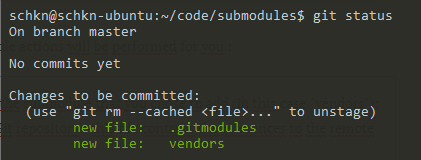

# How To Add and Update Git Submodules

If you are a developer working on a large project, you are probably already familiar with the concept of **Git submodules**.

**Git [submodules](https://git-scm.com/docs/git-submodule)** are most of the time used in order to incorporate another versioned project within an existing project.

Submodules can be used for example in order to store third-party  libraries used by your main project in order to compile successfully.

In order to keep up with the changes made for those third-party libraries, you choose **to include projects as submodules** in your main project.

In this tutorial, we are going to explain **how you can easily add, update and remove Git submodules on your main project.**

We are also going to explain concepts about **Git submodules**, what they are and how they should be worked with on a Git repository.

## Add a Git Submodule

The first thing you want to do is to add a Git submodule to your main project.

**In order to add a Git submodule, use the “git submodule add”  command and specify the URL of the Git remote repository to be included  as a submodule.**


Optionally, you can also **specify the target directory** (it will be included in a directory named as the remote repository name if not provided)

```
$ git submodule add <remote_url> <destination_folder>
```

When adding a Git submodule, your submodule will be staged. As a  consequence, you will need to commit your submodule by using the “git  commit” command.

```
$ git commit -m "Added the submodule to the project."

$ git push
```

 As an example, let’s pretend that you want to add the “project”  repository as a submodule on your project into a folder named “vendors”.

To add “project” as a submodule, you would run the following command at the root of your repository

```
$ git submodule add https://github.com/project/project.git vendors

Cloning into '/home/user/main/project'...
remote: Enumerating objects: 5257, done.
remote: Total 5257 (delta 0), reused 0 (delta 0), pack-reused 5257
Receiving objects: 100% (5257/5257), 3.03 MiB | 3.38 MiB/s, done.
Resolving deltas: 100% (3319/3319), done.
```

When adding a new Git submodule into your project, multiple actions will be performed for you :

- A folder is created in your Git repository named after the submodule that you chose to add (in this case “vendors”);
- [A hidden file](https://devconnected.com/how-to-show-hidden-files-on-linux/) named “**.gitmodules**” is created in your Git repository : this file contains the references  to the remote repositories that you cloned as submodules;
- Your Git configuration (located at .git/config) was also modified in order to include the submodule you just added;
- The submodule you just added are marked as changes to be committed in your repository.



## Pull a Git Submodule

In this section, we are going to see how you can pull a Git submodule as another developer on the project.

Whenever [you are cloning a Git repository](https://devconnected.com/how-to-clone-a-git-repository/) having submodules, you need to execute an extra command in order for the submodules to be pulled.

If you don’t execute this command, you will fetch the submodule folder, but you won’t have any content in it.

**To pull a Git submodule, use the “git submodule update” command with the “–init” and the “–recursive” options.**

```
$ git submodule update --init --recursive
```

Going back to the example we described before : let’s pretend that we are in a complete new Git repository created by our colleague.

In its Git repository, our colleague first starts by cloning the  repository, however, it is not cloning the content of the Git submodule.

To update its own Git configuration, it has to execute the “git submodule update” command.

```
$ git submodule update --init --recursive

Submodule 'vendors' (https://github.com/project/project.git) registered for path 'vendors'
Cloning into '/home/colleague/submodules/vendors'...
Submodule path 'vendors': checked out '43d08138766b3592352c9d4cbeea9c9948537359'
```

As you can see, pulling a Git submodule in our colleague Git repository detached the HEAD at a given commit.

The submodule is always set to have its HEAD detached at a given  commit by default : as the main repository is not tracking the changes  of the submodule, it is only seen as a specific commit from the  submodule repository.

## Update a Git Submodule

In some cases, you are not pulling a Git submodule but you are simply look to update your existing Git submodule in the project.

**In order to update an existing Git submodule, you need to  execute the “git submodule update” with the “–remote” and the “–merge”  option.**

```
$ git submodule update --remote --merge
```

Using the “–remote” command, you will be able to update your existing Git submodules without having to run “git pull” commands in each  submodule of your project.

When using this command, your detached HEAD will be updated to the newest commit in the submodule repository.

Given the example that we used before, when updating the submodule, we would get the following output

```
$ git submodule update --remote --merge

Updating 43d0813..93360a2
Fast-forward
 README.md | 6 +++++-
 1 file changed, 5 insertions(+), 1 deletion(-)
Submodule path 'vendors': merged in '93360a21dc79011ff632b68741ac0b9811b60526'
```

### Fetch new submodule commits

In this section, you are looking to update your Git repository with your commits coming from the submodule repository.

First, you may want to fetch new commits that were done in the submodule repository.

Let’s say for example that you want to fetch two new commits that were added to the submodule repository.

**To fetch new commits done in the submodule repository, head  into your submodule folder and run the “git fetch” command first (you  will get the new submodule commits)**

```
$ cd repository/submodule 

$ git fetch
```

Now, if you run the “git log” command again, you will be able to see the new commits you are looking to integrate.

```
$ git log --oneline origin/master -3

93360a2 (origin/master, origin/HEAD) Second commit
88db523 First commit
43d0813 (HEAD -> master) Initial commit
```

Now, in order for your submodule to be in-line with the newest  commits, you can run the “git checkout” command and specify the SHA that you want to update your submodule to (in this case 93360a2)

```
$ git checkout -q 93360a2
```

Great! Your HEAD is now aligned with the newest commits from the submodule repository.

You can now go back to your main repository and commit your changes for other developers to fetch those new commits.

```
$ cd repository

$ git add .

$ git commit -m "Added new commits from the submodule repository"

$ git push
```

## Remove Git submodules

In this section, we are going to see how you can effectively remove a Git submodule from your repository.

**In order to remove a Git submodule from your repository, use  the “git submodule deinit” command followed by the “git rm” command and  specify the name of the submodule folder.**

```
$ git submodule deinit <submodule>

$ git rm <submodule>
```

When executing the “git submodule deinit” command, you will delete the local submodule configuration stored in your repository.

As a consequence, the line referencing the submodule will be **deleted** from your .git/config file.

The “git rm” command is used in order to delete submodules files from the working directory and remaining .git folders.

## Configuring submodules for your repository

In some cases, you may want to have additional logging lines whenever you are executing “git status” commands.

Luckily for you, there are configuration properties that you can tweak in order to have more information about your submodules.

### Submodule summary

**In order to have a submodule summary when executing “git  status”, execute the “git config” command and add the  “status.submoduleSummary” option.**

```
$ git config --global status.submoduleSummary true
```

As a consequence, you will be presented with more information when executing “git status” commands.

```
$ git status
On branch master
Your branch is up-to-date with 'origin/master'.
Changes to be committed:
  (use "git reset HEAD <file>..." to unstage)

  new file:   .gitmodules
  new file:   <submodule>

Submodule changes to be committed:

* <submodule> 0000000...ae14a2 (1):
  > Change submodule name
```

### Detailed diff for submodules

If you configured your Git to have the submodule summary as explained in the previous section, you should now have a customized way to see  differences between submodules.

However, in some cases, you want to get more information about the commits that might have been done in your submodules folder.

**For the “git diff” command to have detailed information about your submodules, use the “git config” command with the “diff.submodule” parameter set to true.**

```
$ git config --global diff.submodule log
```

Now, whenever you are executing the [“git diff” command](https://devconnected.com/how-to-compare-two-git-branches/), you will be able to see the commits that were done in the submodules folder.

```
$ git diff

Submodule <submodule> 0000000...ae14a2:
  > Submodule commit n°1
  > Submodule commit n°2
```

## Conclusion

In this tutorial, you learnt what submodules are and how you can use  them in order to have external repositories in your main project  repository.

You also learnt that it is possible **to add and update Git submodules** using the dedicated “git submodule” commands : “**git submodule add**” and “**git submodule update**“.

Finally, you have seen that it is possible to tweak your Git  configuration in order to get more information about your Git  repository.

If you are interested about Git or about software engineering in  general, we have a complete section dedicated to it on the website, so  make sure to check it out!


# How to create git submodule from repository subdirectory

This tutorial explains how to extract a subdirectory of a git  repository and how to make it a submodule or an independent git  repository in 8 easy steps.


## Problem

If you work with git repositories it’s probably only a matter of time until you’ll need/want to refactor them in order to share some parts or to create new repositories.

For example you have a repository with a layout similar to this one:

```
Project/
|---- data/
|---+ src/
    |---- app/
    |---+ libs/
        |---- Library1/
        |---- ...
        |---- LibraryN/
```

maybe at some point you’ll want to make *Library1* an independent git repository to share it with other projects preserving its previous history.

A pretty easy way to achieve this is using git filter branch and git sumbmodule as explained in the next section.

## From repository subdirectory to git submodule

The following steps are based on the repository introduced in the  previous section.They will explain how to turn a subdirectory of  a project into an independent git repository and how to use this new  repository as submodule, a foreign repository embedded within a  dedicated subdirectory of the source tree of a project.

### **1- CREATE A NEW REPOSITORY**

 The first thing to do is creating a new empty repository for *Library1*. The following instructions assume that you are doing this on some server from the shell.

```
cd /path/to/git/repos/
mkdir Library1.git
cd Library1.git
git init --bare
```

here */path/to/git/repos/* is the directory storing all the git repositories on your server.

### **2- CLONE Project REPOSITORY**

 The second step is cloning the *Project* repository to work on a new copy.

```
git clone git@REMOTE_URL:/path/to/git/repos/Project.git
```

### **3- FILTER SUBDIRECTORY**

 Now it’s time to rewrite the repository to look as if *Library1/* had been its project root, and discard all other history.

```
git filter-branch --subdirectory-filter src/libs/Library1 -- --all
```

### **4- REPLACE ORIGIN**

 As we are working on a clone of *Project*, *origin* is still pointing to the remote repository of *Project*. We want to remove that and make *origin* point to the new remote repository of *Library1*.

```
git remote rm origin
git remote add origin git@REMOTE_URL:/path/to/git/repos/Library1.git
```

### **5- PUSH FILES TO REMOTE REPOSITORY**

Then we can push all the *Library1* files and populate its remote repository.

```
git push origin master
```

At this point *Library1* is an independent git repository.

### **6- DELETE Library1 FROM Project**

It’s time to remove the *Library1/* directory from *Project* as we’re going to replace it with a submodule.

Go into the root directory of *Project* and type the following commands:

```
git rm -r src/libs/Library1/
git commit -m "Removed Library1 directory to replace it with submodule."
```

### **7- ADD Library1 AS SUBMODULE**

Now we can add *Library1* as a submodule from the root directory of *Project*:

```
git submodule add git@REMOTE_URL:/path/to/git/repos/Library1.git src/libs/Library1
```

### **8- COMMIT AND PUSH CHANGES**

Finally we can commit and push our changes

```
git commit -m "Replaced Library1 directory with submodule."
git push origin master
```

## References

If you want to know more about the commands and concepts discussed in this tutorial you can check out the following resources:

- [Git on the server – Setting up the server](http://git-scm.com/book/en/v2/Git-on-the-Server-Setting-Up-the-Server)
- [Git tools – Submodules](http://git-scm.com/book/en/v2/Git-Tools-Submodules)
- [git-filter-branch](http://git-scm.com/docs/git-filter-branch)
- [git-remote](http://git-scm.com/docs/git-remote)
- [git-submodule](http://git-scm.com/docs/git-submodule)