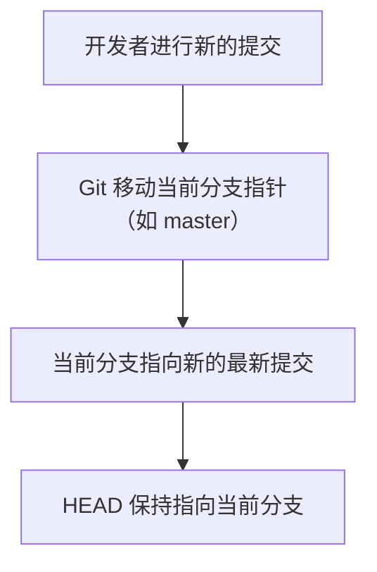
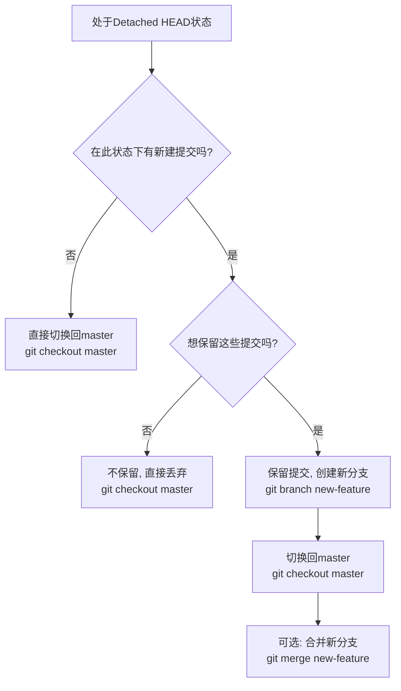
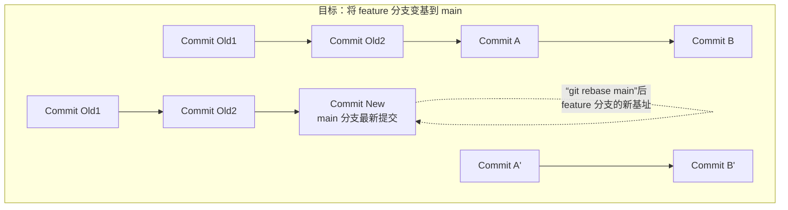

# Git QA


<!-- vim-markdown-toc GFM -->

* [git head 与master的区别](#git-head-与master的区别)
    * [1. Master (或 Main)](#1-master-或-main)
    * [2. HEAD](#2-head)
    * [它们之间的关系与工作方式](#它们之间的关系与工作方式)
    * [如何查看它们？](#如何查看它们)
    * [总结对比表](#总结对比表)
* [怎样将deattached head 重新指向master](#怎样将deattached-head-重新指向master)
    * [情况一：你没有在 Detached HEAD 状态下做任何提交（只是想回到 master）](#情况一你没有在-detached-head-状态下做任何提交只是想回到-master)
    * [情况二：你在 Detached HEAD 状态下做了新的提交（并想保留这些提交）](#情况二你在-detached-head-状态下做了新的提交并想保留这些提交)
        * [方法 A：创建新分支并切换回 master（推荐）](#方法-a创建新分支并切换回-master推荐)
        * [方法 B：直接让 master 分支指向这些新提交](#方法-b直接让-master-分支指向这些新提交)
    * [总结与操作流程图](#总结与操作流程图)
* [git 删除一个branch](#git-删除一个branch)
    * [1. 删除本地分支 (Local Branch)](#1-删除本地分支-local-branch)
        * [基本命令：](#基本命令)
        * [强制删除（无论合并状态）：](#强制删除无论合并状态)
    * [2. 删除远程分支 (Remote Branch)](#2-删除远程分支-remote-branch)
        * [基本命令：](#基本命令-1)
    * [操作步骤示例](#操作步骤示例)
    * [常用查看命令](#常用查看命令)
    * [总结](#总结)
* [git rebase 用法示例](#git-rebase-用法示例)
    * [核心概念：Rebase 是什么？](#核心概念rebase-是什么)
    * [场景一：保持特性分支更新（最常用）](#场景一保持特性分支更新最常用)
    * [场景二：交互式 Rebase（整理提交历史）](#场景二交互式-rebase整理提交历史)
    * [场景三：解决“黄金法则”被打破后的问题](#场景三解决黄金法则被打破后的问题)
    * [总结](#总结-1)
* [理解与解决 Git Detached HEAD 状态](#理解与解决-git-detached-head-状态)
    * [为什么会发生 Detached HEAD？](#为什么会发生-detached-head)
    * [如何识别 Detached HEAD 状态](#如何识别-detached-head-状态)
    * [解决方案](#解决方案)
        * [情况一：你没有做任何提交（只是想回到分支）](#情况一你没有做任何提交只是想回到分支)
        * [情况二：你做了提交并想保留它们](#情况二你做了提交并想保留它们)
            * [选项 A：创建新分支保留更改](#选项-a创建新分支保留更改)
            * [选项 B：直接使用 checkout 创建并切换到新分支](#选项-b直接使用-checkout-创建并切换到新分支)
        * [情况三：你做了提交但想丢弃它们](#情况三你做了提交但想丢弃它们)
    * [预防 Detached HEAD](#预防-detached-head)
    * [总结](#总结-2)

<!-- vim-markdown-toc -->


## git head 与master的区别

这是一个非常经典的 Git 初学者问题。简单来说，**`HEAD` 和 `master` 是两种完全不同性质的东西**。

让我用一个比喻来开始：

- **`master`** 就像一条街道的名字（比如“主街”）。
- **`HEAD`** 就像是你这个人。当你站在“主街”上时，`HEAD` 就指向 `master`。但你也可以走到其他街道（比如 `develop` 分支）上，那时 `HEAD` 就指向 `develop`。

下面我们来详细分解它们的区别。


### 1. Master (或 Main)

- **它是什么？** **一个分支（Branch）的名字**。
- **它的作用？** 在 Git 中，`master` 是当你初始化一个新仓库时（`git init`），Git 默认为你创建的第一个分支的名称。近年来，出于文化包容性的考虑，许多社区和平台（如 GitHub）将默认分支名改为了 `main`，但它们的作用完全相同。
- **它的意义？** 它通常被用作项目的主分支，代表项目的稳定、可发布的版本。但这只是一个约定俗成的习惯，并非 Git 的技术要求。
- **特点：**
  - 它是一个**指针**，指向该分支上最新的一次提交（commit）。
  - 它的名字是可以改变的，甚至可以被删除（当然不推荐删除主分支）。
  - 你可以有无数个其他分支（如 `develop`, `feature/login`），`master` 只是其中之一。

### 2. HEAD

- **它是什么？** 一个**特殊的指针**。
- **它的作用？** **它指向你当前正在工作的分支（branch）或提交（commit）**。你可以把它理解成“你当前在哪儿”的指针。
- **它的意义？** Git 通过 `HEAD` 知道你的下一次提交应该附加到哪个分支上。几乎所有 Git 命令（如 `git commit`, `git status`）的行为都和 `HEAD` 的位置息息相关。
- **特点：**
  - 它通常指向一个分支的名字（例如 `ref: refs/heads/master`），而不是直接指向一个提交。
  - 当 `HEAD` 指向一个分支时，我们称其为 **“已附加”（Attached）** 状态。这是正常的工作状态。
  - 当 `HEAD` 直接指向某个提交的哈希值（Hash）而不是分支时，我们称其为 **“分离头指针”（Detached HEAD）** 状态。这是一种临时状态，常用于查看历史版本。

### 它们之间的关系与工作方式

最核心的关系是：**在正常情况下，`HEAD` 指向 `master`（或你当前切换到的任何其他分支），而 `master` 指向该分支最新的一次提交。**

这个过程可以用下图清晰地展示：




举个例子：

1. 你初始化一个仓库，默认在 `master` 分支。
   - `HEAD` 指向 `master`。
   - `master` 指向初始提交（假设哈希为 `a1b2c3d`）。
   - 状态：`HEAD -> master -> (a1b2c3d)`
2. 你进行一次新的提交（`git commit`）。
   - Git 会创建一个新的提交（假设哈希为 `e4f5g6h`）。
   - 因为 `HEAD` 指向 `master`，所以 Git 会将 `master` 分支的指针移动到新的提交 `e4f5g6h`。
   - `HEAD` 本身不动，它依然指向 `master`。
   - 新状态：`HEAD -> master -> (e4f5g6h)`
3. 你创建并切换到一个新分支 `feature`（`git checkout -b feature`）。
   - `HEAD` 现在指向了 `feature` 分支。
   - `master` 保持不变，仍然指向 `e4f5g6h`。
   - 状态：`HEAD -> feature -> (e4f5g6h)` 和 `master -> (e4f5g6h)`
4. 你在 `feature` 分支上提交。
   - 新的提交会产生（假设哈希为 `i7j8k9l`）。
   - `feature` 指针会移动到 `i7j8k9l`。
   - `HEAD` 依然指向 `feature`。
   - `master` 依然指向 `e4f5g6h`，纹丝不动。
   - 新状态：`HEAD -> feature -> (i7j8k9l)` 和 `master -> (e4f5g6h)`

### 如何查看它们？

- **查看 HEAD 指向哪里：**
  - `git log -1` 查看最新提交信息，开头第一行就会显示 `commit ... (HEAD -> master)`，这表示 HEAD 指向 master。
  - `git status` 命令的第一行也会显示：`On branch master`，这表示你当前在 master 分支，即 HEAD 指向 master。
  - `cat .git/HEAD` 这个命令会直接输出 HEAD 文件的内容（例如 `ref: refs/heads/master`）。
- **查看 master 指向哪个提交：**
  - `git log master` 查看 master 分支的提交历史。
  - `git show-ref master` 显示 master 分支对应的最新提交哈希值。

### 总结对比表

| 特性         | HEAD                           | Master (或 Main)                           |
| ------------ | ------------------------------ | ------------------------------------------ |
| **本质**     | **特殊指针**                   | **分支指针**                               |
| **代表什么** | **你当前的工作位置**           | **主分支的最新状态**                       |
| **是否可变** | **随时变化**（当你切换分支时） | **变化较慢**（只在向它合并或提交时变化）   |
| **关系**     | **指向**当前所在的分支         | **被 HEAD 指向**（当你在 master 分支上时） |
| **默认名称** | 永远叫 `HEAD`                  | 传统叫 `master`，现在常用 `main`           |

**一句话总结：`HEAD` 是你“当前所在的位置”，而 `master` 是“一条名为主分支的街道”。大多数时候，你这个人（`HEAD`）正站在这条主街道（`master`）上。**


## 怎样将deattached head 重新指向master

将脱离的 HEAD（Detached HEAD）重新指向 `master` 分支是一个很常见的操作。解决方法取决于你在脱离状态下**是否创建了新的提交**。

### 情况一：你没有在 Detached HEAD 状态下做任何提交（只是想回到 master）

这是最简单的情况。你只是用 `git checkout <某个提交号>` 查看历史版本，现在想回到最新状态。

**解决方法：直接切换回 `master` 分支即可。**

```bash
git checkout master
```


这条命令会做两件事：

1. 将 **HEAD** 从指向一个具体的提交哈希值，重新指回指向 `master` 分支。
2. 将你的工作目录更新为 `master` 分支最新的文件状态。

### 情况二：你在 Detached HEAD 状态下做了新的提交（并想保留这些提交）

这是关键情况。你在查看旧版本后，心血来潮修改了一些文件并执行了 `git commit`。Git 会提示你：

```text
You are in 'detached HEAD' state. You can look around, make experimental
changes and commit them, and you can discard any commits you make in this
state without impacting any branches by performing another checkout.
...
```


现在你的提交历史看起来像这样（可通过 `git log --oneline --graph --all` 查看）：

```text
* (HEAD) 4a4b4c4 在分离头指针状态下做的提交
| 
*   1a2b3c4 之前的某个提交
| /
* (master) e4f5g6h  master 分支的最新提交
```


这些新提交（如 `4a4b4c4`）不属于任何分支，只有 `HEAD` 指向它们。如果你直接 `git checkout master`，这些提交将会被 Git 的垃圾回收机制在一段时间后删除，从而**丢失**。

**如果你想保留这些提交，你需要创建一个新的分支来“抓住”它们。**

你有两种主要方法：

#### 方法 A：创建新分支并切换回 master（推荐）

这个方法会明确地创建一个新分支来保存你的工作，然后再与主分支合并。

1. **从当前分离的 HEAD 创建一个新分支**（比如叫 `new-feature`）。这个新分支的起点就是你最新的那个提交。

```bash
git branch new-feature
```


**切换回 `master` 分支。**

```bash
git checkout master
```


现在，你的 `HEAD` 已经安全地重新指向了 `master`，并且你的提交都保存在了 `new-feature` 分支上。

**（可选）如果你希望将新分支的工作合并到 master，现在可以执行合并。**

```bash
git merge new-feature
```


#### 方法 B：直接让 master 分支指向这些新提交

这个方法使用 `reset` 命令，**强制让 `master` 分支指向你最新的提交**。**请谨慎使用**，尤其是不推荐在公共分支上这么做，因为它会重写历史。

1. 首先，确保你仍在 Detached HEAD 状态，并且位于你想保留的最新提交上。
2. 执行以下命令，将 `master` 分支指针强制移动到当前 HEAD 所指向的提交：

```bash
git checkout -B master
```


`git checkout -B <branch>` 命令的意思是：强制重置 `<branch>` 分支到当前 HEAD，并切换过去。

**警告：** 方法 B 会改变 `master` 分支的历史。如果这个 `master` 分支已经推送到了远程仓库（如 GitHub），你下次推送时需要使用 `git push --force`，这可能会给其他协作者带来麻烦。因此，**方法 A 通常是更安全、更推荐的做法**。

### 总结与操作流程图

面对 Detached HEAD 状态，遵循以下决策流程可以安全地处理：



记住最关键的一点：**在 Detached HEAD 状态下做的提交，必须用一个分支名来“记住”它们，否则它们最终会丢失。**


## git 删除一个branch

在 Git 中删除一个分支是一个常见操作。删除分支分为**删除本地分支**和**删除远程分支**两种场景。

### 1. 删除本地分支 (Local Branch)

**警告：** 你不能删除当前所在的分支。在删除一个分支前，请先切换到其他分支（例如 `git checkout master` 或 `git switch main`）。

#### 基本命令：

```bash
git branch -d <branch_name>
```


- `-d` 选项是 `--delete` 的缩写，它会执行一个**安全删除**。
- Git 会检查你想要删除的分支是否已经**完全合并**到了当前分支（通常是 `main` 或 `master`）。
- 如果该分支的代码还没有被合并，Git 会阻止你删除，并给出错误提示，以避免工作丢失。

#### 强制删除（无论合并状态）：

如果你确定要删除一个未合并的分支，**并且愿意丢失该分支上的所有工作**，你可以使用 `-D` 选项（大写 D）进行强制删除。

```bash
git branch -D <branch_name>
```


- `-D` 选项是 `--delete --force` 的缩写，它会跳过合并检查，直接删除分支。

------

### 2. 删除远程分支 (Remote Branch)

删除远程分支（例如在 GitHub, GitLab 等上的分支）的命令语法有所不同。

#### 基本命令：

```bash
git push <remote_name> --delete <branch_name>
```

通常，你的远程仓库默认名称是 `origin`，所以命令最常这样写：

```bash
git push origin --delete <branch_name>
```


你也可以使用这种更短的格式，效果相同：

```bash
git push origin :<branch_name>
```


**例如**，要删除远程名为 `feature/login` 的分支：

```bash
git push origin --delete feature/login
# 或者
git push origin :feature/login
```

### 操作步骤示例

假设你有一个本地分支 `fix-bug` 和一个对应的远程分支 `origin/fix-bug`，你现在想删除它们。

1. **首先，切换到另一个分支**（确保你不在要删除的分支上）：

```bash
git checkout main
# 或者使用更新的 git switch 命令
git switch main
```


2. **删除本地分支 `fix-bug`**：

```bash
# 安全删除（如果分支已合并）
git branch -d fix-bug

# 如果未合并，强制删除
git branch -D fix-bug
```

3. **删除远程分支 `origin/fix-bug`**：

```bash
git push origin --delete fix-bug
```


------

### 常用查看命令

- **查看所有本地分支**：`git branch`
- **查看所有远程分支**：`git branch -r`
- **查看所有本地和远程分支**：`git branch -a`

### 总结

| 操作场景                 | 命令                                       | 注意事项                                  |
| ------------------------ | ------------------------------------------ | ----------------------------------------- |
| **删除本地分支（安全）** | `git branch -d <branch_name>`              | 分支必须已合并，否则操作失败。            |
| **删除本地分支（强制）** | `git branch -D <branch_name>`              | **强制删除**，即使未合并也会丢失代码。    |
| **删除远程分支**         | `git push <remote> --delete <branch_name>` | 需要删除权限，远程仓库名通常是 `origin`。 |

**核心原则：** 在删除分支前，**确保你不再需要这个分支上的任何代码**，尤其是使用强制删除 `-D` 时。删除远程分支会影响你的所有协作者。


## git rebase 用法示例

`git rebase` 是 Git 中最强大也最需要谨慎使用的命令之一。它的核心作用是**改变一系列提交的基址**，从而可以创造出更清晰、线性的项目历史。

### 核心概念：Rebase 是什么？

想象提交历史是一棵正在生长的树。`merge` 会创建一个新的合并提交，把两个分支连接起来，像是一个"Y"形路口。而 `rebase` 则是把你当前分支上的所有提交都“拔下来”，然后以另一个分支的最新状态为“基址”，重新“嫁接”上去，使历史变成一条直线。

**黄金法则：只对尚未推送到远程仓库的本地提交进行 rebase。不要 rebase 公共分支（如 master/main）上的提交。**

### 场景一：保持特性分支更新（最常用）

你从 `main` 分支切出了一个特性分支 `feature` 进行开发。与此同时，`main` 分支也有其他人推送了新的提交。你希望让你的 `feature` 分支包含 `main` 的最新改动，并且历史看起来是线性的。

**合并（Merge）的方式**：`git merge main` 会创建一个额外的合并提交。

**变基（Rebase）的方式**：

1. 首先，确保你在特性分支上。


```bash
git checkout feature
# 或者使用更新的 git switch
git switch feature
```


2. 执行 rebase 命令，将 `main` 分支的新提交作为新的基址。

```bash
git rebase main
```


3. 这个命令的执行过程是：

   - Git 会找到当前分支 (`feature`) 和基分支 (`main`) 的公共祖先。

   - **临时保存**当前分支 (`feature`) 上从公共祖先之后的所有提交所带来的差异。

   - 将当前分支指针**重置**到 `main` 分支的最新提交（快进）。

   - 将之前保存的差异提交，**一个一个地**重新应用到当前分支的顶端。

  4. **(可选) 如果出现冲突**：Rebase 过程中可能会发生冲突，因为你的修改和 `main` 分支的修改可能在同一处。

        - Git 会暂停 rebase 过程，并提示你解决冲突。

        - 解决冲突后，用 `git add <file>` 标记冲突已解决。

        - 然后执行 `git rebase --continue` 继续剩下的操作。

        - 如果你想放弃这次 rebase，可以执行 `git rebase --abort`，一切都会恢复到 rebase 之前的状态。


**结果**：`feature` 分支的历史现在看起来像是直接从最新的 `main` 分支开始开发的，历史是一条干净的直线。

这个过程的核心步骤可以可视化如下：



### 场景二：交互式 Rebase（整理提交历史）

这是 rebase 更强大的功能。你可以**修改、合并、删除、重新排序过去的提交**。常用于在将本地分支推送到远程前，整理自己的提交历史，使其更清晰。

**示例**：你刚刚在本地完成了功能开发，有 4 个提交，但你想把它们合并成 1 个清晰的提交。

1. 启动交互式 rebase。`HEAD~4` 表示对最新的 4 个提交进行操作。

```bash
git rebase -i HEAD~4
# 或者指定具体的提交哈希值
# git rebase -i a1b2c3d
```

2. 这会打开一个文本编辑器（如 Vim, VSCode），列出你的提交和一些操作命令：

```bash
pick a1b2c3d Add new user login function
pick b2c3d4e Fix typo in login page
pick c3d4e5f Refactor user authentication code
pick d4e5f6a Update login test cases

# Rebase xxxxxx..xxxxxx onto xxxxxx (4 commands)
#
# Commands:
# p, pick <commit> = use commit (使用提交，即保留)
# r, reword <commit> = use commit, but edit the commit message (使用提交，但修改提交信息)
# e, edit <commit> = use commit, but stop for amending (使用提交，但暂停以修改提交内容)
# s, squash <commit> = use commit, but meld into previous commit (使用提交，但将其合并到前一个提交中)
# f, fixup <commit> = like "squash", but discard this commit's log message (类似 squash，但丢弃本次提交的日志信息)
# d, drop <commit> = remove commit (删除提交)
```

假设我们想：

- 保留第一个提交 (`pick`)
- 将第二个提交（拼写修复）合并到第一个里，并且不保留它的日志 (`fixup`)
- 重新编辑第三个提交的信息 (`reword`)
- 将第四个提交合并到第三个里 (`squash`)

我们将文件修改为：

```bash
pick a1b2c3d Add new user login function
f b2c3d4e Fix typo in login page
r c3d4e5f Refactor user authentication code
s d4e5f6a Update login test cases
```


Git 会根据你的指令执行：

- 在执行到 `reword` 操作时，会再次打开编辑器让你输入新的提交信息。
- 在执行到 `squash` 操作时，会再次打开编辑器让你将两个提交的信息合并为一个。

完成后，使用 `git log` 查看，你会发现凌乱的 4 个提交变成了清晰的 2 个（或更少）提交。

### 场景三：解决“黄金法则”被打破后的问题

如果不小心对已经推送到远程的分支执行了 rebase，你的本地历史会和远程历史不一致。直接 `git push` 会被拒绝。

**解决方法**：必须使用强制推送 (`--force-with-lease`)，但请**务必谨慎**，并确保只有你一人在这个分支上工作。

```bash
git push origin feature --force-with-lease
# 比 --force 更安全，它会检查远程分支是否有你不知道的新提交，如果有则推送失败。
```


**再次警告：** 强制推送会**重写远程仓库的历史**。如果其他人已经基于这个旧历史进行了工作，他们的工作会被彻底打乱。所以，请严格遵守 **“只 rebase 本地提交”的黄金法则**。


### 总结

| 场景             | 命令                          | 目的                                                         |
| ---------------- | ----------------------------- | ------------------------------------------------------------ |
| **更新特性分支** | `git rebase <base_branch>`    | 将当前分支的提交“嫁接”到目标分支的最新提交上，保持历史线性。 |
| **整理提交历史** | `git rebase -i <commit>`      | 交互式地修改、合并、删除提交，创造更清晰的提交记录。         |
| **强制推送**     | `git push --force-with-lease` | **谨慎使用！** 在 rebase 了已推送的提交后，用此命令覆盖远程历史。 |

**Rebase  vs.  Merge**

- **Rebase**：追求干净、线性的提交历史。**更适合整理本地分支的提交**。
- **Merge**：保留所有的历史上下文和实际发生的事件流。**更适合集成公共分支的更新**（例如将 `feature` 合并回 `main`）。


## 理解与解决 Git Detached HEAD 状态

当 Git 显示 "HEAD detached from..." 时，表示你处于"分离头指针"状态。这是一种特殊状态，意味着 HEAD 指针没有指向任何分支引用，而是直接指向了某个具体的提交。

### 为什么会发生 Detached HEAD？

通常发生在以下情况：

1. 直接检出一个特定的提交哈希值：`git checkout a1b2c3d`
2. 检出一个标签：`git checkout v1.0.0`
3. 检出远程分支而没有创建本地分支：`git checkout origin/feature`
4. 使用相对引用检出一个提交：`git checkout HEAD~3`

### 如何识别 Detached HEAD 状态

1. 运行 `git status`，你会看到类似这样的提示：


```text
HEAD detached at a1b2c3d
```


运行 `git branch`，当前分支前不会有星号标记，或者你会看到类似：

```text
* (HEAD detached at a1b2c3d)
  main
  feature
```


### 解决方案

根据你是否在分离状态下做了提交，有不同的解决方法：

#### 情况一：你没有做任何提交（只是想回到分支）

如果你只是查看历史版本，没有做任何修改，直接切换回分支即可：


```bash
# 切换到主分支（或任何其他分支）
git checkout main

# 或者使用更新的 git switch 命令
git switch main
```


#### 情况二：你做了提交并想保留它们

如果你在分离状态下做了提交并想保留这些工作：

##### 选项 A：创建新分支保留更改

1. 从当前分离状态创建一个新分支：

```bash
git branch new-branch-name
```

切换到该分支（或直接切换到主分支）：


```bash
git checkout new-branch-name
# 或
git checkout main
```

（可选）如果你希望将新分支合并到主分支：


```bash
git checkout main
git merge new-branch-name
```

##### 选项 B：直接使用 checkout 创建并切换到新分支

更简洁的方式是一步完成创建和切换：


```bash
git checkout -b new-branch-name
```


#### 情况三：你做了提交但想丢弃它们

如果你在分离状态下做了提交但不想要这些更改：


```bash
# 直接切换回主分支，丢弃所有分离状态下做的提交
git checkout main
```


Git 会警告你正在离开未链接的提交，这些提交最终会被垃圾回收机制删除。

### 预防 Detached HEAD

1. 当检出远程分支时，总是创建本地跟踪分支：


```bash
# 不要这样做（会导致分离头指针）：
git checkout origin/feature

# 应该这样做：
git checkout -t origin/feature
# 或
git checkout -b feature origin/feature
```


使用相对引用时，确保最终会回到分支：


```bash
# 查看前一个提交但不保持分离状态
git checkout HEAD~1
# 然后立即回到分支
git checkout -
```


使用 `git switch` 命令（Git 2.23+），它比 `git checkout` 更明确，能减少意外进入分离状态的可能：


```bash
# 切换分支
git switch main

# 创建并切换新分支
git switch -c new-branch
```


### 总结

Detached HEAD 状态是 Git 的正常功能，用于查看历史提交。要解决它：

- 如果没有重要更改，直接切换回分支
- 如果有要保留的更改，创建新分支保存它们
- 使用 `git switch` 命令可以减少意外进入此状态的概率

记住黄金法则：**只对尚未共享的本地提交进行这类操作**。如果你已经将分支推送到远程仓库，避免使用可能重写历史的方法。
