# [What is RS232 Protocol and How it Works? - Codrey Electronics](https://www.codrey.com/embedded-systems/rs232-serial-communication/)

Historically, **RS232 Communication protocol** is an old [serial communication](https://www.codrey.com/embedded-systems/serial-communication-basics/) protocol developed by EIA (Electronics Industry Alliance)/TIA  (Telecommunications Industry Association)-232 in the year 1962. Modern  hardware designs use innovative serial communication protocols like USB, Ethernet, and Wi-Fi. But still, RS232 has proven to be prominent. The  reason is, RS232 signals spread over longer distances when compared to  I2C and serial TTL signals. Moreover, it has better noise immunity. It  is proven to be compatible across different manufacturers for  interfacing computer and modems.

## What is RS232 Protocol?

In RS232, ¡®RS¡¯ stands for Recommended Standard. It defines the serial communication using DTE and DCE signals. Here, DTE refers to Data  Terminal Equipment and DCE refers to the Data Communication Equipment.  Example of DTE device is a computer and DCE is a modem. Formally, it is  specified as the interface between DTE equipment and DCE equipment using serial binary data exchange.

[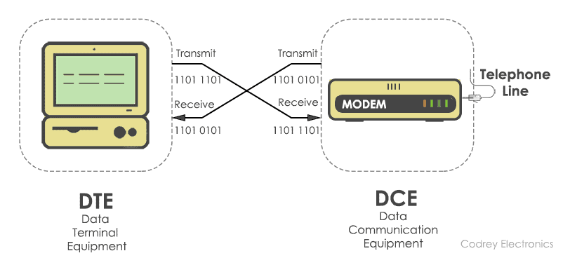](https://www.codrey.com/wp-content/uploads/2017/09/Communication-between-DTE-and-DCE.png)

Communication between DTE and DCE

The DTE (computer) transmits the information serially to the other  end equipment DCE (modem). In this case, DTE sends binary data  ¡°11011101¡± to DCE and DCE sends binary data ¡°11010101¡± to the DTE  device.

RS232 describes the common voltage levels, electrical standards,  operation mode and number of bits to be transferred from DTE to DCE.  This standard is used for transmission of information exchange over the  telephone lines.

## Electrical Standards

The electrical specifications for RS232 are updated in the year 1969. It specifies the electrical voltages, slew rate, line impedance,  operation mode, and baud rate.

**Voltage Levels**

The line voltages of RS232 range from -25V to +25V. They are categorized as signal voltage and control voltage.

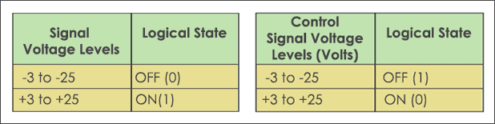

RS232 Voltage Levels

The signal voltage between +3V to +25V represents logic ¡®1¡¯ and the  signal voltages between -3V to -25V represents logic ¡®0¡¯. Whereas the  control voltage signals use negative logic, i.e., logic ¡®1¡¯ indicates -3 to -25 volts and logic ¡®0¡¯ indicates +3V to +25V. The voltage from -3V  to +3V is considered as an indeterminate state.

**Slew Rate** 

The change of input voltage determines the rate at which the **RS232 driver** responds. This is often termed as slew rate. The RS232 standard  maintains a minimum slew rate with slow rise and fall time to reduce the cross-talk between neighbouring signals. Normally, the maximum slew  rate allowed is 30V/?sec.

**Line Impedance** 

The impedance bridging between RS232 driver and the receiver is  defined to maximize the voltage transfer between the transmitter and  receiver. It is in the range of 3K? to 7K?.

**Mode of Operation** 

The RS232 devices work on **single-ended signaling**  (two wire). This means one wire transmits an altering voltage and  another wire is connected to ground. Single-ended signals are affected  by the noise induced by differences in ground voltages of the driver and receiver circuits. The advantage of the single-ended technique is, it  requires fewer wires to transmit information.

**Baud rate**

It is the number of binary bits transferred per second. RS232  supports baud rates from 110 to 230400. Commonly, the baud rate with  1200, 4800, 9600, 115200 are used. It determines the speed at which data is to be sent from the transmitter to the receiver.

**Note:** The baud rate has to be same at both the transmitter side and receiver side.

## Communication Interface

RS232 determines the communication between the DTE and DCE using DB9  and DB25 connectors. The D-sub connectors (DB9, DB25) comes with male  and female cable. DB9 connector has 9 pins and DB25 connector has 25  pins with each pin having its own function.

[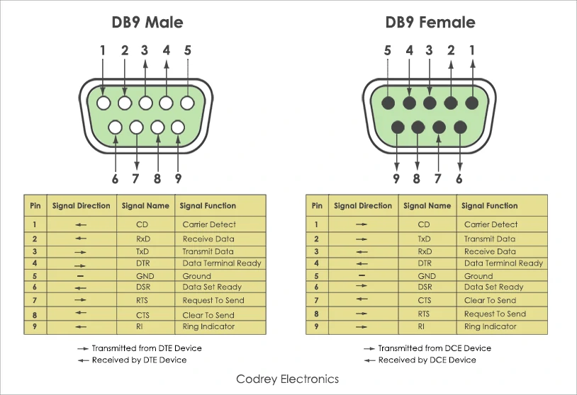](https://www.codrey.com/wp-content/uploads/2017/09/DB9-Male-and-Female-Pinouts.png)

DB9 Male and Female Pinouts

[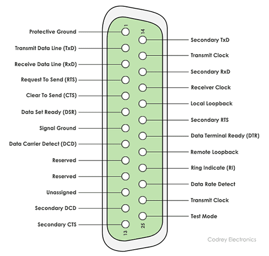](https://www.codrey.com/wp-content/uploads/2017/09/DB25-Pinout.png)

DB25 Pinout

#### Functional Description

Apart from the electrical characteristics, RS232 defined the  functions of signals that are used in the serial interface. Some of them are common ground, Data, control and timing signals. Here is a list of  signals used in RS232 pinout.

| Signal Name               | Function                                                     |
| ------------------------- | ------------------------------------------------------------ |
| Protective Ground         | This signal is connected to chassis ground of metallic connector. |
| Common Ground             | Zero reference voltage level for all the control signals.    |
| TxD (Transmit Pin)        | To transmit data from DTE to DCE.                            |
| RxD (Receive Pin)         | Sends data from DCE to DTE.                                  |
| DTR (Data Terminal Ready) | DTE is ready to accept request.                              |
| DCD (Data carrier Detect) | DCE accepts a carrier from a DTE located at remote location. |
| DSR (Data Set Ready)      | DCE is prepared to send and receive the information.         |
| RI (Ring Indicator)       | Detects the incoming ring tone on the telephone line.        |
| RTS (Request to Send)     | DTE call for DCE to send the data.                           |
| RTR (Ready to Receive)    | DTE is geared up to receive data coming from DCE.            |
| CTS (Clear To Send)       | DCE is in a ready state to accept data coming from DTE.      |

Other than above signals, (primary signals) RS232 provides secondary  signals such as secondary DTE, secondary RTS, secondary DCD, secondary  TxD and secondary RxD for optional connection of DTE and DCE.

## Types of Serial Cables

To make [serial communication](https://www.codrey.com/embedded-systems/serial-communication-basics/) possible between DTE and DCE, two types of RS232 cables exist. They are Null modem and Straight-cable. In **null modem cable**, the TX (Transmitter) pin of the male connector is linked up with the RX (Receiver) pin of the female and the RX pin of the male is connected to TX pin of the female.

[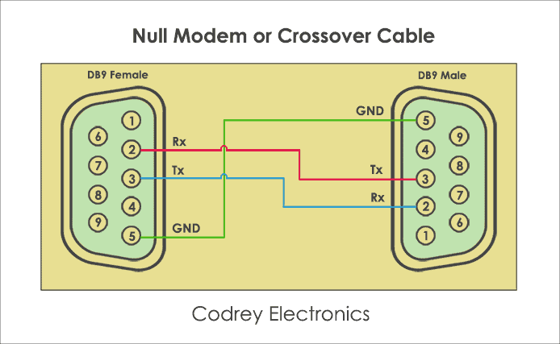](https://www.codrey.com/wp-content/uploads/2017/09/Null-Modem-or-Crossover-Cable.png)

Null Modem or Crossover Cable

Next one, is the **Straight-through cable**. As the name implies, it is a one to one connector, i.e. a transmit pin of one  device is connected to transmit pin of another device and receiver pin  of one device is connected to receiver pin of another device. Apart from connections, the cable length depends upon the wiring capacitance. As  per specification, the cable length is nearly 80 feet.

[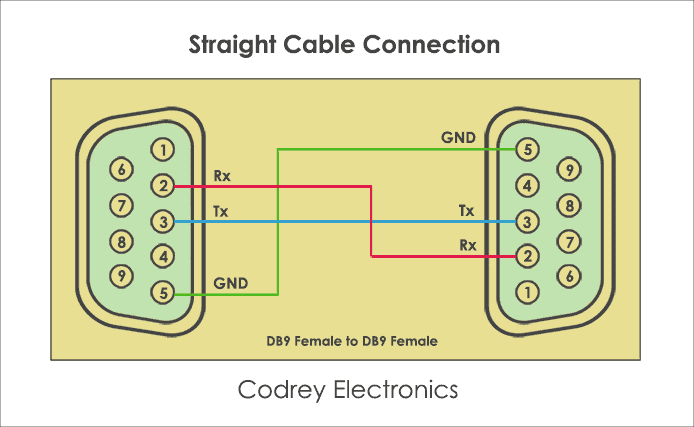](https://www.codrey.com/wp-content/uploads/2017/09/Straight-Cable-Connection.png)

Straight Cable Connection

## How RS232 Communication Works?

The working of RS-232 can be understood by the protocol format. As  RS-232 is a point-to-point asynchronous communication protocol, it sends data in a single direction. Here, no clock is required for  synchronizing the transmitter and receiver. The data format is initiated with a start bit followed by 7-bit binary data, parity bit and stop bit which are sent one after another.

#### Protocol Format

[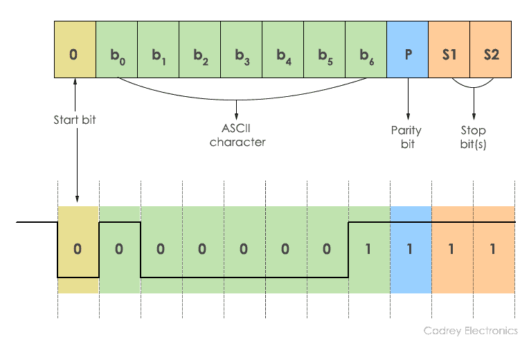](https://www.codrey.com/wp-content/uploads/2017/09/RS232-Framing.png)

RS232 Framing

The transmission begins by sending a **Start bit** ¡®0¡¯. This is succeeded by 7 bits of ASCII data. The **parity bit** is appended to this data for the receiver validation. The data sent  from the transmitter should match at the receiver. Finally, the  transmission is halted using a **stop bit** and it is represented by the binary ¡®1¡¯. Generally, 1 or 2 stop bits can be sent.

In the above diagram, ASCII character ¡®A¡¯ is sent using a serial  binary stream of ¡®1¡¯s and ¡®0¡¯s. While sending data, there should be a  certain delay between each bit. This delay is considered as inactive  time and the RS232 line is at negative logic state (-12V).

## What is Handshaking?

Handshaking is the process of interchanging information signals  between the sender (transmitter) and receiver. These signals build a  communication link between the transmitter and receiver. In RS232, there are two types of handshaking. They are hardware handshaking and  software handshaking.

[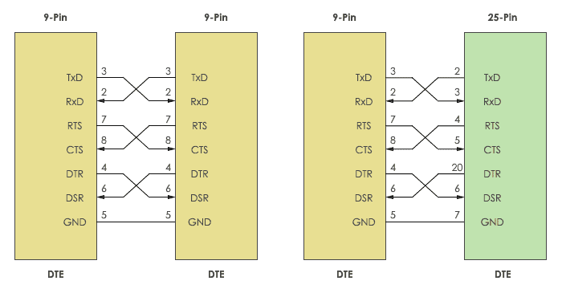](https://www.codrey.com/wp-content/uploads/2017/09/RS232-communication-with-handshaking.png)

Handshaking

The connectors DB9 and Db25 are used for handshaking purpose. When no handshaking is performed, only the TxD (Transmitter) and RxD are  cross-coupled. Other pins, RTS, CTS, DSR, and DTR are connected in  loopback fashion.

To use the handshaking technique, RTS and CTS are cross-coupled. Also, DTR and DSR are also connected in cross mode.

#### Why to use Handshaking?

To send and receive the information without loss of data, it is  necessary to maintain robust communication between the transmitter and  receiver. To do that, buffer is used. Buffer is a temporary storage  location which allows the transmitter and receiver to store the data  until the information is processed by each other at different speeds.

[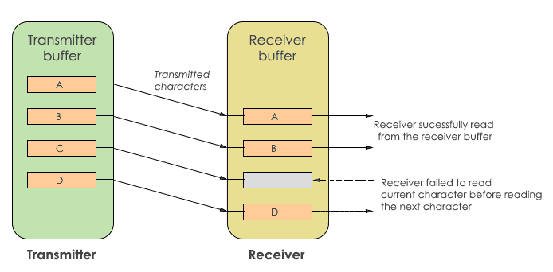](https://www.codrey.com/wp-content/uploads/2017/09/RS232-Data-flow.png)

Data flow

In the above diagram, the transmitter and receiver have their own  buffer. The transmit buffer holds the characters to be sent to the  receiver. While the receive buffer holds the characters received from  the transmitter. If the transmitter sends data at a higher speed, the  receiver may fail to receive. In this case, character ¡®C¡¯ is missed by  the receiver. To avoid this, handshaking is used. Handshaking allows the transmitter and receiver device to agree before the communication is  going to start.

#### Hardware Handshaking

The flow control of data transmission and reception is done using **hardware handshaking**. It uses control signals DTR, DSR, RTS and CTS signals. Typically, when  establishing communication between a computer and modem RTS and CTS  signals are used.

It stops the data being replaced in the receiver buffer. The signals  are kept in a high state (logic ¡®1¡¯) to activate handshaking.

#### Software Handshaking

This type of handshaking uses two ASCII characters for start-stop  communication. Hence, this is known as software flow control. Software  handshaking use XON/XOFF character to control the serial communication.  ¡®XON¡¯ represents Ctrl+S or ASCII character 11, whereas ¡®XOFF¡¯ represents Ctrl+Q or ASCII 13. This handshaking requires 3 wires. They are TXD,  RXD and signal GND.

When ¡®XOFF¡¯ character is enabled, the communication is closed until  ¡®XON¡¯ character is received by the transmitter. In some cases, the  receiver buffer may overload which causes the receiver to send ¡®XOFF¡¯  automatically to the transmitter.

#### How Handshaking Works?

In the initial state, the RTS line is pulled high by the DTE to wake  up the DCE. In this state no data is transmitted. After that, DCE puts  the CTS line HIGH to receive the data. This makes the DTE to respond and set the DTR into the HIGH state. Now, the data transfer takes place.  After completion of data transfer, both RTS and DTR are pulled LOW by  DTE. Then, DCE triggers the CTS line to the LOW state. This stops the  DTE to transmit the data.

[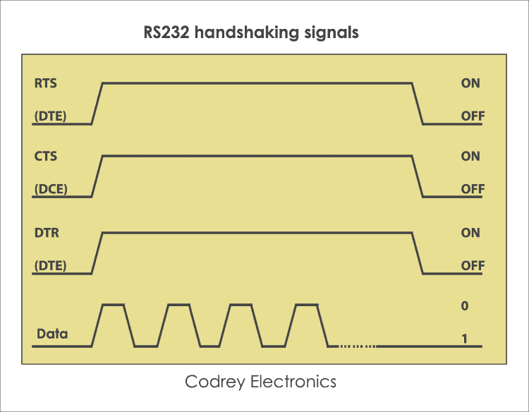](https://www.codrey.com/wp-content/uploads/2017/09/RS232-Handshaking-Signals.png)

RS232 Handshaking Signals

In this way, handshaking takes place by DTE request, taking control of the communication link and lets the DCE transfer data.

## Difference between RS232 and UART

The main difference between RS232 and [UART](https://www.codrey.com/embedded-systems/uart-serial-communication-rs232/) protocol is the voltage levels. Apart from this, they both supports half duplex and full duplex communication.

Microcontrollers don¡¯t tolerate RS232 voltages and may be damaged. To avoid this, [UART](https://www.codrey.com/embedded-systems/uart-serial-communication-rs232/) (Universal Asynchronous Transmitter Receiver) is used. It sends and  receives the data in serial form. To do the level conversion of  voltages, RS232 driver IC such as MAX232 is used between the UART and  serial port.

[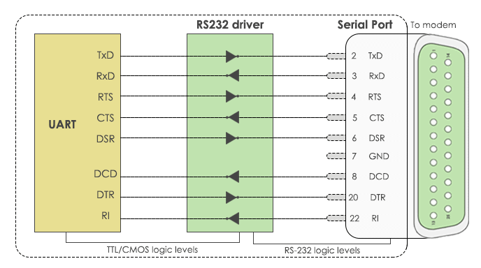](https://www.codrey.com/wp-content/uploads/2017/09/RS232-UART.png)

RS232 ¨C UART

## Advantages

The **advantages of RS232** make it as a standard serial interface for system to system communication and also for the following benefits.

- Simple protocol design.
- Hardware overhead is lesser than parallel communication.
- Recommended standard for short distance applications.
- Compatible with DTE and DCE communication.
- Low cost protocol for development.

## Disadvantages

The **limitations of RS232** protocol are, it doesn¡¯t  support full-duplex communication and it is a single-ended protocol  which shifts the ground potential. Moreover, the longer cable length  introduces cross talk during [serial communication](https://www.codrey.com/embedded-systems/serial-communication-basics/). Hence, this protocol is restricted for long distance communication.

## Applications

RS232 communication is used in different applications. Some of them are:

- Teletypewriter devices.
- Demodulator applications.
- PC COM port interfacing.
- In [embedded systems](https://www.codrey.com/embedded-systems/embedded-systems-introduction/) for debugging.
- Modems and printers.
- Handheld equipment.
- CNC controllers, Software debuggers etc.
- Barcode scanners and Point of Sales (POS) terminals.