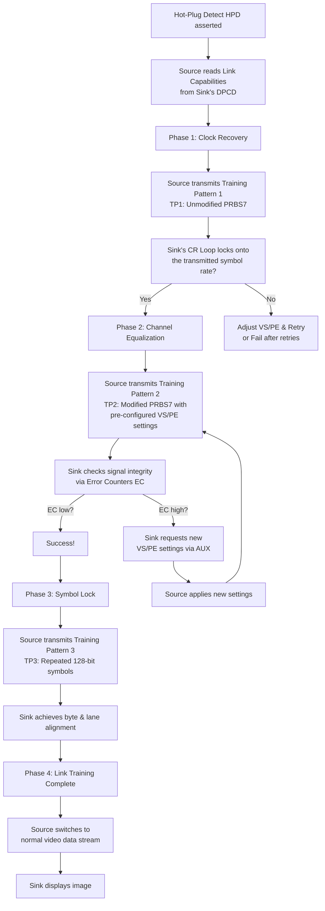
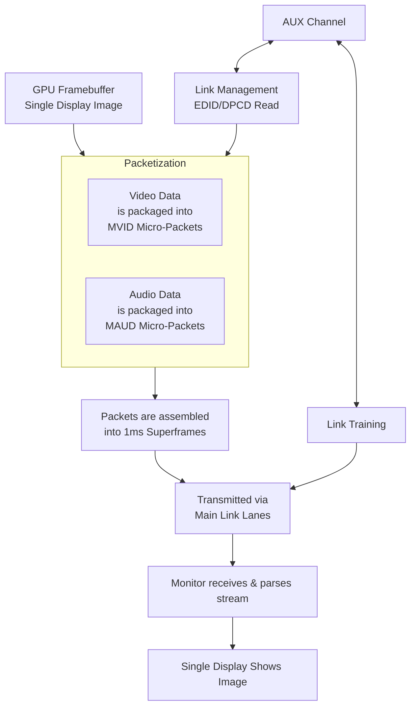

## DisplayPort vs eDP


Of course. This is an excellent question because the two are often confused, but they serve very different purposes in a device.

Here’s the simple breakdown:

- **DisplayPort (DP)** is an **external** video interface standard. It's the port you see on your laptop, desktop GPU, or monitor to connect them together with a cable.
- **eDP (Embedded DisplayPort)** is an **internal** video interface standard. It's the connection *inside* your device, like a ribbon cable that links your laptop's motherboard to its LCD screen.

------

### Comparison Table: DisplayPort vs. eDP

| Feature                 | DisplayPort (External)                                       | eDP (Embedded)                                               |
| ----------------------- | ------------------------------------------------------------ | ------------------------------------------------------------ |
| **Primary Use**         | Connecting external devices (monitor to PC, dock to laptop). | Connecting an internal display (motherboard to laptop/tablet/All-in-One screen). |
| **Physical Form**       | Standardized external port (DP, Mini DP, USB-C Alt Mode).    | Internal, flat flexible cable (like an LCD ribbon cable).    |
| **Where You See It**    | On the outside of monitors, graphics cards, and laptops.     | **Inside** devices; you only see it if you open them up.     |
| **Power Delivery**      | Can provide power (via DP++ or USB-C), but main job is video. | **Includes power** for the display's backlight and logic board. |
| **Protocol & Features** | Based on DisplayPort standard. Supports DSC (compression), HDR, etc. | Based on DisplayPort but **optimized for integration**. Key feature: **Panel Self-Refresh (PSR)**. |
| **Key Advantage**       | High bandwidth, daisy-chaining, adaptive sync (FreeSync/G-SYNC). | **Extreme power efficiency** (thanks to PSR), reduced physical size, simpler integration. |

------

### Deep Dive into Each Standard

#### DisplayPort (The External Standard)

DisplayPort is designed to be a robust, versatile, and high-performance connector for external displays.

- **Function:** Transmits video and audio from a source (like a PC) to a display (like a monitor).
- **Key Features:**
  - **High Bandwidth:** The latest DP 2.1 standard supports incredibly high resolutions and refresh rates (e.g., 8K @ 60Hz with HDR or 4K @ 240Hz).
  - **Adaptive Sync:** The foundation for NVIDIA G-SYNC and AMD FreeSync technologies, which eliminate screen tearing.
  - **Daisy-Chaining:** Allows you to connect multiple monitors in a series using a single port on your computer (requires monitors that support DP Multi-Stream  Transport - MST).
  - **USB-C Alt Mode:** This is how modern laptops output a DisplayPort signal through a USB-C  port. A USB-C to DisplayPort cable is passive and works because the  video signal is natively using the DisplayPort protocol.

#### eDP (The Internal Standard)

eDP was created to replace the older LVDS internal display standard. It's  designed for the specific constraints of being inside a device like a  laptop.

- **Function:** Connects the main logic board directly to the LCD panel and its controller.
- **Key Features:**
  - **Panel Self-Refresh (PSR):** This is the **killer feature**. With PSR, the display panel has a small memory buffer (eDP  framebuffer). When a static image is on screen (e.g., reading a  document), the GPU sends the image once, stores it in the panel's  buffer, and then goes to sleep. The panel refreshes itself from this  buffer, saving a significant amount of power. This is crucial for laptop battery life.
  - **Integrated Power:** The eDP cable carries both data and power for the LCD panel itself, simplifying internal design.
  - **Lower Voltages & Fewer Lanes:** Optimized for shorter distances and lower EMI (electromagnetic interference) inside a tight chassis.

### How They Work Together

A modern laptop is the perfect example of how these two standards work in harmony:

1. The laptop's **internal display** is connected to the motherboard via an **eDP** cable.
2. The laptop's **external USB-C or DisplayPort** port sends a video signal using the **DisplayPort** protocol (often via USB-C Alt Mode).
3. When you plug in an external monitor, the GPU outputs a DisplayPort signal to that port.
4. When you close the lid and use only the external monitor, the internal  display (via the eDP link) is turned off, often leveraging a low-power  state defined by the eDP standard.

### Can You Convert eDP to DisplayPort?

**Yes, absolutely.** This is a very common practice.

An **eDP to DisplayPort converter board** (or adapter) is a small circuit board that takes the signal from an  internal eDP connector (e.g., from a laptop motherboard) and converts it to a standard DisplayPort output. This is how:

- **DIY Laptop External Monitor Projects:** People salvage screens from broken laptops and turn them into external monitors by using these converter boards.
- **Repurposing AIO PCs:** If the motherboard in an All-in-One PC fails, the perfectly good screen can often be used as an external monitor with one of these converters.

### Summary: The Takeaway

- Use **DisplayPort** when you need to **plug in an external monitor, TV, or dock** to your computer. It's for outside connections.
- Use **eDP** when you are talking about the **internal display connection** of a laptop, tablet, or All-in-One PC. It's for inside connections.

Think of it like this: **DisplayPort is for the user to connect things; eDP is for the manufacturer to build things.**


## Display Port superframe


Of course. This is an excellent deep-dive question into the underlying mechanics of the DisplayPort standard.

### What is a DisplayPort Superframe?

A **Superframe** is a fundamental structural unit of data transmission in the  DisplayPort protocol. It's not a single image or packet, but a  fixed-duration container that carries all the information for a video  stream, including audio and auxiliary data.

Think of it like a **freight train**:

- The **entire train** is the **Superframe**. It has a fixed length and schedule.
- Each **individual car** on that train is a **Video Transport Packet** or an **Audio Transport Packet**.
- The products inside those cars are the **pixel data** or **audio samples**.

------

### Key Characteristics of a Superframe

1. **Fixed Duration:** A single Superframe has a precise duration of **1 millisecond (ms)**. This is true regardless of the resolution or refresh rate.
   - 60 Hz refresh rate = 60 frames per second = a new frame every ~16.67 ms.
   - Therefore, each video frame is broken down and transmitted over approximately **16 or 17 superframes**.
2. **Structure:** A Superframe is composed of:
   - **Main Video Stream (MVID):** The bulk of the superframe. It contains 64 to 512 **Video Transport Packets**. Each packet carries a chunk of pixel data from the active video lines.
   - **Main Audio Stream (MAUD):** Optional packets interleaved within the superframe that carry audio data.
   - **Secondary Streams:** Can also carry secondary video or audio streams (for stereoscopic 3D, for example).
   - **Auxiliary Data (AUX):** Used for link management, like reading the monitor's EDID (Extended  Display Identification Data) over the AUX CH channel or handling USB  data for USB-C Alt Mode.
3. **Synchronization:** Each Superframe begins with a special sync pattern called the **Blanking Interval**. This acts as a marker, allowing the receiver (the monitor) to reliably  identify the start of each new superframe and re-synchronize itself,  ensuring data is parsed correctly.

### Why is the Superframe Concept Important? (The Advantages)

The superframe architecture is a key reason for DisplayPort's robustness and flexibility.

| Advantage                   | Description                                                  |
| --------------------------- | ------------------------------------------------------------ |
| **Fixed Link Rate**         | The physical link between the GPU and monitor runs at a constant speed  (e.g., 5.4 Gbps per lane on DP 1.2). The superframe structure allows  this fixed-rate link to carry variable-resolution video content  efficiently. The "container" is always the same size (1 ms), but the  amount of data inside it (packets) changes based on the video's  requirements. |
| **Isochronous Transport**   | The 1 ms timing creates a predictable, rhythmic data flow. This is crucial  for synchronizing audio with video. Audio packets are inserted into  specific, pre-defined slots within the superframe, ensuring they arrive  with minimal jitter and stay perfectly in sync with the video. |
| **Efficient Bandwidth Use** | Unlike older standards like VGA or even HDMI's TMDS which have significant  blanking intervals, DisplayPort fills the superframe almost entirely  with data packets. This makes it a much more efficient protocol,  allowing for higher resolutions and refresh rates with fewer lanes. |
| **Multiplexing**            | The superframe is a perfect container for carrying multiple types of data  simultaneously. Video, audio, and auxiliary data (like USB for a dock)  can all be neatly packed into their own designated packets within the  single superframe, enabling features like USB-C's "DisplayPort Alt  Mode." |

### Superframes vs. Frames: A Critical Distinction

It's vital not to confuse a **Superframe** with a **Video Frame**.

- A **Video Frame** is a single, complete, still image (e.g., 1920x1080 pixels). Your monitor might refresh these at 60Hz (60 times per second).
- A **Superframe** is a 1 ms **chunk of data** used to *transmit* parts of one or more video frames.

**Analogy:** If a video frame is a complete chapter in a book, a superframe is a  single page. It takes many pages (superframes) to transmit the entire  chapter (frame), and the page might even contain parts of two different  chapters if the data is being multiplexed.

### The Role of Micro-Packet Structure

The superframe itself is built upon an even smaller structure: the **Micro-Packet**.

- Each Video or Audio Transport Packet within the superframe is a micro-packet.
- These micro-packets are encoded for transmission using a scheme called **8b/10b encoding** (or 128b/132b in newer versions), which ensures a balanced number of 1s and 0s for reliable clock recovery and DC balance on the wire.

### Summary

In essence, the **DisplayPort Superframe** is a **1-millisecond, structured container** that efficiently multiplexes video, audio, and auxiliary data into a  constant-rate stream. This design is a foundational element that  provides DisplayPort with its high performance, efficiency, and  versatility compared to older display standards.


## Display port  Micro-Packet Structure


Of course. The **Micro-Packet Structure** is the core of what makes DisplayPort so efficient and different from older standards like HDMI (which uses TMDS).

Let's break down the DisplayPort Micro-Packet structure in detail.

### High-Level Concept: From Pixels to Packets

A graphics card doesn't just send a raw stream of pixels. It packages  them into a structured, predictable format for reliable transmission.  This format is the Micro-Packet.

Think of it like shipping:

- **Pixels** are the individual items you want to ship.
- A **Micro-Packet** is a standard-sized box you put them in.
- A **Superframe** (the 1 ms container) is the shipping container that holds many of these boxes.

------

### The Components of a Micro-Packet

A DisplayPort Micro-Packet consists of two main parts:

1. **The Header:** Contains control information (like an address on a package).
2. **The Payload:** The actual data being transported (the items in the package).

There are four primary types of Micro-Packets, each with a specific role:

| Micro-Packet Type   | Abbr. | Purpose                                          | Payload Contents                                    |
| ------------------- | ----- | ------------------------------------------------ | --------------------------------------------------- |
| **Video Stream**    | MVID  | Carries the main pixel data.                     | Chunks of pixel values from the active video lines. |
| **Audio Stream**    | MAUD  | Carries audio data.                              | Audio samples and timing information.               |
| **Secondary Video** | SVID  | Carries a secondary video stream (e.g., for 3D). | Same as MVID, but for a second view.                |
| **Auxiliary**       | AUX   | Used for link management and control.            | EDID reads, DPCD writes, USB data (for Alt Mode).   |

------

### Detailed Structure of a Video Transport Packet (MVID)

This is the most common packet type. Let's dissect it:

**1. The Header (4 Bytes)**
The header is itself divided into two crucial parts:

- **Symbol 0 (S0):** The **Packet Type Identifier**.
  - A specific value (`0x81` for MVID, `0x69` for MAUD, etc.) that tells the receiver "This is a video packet" or "This is an audio packet."
- **Symbol 1, 2, 3 (S1, S2, S3):** The **Data Count Value (DCV)**.
  - This is a 20-bit number that indicates the number of **payload bytes** in this specific packet. This allows for variable-length packets, making the link efficient.

**2. The Payload (1 to 64 Bytes)**

- This is the actual pixel data, sliced into chunks.
- The size can vary from 1 to 64 bytes, as defined by the DCV in the header.  This variability allows the transmitter to perfectly fill the available  bandwidth.

**3. The Checksum (2 Bytes) - Optional**

- A Cyclic Redundancy Check (CRC) value for the payload.
- The receiver calculates its own CRC on the received payload and compares it to this one. If they match, the data is assumed to be correct. If not,  it may request a retransmission (depending on the implementation).

**Visual Representation of an MVID Packet:**

```text
|----------------------------------------------------------------|
| SYMBOL 0  | SYMBOL 1  | SYMBOL 2  | SYMBOL 3  | PAYLOAD (1-64B) | CRC (2B) |
|----------------------------------------------------------------|
| Packet ID |         Data Count Value (DCV) (20 bits)          |    Data     | (Optional)|
|  (8 bits) |              (S1, S2, S3 as 5, 7, 8 bits)         |             |           |
|----------------------------------------------------------------|
|<----------------- Header (4 Bytes) ----------------->|
```


------

### How Micro-Packets Fit into the Superframe

This is where the elegance of DisplayPort's design shines.

1. The **Superframe** is the fixed 1 ms time window.
2. This window is filled with a sequence of **Micro-Packets**.
3. The transmitter calculates how many video packets (MVID) are needed to carry the pixel data for that slice of time.
4. It then **interleaves** other packet types (like MAUD for audio and AUX for control) into the gaps between the video packets.
5. This creates a continuous, isochronous stream where all data types are multiplexed together seamlessly.

text

```
A Superframe (1 ms) looks like this:
[---MVID---][-MAUD-][---MVID---][-AUX-][---MVID---][---MVID---][-MAUD-]...
```


### Key Advantages of the Micro-Packet Structure

- **Efficiency:** Unlike HDMI's TMDS, which has large fixed blanking periods, DisplayPort fills almost the entire transmission time with data packets. The  payload size can be adjusted to minimize wasted space.
- **Robustness:** The header and checksum provide a structured way to identify and verify data, ensuring integrity.
- **Scalability & Flexibility:** The protocol is "link agnostic." The same micro-packet structure is  used whether the physical link has 1, 2, or 4 lanes. The transmitter  just splits the stream of packets across the available lanes. This also  makes it future-proof for higher bandwidths.
- **Multiplexing:** Different data types (video, audio, auxiliary) can be perfectly  interleaved without interference. This is the foundation for features  like sending USB data and video over the same cable in USB-C DisplayPort Alt Mode. An AUX packet can carry USB data within the video stream.

### Comparison to HDMI (TMDS)

| Feature             | DisplayPort (Micro-Packets)                                  | HDMI (TMDS)                                                  |
| ------------------- | ------------------------------------------------------------ | ------------------------------------------------------------ |
| **Method**          | **Packet-Based** (Digital)                                   | **Signal Transition** (Digital)                              |
| **Data Transport**  | Structured packets with headers and payloads.                | Encoded pixels and control signals sent in a continuous stream during active video, with long blanking intervals. |
| **Blanking Period** | Used efficiently to carry audio and auxiliary data in packets. | Large and mostly unused, representing wasted bandwidth.      |
| **Flexibility**     | Very high. Easily adapts to different numbers of lanes and new data types. | Lower. Relies on fixed clock frequencies and larger blanking intervals. |

In summary, the **Micro-Packet Structure** is the intelligent, packet-switched heart of DisplayPort. It transforms a simple stream of pixels into a robust, efficient, and multiplexed  data flow, enabling the high performance and advanced features of the  standard.


## Micro-Packet Structure map to multiple lane


Of course. This is an excellent question that gets to the very heart of DisplayPort's high-performance design.

The way DisplayPort's Micro-Packet structure maps onto its multiple lanes is a process called **Data Stripping** or **Lane Splitting**. It's a key reason DisplayPort can achieve such high bandwidths efficiently.

### The Core Concept: Byte Interleaving

DisplayPort uses a **byte-interleaved** method to distribute data across its lanes. This means it takes the  sequential stream of bytes from the Micro-Packets and "deals" them out  to the available lanes, one byte at a time, in a round-robin fashion.

This is fundamentally different from how other standards (like HDMI) might  use separate lanes for different color channels. In DisplayPort, **each lane carries a mix of all types of data** (red, green, blue pixels, audio, control packets).

------

### Step-by-Step Process: How it Works

Let's walk through what happens from the source (GPU) to the sink (Monitor).

**Step 1: Create the Micro-Packet Stream**
The GPU's display controller forms the complete sequence of Micro-Packets  (MVID, MAUD, AUX) that need to be sent within the next Superframe. This  is a single, sequential stream of bytes.

**Step 2: Scramble the Data**
The entire stream of bytes is passed through a scrambler. This process randomizes the data pattern to:

- Reduce Electromagnetic Interference (EMI).
- Ensure frequent signal transitions, which helps the receiver's clock recovery circuit stay synchronized.

**Step 3: Split (Strip) the Bytes Across Lanes**
This is the crucial step. The transmitter takes the single stream of  scrambled bytes and distributes it across the available lanes.

- **For a 4-Lane Link:** The 1st byte goes to Lane 0, the 2nd byte to Lane 1, the 3rd byte to  Lane 2, the 4th byte to Lane 3, the 5th byte to Lane 0, the 6th byte to  Lane 1, and so on.
- **For a 2-Lane Link:** The 1st byte goes to Lane 0, the 2nd byte to Lane 1, the 3rd byte to Lane 0, the 4th byte to Lane 1, etc.
- **For a 1-Lane Link:** All bytes are sent on the single lane.

**Visualization of Byte Interleaving on a 4-Lane Link:**

Imagine a stream of bytes from the Micro-Packets: `B0, B1, B2, B3, B4, B5, B6, B7, B8, ...`

The transmitter splits them like this:

text

```
Lane 0: B0, B4, B8, ...
Lane 1: B1, B5, B9, ...
Lane 2: B2, B6, B10, ...
Lane 3: B3, B7, B11, ...
```


*All four lanes are transmitting their bytes simultaneously.*

**Step 4: Encode for Transmission**
Each lane's byte stream is then encoded using a scheme like **8b/10b** (for HBR1/HBR2 rates) or **128b/132b** (for HBR3/UHBR rates). This encoding converts 8-bit data bytes into  10-bit symbols (or 128-bit blocks into 132-bit blocks) to ensure a  balanced number of 1s and 0s, which is critical for maintaining DC  balance and accurate clock recovery.

**Step 5: Transmit Simultaneously**
All lanes now transmit their encoded data **in parallel and in sync with each other**. A single data clock signal helps keep all lanes synchronized.

**Step 6: Receive and Reassemble**
On the monitor's side (the receiver):

1. Each lane receives its own stream of encoded symbols.
2. Each lane decodes its symbols (10b-to-8b or 132b-to-128b decoding) back into a stream of bytes.
3. The receiver then performs the **reverse of the stripping process**. It takes the first byte from Lane 0, then the first byte from Lane 1,  then from Lane 2, then from Lane 3, then the second byte from Lane 0,  and so on.
4. This reassembles the original, single stream of bytes in the correct order.
5. The descrambler then unscrambles this byte stream.
6. The monitor's display controller can now parse the Micro-Packet headers,  extract the payloads, and reconstruct the video frame, audio samples,  and any auxiliary data.

------

### Why This Design is So Effective

| Advantage             | Description                                                  |
| --------------------- | ------------------------------------------------------------ |
| **Bandwidth Scaling** | Bandwidth scales almost linearly with the number of lanes. **Total Bandwidth = Lane Count \* Lane Speed**. This is a simple and effective way to increase performance. |
| **Data Integrity**    | Since each lane is independent, a minor issue on one lane (e.g., slight  interference) is isolated and doesn't corrupt the entire data stream.  The receiver can often correct it. |
| **Efficiency**        | There is no inherent bandwidth penalty for using more lanes. The interleaving process adds minimal overhead. |
| **Synchronization**   | The process keeps the data across all lanes perfectly synchronized. A  single pixel's data is spread across lanes, but because the bytes are  transmitted simultaneously and reassembled in order, the original  structure is perfectly maintained. |

### Practical Example: Link Configurations

- **A high-resolution, high-refresh rate monitor** (e.g., 4K @ 144Hz) will require a lot of bandwidth. It will use a **4-lane (HBR3 or UHBR)** link to get the necessary data rate.
- **A VR headset** might use a **4-lane** link for its high-speed internal connection (which is often based on DisplayPort protocol).
- **A lower-resolution monitor** or a connection running at a lower refresh rate might only need to enable **2 lanes** to function, potentially freeing up the other two lanes for other purposes (like more USB data in a USB-C dock).

In summary, DisplayPort's method of mapping its Micro-Packet structure to multiple lanes via **byte-interleaving** is a brilliantly simple, robust, and scalable system that is the engineering foundation for its high performance.


## DisplayPort speed grade


Of course. DisplayPort speed grades define the maximum data rate per lane  that a DisplayPort source (GPU), cable, and sink (monitor) can support.  This is crucial for determining what resolutions and refresh rates a  connection can handle.

Here is a comprehensive breakdown of all DisplayPort speed grades.

### DisplayPort Speed Grades Overview

The speed is measured per lane, and the total bandwidth of the connection is **lanes × speed**. DisplayPort uses 1, 2, or 4 lanes.

| Speed Grade   | Official Name            | Symbol | **Data Rate per Lane (Gbit/s)** | Total Bandwidth (4 Lanes) | Encoding  | Max Data Efficiency | Common Use Case                    |
| ------------- | ------------------------ | ------ | ------------------------------- | ------------------------- | --------- | ------------------- | ---------------------------------- |
| **RBR**       | Reduced Bit Rate         |        | 1.62                            | 6.48 Gbit/s               | 8b/10b    | 80%                 | Legacy/Low-power devices           |
| **HBR**       | High Bit Rate            |        | 2.70                            | 10.80 Gbit/s              | 8b/10b    | 80%                 | 1080p @ 240Hz, 1440p @ 144Hz       |
| **HBR2**      | High Bit Rate 2          |        | 5.40                            | 21.60 Gbit/s              | 8b/10b    | 80%                 | 4K @ 60Hz, 1440p @ 240Hz           |
| **HBR3**      | High Bit Rate 3          |        | 8.10                            | 32.40 Gbit/s              | 8b/10b    | 80%                 | 4K @ 120Hz+, 5K @ 60Hz, 8K @ 30Hz  |
| **UHBR 10**   | Ultra High Bit Rate 10   |        | 10.0                            | 40.00 Gbit/s              | 128b/132b | ~97%                | 8K @ 60Hz with DSC                 |
| **UHBR 13.5** | Ultra High Bit Rate 13.5 |        | 13.5                            | 54.00 Gbit/s              | 128b/132b | ~97%                | 8K @ 60Hz, 4K @ 240Hz              |
| **UHBR 20**   | Ultra High Bit Rate 20   |        | 20.0                            | 80.00 Gbit/s              | 128b/132b | ~97%                | 8K @ 120Hz+, 16K @ 60Hz (with DSC) |

------

### Key Details and Explanations

#### 1. The Impact of Encoding (8b/10b vs. 128b/132b)

This is the most critical concept for understanding effective bandwidth.

- **8b/10b Encoding (RBR, HBR, HBR2, HBR3):** For every 8 bits of real data, 10 bits are actually transmitted. This creates a **20% overhead**, meaning the maximum data throughput is only **80%** of the raw lane rate.
  - *Example: HBR3 has a raw rate of 32.4 Gbit/s, but its effective data rate is 32.4 × 0.8 = 25.92 Gbit/s.*
- **128b/132b Encoding (UHBR grades):** For every 132 bits transmitted, 128 bits are real data. This creates only a **~3% overhead**, meaning the effective data throughput is **~97%** of the raw lane rate—a massive efficiency gain.
  - *Example: UHBR 20 has a raw rate of 80.0 Gbit/s, and its effective data rate is ~77.4 Gbit/s.*

#### 2. DisplayPort Versions vs. Speed Grades

It's important to distinguish the version of the DisplayPort standard from the speed grade. A version *supports* certain speed grades.

- **DP 1.0-1.2a:** Supports **RBR** and **HBR**.
- **DP 1.3-1.4a:** Supports **RBR, HBR, HBR2,** and **HBR3**.
- **DP 2.0-2.1:** Supports all previous grades plus the new **UHBR 10, UHBR 13.5, and UHBR 20** speeds.

A device labeled "DisplayPort 2.1" must support at least UHBR 10, but it could support a higher UHBR grade.

#### 3. How to Know What You Need? (Bandwidth Calculation)

To see if a certain mode (resolution, refresh rate, color depth) will work, you need to compare its **Required Bandwidth** to the **Total Effective Bandwidth** of your connection.

**Simplified Formula:**
`Required Bandwidth ≈ Horizontal Pixels × Vertical Pixels × Refresh Rate × Color Depth (bits per pixel)`

- **Example: 4K @ 60Hz, 8-bit color, no HDR:**
  - `3840 × 2160 × 60 × 8` ≈ **3.98 Gbit/s**
  - This seems low, but the formula above is simplified. It doesn't include blanking intervals. A more accurate calculation is **~12.54 Gbit/s** for this mode.
- **Use a Online Calculator:** For accuracy, use a trusted online [DisplayPort Bandwidth Calculator](https://tomverbeure.github.io/video_timings_calculator).

**Rule of Thumb:**

- **HBR2 (Effective ~17.28 Gbit/s):** Good for 4K @ 60Hz or 1440p @ 144Hz.
- **HBR3 (Effective ~25.92 Gbit/s):** Good for 4K @ 120Hz or 5K @ 60Hz.
- **UHBR 20 (Effective ~77.4 Gbit/s):** Good for 4K @ 240Hz, 8K @ 60Hz, or 8K @ 120Hz with DSC.

#### 4. The Role of DSC (Display Stream Compression)

DSC is a "visually lossless" compression standard that is crucial for modern high-resolution displays.

- It can typically compress video data by about 3:1 without any perceptible loss in image quality.
- **DSC is what makes high-resolution modes possible on slower links.** For example, an 8K @ 60Hz signal would require more bandwidth than even HBR3 provides. With DSC, it can fit within the HBR3 or UHBR 10  bandwidth.
- DSC support is independent of speed grade but is a feature of DP 1.4 and later.

### Summary and Practical Advice

1. **Check Your Gear:** Your GPU, cable, and monitor must *all* support the same speed grade for a high-speed link to work. A DP 2.1  GPU with a cheap HBR-rated cable will be limited to HBR speeds.
2. **Look for Logos:** Modern devices and cables may display their supported speed (e.g., "UHBR" or "DP40/DP80" for 40/80 Gbit/s total bandwidth).
3. **For Future-Proofing:** If buying a new high-end cable, look for a **DP80 Certified Cable** or a **Thunderbolt 4/USB4 cable**, which are designed to support the full UHBR20 (80 Gbit/s) bandwidth.
4. **The Bottleneck Rule:** Your connection will always run at the speed of the slowest component in the chain (Source > Cable > Sink).


## DisplayPort compliance test


Of course. The DisplayPort compliance test is a rigorous and comprehensive process that ensures all devices implementing the DisplayPort standard  (sources like GPUs, sinks like monitors, and cables) will work together  reliably and perform to specification.

The program is managed by VESA (Video Electronics Standards Association),  and passing these tests is mandatory for a product to use the official  DisplayPort logo.

------

### 1. Purpose and Goal

The primary goal is **interoperability**. With thousands of manufacturers, VESA must ensure that:

- A Dell laptop works with an ASUS monitor using a Club3D cable.
- All features (high resolutions, HDR, Adaptive-Sync, DSC) function correctly.
- The connection is stable and reliable over time and across different environments.

------

### 2. Who is Tested?

The compliance test applies to three main components:

1. **Source Devices (Tx - Transmitter):** Graphics cards, laptops, smartphones, docking stations.
2. **Sink Devices (Rx - Receiver):** Monitors, TVs, projectors, VR headsets.
3. **Cables:** Passive and active DisplayPort cables, including USB-C cables that support DisplayPort Alt Mode.

------

### 3. The Testing Workflow

The process is highly structured and typically follows these steps:

**Step 1: Pre-Testing (Self-Testing)**
Before submitting a product to an official test lab, the manufacturer performs extensive internal testing using:

- **Protocol Analyzers:** Specialized hardware tools that sit between the source and sink,  capturing and decoding the raw DisplayPort traffic (packets,  superframes) to debug signal integrity and protocol errors.
- **Compliance Test Equipment:** Tools like the **M31A/B/C** or **Rivet Networks' EDSFF** test platforms. These are programmable instruments that can act as a  "golden" reference receiver or transmitter to test the device under test (DUT) against the spec.

**Step 2: Official Certification Testing**
The manufacturer sends their product to an **Authorized Test Center (ATC)**. These are independent labs certified by VESA to perform compliance  testing. They use standardized, calibrated equipment and procedures to  ensure consistent results worldwide.

**Step 3: Test Execution & Results**
The ATC runs a vast suite of tests defined in VESA's compliance test  specification documents. The results are compiled into a report.

**Step 4: Certification**
If the product passes all mandatory tests, VESA issues a certification and the manufacturer is granted a license to use the relevant DisplayPort  logos on that product and its packaging.

------

### 4. Key Test Categories

The tests are extensive and cover multiple domains:

#### A. Electrical & Physical Layer Tests (The "Signal Quality" Tests)

This is about the analog characteristics of the signal. It ensures the 1s  and 0s are strong and clear enough to be interpreted correctly by the  receiver.

- **Eye Diagram Analysis:** The most critical test. It measures the "openness" of the signal's eye  pattern. A wide-open "eye" means low jitter and high signal integrity.  Test parameters include:
  - **Eye Height & Width:** Must be above minimum thresholds.
  - **Jitter (Total, Deterministic, Random):** Must be below maximum limits.
  - **Swing Voltage:** The amplitude of the signal must be within spec.
- **Link Training & Equalization:** Tests the device's ability to automatically negotiate the best possible signal settings (pre-shoot, de-emphasis) for the specific channel  (cable + connectors).

#### B. Protocol & Link Layer Tests (The "Digital" Tests)

This ensures the device correctly implements the digital protocol.

- **Main Link Authentication:** Verifies the source and sink can correctly establish a link (handshake process).
- **AUX CH Transaction Testing:** Tests the communication channel used for reading EDID/DPCD and sending commands.
- **Micro-Packet and Superframe Structure:** Verifies that the data is packaged correctly according to the rules.
- **HDCP Content Protection Testing:** A separate but related suite of tests to ensure encrypted content is handled securely.

#### C. Video & Audio Functional Tests (The "Does it Work?" Tests)

- **EDID/DPCD Read/Write:** Ensures the source correctly reads the monitor's capabilities and writes its required settings.
- **Mode Validation:** The device is tested across a matrix of resolutions, refresh rates, and color depths (e.g., 4K@60Hz 8bpc, 1440p@144Hz 10bpc with HDR).
- **DSC (Display Stream Compression) Validation:** For DP 1.4/2.1 devices, tests that DSC is enabled, managed, and decoded correctly without visual artifacts.
- **Adaptive-Sync (FreeSync/G-SYNC) Testing:** Validates that variable refresh rate functions work as intended.
- **Audio Functionality:** Tests for lip-sync accuracy and audio channel integrity.

#### D. Interoperability Tests

The device is tested against a variety of "golden" reference devices from  other manufacturers to ensure it works in real-world scenarios.

------

### 5. The Importance of Compliance Testing

- **Consumer Confidence:** When you see the DisplayPort logo, you can be confident the device will work with other certified devices.
- **Prevents Market Fragmentation:** Without strict compliance, the market would be flooded with  incompatible products, hurting the ecosystem and confusing consumers.
- **Drives Innovation:** By providing a stable, reliable baseline, VESA ensures that new  features (like higher resolutions or better HDR) can be added knowing  they will work on certified hardware.

### What happens if a product fails?

A product cannot be certified if it fails mandatory tests. The manufacturer must:

1. **Debug** the failure using the detailed report from the ATC.
2. **Redesign** the hardware (e.g., PCB layout, connector choice) or firmware/software to fix the issue.
3. **Resubmit** the revised product for testing.

In summary, the DisplayPort compliance test is a non-negotiable, rigorous  process that is the backbone of the standard's widespread success and  reliability. It moves beyond simple functionality to ensure robust  performance and interoperability across the entire ecosystem.


## DisplayPort training vs eDP fast training


Of course. This is an excellent question that gets into the nuanced  differences between an external and an internal display standard.

While both standard DisplayPort (for external displays) and Embedded  DisplayPort (eDP, for internal displays) use a link training process to  establish a connection, **eDP's "Fast Training" is a specific, optimized feature designed for power efficiency and speed in an integrated environment.**

Here’s a detailed breakdown.

------

### The Common Foundation: Why Link Training Exists

Both DP and eDP need to perform **link training** because the physical connection (the "channel") is imperfect. The signal can be degraded by:

- **Cable length and quality** (for DP) / **Trace length and board material** (for eDP).
- **Connector quality** (for DP).
- **Electrical noise and interference.**

Link training is an automated handshake where the Source (Tx) and Sink (Rx)  work together to find the optimal settings for stable communication.  They test different signal levels and timings to compensate for the  channel's imperfections.

### Standard DisplayPort Link Training

This process is designed for an **external, variable environment** where the user can plug and unplug different cables and monitors.

1. **Process:** It's a multi-step process involving the AUX channel and the main link  lanes. The Source and Sink adjust four key parameters for each lane:
   - **Voltage Swing (VS):** The signal amplitude.
   - **Pre-Emphasis (PE):** A boost to high-frequency signals to counteract cable loss.
   - **Post-Cursor Equalization:** Advanced filtering to correct for signal distortion after it has traveled.
2. **Key Characteristics:**
   - **Thorough:** It tests many combinations to ensure the most robust connection possible across a wide range of cables and monitors.
   - **Time-Consuming:** This process can take tens or even hundreds of milliseconds. You can  sometimes observe this as a delay between plugging in a monitor and the  image appearing.
   - **Reactive:** It typically happens in response to a hot-plug event (you plug in a monitor) or a link loss.

### Embedded DisplayPort (eDP) Fast Link Training

This is a specialized version of link training for an **internal, fixed environment** like a laptop or All-in-One PC. The motherboard, the eDP cable, and the panel are soldered together and never change.

1. **The Core Idea:** Because the physical environment is fixed and known at the factory, the optimal link training parameters (VS, PE) are also fixed. There's no  need to rediscover them every single time.
2. **How It Works:**
   - During manufacturing, the optimal link training parameters are determined once and stored in the panel's non-volatile memory (its **DPCD** - DisplayPort Configuration Data registers).
   - On subsequent power-ups (e.g., when you open your laptop lid), the Source  (the laptop chipset) simply reads these pre-defined, "golden" values  from the panel's DPCD.
   - It applies them immediately to the link, bypassing the lengthy back-and-forth testing process.
3. **Key Characteristics:**
   - **Extremely Fast:** The training time is slashed from milliseconds to microseconds. This is crucial for achieving fast resume-from-sleep times.
   - **Power Efficient:** The training process consumes power. By making it nearly instantaneous, eDP Fast Training minimizes power draw, which is paramount for  battery-powered devices.
   - **Predictable & Reliable:** Since the parameters are pre-calculated for the specific hardware, the result is highly reliable.

------

### Comparison Table: DP Training vs. eDP Fast Training

| Feature            | Standard DisplayPort Training                              | eDP Fast Link Training                                       |
| ------------------ | ---------------------------------------------------------- | ------------------------------------------------------------ |
| **Environment**    | **External, variable.** Unknown cables and monitors.       | **Internal, fixed.** Known motherboard, cable, and panel.    |
| **Primary Goal**   | **Maximum robustness** across a wide range of scenarios.   | **Maximum speed and power efficiency** for a known scenario. |
| **Process**        | Iterative testing and negotiation between Source and Sink. | Source reads pre-defined optimal settings from panel's memory. |
| **Speed**          | Slow (tens/hundreds of milliseconds). Noticeable to user.  | Very fast (microseconds). Virtually instantaneous to the user. |
| **Power Use**      | Higher, due to extended negotiation process.               | Very low, as the process is almost bypassed.                 |
| **When it Occurs** | On hot-plug detection or link failure.                     | On every power-up or exit from a low-power state.            |
| **Key Driver**     | **Interoperability** between different vendors' products.  | **Power saving** and fast user experience in an integrated system. |

### Why This Distinction Matters

- **For a Desktop User:** When you plug in a new monitor, the robust (but slower) standard DP  training ensures it will work reliably, even with a long or  mediocre-quality cable.
- **For a Laptop User:** When you open your lid, eDP Fast Training is the reason the screen  turns on almost instantly, saving precious battery life that would be  wasted on a lengthy negotiation process every time.

In summary, **eDP Fast Training is an optimization of the standard DisplayPort link training process.** It trades the generality and thoroughness needed for an external port  for the raw speed and efficiency required for an internal, fixed display connection. It's a perfect example of engineering a standard to fit its specific use case.


## DisplayPort training fail


Of course. A DisplayPort training failure is a fundamental hardware-level  communication error where the source (e.g., GPU) and sink (e.g.,  monitor) cannot agree on a stable connection. This results in a **"No Signal"** message, a black screen, or a flickering image that never stabilizes.

This guide covers the causes, troubleshooting steps, and underlying technical reasons.

------

### Symptoms of a Link Training Failure

- **"No Signal"** or **"DisplayPort Going to Sleep"** message on the monitor.
- **Blank/Black screen** after connecting the cable.
- **Intermittent flickering** where the image appears for a split second and then disappears.
- **Lower resolution** (e.g., 640x480) works, but higher resolutions fail.
- **Screen artifacts** (sparkles, dots, colored pixels) that indicate a marginal, unstable signal.

------

### Root Causes: The "Why" Behind the Failure

Link training is the process where the GPU and monitor negotiate four key  parameters for each data lane to compensate for signal degradation:

1. **Voltage Swing (VS):** The power of the signal.
2. **Pre-Emphasis (PE):** A boost to high-frequency signals to counteract attenuation over distance.
3. **Post-Cursor Equalization:** Advanced correction for signal distortion that occurs after transmission.

A failure happens when they cannot find a combination of these settings  that produces a clear, error-free signal. The core causes are:

#### 1. Cable Issues (The Most Common Cause)

- **Out-of-Spec Cable:** The cable cannot handle the high bandwidth (speed grade: HBR2, HBR3,  UHBR) required for the resolution/refresh rate you are using. It  attenuates the signal too much.
- **Damaged Cable:** Bent pins, fraying, or internal breaks from physical damage.
- **Long Cable:** Signal degradation is worse over longer distances. Passive cables over 2 meters (~6.5 ft) are prone to failure at high resolutions.
- **Poor Shielding:** Allows external electromagnetic interference (EMI) to corrupt the signal.

#### 2. Source/Sink Device Issues

- **Faulty Port:** A damaged DP port on the GPU or monitor.
- **Outdated Firmware/Driver:** Bugs in the GPU driver or the monitor's firmware can cause incorrect training behavior.
- **Power Delivery Issues:** An underpowered or faulty GPU can lead to a weak output signal.
- **Marginal Hardware:** The transmitter (GPU) or receiver (monitor controller) is weak or out of specification.

#### 3. Configuration & Compatibility

- **DSC (Display Stream Compression) Issues:** A bug in the DSC implementation on either device can cause handshake failures on high-resolution monitors.
- **Adaptive-Sync (G-SYNC/FreeSync) Conflicts:** Enabling this feature can sometimes push a marginal link over the edge into failure.
- **HDCP Handshake Failure:** While related to content protection, a failed HDCP handshake can sometimes manifest as a training issue.

#### 4. Physical Connection

- **Loose Connection:** A cable that isn't fully seated in the port.
- **Dirt/Debris:** Dust or pocket lint in the port preventing a good connection.

------

### Troubleshooting Steps: From Most to Least Likely

**Step 1: The Basic Checks**

- **Restart Everything:** Turn off the monitor and PC completely. Unplug them from power for 60  seconds. This clears any state and resets the link training process.
- **Reseat the Cable:** Unplug and firmly re-seat the cable at both ends. Ensure it's fully clicked in.
- **Try a Different Port:** Use a different DisplayPort output on your GPU and a different input on your monitor.

**Step 2: Isolate the Problem Component**

- **Try a Different Cable:** This is the single most important step. Use a certified high-quality  cable known to support your desired bandwidth (look for "DP8K" or "UHBR" certification for modern setups).
- **Try a Different Monitor:** Connect your PC to a different DisplayPort monitor/TV. If it works, the original monitor is likely the issue.
- **Try a Different Source:** Connect a different PC/laptop to your monitor. If it works, your original PC/GPU is likely the issue.

**Step 3: Software and Configuration Fixes**

- **Update GPU Drivers:** Download and install the latest drivers directly from NVIDIA, AMD, or Intel.
- **Update Monitor Firmware:** Check the manufacturer's website for a firmware update tool for your specific monitor model.
- **Reduce Bandwidth Demand (Test):**
  - Lower your **refresh rate** (e.g., from 144Hz to 60Hz).
  - Lower your **resolution** (e.g., from 4K to 1080p).
  - Change your **color depth** from 10bpc to 8bpc.
  - **Disable Adaptive-Sync/G-SYNC/FreeSync** temporarily.
  - If the problem disappears at lower settings, it confirms a **bandwidth issue**, pointing strongly to the cable.

**Step 4: Advanced / Last Resort**

- **Check GPU Power:** Ensure all power connectors are firmly attached to the GPU.
- **NVIDIA GPU Users:** Try a **Clean Driver Install** using the custom install option in the NVIDIA installer, checking the "Perform a clean installation" box.
- **Monitor Settings:** Some monitors have a "DisplayPort Version" or "Link Rate" setting in  their OSD menu. Try forcing it to a lower version (e.g., DP 1.2 instead  of DP 1.4).
- **Check Physical Ports:** Inspect the ports on the GPU and monitor for bent or damaged pins.

### Diagnostic Tools (For Advanced Users)

- **Monitor OSD:** Many modern monitors display the current link rate, resolution, and  color depth in their information menu. If it shows a lower speed than  expected (e.g., HBR2 instead of HBR3), the link trained at a lower rate  due to problems.
- **EDID/DPCD Readers:** Software tools like **CRU (Custom Resolution Utility)** or **Linux tools** can read the monitor's capabilities (EDID) and the live link data (DPCD), which can sometimes show training errors.

### Summary: Most Likely Culprits

| Likelihood    | Cause                                                |
| ------------- | ---------------------------------------------------- |
| **Very High** | **A faulty or low-quality cable.**                   |
| **High**      | **A marginal connection (loose cable, dirty port).** |
| **Medium**    | **Outdated drivers or firmware.**                    |
| **Low**       | **A faulty monitor or GPU.**                         |

**Start with the cable.** In the vast majority of cases, especially with  high-resolution/high-refresh-rate setups, the cable is the bottleneck  causing the link training to fail. Investing in a **VESA-certified cable** for the specific speed grade you need (e.g., "DP40" for UHBR10, "DP80" for UHBR20) is the best preventative measure.


## DisplayPort training flow


Hmm, the user is asking about the DisplayPort training flow, which is a  technical process underlying the connection establishment. They've shown a pattern of deep technical interest, from micro-packets to compliance  testing, so they likely want a detailed, structured explanation rather  than a high-level overview.

I should break this down into clear phases, mirroring the actual  handshake process, and emphasize the key steps like clock recovery,  channel equalization, and link speed negotiation. The user would  probably appreciate the technical specifics like PRBS patterns and the  role of the AUX channel.

Since they've previously engaged with comparisons (e.g., DP vs. eDP), I  should highlight how this training differs from simpler protocols like  HDMI, but avoid digressing into that unless relevant. The focus should  stay on the sequential flow, maybe with a mermaid diagram to visualize  the stages, as they've responded well to structured diagrams before.

I'll avoid oversimplifying but ensure the explanation is accessible to  someone with their level of technical background. The goal is to make  the complex negotiation process clear without drowning in unnecessary  detail.

Of course. The DisplayPort link training flow is a sophisticated,  automated handshake sequence between the Source (Tx, e.g., a GPU) and  the Sink (Rx, e.g., a monitor) to establish a stable, high-speed  connection. It's designed to compensate for signal degradation caused by the physical channel (cable, connectors, PCB traces).

Here is a detailed, step-by-step breakdown of the entire process.

------

### High-Level Overview of the Flow

The entire process is orchestrated via the **AUX channel**, a separate low-speed data channel used for control and status  communication. The main high-speed data lanes are initially inactive and are only enabled once training is complete.

The flow can be broken down into four main phases:

1. **Clock Recovery**
2. **Channel Equalization**
3. **Symbol Lock & Alignment**
4. **Link Training Complete**




### Phase 1: Clock Recovery (CR)

**Goal:** Allow the Sink's Phase-Locked Loop (PLL) to lock onto the exact symbol rate (clock frequency) of the Source.

1. **Trigger:** The Source detects the Hot-Plug Detect (HPD) signal from the Sink.
2. **Capability Check:** The Source reads the Sink's capabilities (DPCD - DisplayPort  Configuration Data) via the AUX channel to understand supported link  rates (e.g., HBR2, HBR3).
3. **TP1 Transmission:** The Source transmits **Training Pattern 1 (TP1)** on all configured lanes. TP1 is a standard **PRBS7 (Pseudo-Random Bit Sequence 7)** pattern. This pattern is ideal for clock recovery because it has strong transition density.
4. **Sink's Task:** The Sink uses this repetitive, predictable pattern to adjust its clock  recovery circuitry until it perfectly matches the incoming symbol rate.
5. **Success Criteria:** The Sink sets the **CLOCK_RECOVERED** bit in its DPCD status register.
6. **Failure:** If the Sink cannot lock onto the clock after several attempts, the  training fails. This usually indicates a fundamental problem like a  broken lane, severe signal integrity issues, or an unsupported high link rate.

### Phase 2: Channel Equalization (EQ)

**Goal:** Find the optimal Voltage Swing (VS) and Pre-Emphasis (PE) settings to  compensate for channel loss and ensure a clear signal at the receiver.

1. **TP2 Transmission:** Once clock is recovered, the Source switches to **Training Pattern 2 (TP2)**. This is the same PRBS7 pattern but now transmitted with *initial* VS and PE settings.
2. **Sink's Analysis:** The Sink analyzes the signal integrity of the incoming TP2 pattern on  each lane. It checks for errors by comparing the received pattern to the expected PRBS7 sequence.
3. **Error Counting:** The Sink has error counters for each lane. A high error count means the signal is too degraded.
4. **Adjustment Request:**
   - If errors are low, the Sink sets the **EQ_INTERIM_OK** or **EQ_FINAL_OK** bits in its DPCD.
   - If errors are high, the Sink writes *requested* VS and PE values for each lane back to the Source via the AUX channel.
5. **Iterative Process:** The Source applies the new values from the Sink and transmits TP2  again. This loop continues iteratively until the Sink reports that the  signal is good (**EQ_FINAL_OK**).
6. **Why it's Complex:** This is a negotiation. The Sink is effectively saying, "Your signal is  bad. Please try more power (VS) and more high-frequency boost (PE) on  Lane 1." The Source complies and asks, "How about this?" until the Sink  replies, "Perfect!"

### Phase 3: Symbol Lock and Inter-Lane Alignment

**Goal:** Ensure the receiver can correctly identify byte boundaries and that all lanes are synchronized.

1. **TP3 Transmission:** After successful equalization, the Source transmits **Training Pattern 3 (TP3)**. TP3 is a pattern of repeating, specific 128-bit symbols that are easy for the Sink to recognize.
2. **Symbol Lock:** The Sink uses this repetitive pattern to achieve "symbol lock" or "byte alignment." This means it correctly groups the incoming bitstream into  bytes.
3. **Inter-Lane Alignment:** Since data is striped across multiple lanes, the Sink must ensure all  lanes are aligned. It uses the TP3 pattern to deskew the lanes, ensuring that Byte 1 from Lane 0 and Byte 1 from Lane 1 are processed  simultaneously, even if they arrive nanosecond apart.
4. **Success:** The Sink sets the **SYMBOL_LOCKED** and **LANE_ALIGNED** bits in its DPCD.

### Phase 4: Link Training Complete

1. **Final Check:** The Source reads the Sink's DPCD status register one last time and confirms that all "OK" bits are set (**CLOCK_RECOVERED**, **EQ_FINAL_OK**, **SYMBOL_LOCKED**).
2. **Switch to Normal Data:** The Source stops sending training patterns and switches to sending the **normal video data stream** (the actual screen image packaged into Micro-Packets and Superframes).
3. **Image Display:** The Sink, now fully synchronized and tuned, receives the data error-free and displays the image.

------

### What If Training Fails?

If any phase fails after a set number of retries, the Source will:

1. Fall back to a **lower link rate** (e.g., from HBR3 to HBR2) and restart the training sequence.
2. If it continues to fail at all rates, it will give up, resulting in a **"No Signal"** condition on the monitor.

This elaborate process is why a high-quality, certified cable is crucial. A  poor cable causes excessive signal degradation, making it impossible for the equalization phase to find settings that produce a error-free  signal, leading to training failure.


## DisplayPort stable issue under  high temperature


DisplayPort interfaces can indeed experience stability issues under high  temperatures, which is a known challenge in both consumer and industrial applications. Here's a detailed explanation of the causes,  implications, and solutions, based on the provided search results and  technical knowledge.

### 🔥 1. **Causes of High-Temperature Instability**

```text
- **Signal Integrity Degradation**: High temperatures can increase the attenuation of high-frequency signals traveling through cables and PCB traces. This exacerbates issues like inter-symbol interference (ISI), making it harder for the receiver to accurately interpret the data. Components like **linear redrivers** (e.g., Texas Instruments' TDP2004) use programmable equalization (e.g., CTLE) to combat this, but extreme heat can still overwhelm these adjustments :cite[7].
- **Clock Timing Drift**: Temperature fluctuations can affect the stability of clock circuits. For instance, Intel documented an issue where the Pixel Clock Recovery (PCR) module in FPGA-based DisplayPort IP cores could lose PLL lock at elevated temperatures, causing signal reset and video loss. This was due to incorrect VCO divider settings pushing frequencies out of spec :cite[4].
- **Active Component Overheating**: Devices like **signal redrivers** (e.g., TI's TUSB1064) or **retimers** (e.g., Parade's PS8461V) generate heat during operation. In poorly cooled environments, their temperatures can soar (e.g., to 75°C as reported), potentially triggering thermal protection mechanisms or reducing operational efficiency. Notably, the power consumption of such chips is often tied to the number of active channels, not just equalization settings :cite[1].
- **Cable and Connector Issues**: Low-quality or damaged cables may have poor shielding or inadequate power pin management (e.g., DP_PWR pin issues). Heat can exacerbate these physical shortcomings, leading to increased resistance, signal loss, or even backpowering problems that strain the source device :cite[6].
```


### ⚙️ 2. **Technical Mechanisms and Failures**

```text
- **Link Training Failures**: DisplayPort relies on a constant handshake between source and sink (monitor) to adjust signal parameters (voltage swing, pre-emphasis). High temperatures can disrupt this process, causing repeated training attempts or fallbacks to lower link rates (e.g., HBR2 instead of HBR3), which may manifest as blank screens or flickering :cite[7]:cite[4].
- **Thermal Throttling**: Devices like GPUs or interface chips may reduce performance to cool down, indirectly affecting DisplayPort output stability. For example, some AMD GPUs were reported to experience high junction temperatures when specific DP cables were used, though the exact mechanism remained unclear :cite[6].
- **Material and Design Limitations**: Consumer-grade cables and components often have operating temperature limits (e.g., 0°C to 70°C). Beyond these ranges, signal integrity can degrade. Automotive-grade solutions, like Parade's PS8461V retimer (-40°C to 105°C), are designed for wider tolerances but are uncommon in consumer gear :cite[5].
```


### 🛠️ 3. **Solutions and Mitigation Strategies**

```text
- **Use High-Quality, Certified Components**: Opt for **VESA-certified DP cables** (e.g., supporting UHBR) and ensure they are well-shielded. Avoid adapters or extenders that introduce additional points of failure. For instance, LINDY's DP 1.4 adapter supports 32.4Gbps but requires compatible cables :cite[2].
- **Improve Thermal Management**:
  - **Active Cooling**: Ensure adequate airflow around devices. For laptops, avoid blocking vents and consider cooling pads. One suggestion from the search results is to even slightly elevate the laptop to improve airflow :cite[9].
  - **Heat Sinking**: For hot components like redrivers, ensure the PCB thermal pad is properly soldered to a ground plane with sufficient paste coverage (e.g., >73% as recommended by TI) :cite[1].
- **Firmware and Driver Updates**: Manufacturers like Intel and TI release updates to address thermal-related bugs. For example, Intel fixed the PCR PLL issue in Quartus Prime v19.1 :cite[4].
- **Reduce Bandwidth Demand**: Lowering resolution, refresh rate, or color depth can reduce the thermal load on both GPU and interface chips. This might be a temporary workaround for critical applications :cite[9].
- **Select Industrial-Grade Components**: For environments with consistently high temperatures (e.g., automotive or industrial settings), use components rated for extended temperature ranges, such as the TDP2004I industrial redriver (-40°C to 85°C) or Parade's PS8461V retimer :cite[7]:cite[5].
```


### 💡 4. **Design Considerations for Stability**

```text
- **PCB Layout and Shielding**: Ensure differential pairs are properly length-matched and surrounded by ground planes to minimize EMI and crosstalk, which can worsen with heat. Tools like TI's PSPICE or TINA-TI can simulate signal integrity under thermal stress :cite[7].
- **Protocol Compliance**: Use devices that transparently handle link training (like TDP2004) to avoid protocol timeouts or errors during thermal fluctuations :cite[7].
- **Power Management**: For designs involving USB-C or DP_PWR, ensure proper isolation to prevent backpowering, which can cause unexpected heating :cite[6].
```


### 💎 5. **Summary of Recommendations**

```text
- **For Consumers**: If experiencing dropouts, first try a different high-quality cable, ensure devices are well-cooled, and update drivers/firmware. Avoid daisy-chaining or using long cables in hot environments.
- **For Engineers**: Design with thermal margins in mind: select industrial-temperature components, model thermal performance, and implement robust cooling. Consider using retimers for long channels or harsh environments.
```


In summary, DisplayPort stability under high temperatures hinges on signal integrity, clock stability, and component thermal performance.  Addressing it requires a combination of quality components, careful  design, and active thermal management.


## how to implement DisplayPort daisy chain


Implementing a DisplayPort daisy chain allows you to connect multiple monitors in a  series from a single DisplayPort output on your computer, creating a  streamlined multi-display setup. Here's a comprehensive guide on how to  implement it:

------

### 🖥️ 1. **Check Hardware Requirements**

- **Source Device (PC/GPU)**: Your computer’s DisplayPort output must support **DisplayPort 1.2 or later** and **MST (Multi-Stream Transport)**. Most modern GPUs and laptops (e.g., gaming GPUs, business laptops)  support this. Verify your GPU’s specs in its documentation or driver  settings 


.

**Monitors**: Each monitor in the chain (except the last) must have a **DisplayPort output port** and support **DP 1.2+ with MST**. Not all monitors with DisplayPort support daisy chaining—check the  manual or product specifications (e.g., ASUS ProArt PA247CV/PA278CV,  Philips 242B7QPTEB/00) 


.

**Cables**: Use **VESA-certified DisplayPort cables** to ensure signal integrity. Low-quality cables can cause bandwidth issues or signal dropouts, especially at higher resolutions 


- .

------

### 🔌 2. **Physical Connection Setup**

- **Step 1**: Connect the **source device** (PC/laptop) to the **first monitor’s DisplayPort input** using a certified cable.
- **Step 2**: Connect the **first monitor’s DisplayPort output** to the **second monitor’s DisplayPort input**.
- **Step 3**: Repeat for additional monitors (up to 3-4 monitors depending on resolution and bandwidth) 


- .
- **Note**: The last monitor in the chain should **not** have a cable connected to its output port.

------

### ⚙️ 3. **Configure Software and Settings**

- **Enable MST on Source Device**:
  - **Windows**: Go to `Settings > System > Display > Multiple displays` and select "Extend these displays." Ensure MST is enabled in your GPU  driver control panel (e.g., NVIDIA Control Panel or AMD Radeon  Settings).
  - **macOS**: macOS has limited MST support; it may require third-party software or specific GPU drivers.
- **Monitor OSD Settings**: On each monitor, access the On-Screen Display (OSD) menu and enable **MST mode** or **DP Out Multi-Stream** (e.g., on Philips monitors, navigate to `OSD > Setup > DP Out Multi-Stream > Extend`) 


.

**Resolution and Refresh Rate**: Lower resolutions (e.g., 1080p) allow more monitors in the chain. For  4K, bandwidth limits may restrict the chain to 2 monitors at 60Hz or 3-4 at 30Hz 

- .

------

### 🚧 4. **Troubleshooting Common Issues**

- **No Signal or Black Screen**:
  - Ensure all cables are securely connected and certified for DisplayPort 1.2+.
  - Check that MST is enabled on both the source and monitors.
  - Reduce resolution/refresh rate if bandwidth is exceeded (e.g., switch 4K@60Hz to 4K@30Hz) 

- .

**Limited Bandwidth**: Higher resolutions (e.g., 4K) consume more bandwidth. Refer to DisplayPort bandwidth guidelines 

:

| Resolution/Refresh Rate | Max Monitors in Chain   |
| ----------------------- | ----------------------- |
| 1080p @ 60Hz            | 3-4                     |
| 1440p @ 60Hz            | 2-3                     |
| 4K @ 30Hz               | 2-3                     |
| 4K @ 60Hz               | 2 (with HBR2 bandwidth) |

**Driver/Firmware Updates**: Update your GPU drivers and monitor firmware from the manufacturer’s website. Older drivers may lack MST support 


- .
- **Compatibility**: Some GPUs or monitors may require specific settings (e.g., AMD Eyefinity or NVIDIA Surround for gaming setups).

------

### 💡 5. **Advanced Considerations**

- **Daisy Chaining with USB-C**: If your source uses USB-C (with DisplayPort Alt Mode), ensure the USB-C cable supports DisplayPort 1.2+ and power delivery (e.g., Sharp’s  MultiSync displays with USB-C) 

.

**Signal Integrity**: Long chains or poor cables can cause signal degradation. For chains beyond 3 monitors, consider an **active DisplayPort cable** or **MST hub** for better stability 

.

**Industrial Use**: In high-temperature environments (e.g., outdoor LED walls), use  industrial-grade equipment with wide temperature tolerance (e.g., -30°C  to 70°C) to avoid signal loss 

- .

------

### 📊 6. **Alternative Solutions**

- **MST Hubs**: If your monitor lacks a DisplayPort output, use an external MST hub to split the signal to multiple monitors.
- **Thunderbolt**: Some Thunderbolt 3/4 ports support daisy chaining DisplayPort monitors  via Thunderbolt cables (common in MacBooks and high-end laptops).

------

### ✅ 7. **Verification and Testing**

- After setup, test each monitor’s functionality by dragging windows across displays.
- Use tools like **DisplayPort Signal Integrity Test** (e.g., VESA compliance tests) to verify signal quality if issues persist 

- .

------

### 🌟 Conclusion

DisplayPort daisy chaining simplifies multi-monitor setups by reducing cable clutter. Success depends on:

- **Hardware compatibility** (DP 1.2+ with MST support).
- **High-quality cables**.
- **Correct software configuration**.

If problems arise, systematically check each step and consult your device manuals or manufacturer support 


. For advanced scenarios (e.g., extreme environments or high-resolution  chains), consider professional-grade hardware and testing.


## Micro-Packet Structure for MST

DisplayPort Multi-Stream Transport (MST) leverages the **micro-packet architecture** fundamental to the DisplayPort standard to enable efficient driving of  multiple displays from a single source. This architecture provides the  flexibility and bandwidth management necessary for MST operation. Here's a detailed explanation:

### 🔧 1. **Foundation of Micro-Packet Architecture**

DisplayPort's micro-packet architecture is a packet-based transmission system, unlike the dedicated channel approach of HDMI or DVI. This design is crucial  for MST because it allows multiple independent video streams to be  efficiently multiplexed onto a single physical link 


.

- **Packet Structure**: Data is organized into discrete **micro-packets** or **transport packets**. Each packet contains a header and a payload section. The header  includes control information and identifiers, while the payload carries  the actual video, audio, or auxiliary data 

.

**Efficiency and Flexibility**: This packetized approach allows the main link to carry multiple video  streams (for MST), audio data, and auxiliary information within the same data stream. The **auxiliary (AUX) channel**, a bidirectional sideband channel, is used for managing the link,  reading display capabilities (EDID), and handling DisplayPort  Configuration Data (DPCD) 

- .

### ⚙️ 2. **MST Operation Utilizing Micro-Packets**

MST harnesses the micro-packet architecture to split and direct multiple video streams.

- **Stream Multiplexing**: The source GPU packs pixel data for each independent display into  separate video streams (e.g., MVID for main video). These streams are  then broken down into micro-packets. The MST hub or the first monitor in a daisy chain receives this aggregated packet stream, reads the packet  headers to identify which display each packet is destined for, and  routes them accordingly 


.

**Role of the AUX Channel**: The AUX channel is vital for MST setup and control. It facilitates the **link training** process between the source and each display in the chain, ensuring  optimal signal integrity. It also carries management commands for  enabling MST mode and reading the EDID and DPCD of all displays in the  topology 


- .

### 📊 3. **Bandwidth Management and Allocation**

A key advantage of the micro-packet architecture is its efficient use of available bandwidth.

- **Dynamic Allocation**: The total bandwidth of the DisplayPort link (e.g., 17.28 Gbps for HBR2) is dynamically shared among all connected displays. The source device  allocates bandwidth to each stream based on its resolution, refresh  rate, and color depth 


.

**Micro-Packet Interleaving**: Packets from different video streams are interleaved and transmitted  sequentially over the main link. This ensures that all displays are  updated seemingly simultaneously without requiring a dedicated physical  lane for each stream 

- .

### 🔍 4. **Technical Implementation in Daisy Chaining**

In a daisy chain setup, the micro-packet structure dictates how data flows.

- **Data Flow**: The source sends a single stream of interleaved micro-packets for all  displays to the first monitor. This monitor reads its assigned packets  (e.g., for its own image), strips them from the stream, and forwards the remaining packets containing data for downstream displays to its DP  Output port 


.

**Protocol Compliance**: Each monitor in the chain must be able to parse the micro-packet  headers, decode its own data, and accurately forward the rest. The last  monitor in the chain only receives packets intended for itself 

- .

### 💎 5. **Summary and Practical Considerations**

The micro-packet architecture is the backbone that enables MST's  functionality, providing the flexibility to multiplex streams and the  efficiency to manage bandwidth dynamically.

To ensure reliable MST operation based on this architecture:

- **Use Certified Cables**: Ensure all cables are VESA-certified for DisplayPort to maintain signal integrity, which is critical for accurate micro-packet delivery 

.

**Enable MST in Display Settings**: Some monitors require manually enabling MST or "DP Out Multi-Stream" in their On-Screen Display (OSD) menu to participate in the packet  forwarding chain 

.

**Manage Bandwidth**: Be mindful of total bandwidth limits; higher resolutions/refresh rates  on one display will reduce available bandwidth for others in the chain 


- .

In essence, the micro-packet architecture transforms the DisplayPort link into a **packet-switched network**, allowing it to efficiently route multiple independent video streams to  their respective destinations, which is the core innovation enabling  MST.


## DisplayPort SST


Of course. DisplayPort SST (Single-Stream Transport) is the fundamental,  default mode of operation for a standard DisplayPort connection. It is  used to drive a **single display** from a single source.

Understanding SST is crucial as it forms the basis upon which more advanced features  like MST (Multi-Stream Transport) are built.

------

### 1. Core Concept of SST

In **Single-Stream Transport** mode, the Source device (e.g., a GPU) transmits **one complete video stream** intended for exactly one Sink device (e.g., a monitor).

- **One Stream, One Display:** The entire bandwidth of the DisplayPort link is dedicated to carrying  the pixel data, audio, and auxiliary data for a single display.
- **The Default Mode:** SST is the simplest and most common mode. If you have a single monitor  connected to your computer via DisplayPort, you are almost certainly  using SST.

### 2. How SST Uses the Micro-Packet Structure

The elegance of DisplayPort is its packet-based design, which SST utilizes in a straightforward manner:

1. **Packetization:** The source GPU takes the video data for the single display and packages it into **Video Transport Packets (MVID)**. Audio is packaged into **Audio Transport Packets (MAUD)**.
2. **Assembly into Superframes:** These packets are assembled into **Superframes** (1 ms containers) for transmission.
3. **Transmission:** The sequential stream of superframes is transmitted across the main  link lanes. The AUX channel handles link management, reading the  monitor's EDID, and reading/writing the DPCD (DisplayPort Configuration  Data).
4. **Reception:** The monitor receives the stream, parses the packets, extracts the video and audio data, and displays the image.

The entire structure of the link—lanes, micro-packets, and superframes—is dedicated to this one stream.




### 3. SST vs. MST (Multi-Stream Transport)

This is the key distinction. MST is an extension that builds on top of the SST foundation.

| Feature                | **Single-Stream Transport (SST)**                  | **Multi-Stream Transport (MST)**                             |
| ---------------------- | -------------------------------------------------- | ------------------------------------------------------------ |
| **Number of Displays** | **One** display per DP output.                     | **Multiple** displays (daisy-chained or via hub) per DP output. |
| **Video Streams**      | **One** video stream.                              | **Multiple** independent video streams multiplexed together. |
| **Bandwidth Usage**    | Dedicates the entire link bandwidth to one stream. | Dynamically allocates and shares the total bandwidth among multiple streams. |
| **Complexity**         | Simple, direct connection.                         | Complex, requires an MST hub (or compatible monitor) to split the stream. |
| **Use Case**           | Standard single-monitor setup.                     | Multi-monitor setups from a single port to reduce cable clutter. |

**Analogy:**

- **SST** is a **single-lane highway** that goes directly from your house (GPU) to one destination (Monitor).
- **MST** is a **multi-lane highway** that leads to a **cloverleaf interchange** (MST Hub). The interchange splits the traffic into multiple streams,  each taking a different exit to reach various destinations (multiple  monitors).

### 4. Why SST Matters

- **Simplicity and Reliability:** As the default mode, it is universally supported and highly reliable.  There is no need for complex configuration or specific hardware on the  sink side beyond basic DisplayPort support.
- **Performance:** For a single high-resolution, high-refresh-rate display (e.g., 4K @  144Hz, 8K), SST is the mode used to deliver the maximum possible  bandwidth from the GPU to the monitor without any overhead from  multiplexing.
- **Foundation for MST:** The micro-packet structure and link protocol defined for SST are  exactly what MST uses. An MST hub receives what appears to be a single  SST stream, but that stream is actually a container holding multiple  independent video streams. The hub's job is to unpack them and route  each to the correct output.

### 5. Practical Implications

- **You are using SST if:** You have one cable from your GPU to one monitor.
- **You need MST if:** You want to connect two or more monitors to a single DisplayPort output on your GPU **and** have them work as independent displays (extended desktop).
- **Daisy-Chaining Requires MST:** To connect Monitor A to your GPU, and then Monitor B to Monitor A's DP Output port, **both Monitor A and your GPU must support MST**. Monitor A acts as an MST hub in this scenario.

In summary, **SST is the standard, single-display mode** of DisplayPort. It efficiently utilizes the protocol's micro-packet  structure to deliver a high-quality video and audio stream to one  display. MST is a powerful feature that leverages this same packet-based structure to enable multi-display functionality from a single port.