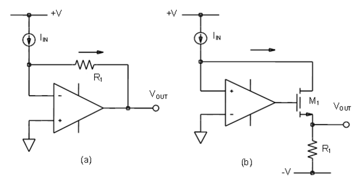

# [Chapter 11: The Current Mirror](https://wiki.analog.com/university/courses/electronics/text/chapter-11)

## 11.1 Basic principles

The implementation of the current mirror circuit may seem simple but  there is a lot going on. The simple two transistor implementation of the current mirror is based on the fundamental relationship that two equal  size transistors at the same temperature with the same VGS for a MOS or VBE for a BJT have the same drain or collector current. To best understand  this important circuit building block and how it makes use of this  relationship we need to deconstruct the circuit into input and output  sections and examine each in turn.

A current mirror is a circuit block which functions to produce a copy of the current flowing into or out of an input terminal by replicating the current in an output terminal. An important feature of the current  mirror is a relatively high output resistance which helps to keep the  output current constant regardless of load conditions. Another feature  of the current mirror is a relatively low input resistance which helps  to keep the input current constant regardless of drive conditions. The  current being 'copied' can be, and often is, a varying signal current.  The current mirror is often used to provide bias currents and active  loads in amplifier stages.

The ideal block level concept of the current mirror is shown in figure  11.1. Given a current source as the input, the input section of the  current mirror looks like a virtual short circuit and reflects (swaps  the direction of flow) this current to produce a current sink (the  current exiting the mirror); as a result, we obtain a current sink  (figure 11.1a). Conversely, given a current sink as the input, the  current mirror reflects this current to control current source (figure  11.1b); as a result, now we obtain a current source. We can generalize  this basic current mirror structure with this first observation: A  current mirror consists of a low impedance input stage connected to a  high impedance output current stage.

 Figure 11.1, Current Mirror (a) Sink (b) Source 

Conceptually, an ideal current mirror is simply an ideal current  amplifier with a gain of -1. In Chapter 8 we explored the transistor and you should recall that the BJT device is a current amplifier of sorts  (current controlled current source) in that the collector current is β  times the base current. The problem with using this feature directly is  that β is not a well controlled value from device to device and can vary with changes in temperature. Accurate current amplifiers are difficult  to directly implement using conventional transistor amplifier  configurations which are typically voltage amplifiers. For example the  MOS transistor is generally modeled as a voltage controlled current  source and can not be used directly as a current amplifier. The use of  feedback and the current to voltage relationship of two terminal  elements such as a resistor are most often used when manipulating  currents as signals. Because in a current mirror the input and output  are currents, it is easier to convert the input to a voltage first and  then convert a voltage back to a current at the output.

It should be noted that these two stages of the current mirror may have a linear relationship (for example where VOUT = IINR and IOUT = VIN/R) like a resistor. In figure 11.1.1 we see the classic operational  amplifier implementation of the current to voltage converter explored  back in Chapter 4 section 2. The virtual ground at the negative input of the op-amp provides a very low input resistance. These circuits use the linear relationship between the current in resistor R1 and the voltage  across the resistor. However, this linear relationship is not  necessarily required. Any element or combination of elements could be  used such as the VBE or VGS of a transistor as in (b) if the output voltage was taken at the gate of M1 (output of the op-amp).

Figure 11.1.1 Linear Current to Voltage converter (from Chapter 4)

Similarly, as an output stage we have the operational amplifier  implementation of the voltage to current converter from section 1 of  Chapter 4 in figure 1.1.2. Here the input voltage is forced across  resistor R1 such that the resulting current in R1 flows through  transistor M1.

Figure 11.1.2 Linear Voltage to Current converter (from Chapter 4)

Implementing the block diagram of the current mirror shown in figure  11.1 follows directly from these voltage / current converter stages from Chapter 4, if we connect the output of the I to V converter in figure 11.1.1(b) to the input of the V to I converter in figure 11.1.2. With the two resistors being equal, IOUT would be the mirror image of IIN. Note that the second op-amp is not actually necessary because the gates of the two NMOS transistors can be tied directly to each other with the same result. Remember that two equal size transistors at the same  temperature with the same VGS (or VBE for a BJT) have the same drain current. This is an important simplification of the current mirror concept.

The converters might consist of non-linear devices having whatever I to V characteristics that may include another physical quantity (such as  temperature); the only requirement is that the characteristics be the  inverse of each other. For example, if the input I to V stage implements a function v = f(i) and the output stage implements  the inverse function i = f -1(v) the total input to output transfer  function is v = f(i) = f(f -1(v)) . We can make a second observation: A  current mirror consists of two connected stages with inverse transfer  functions of each other.

The converter circuits in figures 11.1.1 and 11.1.2 are rather  complicated and require as many as two operational amplifiers. A much  simpler implementation would be better.

## 11.2 An input stage to convert current to voltage

We would like a simple configuration where the active element, a single  transistor, serves as the desired current-to-voltage converter. However, the transistor is a unidirectional device, where for the BJT the base  emitter voltage controls the collector current or for the FET the gate  source voltage controls the drain current. Producing the opposite where  the collector current controls the VBE is not possible in the conventional use of the device as a common  emitter amplifier. Referring back to Figure 11.1.1, the solution is to  incorporate negative feedback. In this case that means making the  transistor adjust its base emitter or gate source voltage, VBE or VGS, so that the collector or drain current is IIN = (V1-VBE)/R. For this purpose, we simply connect the collector to the base or gate  to drain or “diode connect” the transistor. This classic “diode”  connection results in 100% parallel negative feedback (figure 11.2). As a result, with this diode connected transistor, the collector current  serves as the input quantity while the base-emitter voltage VBE serves as the output quantity with the logarithmic transfer function of the base emitter junction. Similarly, a diode connected enhancement  mode MOS FET (gate tied to drain) will serve as a similar current to  voltage converter with VGS as the output quantity rather than VBE.

 Figure 11.2, Current to Voltage Converter 

[ADALM1000 BJT as a diode lab activity](https://wiki.analog.com/university/courses/alm1k/alm-lab-3)
 [ADALM1000 MOS as a diode lab activity](https://wiki.analog.com/university/courses/alm1k/alm-lab-3m)
 [ADALM2000 BJT as a diode lab activity](https://wiki.analog.com/university/courses/electronics/electronics-lab-3)
 [ADALM2000 MOS as a diode lab activity](https://wiki.analog.com/university/courses/electronics/electronics-lab-3m)

## 11.3 An output stage to convert voltage to current

A bipolar transistor can be driven by a voltage or by a current. If we consider the base emitter voltage, VBE, as the input and the collector current, IC, as the output (figure 11.3), we can think of a transistor as a  non-linear voltage-to-current converter having an exponential  characteristic. The base can be directly driven by the voltage output of the I-to-V converter we just discussed. The collector provides the output terminal of our simple current mirror: The output V to I converter stage of the simple current mirror is just a transistor  acting as a non-linear (exponential for BJT) voltage-to-current  converter. Again if a MOS transistor were used for the input stage the  output stage would be a MOS transistor with the gate serving as the  voltage input and the drain as the current output.

 Figure 11.3, Voltage to Current Converter 

## 11.4 Assembling the complete circuit

The final step is to connect the output of the input stage (the base emitter junction of Q1) to the input of the output stage (the base emitter junction of Q2) to build the basic BJT current mirror circuit (figure 11.4). At this  point we will concentrate on the issues involved with the BJT current  mirror and pick back up with the MOS current mirror in section 11.6.

 Figure 11.4, BJT Current Mirror 

### 11.4.1 Mirror Gain other than 1

If transistors Q1 and Q2 in figure 11.4 are identical (that is have the same size emitter and thus equal IS) the input current to output current ratio or gain is ideally 1. There  are often occasions when a gain other than one is required. When  building circuits from discrete devices only simple integer ratios are  possible while in microelectronic integrated circuits it is possible to  make transistors with arbitrary emitter areas, A. However, even in  integrated circuits the best design practice is to use identical unit  size transistors when making current mirrors.

 Figure 11.4.1, Current Mirror with non-unary gain ratio 

If on the input side of the mirror we connect N identical devices in parallel and connect M devices in parallel on the output side, the gain of the mirror will be M/N. In figure 11.4.1 we see an example where 2 (N=2) devices are connected together on the input and 3 (M=3) devices are connected together on the output. The mirror gain will thus be 3/2 or 1.5. Since all five transistors share the same VBEvoltage, their collector currents, IC, will all be equal. The input current IIN splits equally in Q1 and Q2 such that:

 ,  or 

## 11.5 Imperfections of the simple mirror

There are three primary error sources that make the simple 2 transistor  mirror less than ideal. The first is the mirror gain. Ideally IOUT should exactly equal IIN. There are systematic and random factors that make this not the case.  The second is the incremental output resistance, which determines how  much the output current varies with the voltage seen at the mirror  output. The third limitation is the minimum voltage drop across the  output leg of the mirror necessary to maintain the desired output  current. This minimum voltage, called output compliance, is determined  by the need to keep the output transistor of the mirror in the active  region. There are also a number of secondary performance issues with  mirrors, for example, temperature stability and frequency response.

### 11.5.1 Gain Errors

An error source in this simple BJT based current mirror is that the transistors Q1 and Q2 (figure 11.4) each remove a base current IB from the input current IIN.  As a result, the output current is smaller than the input current:

As was already discussed, current mirrors can just as easily be made from MOS FET transistors. The I-to-V and V-to-I functions are different but of course are still the inverse of each  other. A significant advantage of the MOS current mirror is the lack of  base current induced error that BJT current mirrors suffer. There are  methods to correct or compensate for the base current in BJT current  mirrors which will be discussed in detail in later sections of this  chapter.

### 11.5.2 Compliance voltage

It is necessary to keep the output (BJT) transistor out of saturation, VCB = 0 V. Or from another  perspective, not allow the collector base junction to forward bias. That means the lowest output voltage that  results in the correct output current, the compliance voltage, is VOUT = VCV =  VBE under bias conditions with the output transistor at the output current level IC and  with VCB = 0 V or, restating the VBErelation from earlier:

Where VT is the thermal voltage and IS is the reverse saturation current.

### 11.5.3 Output resistance

The VCB of Q1 in the mirror is zero. If VCB is greater than zero in the  output transistor Q2, the collector current in Q2 will be somewhat larger than  Q1 due to the Early effect. In other words, the mirror has a finite output resistance given by the  rO of the output transistor, namely:

Where:
 VA is the Early voltage
 VCB is the collector-to-base voltage

As we learned in an earlier chapter, the inclusion of emitter degeneration resistors (RE1 and  RE2 in figure 11.5) can increase the effective collector impedance seen at the mirror output. In  order for the mirror gain to remain equal to 1, RE1 must of course equal RE2. The added  voltage drop across the emitter resistor RE2 (IOUT x RE2) adds to the  minimum allowable output voltage (see section 11.5.2).

While resistors could also be added to the sources in an MOS based mirror, it is often more effective to  simple increase the channel length, L, of the transistors. The longer the channel the less it is affected by  the channel length modulation due to the increasing drain voltage.

 Figure 11.5, Emitter degeneration included to boot output resistance. 

It is important to note that the inclusion of emitter resistors does not reduce the reduction in the output  current IOUT caused by the finite beta of Q1 and Q2. A compensating voltage  can be inserted by including resistor RB, of the correct value, as shown in figure 11.6.

 Figure 11.6, Adding a resistor in the base of Q1 tends to compensate for the finite beta of Q2 

For VCB close to zero (that is, neglecting base-width modulation errors) the necessary value for  RB is:

For example, using A = 2 ( a mirror gain of 2 ), IIN = 1mA, so rE = 26Ω and  RE1 = 500Ω (introducing about 500mV of degeneration) RB should be 1578Ω if β is enough  larger than A so that factor can be ignored, or 1626Ω if it is included and beta is 100. Clearly, this  compensation method becomes unpredictable when β is small and is comparable to A and will never be precise  because β1 and β2 are not in general equal. However, this technique can be of practical  utility in many cases.

## 11.6 Basic MOSFET current mirror

The simple current mirror can, obviously, also be implemented using MOSFET transistors, as shown in figure  11.7. We know that transistor M1 is operating in the saturation region because VDS is  greater than or equal to VGS. Transistor M2will also be in saturation so long as the  output voltage is larger than its saturation voltage. In this simple configuration, the output current  IOUT is directly related to IIN.

 Figure 11.7 Simple MOS current mirror 

The drain current of a MOSFET ID is a function of both the gate to source voltage and the drain to  gate voltage of the MOSFET given by ID = f (VGS, VDG), a relationship  derived from the functionality of the MOSFET device. In the case of transistor M1 of the mirror,  ID = IIN. Input current IIN is a known current, and can be provided by a  resistor as shown in the figure, or by a threshold-referenced or self-biased current source to ensure that it  is constant, independent of voltage supply variations.

Using VDG=0 for transistor M1, the drain current in M1 is ID = f  (VGS,VDG=0), so we find: f (VGS, 0) = IIN, implicitly determining  the value of VGS. Thus IIN sets the value of VGS. The circuit in the diagram  forces the same VGS to apply to transistor M2. If M2 also is biased with  zero VDG and provided transistors M1 and M2 have good matching of their  properties, such as channel length, width, threshold voltage etc., the relationship IOUT = f  (VGS,VDG=0 ) applies, thus setting IOUT = IIN; that is, the  output current is the same as the input current when VDG=0 for the output transistor, and both  transistors are matched.

The drain-to-source voltage can be expressed as VDS=VDG + VGS. With this  substitution, the Shichman-Hodges model provides an approximate form for function f(VGS,VDG):

Where:
 Kp is a technology related constant associated with the transistor,
 W/L is the width to length ratio of the transistor,
 VGS is the gate-source voltage, Vth is the threshold voltage, VDS is the  drain-source voltage
 λ is the channel length modulation constant

**Output resistance**

Because of channel-length modulation, the mirror has a finite output resistance given by the *ro* of the  output transistor, namely:

Where:
 λ = channel-length modulation parameter
 VDS = drain-to-source bias.

**Compliance voltage**

To keep the output transistor resistance high, VDG = 0 V. That means the lowest output voltage  that  results in correct mirror behavior, the compliance voltage, is VOUT = VCV =  VGS for the output  transistor at the output current level with VDG = 0 V, or using the  inverse of the f- function, f-1:

For the Shichman-Hodges model, f-1 is approximately a square-root function.

## 11.7 Improved current mirrors

### 11.7.1 Buffered Feedback current mirror

Figure 11.8 shows a mirror where the simple wire connecting the collector of Q1 to its base is replaced by an emitter follower buffer. This improvement to the simple current mirror is referred to as an emitter follower  augmented mirror. The current gain (ßQ3) of the emitter follower buffer stage (Q3) greatly reduces the gain error caused by the finite base currents of Q1 and Q2.

 Figure 11.8 Buffered Feedback current mirror. 

One thing to note that is different in this mirror configuration vs. the simple two transistor mirror is that  the Collector-Base voltage, VCB, of Q1 is no longer zero. It is equal to the  VBE of Q3. Given the effect of the finite output resistance (Early effect ) the output  current IOUT in Q2 will most closely match IIN when the collector voltage of  Q2 is the same as that of Q1 which is 2XVBE above the common voltage. Also  note that when driven by a resistor, like R1, IIN will now be  (V1-VBE1-VBE2)/R1.

Another consequence of adding the emitter follower buffer is, in general, a loss in the frequency response of  the mirror. Transistor Q3 is potentially operating at a very small current of 2IB. If  there were to be a significant capacitance to ground at the base connection common to Q1 and  Q2 the current available to discharge this current will also be small equal to 2IB. But  the current available to charge this node is potentially equal to ßQ3IIN which is very  much larger than 2IB. This asymmetry in the charging vs. discharging current available for this  node in the current mirror can lead to very undesirable response to fast changes to IIN.

### 11.7.2 The Wilson current mirror

A Wilson current mirror or Wilson current source, named after George Wilson, is an improved mirror circuit  configuration designed to provide a more constant current source or sink. It provides a much more accurate  input to output current gain. The structure is shown in figure 11.9.

 Figure 11.9 The Wilson Current Mirror 

We will be making the following two assumptions. First, all transistors have the same current gain ß. Second,  Q1 and Q2are matched, so their collector currents are equal. Therefore, IC1 = IC2 (= IC) and IB1 = IB2 (= IB) .

The base current of Q3 is given by,

The emitter of Q3 current by,

Looking at figure 11.9, it can be seen that IE3 = IC2 + IB1 + IB2 Substituting for IC2, IB1 and IB2, IE3 = IC + 2IB

so,

Substituting for IE3

rearranging,

The current through R1 is given by, IR1 = IC1 + IB3

But, IC1 = IC2 = IC

Substituting for IC and since   we get,

Therefore,

And finally,

From the above equation we can see that if

And the output current (assuming the base-emitter voltage of all transistors to be 0.7 V) is calculated as,

Note that the output current is equal to the input current IR1 which in turn is dependent on  V1 and R1. If V1 is not stable, the output current will not be stable. Thus  the circuit does not act as a regulated constant current source.

In order for it to work as a constant current source, R1 must be replaced with a constant current  source.

**Advantages over other configurations**

This circuit has the advantage of virtually eliminating the base current mismatch of the conventional BJT  current mirror thereby ensuring that the output current IC3 is almost equal to the reference or  input current IR1. It also has a very high output impedance due to the negative feedback through  Q1 back to the base of Q3.

### 11.7.3 Further improvement (full Wilson Mirror)

Adding a fourth transistor to the simple Wilson current mirror in figure 11.10, we have the modified or  improved Wilson mirror.  The improved input to output current accuracy is accomplished by equalizing the  collector voltages of Q1 and Q2 at 1 VBE. This leaves the finite ß and  voltage differences of each of Q1 and Q2 as the remaining unbalancing influences in the  mirror.

 Figure 11.10 The improved Wilson Current Mirror 

## 11.8 Widlar current source

A Widlar current source is a modification of the basic two-transistor current mirror that incorporates an  emitter degeneration resistor for only the output transistor, enabling the current source to generate low  currents using only moderate resistor values. This circuit is named for its inventor, Robert Widlar, and was  patented in 1967.

The Widlar circuit may be used with bipolar transistors or MOS transistors. An example application is in the  now famous uA741 operational amplifier, and Widlar used the circuit in many of his designs.

### 11.8.1 Analysis

 Figure 11.11 A version of the Widlar current source using bipolar transistors. 

Figure 11.11 is an example Widlar current source using bipolar transistors, where the emitter resistor  R2 is connected in series with the emitter of output transistor Q2, and has the effect  of reducing the current in Q2 relative to Q1. The key to this circuit is that the  voltage drop across the resistor R2 subtracts from the base-emitter voltage of transistor  Q2, thereby reducing the collector current compared to transistor Q1. A simulation plot  showing this reduction in IC2 is presented in figure 11.12.

 Figure 11.12 Plot of the collector current of Q1 and Q2 R1 = 15KΩ, R2 = 300  

This observation is expressed by using KVL around the base emitter loop of the circuit in Figure 11.11 as:

Where ß2 is the beta of the output transistor, which may not be the same as that of the input  transistor, in part because the currents in the two transistors are very different. The variable  IB2 is the base current of the output transistor, VBE refers to base-emitter voltage.   If we neglect the effect of finite ß and use the VBE equation we can obtain a useful formula for  the output current:

where VT is the thermal voltage, IIN = IC1 and IOUT = IC2.

Suppose we want to create a 100uA output current from a 300uA input current as in the simulation plot of  figure 11.12. VT is 26mV times ln(3) is 28.5mV. 28.5mV divided by 100uA is 285 ohms.  This equation makes the approximation that the currents are both much larger than the saturation currents  IS1, IS2, an approximation valid except for very low current levels. In the following  the distinction between the two scale currents is dropped, although the difference can be important, for  example, if the two transistors are designed with different emitter areas.

### 11.8.2 Output impedance

 Figure 11.13 Small-signal circuit for finding output resistance of the Widlar source   shown in figure 11.11. 

A test current I/x is applied at the output, and the output resistance is then RO =  Vx / Ix.

An important property of a current source is its small signal incremental output impedance, which should  ideally be infinite. The emitter degeneration resistance introduces local current feedback for transistor  Q2. Any increase in the current in Q2 increases the voltage drop across R2,  reducing the VBE for Q2, thereby countering the increase in current. This feedback  means the output impedance of the circuit is increased, because the feedback involving R2 forces  use of a larger voltage to drive a given current.

Output resistance is found using a small-signal model for the circuit, shown in Figure 11.13. The transistor  Q1 is replaced by its small-signal emitter resistance rE because it is diode connected.  In a diode-connected transistor the collector is short-circuited to the base, so the transistor  collector-base junction has no time-varying voltage across it. As a result, the transistor behaves like the  base-emitter diode, which at low frequencies has a small-signal circuit that is simply the resistor  rE = VT / IE, with IE the DC Q-point emitter current. The  transistor Q2 is replaced with its hybrid-pi model. A test current Ix is attached at  the output.

Using the figure, the output resistance is determined using Kirchhoff's laws. Using Kirchhoff's voltage law  from the ground on the left to the ground connection of R2:

Rearranging:

Using Kirchhoff's voltage law from the ground connection of R2 to the ground of the test current:

or, substituting for Ib:

Eq. 4

According to Eq. 4, the output resistance of the Widlar current source is increased over that of the output  transistor itself (which is rO) so long as R2 is large enough compared to the  rp of the output transistor. (Large resistances R2 make the factor multiplying  rO approach the value (ß +1).) The output transistor carries a low current, making rp large, and increase in R2 tends to reduce this current further, causing a correlated increase in  rp. Therefore, a goal of R2 » rp can be unrealistic, and further discussion  is provided below. The resistance R1 / rE usually is small because the emitter  resistance rE usually is only a few ohms.

**ADALM1000 Lab Activity 6, [BJT Current Mirror](https://wiki.analog.com/university/courses/alm1k/alm-lab-6)** 
 **ADALM1000 Lab Activity 6M, [MOS Current Mirror](https://wiki.analog.com/university/courses/alm1k/alm-lab-6m)** 

**ADALM2000 Lab Activity 6, [BJT Current Mirror](https://wiki.analog.com/university/courses/electronics/electronics-lab-6)** 
 **ADALM2000 Lab Activity 6M, [MOS Current Mirror](https://wiki.analog.com/university/courses/electronics/electronics-lab-6m)** 

## 11.9. The Zero Gain Amplifier

When designing a circuit it is important to take into account the wide variation in certain device values  from one to another. A central objective of the designer is to desensitize the circuit to these variations to  produce a circuit which meets the specifications across all possible conditions. One aspect of design which  is common to nearly all circuits is the establishment of stable bias or operating point levels. This  seemingly minor portion of a design can provide the most challenging and interesting circuit problems. Many  bias generators are centered around the generation of currents to operate the core of the circuit. Current  generated from simple resistors and diodes or diode connected transistors connected across the power supply  will vary approximately proportional to the variation of the supply voltage. This variation in the resulting  bias current is frequently undesirable.

This is to introduce another kind of current mirror, actually a stabilized current source, which has an  output which had been desensitized to variation in input current. To understand this configuration, it is  helpful to examine the behavior of a zero gain amplifier. A NMOS version is shown in figure 11.14 but PMOS,  NPN or PNP transistors will just as well function in this configuration

 Figure 11.14 NMOS Zero Gain Amplifier 

Remembering back to the previous explanation of the common emitter/source amplifier (figure 11.14(a)), the  gain is a function of the drain (or collector) current and the load resistor. For a given drain current, if  the drain resistor RL is set equal to rs then the gain A will be minus 1. 

Alternatively. if the gate is held fixed at the same DC bias level which produces an identical drain current  as in (a) and an input signal is applied to the top of load resistor RL (figure 11.14(b)), then  the gain will be plus 1. That is if the drain/source output impedance of the transistor is neglected. If we  now connect the gate to the top of resistor RL as in figure 11.14©, the net gain superimposing  both paths will be 1 - 1 = 0.

In figure 11.15 we have an NPN transistor biased into conduction with a collector voltage VC which  is less than the base voltage VBE by the thermal voltage VT= kT/q, (equal to Ic times  RL) and is essentially constant with input voltage changes applied from VIN. The  voltages seen at VBE and VC are plotted vs. the applied voltage at VIN in  figure 11.14. As we can see while VBE continues to rise, VC remains much more constant  and actually decreases above a certain level of VIN.

 Figure 11.15 NPN Zero Gain Amplifier 

 Figure 11.16 Plot of VBE and VC vs VIN for R1 = 10KΩ and  RL=75Ω 

A zero gain amplifier made using an enhancement mode NMOS 2N7000 transistor was simulated where the small  signal AC gain and phase was calculated as the drain current was swept. As can be seen in figure 11.17 there  is a sharp null or dip in the gain curve at around 345uA. This also occurs at the point where the phase makes  a sharp transition from 0 degrees to 180 degrees.

 Figure 11.17 Small signal gain/phase plot of zero gain amplifier vs. ID 

**ADALM1000 Lab Activity 7, [BJT Zero Gain Amplifier](https://wiki.analog.com/university/courses/alm1k/alm-lab-7)** 
 **ADALM1000 Lab Activity 7m, [NMOS Zero Gain Amplifier](https://wiki.analog.com/university/courses/alm1k/alm-lab-7m)** 

**ADALM2000 Lab Activity 7, [BJT Zero Gain Amplifier](https://wiki.analog.com/university/courses/electronics/electronics-lab-7)** 
 **ADALM2000 Lab Activity 7m, [NMOS Zero Gain Amplifier](https://wiki.analog.com/university/courses/electronics/electronics-lab-7m)** 

## 11.10 Stabilized Current Source

Now that we understand the concept of the zero gain amplifier, the objective is to investigate its use to  produce an output current which is stabilized (less sensitive) to variations of the input current level. This  current source configuration, figure 11.17, is also sometimes called a Peaking Current Source or  gm-compensated mirror. Because the collector voltage VC of transistor Q1 is now more constant with changes in the input supply voltage as represented by VIN, it can be used  as the base voltage of Q2 to produce a much more constant collector current in transistor  Q2.

 Figure 11.18 Stabilized (Peaking) current source (gm-compensated mirror) 

 Figure 11.19 Plot of the collector current of Q1 and Q2 R1 = R2 = 10KΩ, RL = 75Ω 

 Figure 11.20 PTAT current plot of Peaking Current Source 

 Figure 11.21 A combination of the Widlar mirror and peaking current source provides  further improvement in the regulation of a variable input current. 

 Figure 11.22 Simulation of circuit in figures 11.18 and 11.21 with R1 = 20KΩ,  RL= 250Ω and R2= 1.2KΩ 

 Figure 11.23 cascade of NPN and PNP peaking current sources 

**ADALM1000 Lab Activity 8, [BJT Stabilized current source](https://wiki.analog.com/university/courses/alm1k/alm-lab-8)**
 **ADALM1000 Lab Activity 8m, [NMOS Stabilized current source](https://wiki.analog.com/university/courses/alm1k/alm-lab-8m)**

**ADALM2000 Lab Activity 8, [BJT Stabilized current source](https://wiki.analog.com/university/courses/electronics/electronics-lab-8)**
 **ADALM2000 Lab Activity 8m, [MOS Stabilized current source](https://wiki.analog.com/university/courses/electronics/electronics-lab-8m)**