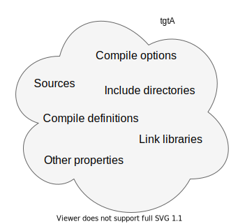

# CMake

* [CMake example from cnblog](https://www.cnblogs.com/faithlocus/category/2053737.html)
* [CMake example from fengbingchun](https://github.com/fengbingchun/Linux_Code_Test/tree/master/Samples_CMake)
* [function vs macro](https://www.cnblogs.com/Braveliu/p/15621973.html)
* Functions:
  * [get_filename_component](https://cmake.org/cmake/help/latest/command/get_filename_component.html)
  * [set](https://www.jianshu.com/p/c2c71d5a09e9)
* [Linux_Code_test for Cmake](https://github.com/fengbingchun/Linux_Code_Test/tree/master)
* [Cmake Cookbook -- Chinese](./CMake-CookBook.pdf)
* [modern cmake from gitlab](https://cliutils.gitlab.io/modern-cmake/)
* [HSF cmake](https://hsf-training.github.io/hsf-training-cmake-webpage/)
* [official cmake documents ](https://cmake.org/cmake/help/latest/)
* **[Mastering CMake](https://cmake.org/cmake/help/book/mastering-cmake/index.html#mastering-cmake)**
* [step by step example](https://github.com/ttroy50/cmake-examples)
* [cmake useful variable](https://gitlab.kitware.com/cmake/community/-/wikis/doc/cmake/Useful-Variables)

| Variable                 | Info                                                         |
| ------------------------ | ------------------------------------------------------------ |
| CMAKE_SOURCE_DIR         | The root source directory                                    |
| CMAKE_CURRENT_SOURCE_DIR | The current source directory if using sub-projects and directories. |
| PROJECT_SOURCE_DIR       | The source directory of the current cmake project.           |
| CMAKE_BINARY_DIR         | The root binary / build directory. This is the directory where you ran the cmake command. |
| CMAKE_CURRENT_BINARY_DIR | The build directory you are currently in.                    |
| PROJECT_BINARY_DIR       | The build directory for the current project.                 |

* [effective_modern_cmake](https://github.com/boostcon/cppnow_presentations_2017)
* [Embracing Modern CMake: How to recognize and use modern CMake interfaces -- Stephen Kelly AT Dublin C++ Meetup](./embracing-modern-cmake.pdf)
* Modern CMake for modular design -- Mathieu Ropert AT CppCon-2017
* More Modern CMake: Working With CMake 3.12 And Later -- Deniz Bahadir AT Meeting C++ 2018
* Compile Dependency

```cmake
target_include_directories (<target> 
<PUBLIC|PRIVATE|INTERFACE> 
[items...])
```

|  |  |
| --------- | ------------------------------------- |
| **PRIVATE** | Needed by me, but **not** my dependers |
| **PUBLIC** | Needed by me **and** my dependers     |
| **INTERFACE** | Needed **not** by me, **but** by my dependers |

* Build Properties

Support <PRIVATE|PUBLIC|INTERFACE> and transtivity

|                                            |                            |
| ------------------------------------------ | -------------------------- |
| **Include Directories**<br />(-I /foo/bar) | target_include_directories |
| **Compile Definitions**<br />(-DSOMEDEF)   | target_compile_definitions |
| **Compile Options**<br />(-fPIC)           | target_compile_options     |
| **Link Libraries**<br />(-l/path/to/lib)   | target_link_libraries      |
| **Sources**                                | target_sources             |

* Avoid unnecessary variables

* [Target-based build systems with CMake](https://coderefinery.github.io/cmake-workshop/targets/#target-based-build-systems-with-cmake)

  ## [Targets](https://coderefinery.github.io/cmake-workshop/targets/#id1)

  A target is declared by either [`add_executable`](https://cmake.org/cmake/help/latest/command/add_executable.html) or [`add_library`](https://cmake.org/cmake/help/latest/command/add_library.html): thus, in broad terms, a target maps to a build artifact in the project.

  You can add custom targets to the build system with [`add_custom_target`](https://cmake.org/cmake/help/latest/command/add_custom_target.html). Custom targets are not necessarily build artifacts.

  Any target has a collection of **properties**, which define *how* the build artifact should be produced **and** *how* it should be used by other dependent targets in the project.

  

  A target is the basic element in the CMake DSL. Each target has *properties*, which can be read with [`get_target_property`](https://cmake.org/cmake/help/latest/command/get_target_property.html) and modified with [`set_target_properties`](https://cmake.org/cmake/help/latest/command/set_target_properties.html).  Compile options, definitions, include directories, source files, link libraries, and link options are properties of targets.[](https://coderefinery.github.io/cmake-workshop/targets/#id2)

  The five most used commands used to handle targets are:

  - [`target_sources`](https://cmake.org/cmake/help/latest/command/target_sources.html)
  - [`target_compile_options`](https://cmake.org/cmake/help/latest/command/target_compile_options.html)
  - [`target_compile_definitions`](https://cmake.org/cmake/help/latest/command/target_compile_definitions.html)
  - [`target_include_directories`](https://cmake.org/cmake/help/latest/command/target_include_directories.html)
  - [`target_link_libraries`](https://cmake.org/cmake/help/latest/command/target_link_libraries.html)

  There are additional commands in the `target_*` family:

  ```
  cmake --help-command-list | grep "^target_"
  
  target_compile_definitions
  target_compile_features
  target_compile_options
  target_include_directories
  target_link_directories
  target_link_libraries
  target_link_options
  target_precompile_headers
  target_sources
  ```

  ## [Properties](https://coderefinery.github.io/cmake-workshop/targets/#properties)

  CMake lets you set properties at many different levels of visibility across the project:

  - **Global scope**. These are equivalent to variables set in the root `CMakeLists.txt`. Their use is, however, more powerful as they can be set from *any* leaf `CMakeLists.txt`.
  - **Directory scope**. These are equivalent to variables set in a given leaf `CMakeLists.txt`.
  - **Target**. These are the properties set on targets that we discussed above.
  - **Test**.
  - **Source files**. For example, compiler flags.
  - **Cache entries**.
  - **Installed files**.

  For a complete list of properties known to CMake:

  ```
  cmake --help-properties | less
  ```

  You can get the current value of any property with [`get_property`](https://cmake.org/cmake/help/latest/command/get_property.html) and set the value of any property with [`set_property`](https://cmake.org/cmake/help/latest/command/set_property.html).

  ## [Visibility levels](https://coderefinery.github.io/cmake-workshop/targets/#visibility-levels)

  It is much more robust to use targets and properties than using variables and here we will discuss why.

  

  Properties on targets have **visibility levels**, which determine how CMake should propagate them between interdependent targets.[](https://coderefinery.github.io/cmake-workshop/targets/#id3)

  Visibility levels `PRIVATE`, `PUBLIC`, or `INTERFACE` are very powerful but not easy to describe and imagine in words. Maybe a better approach to demonstrate what visibility levels is to see it in action.

  We will demonstrate this with a hello world example where somebody went a bit too far with modularity and where we have split the code into 3 libraries and the main function (`content/examples/property-visibility/`):

  ```
  .
  ├── CMakeLists.txt
  ├── greeting
  │   ├── greeting.cpp
  │   └── greeting.hpp
  ├── hello_world
  │   ├── hello_world.cpp
  │   └── hello_world.hpp
  ├── main.cpp
  └── world
      ├── world.cpp
      └── world.hpp
  ```

  Here the main function links to greeting which links to hello_world which links to world.

* Generator Expressions 

  * "Generator Expressions" conditions at **Generate-time**

  * Basics

|                          |                       |
| ------------------------ | --------------------- |
| `$<1:...>`               | ...                   |
| `$<0:...>`               |                       |
| `$<Config:Debug>`        | 1 (in Debug config)   |
| `$<Config:Debug>`        | 0 (in Debug config)   |
| `$<$<Config:Debug>:...>` | ... (in Debug config) |
| `$<$<Config:Debug>:...>` | (in Debug config)     |

  * Truthiness  conversion

`$<$<BOOL:${WIN32}>:...>` at configure time produces

`$<$<BOOL:1>:...>` or `$<$<BOOL:>:...>` at generate-time!

* If conversion

  ```cmake
  target_compile_definitions(foo PRIVATE 
  "VERBOSITY=$<IF:$<CONFIG:Debug>,30,10>")
  ```

* Function

  ```cmake
  function(my_cmd input output)
  # ...
  set(${output} ... PARENT_SCOPE)
  endfunction()
  
  my_cmd(foo bar)
  
  ```
    * variable are scoped to the function, unless set with **PARENT_SCOPE**
    * Available variables: <u>input</u>, <u>output</u>, <u>ARGC</u>, <u>ARGV</u>, <u>ARGN</u>, <u>ARG0</u>, <u>ARG1</u>, <u>ARG2</u>,...
    * Example: `${output}` expands to <u>bar</u>.

* macro

  ```cmake
  macro(my_cmd input output)
  # ...
  endmacro()
  
  my_cmd(foo bar)
  ```

  * No extra scope
  * Text replacements: <u>${input}</u>, <u>${output}</u>, <u>${ARGC}</u>, <u>${ARGV}</u>, <u>${ARGN}</u>, <u>${ARG0}</u>, <u>${ARG1}</u>, <u>${ARG2}</u>,...
  * Example: `${output} `is **replaced by** <u>bar</u>

* Create `macros` to wrap commands that have output parameters.  Otherwise, create  a `function`. 

  * Support for generator expression

  * `target_`  command
  * `file(GENERATE)` command
  * `add_executable/add_library` commands
  * `install` command (partial)
  * `add_custom_target` command (partial)
  * `add_custom_command` command(partial)

There are others, but these are the most important

* Imperative

  ```cmake
  # Compile with USE_THREADS if the WITH_THREADS property is ON
  target_compile_definitions(hello PRIVATE
  $<$<TARGET_PROPERTY:WITH_THREADS>:USE_THREADS>)
  
  set_property(TARGET hello PROPERTY WITH_THREADS ON)
  ```


* target_link_libraries

  * ````cmake
    target_link_libraries(someTarget <item>)
    <item> can be
    * A CMake target
    * A library name on disk
    * A full library path
    * A linker flag
    ````

  * ```cmake
    target_link_libraries(someTarget aTargetName)
    * Link to aTargetName
    * Determine build order
    * Consume usage requirements
    	* Compiling
    	* Linking
    * Determine compatibility
    ```

  * ```cmake
    target_link_libraries(someTarget oopsItsATypo)
    * Check if it is a CMake target name
    * Check if it is a link flag(starts with '-')
    * Check if it is a path
    * Assume it is a libraryname (add -loopsItsATypo)
    ```
    
  * ```cmake
    target_link_libraries(Foo
    PUBLIC Bar::Bar
    PRIVATE Cow::Cow)
    ```

    * Adds <u>Bar::Bar</u> to the target properties **LINK_LIBRARIES** and **INTERFACE_LINK_LIBRARIES**
    * Adds <u>Cow::Cow</u> to the target property **LINK_LIBRARIES**.
    * Effectively adds all **INTERFACE\_<property>** of <u>Bar::Bar</u> to **<property>** and **INTERFACE\_<property>**
    * Effectively adds all **INTERFACE\_<property>** of <u>Cow::Cow</u> to **<property>** 
    * Adds `$<LINK_ONLY:Cow::Cow`> to **INTERFACE_LINK_LIBRARIES**.

* CMake Target types

|                         |                          |
| ----------------------- | ------------------------ |
| **Executables**         | add_executable           |
| **Shared libraries**    | add_library (SHARED) .so |
| **Static libraries**    | add_library (STATIC) .a  |
| **Object libraries**    | add_library (OBJECT)     |
| **Interface libraries** | add_library (INTERFACE)  |
| **Alias libraries**     | add_library (ALIAS)      |

* Interface targets 

  * suitable for header-only libraries

  ```cmake
  add_library(boost_mpl INTERFACE)
  target_compile_definitions(boost_mpl INTERFACE
  BOOST_MPL_CFG_NO_PREPROCESSED_HEADERS)
  target_include_directories(boost_mpl INTERFACE "3rdparty/boost/mpl")
  
  add_executable(my_exe)
  target_link_libraries(my_exe boost_mpl)
  ```

  ```cmake
  add_library(boost_mpl INTERFACE)
  target_compile_definitions(boost_mpl INTERFACE
  BOOST_MPL_CFG_NO_PREPROCESSED_HEADERS)
  target_include_directories(boost_mpl INTERFACE "3rdparty/boost/mpl")
  
  add_library(boost_icl INTERFACE)
  target_link_libraries(boost_icl INTERFACE boost_mpl)
  target_include_directories(boost_icl INTERFACE "3rdparty/boost/icl")
  
  add_executable(my_exe)
  target_link_libraries(my_exe boost_icl)
  ```

  * Group build properties for convenient consumption
  
    ```cmake
    target_link_libraries(windows_specific INTERFACE directX)
    target_compile_definitions(windows_specific INTERFACE USE_DIRECTX)
    target_source(windows_specific INTERFACE network_win.cpp)
    
    add_library(platform_specific INTERFACE)
    target_link_libraries(platform_specific INTERFACE
    $<$<BOOL:${WIN32}>:windows_specific>
    $<$<NOT:$<BOOL:${WIN32}>>:posix_specific> )
    ```
  
* Dependencies

  ```cmake
  cmake_minimum_required(VERSION 3.5)
  project(myproject)
  
  find_package(Qt5Widgets REQUIRED)
  find_package(Qt53D REQUIRED)
  
  add_executable(hellowrold main.cpp)
  target_link_libraries(helloworld Qt5::Widgets Qt5::3DCore)
  ```

  ```cmake
  cmake_minimum_required(VERSION 3.5)
  project(myproject)
  
  find_package(Qt5Widgets REQUIRED)
  
  add_library(locallib STATIC locallib.cpp)
  target_link_libraries(locallib PUBLIC Qt5::Widgets)
  
  add_executable(hello main.cpp)
  target_link_libraries(hello locallib)
  ```

* Imagine Targets as Objects

  * Constructors:
    * add_executable()
    * add_library()
  * Member variables
    * too many to list here
  * Member functions
    * get_target_property()
    * set_target_properties()
    * get_property(TARGET)
    * set_property(TARGET)
    * target_compile_definitions()
    * target_compile_features()
    * target_compile_options()
    * target_include_directories()
    * target_link_libraries()
    * target_sources()

  

