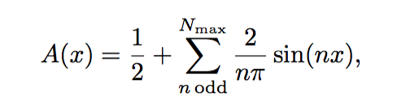
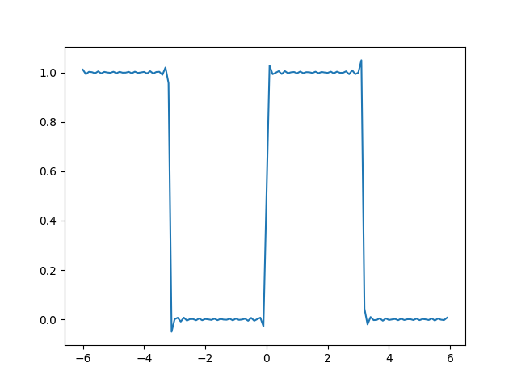
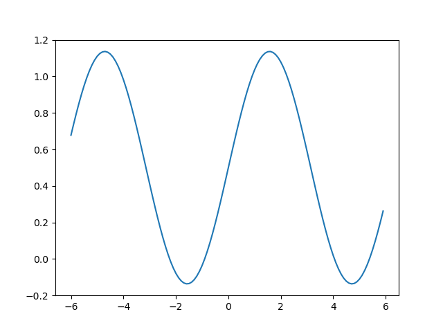

# Python 

<!-- vim-markdown-toc GFM -->

* [vscode](#vscode)
* [Minutes of Python](#minutes-of-python)
* [miniconda3](#miniconda3)
* [plotting a square wave(python) using a Fourier series](#plotting-a-square-wavepython-using-a-fourier-series)

<!-- vim-markdown-toc -->

## [upgrade python](python%20upgrade.md)

## [keyoscacquire is a Python package for acquiring traces from Keysight oscilloscopes through a VISA interface.](https://keyoscacquire.readthedocs.io/en/stable/index.html)

[gitlab](https://github.com/asvela/keyoscacquire)

## vscode

    The folder locations will vary depending on your platform:

    Windows - Delete %APPDATA%\Code and %USERPROFILE%\.vscode.
    macOS - Delete $HOME/Library/Application Support/Code and ~/.vscode.
    Linux - Delete $HOME/.config/Code and ~/.vscode.

   * [portable mode](https://code.visualstudio.com/docs/editor/portable)
   * [Proxy server support](https://code.visualstudio.com/docs/setup/network)
   
        start the program with `--proxy-server=http://myproxy.example.com:3128`
        
   * [Using Python environments in VS Code](https://code.visualstudio.com/docs/python/environments)
   
        1. submodule location: `D:\python\tk\.venv\lib\site-packages\`

   * [Python in Visual Studio Code](https://code.visualstudio.com/docs/languages/python)
   
   * [无法加载文件venv\Scripts\Activate.ps1 ](https://blog.csdn.net/ayiya_Oese/article/details/119864185)
   
        1. powershell at administrate mode : `set-executionpolicy remotesigned`
        2. powershell within vscode : `& d:/python/tk/.venv/Scripts/Activate.ps1` 
   
   * [pip timeout](https://stackoverflow.com/questions/50305112/pip-install-timeout-issue)

        `PIP` has a default timeout of 15 sec. `Pandas` is a relatively big file, at 10MB, and it's dependant `Numpy`, at 20MB could still be needed (if it is not installed already.). In addition, your network connection may be slow. Therefore, set `PIP` to take longer time by, for example, giving it 1000 sec:

        `pip --default-timeout=1000 install pandas`

## [Minutes of Python](./minutes.md)

## [miniconda3](https://docs.conda.io/en/latest/miniconda.html)

    conda install numpy
    conda create -n myenv python=3
    conda update conda
    conda env list
    conda activate myenv
    conda deactivate
    
## [Python GUI Programming With Tkinter](https://realpython.com/python-gui-tkinter/)

## [plotting a square wave(python) using a Fourier series](https://stackoverflow.com/questions/46672128/my-code-is-not-plotting-a-square-wavepython-using-a-fourier-series)

Below image represents the Fourier function

   

Source code shows as below

    import matplotlib.pyplot as plt
    import numpy as np
    
    N_max = 101
    n_odds = np.arange(1,N_max,2)
    xs = np.arange(-6,6,0.1)
    ys = []
    for x in xs:
        sum_terms = []
        for n_odd in n_odds:
            frac_term = 2/(n_odd*np.pi)
            sin_term = np.sin(n_odd*x)
            sum_term = frac_term*sin_term
            sum_terms.append(sum_term)
    
        y = 0.5+sum(sum_terms)
        ys.append(y)
    
    plt.plot(xs, ys)
    plt.show()

The plot with `N_max = 101` show as below

   

The plot with `N_max = 3` show as below

   

