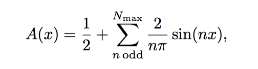
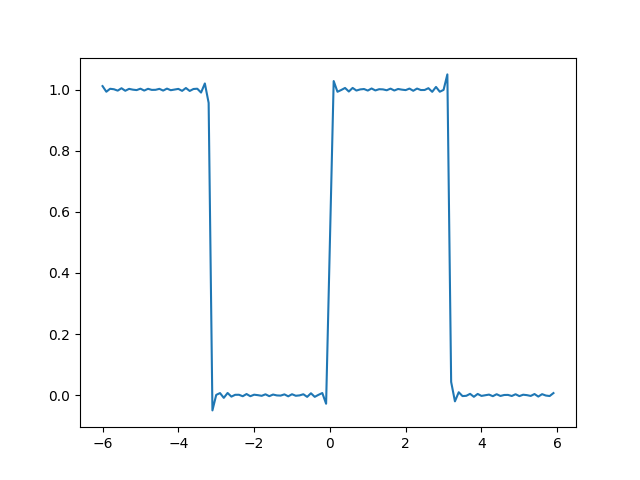
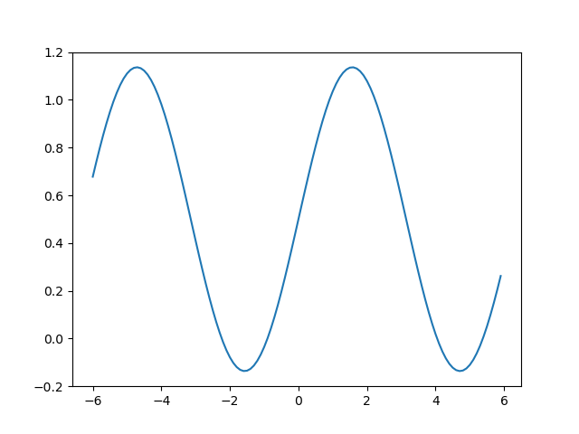

# Python 

## [miniconda3](https://docs.conda.io/en/latest/miniconda.html)

    conda install numpy
    conda create -n myenv python=3
    conda update conda
    conda env list
    conda activate myenv
    conda deactivate

## [plotting a square wave(python) using a Fourier series](https://stackoverflow.com/questions/46672128/my-code-is-not-plotting-a-square-wavepython-using-a-fourier-series)

Below image represents the Fourier function

   

Source code shows as below

    import matplotlib.pyplot as plt
    import numpy as np
    
    N_max = 101
    n_odds = np.arange(1,N_max,2)
    xs = np.arange(-6,6,0.1)
    ys = []
    for x in xs:
        sum_terms = []
        for n_odd in n_odds:
            frac_term = 2/(n_odd*np.pi)
            sin_term = np.sin(n_odd*x)
            sum_term = frac_term*sin_term
            sum_terms.append(sum_term)
    
        y = 0.5+sum(sum_terms)
        ys.append(y)
    
    plt.plot(xs, ys)
    plt.show()

The plot with `N_max = 101` show as below

   

The plot with `N_max = 3` show as below

   

