# Reference

https://unix.stackexchange.com/questions/487823/sort-lines-according-to-date-and-time

https://www.howtogeek.com/562941/how-to-use-the-awk-command-on-linux/

https://stackoverflow.com/questions/20094997/merge-lines-between-two-patterns-using-sed

https://stackoverflow.com/questions/36100615/merge-multiple-lines-between-same-pattern-into-a-single-line-using-awk-sed

https://stackoverflow.com/questions/58717878/how-to-join-lines-between-two-patterns-in-sed-or-awk

https://stackoverflow.com/questions/5410757/how-to-delete-from-a-text-file-all-lines-that-contain-a-specific-string

https://sysadmin.lk/awk-regular-expressions-filter-text-string-files/

https://linuxhandbook.com/awk-command-tutorial/

[grep a block of text delimited by two key lines](https://stackoverflow.com/questions/19926634/grep-a-block-of-text-delimited-by-two-key-lines)

```shell
awk '/Beginning of block/ {p=1};
     {if (p==1) {a[NR]=$0}};
     /some_pattern/ {f=1};
     /End of block/ {p=0; if (f==1) {for (i in a) print a[i]};f=0; delete a}' file
```

[How to print an array in defined order in AWK 3.1.3](https://stackoverflow.com/questions/16075582/how-to-print-an-array-in-defined-order-in-awk-3-1-3)

Just keep a second array order with numerical indices and the keys for the first array as the values. You can then iterate through order in sequence and look up the values of array:
```shell
for (i = 1; i < length(order); i++) {
  print order[i], array[order[i]]
}
```
When building order, you may want to check whether the key is already present in array, to prevent the keys of array being shown multiple times. 

https://www.grymoire.com/Unix/Awk.html

[How do I escape a field variable in an awk command in an alias](https://stackoverflow.com/questions/3110580/how-do-i-escape-a-field-variable-in-an-awk-command-in-an-alias)

Wrap the alias w/ ' and use '\'' for the embedded '.  

```tcsh
alias testawk 'awk '\''{print $2}'\'' file'
```

------------------------------------------------------------------------------------------

```shell
echo "" | awk '{print "Current date is:" , d }' d="`echo "this is a test" | sed -e 's/est/EST/'`"
```

```shell
echo "" | awk '{cmd="echo this is a test | sed -e 's/est/EST/'"; while((cmd | getline a)>0) print a;}'
```

```shell
echo "" | awk 'BEGIN{printf "%10s | %10s | %10s", "CWD","Done at","Elapse time(h)"}; /Done Successfully/ {b=gensub(/(.*): Done.*/,"\\1","g");c=gensub(/.* CPU time used is (.*)\..*/,"\\1","g");printf "%s | %s | %s\n",a,b,c/3600;next} /Execution CWD/ {a=gensub(/.*CWD <(.*)>,.*/,"\\1","g"}'
```

# How to Call an External Program Using awk

## 1. Overview

The [*awk*](https://www.baeldung.com/linux/awk-guide) command is a very powerful text processing tool. Using it, we can solve [various text processing problems](https://www.baeldung.com/linux/tag/awk) in the Linux command-line.

In this tutorial, we’ll look at how to call an external program from an *awk* script.

## 2. Call External Command From *awk*

Even though *awk* is a powerful utility, sometimes we need the assistance of external commands to solve some problems.

For example:

- *awk + sendmail:* Read a CSV file containing email addresses and messages, and process and send each message
- *awk + cp:* Read input of a file list, and copy the files to a required destination with a defined name pattern
- *awk + md5sum:* Read input containing a list of filenames, output the filename and the MD5 hash of the file

**When we call an external command from \*awk\*, depending on the requirement, usually we want to get either the returned status or the output of the command.**

For instance, in the *awk + cp* example above, we want to get the return status of the *cp* command to know if the copy has been done successfully. While in the *awk + md5sum* example, we need the output of the *md5sum* command so that our script can produce the right output.

In later sections, we’ll see how to handle these two cases through examples.

## 3. Get the Execution Status of an External Command

We’ll address how to get the returned status of an external command  by solving a file backup problem. Let’s have a look at our input file:

```bash
$ cat /tmp/test/file_list.csv 
Id,Filename,Create_date
1,"/tmp/test/source/file1.txt",2020-06-01
2,"/tmp/test/source/file2.pdf",2020-05-01
3,"/tmp/test/source/file3.txt",2020-06-03
4,"/tmp/test/source/file4.zip",2020-06-07
```

As the name *file_list.csv* says, it is a CSV file. It contains filenames in the second field. According to this file, we have the files under the */tmp/test/source* directory:

```bash
$ ls -l /tmp/test/source
-rw-r--r-- 1 kent kent   30 Jun  7 00:13 file1.txt
-rw-r--r-- 1 kent kent   36 Jun  7 00:13 file2.pdf
-rwx------ 1 root root 1752 Jun  7 00:10 file3.txt
-rw-r--r-- 1 kent kent   37 Jun  7 00:13 file4.zip
```

The requirement is, we’ll copy the files in the second field to */tmp/test/backup* and add a new field in the CSV file called “*Backup_status*” to record if the backup status of the corresponding file is *“Success”* or “*Failed*“.

If we read the *ls* output above carefully, we’ll notice that the *file3.txt* has a permission *700.* We’ll get “permission denied” error if we attempt to read it by a regular  user. Therefore, we expect that the backup status of the *file3.txt* should be “*Failed*” in the output.

***awk*‘s  *system(cmd)* function can call an external command and get the exit status.** This function is the key to solving the problem.

First, let’s have a look at how the problem gets solved:

```bash
kent$ awk -F',' -v OFS=',' -v toDir="/tmp/test/backup"     \
        'NR==1{print $0,"Backup_status"; next}
        { backup_cmd = "cp " $2 " " toDir " >/dev/null 2>&1"
          st = system(backup_cmd)
          print $0, ( st==0? "Success" : "Failed" ) }' /tmp/test/file_list.csv
Id,Filename,Create_date,Backup_status
1,"/tmp/test/source/file1.txt",2020-06-01,Success
2,"/tmp/test/source/file2.pdf",2020-05-01,Success
3,"/tmp/test/source/file3.txt",2020-06-03,Failed
4,"/tmp/test/source/file4.zip",2020-06-07,Success
```

After we executed the *awk* command, all files with backup status “*Success*” have been copied to the expected directory:

```bash
$ ls /tmp/test/backup 
file1.txt  file2.pdf  file4.zip
```

Now, let’s go through the *awk* code line by line to understand how it works:

- Line #1: Start the *awk* command by a regular user *kent* and set the required variables such as *[FS](https://www.baeldung.com/linux/awk-guide#2-input-fields)* and *[OFS](https://www.baeldung.com/linux/awk-guide#3-output-fields-and-records)*
- Line #2: Extend the title by adding a new field: *Backup_status* and print the title
- Line #3: Construct the copy command and discard all outputs by redirecting both *stdout* and *stderr* to */dev/null*
- Line #4: Call the *system()* function and hold the exit status in a variable *st*
- Line #5: Print the output with the backup status information (*st==0* means *Success*)

## 4. Get the Output of an External Command

We’ve seen how to call an external program and get the exit status from *awk* code. However, sometimes we’d like to use the output of an external command to do further processing.

A command can produce a single line output or multiple lines of output. In this section, we’ll discuss how to handle both cases.

### 4.1. Get a Single Line Output From an External Command

Let’s start with a problem as well.

We’ll reuse the same input file */tmp/test/file_list.csv*. This time, we want to add a new column “*MIME_type*” in the CSV file, to show the [MIME Type](https://www.baeldung.com/linux/file-mime-types) of each file.

To get the MIME type, we can make use of the *[file](https://www.baeldung.com/linux/file-mime-types#2-the-file-command)* command. For example, we can get the MIME type of the file */tmp/test/source/file1.txt* in this way:

```bash
$ file -b --mime-type file1.txt
text/plain
```

Good. So far, the only missing part of solving our problem is how to call the *file* command and get the output from our *awk* script.

***In awk, there is a multi-functional command called [getline](https://www.gnu.org/software/gawk/manual/html_node/Getline.html). We can pipe a constructed command to the getline command and save the output of the command to a variable with this syntax:***

```bash
"an external command" | getline variable
```

For example, if we want to save the output of our *file* command to an *awk* variable *result*, we can write in this way:

```bash
"file -b --mime-type file1.txt" | getline result
```

Now, let’s assemble the things and solve our adding MIME type problem:

```bash
kent$ awk -F',' -v OFS=','                     \
        'NR==1{print $0,"MIME_type"; next}
        { cmd = "file -b --mime-type " $2
          cmd | getline result
          close(cmd)
          print $0, result }' /tmp/test/file_list.csv
Id,Filename,create_date,MIME_type
1,"/tmp/test/source/file1.txt",2020-06-01,text/plain
2,"/tmp/test/source/file2.pdf",2020-05-01,application/pdf
3,"/tmp/test/source/file3.txt",2020-06-03,regular file, no read permission
4,"/tmp/test/source/file4.zip",2020-06-07,application/zip
```

Since we executed the command with the regular user *kent*, we got an error message when we called the *file* command on the *file3.txt*. This error message is also added to the output.

Getting a single line output by piping the command to the *getline* command is pretty straightforward.

Can we get the multi-line output still using the same method? Let’s find out in the next section.

### 4.2. Get Multi-Line Output From an External Command

Some commands may produce multi-line output. Let’s try if we can get complete output using the *cmd | getline v* approach:

```bash
$ awk 'BEGIN{cmd="seq 10"; cmd | getline out; close(cmd); print out}'
1
```

Oops! We know that the command *seq 10* will produce a ten lines output. However, our *awk* only fetched the first line from the output. This is because **this form of the *getline* command reads one record at a time from the pipe.** 

The *getline* command itself has a return value. If there is still output coming from the pipe, it returns 1. Otherwise, the *getline* command will return 0:

```bash
$  awk 'BEGIN{cmd="seq 10";
        for(i=1;i<=11;i++) {
            retValue = cmd | getline out
            printf "getline returns: %s; cmd output: %s\n", retValue, retValue?out:"Null"                 
        }           
        close(cmd)}'
getline returns: 1; cmd output: 1
getline returns: 1; cmd output: 2
getline returns: 1; cmd output: 3
getline returns: 1; cmd output: 4
getline returns: 1; cmd output: 5
getline returns: 1; cmd output: 6
getline returns: 1; cmd output: 7
getline returns: 1; cmd output: 8
getline returns: 1; cmd output: 9
getline returns: 1; cmd output: 10
getline returns: 0; cmd output: Null
```

We write a loop to run *getline* 11 times. We know that the command *seq 10* will output ten lines. Therefore, we have ten *getline returns: 1* in the output above.

However, after the *cmd output: 10* is printed, the pipe doesn’t contain data anymore. Now, if we run the *getline* command and try to read from the pipe once again, the command will return a 0.

Therefore, we can write a *while* loop to get the complete output from an external command:

```bash
$ awk 'BEGIN{cmd="seq 10";
       cmd_out=""
       while(cmd | getline step_out){
          cmd_out=cmd_out (cmd_out=="" ? "" : "\n") step_out
       }
       print cmd_out
       close(cmd)}'
1
2
3
4
5
6
7
8
9
10
```

or 

```bash
awk 'BEGIN{while("seq 3" | getline x) print "output: " x}'
output: 1
output: 2
output: 3
```

### 4.3. Don’t Forget the *close(cmd)*

We’ve seen examples to get the output of external command using the *cmd | getline variable.* 

It’s worthwhile to mention that **we must call *close(cmd)* to close the pipe after calling the *cmd | getline*. Otherwise, our *awk* script may produce the wrong result.**

Let’s have a look at what would happen if we don’t close the pipe. For example, say we have a text file:

```bash
$ cat close_test.txt
"Awk is cool!"
"Sed is cool!"
"Awk is cool!"
"Sed is cool!"
```

In the file, the first line and the third line are identical, so are the second line and the last line.

Now we want for each line in the input file, to call the external *[md5sum](https://www.man7.org/linux/man-pages/man1/md5sum.1.html)* command to append the MD5 hash value on each line. We’re expecting the  identical lines should get the same MD5 hash values. In the first try,  we don’t call the *close(cmd)* to close the pipe:

```bash
$ awk '{cmd="md5sum <<<"$0 ; cmd|getline md5; print $0,"MD5:" md5}' close_test.txt
"Awk is cool!" MD5:04cbd36582f5c11cce032ec44ec476d8  -
"Sed is cool!" MD5:f1844ba1dd262ecbbf798f7c38180693  -
"Awk is cool!" MD5:f1844ba1dd262ecbbf798f7c38180693  -
"Sed is cool!" MD5:f1844ba1dd262ecbbf798f7c38180693  -
```

The output shows that the MD5 hash values for the last three lines are the same. Obviously, this is a wrong output.

Let’s explain shortly why has this happened.

**If we don’t close the pipe, every time piping the same external command to the *getline*, it will not execute the command once again. Instead, it will attempt to read the next record from the output of the last execution.** We know that the *cmd | getline var* command will return either 1 or 0. If there’s no data in the pipe anymore, it will return 0, and the *var* variable will not be set.

Let’s reset the *md5* variable for each input line and print out the *getline* status to understand the problem easier:

```bash
$ awk '{md5=""; cmd="md5sum <<<"$0 
      status=cmd|getline md5; 
      print $0,"getline status:"status,"MD5:" md5}' close_test.txt
"Awk is cool!" getline status:1 MD5:04cbd36582f5c11cce032ec44ec476d8  -
"Sed is cool!" getline status:1 MD5:f1844ba1dd262ecbbf798f7c38180693  -
"Awk is cool!" getline status:0 MD5:
"Sed is cool!" getline status:0 MD5:
```

The fix to the problem is just calling the *close(cmd)* after we’ve read the output from the pipe:

```bash
$ awk '{cmd="md5sum <<<"$0 ; cmd|getline md5;close(cmd); print $0,"MD5:" md5}' close_test.txt
"Awk is cool!" MD5:04cbd36582f5c11cce032ec44ec476d8  -       
"Sed is cool!" MD5:f1844ba1dd262ecbbf798f7c38180693  -
"Awk is cool!" MD5:04cbd36582f5c11cce032ec44ec476d8  -
"Sed is cool!" MD5:f1844ba1dd262ecbbf798f7c38180693  -
```

## 5. Conclusion

In this article, we’ve learned how to call an external program using *awk*.

Depending on the requirement, we can call the *system(cmd)* to get the exit code of the external command, or get the output using the *cmd | getline* form.

We also discussed why we shouldn’t forget calling the *close(cmd)* to close the pipe.


# [The GNU Awk User’s Guide](https://www.gnu.org/software/gawk/manual/gawk.html#SEC_Contents)

# AWK – General

## Rules, Patterns, and Actions

`awk` works on programs that contain rules comprised of  patterns and actions. The action is executed on the text that matches  the pattern. Patterns are enclosed in curly braces (`{}`). Together, a pattern and an action form a rule. The entire `awk` program is enclosed in single quotes (`'`).


Let’s take a look at the simplest type of `awk` program. It has no pattern, so it matches every line of text fed into it. This means the action is executed on every line.


By default, `awk` considers a field to be a string of  characters surrounded by whitespace, the start of a line, or the end of a line. Fields are identified by a dollar sign (`$`) and a number. So, `$1` represents the first field, which we’ll use with the `print` action to print the first field.


We type the following:

```
who | awk '{print $1}'
```


`awk` prints the first field and discards the rest of the line.

We can print as many fields as we like. If we add a comma as a separator, `awk` prints a space between each field.

We type the following to also print the time the person logged in (field four):

```
who | awk '{print $1,$4}'
```


There are a couple of special field identifiers. These represent the entire line of text and the last field in the line of text:

- **$0**: Represents the entire line of text.
- **$1**: Represents the first field.
- **$2**: Represents the second field.
- **$7**: Represents the seventh field.
- **$45**: Represents the 45th field.
- **$NF**: Stands for “number of fields,” and represents the last field.

## Adding Output Field Separators

You can also tell `awk` to print a particular character between fields instead of the default space character. The default output from the `date` [command is slightly peculiar](http://man7.org/linux/man-pages/man1/date.1.html) because the time is plonked right in the middle of it. However, we can type the following and use `awk` to extract the fields we want:

```shell
date
date | awk '{print $2,$3,$6}'
```


We’ll use the `OFS` (output field separator) variable to  put a separator between the month, day, and year. Note that below we  enclose the command in single quotes (`'`), not curly braces (`{}`):

```shell
date | awk 'OFS="/" {print$2,$3,$6}'
date | awk 'OFS="-" {print$2,$3,$6}'
```


## The BEGIN and END Rules

A `BEGIN` rule is executed once before any text processing starts. In fact, it’s executed before `awk` even reads any text. An `END` rule is executed after all processing has completed. You can have multiple `BEGIN` and `END` rules, and they’ll execute in order.

Note the `BEGIN` rule has its own set of actions enclosed within its own set of curly braces (`{}`).

We can use this same technique with the command we used previously to pipe output from `who` into `awk`. To do so, we type the following:

```
who | awk 'BEGIN {print "Active Sessions"} {print $1,$4}'
```

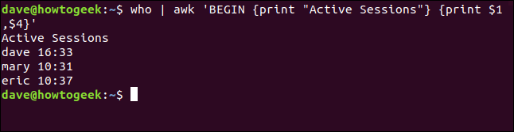

## Input Field Separators

If you want `awk` to work with text that doesn’t use  whitespace to separate fields, you have to tell it which character the  text uses as the field separator. For example, the `/etc/passwd` file uses a colon (`:`) to separate fields.

We’ll use that file and the `-F` (separator string) option to tell `awk` to use the colon (`:`) as the separator. We type the following to tell `awk` to print the name of the user account and the home folder:

```
awk -F: '{print $1,$6}' /etc/passwd
```


The output contains the name of the user account (or application or  daemon name) and the home folder (or the location of the application).

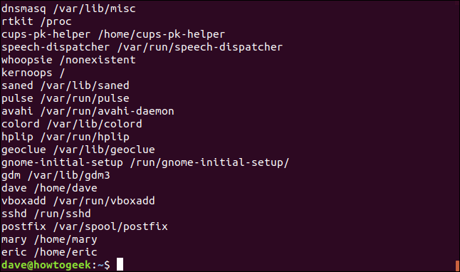

## Adding Patterns

If all we’re interested in are regular user accounts, we can include a pattern with our print action to filter out all other entries. Because [User ID](https://en.wikipedia.org/wiki/User_identifier) numbers are equal to, or greater than, 1,000, we can base our filter on that information.

We type the following to execute our print action only when the third field (`$3`) contains a value of 1,000 or greater:

```
awk -F: '$3 >= 1000 {print $1,$6}' /etc/passwd
```

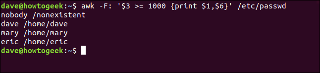

The pattern should immediately precede the action with which it’s associated.

We can use the `BEGIN` rule to provide a title for our little report. We type the following, using the (`\n`) notation to insert a newline character into the title string:

```
awk -F: 'BEGIN {print "User Accounts\n-------------"} $3 >= 1000 {print $1,$6}' /etc/passwd
```

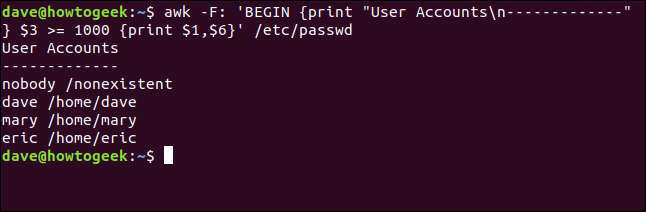

Patterns are full-fledged [regular expressions](https://en.wikipedia.org/wiki/Regular_expression), and they’re one of the glories of `awk`.

Let’s say we want to see the universally unique identifiers (UUIDs) of the mounted file systems. If we search through the `/etc/fstab` file for occurrences of the string “UUID,” it ought to return that information for us.

We use the search pattern “/UUID/” in our command:

```
awk '/UUID/ {print $0}' /etc/fstab
```

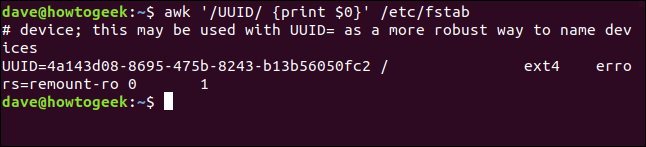

It finds all occurrences of “UUID” and prints those lines. We actually would’ve gotten the same result without the `print` action because the default action prints the entire line of text. For  clarity, though, it’s often useful to be explicit. When you look through a script or your history file, you’ll be glad you left clues for  yourself.

The first line found was a comment line, and although the “UUID” string is in the middle of it, `awk` still found it. We can tweak the regular expression and tell `awk` to process only lines that start with “UUID.” To do so, we type the following which includes the start of line token (`^`):

```
awk '/^UUID/ {print $0}' /etc/fstab
```

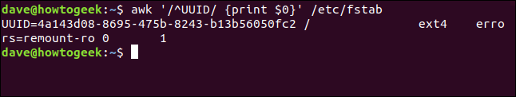

That’s better! Now, we only see genuine mount instructions. To refine the output even further, we type the following and restrict the display to the first field:

```
awk '/^UUID/ {print $1}' /etc/fstab
```


If we had multiple file systems mounted on this machine, we’d get a neat table of their UUIDs.

## Built-In Functions

`awk` has [many functions you can call and use in your own programs](https://www.gnu.org/software/gawk/manual/gawk.html#Built_002din), both from the command line and in scripts. If you do some digging, you’ll find it very fruitful.

To demonstrate the general technique to call a function, we’ll look  at some numeric ones. For example, the following prints the square root  of 625:

```
awk 'BEGIN { print sqrt(625)}'
```

This command prints the arctangent of 0 (zero) and -1 (which happens to be the mathematical constant, pi):

```
awk 'BEGIN {print atan2(0, -1)}'
```

In the following command, we modify the result of the `atan2()` function before we print it:

```
awk 'BEGIN {print atan2(0, -1)*100}'
```

Functions can accept expressions as parameters. For example, here’s a convoluted way to ask for the square root of 25:

```
awk 'BEGIN { print sqrt((2+3)*5)}'
```

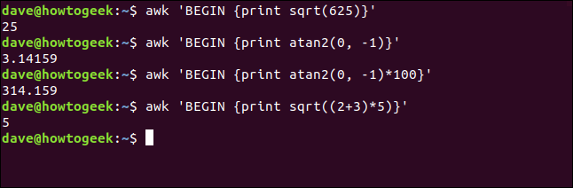

## awk Scripts

If your command line gets complicated, or you develop a routine you know you’ll want to use again, you can transfer your `awk` command into a script.

In our example script, we’re going to do all of the following:

- Tell the shell which executable to use to run the script.
- Prepare `awk` to use the `FS` field separator variable to read input text with fields separated by colons (`:`).
- Use the `OFS` output field separator to tell `awk` to use colons (`:`) to separate fields in the output.
- Set a counter to 0 (zero).
- Set the second field of each line of text to a blank value (it’s always an “x,” so we don’t need to see it).
- Print the line with the modified second field.
- Increment the counter.
- Print the value of the counter.

Our script is shown below.

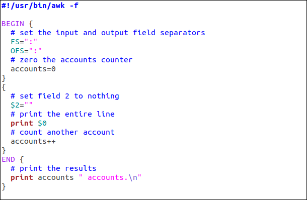

The `BEGIN` rule carries out the preparatory steps, while the `END` rule displays the counter value. The middle rule (which has no name,  nor pattern so it matches every line) modifies the second field, prints  the line, and increments the counter.

The first line of the script tells the shell which executable to use (`awk`, in our example) to run the script. It also passes the `-f` (filename) option to `awk`, which informs it the text it’s going to process will come from a file. We’ll pass the filename to the script when we run it.

We’ve included the script below as text so you can cut and paste:

```
#!/usr/bin/awk -f

BEGIN {
  # set the input and output field separators
  FS=":"
  OFS=":"
  # zero the accounts counter
  accounts=0
}
{
  # set field 2 to nothing
  $2=""
  # print the entire line
  print $0
  # count another account
  accounts++
}
END {
  # print the results
  print accounts " accounts.\n"
}
```

Save this in a file called `omit.awk`. To [make the script executabl](http://man7.org/linux/man-pages/man1/chmod.1.html)[e](http://man7.org/linux/man-pages/man1/chmod.1.html), we type the following using `chmod`:

```
chmod +x omit.awk
```


Now, we’ll run it and pass the `/etc/passwd` file to the script. This is the file `awk` will process for us, using the rules within the script:

```
./omit.awk /etc/passwd
```


The file is processed and each line is displayed, as shown below.

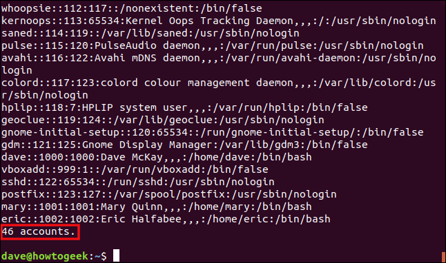

The “x” entries in the second field were removed, but note the field  separators are still present. The lines are counted and the total is  given at the bottom of the output.

## awk Doesn’t Stand for Awkward

`awk` doesn’t stand for awkward; it stands for elegance.  It’s been described as a processing filter and a report writer. More  accurately, it’s both of these, or, rather, a tool you can use for both  of these tasks. In just a few lines, `awk` achieves what requires extensive coding in a traditional language.

That power is harnessed by the simple concept of rules that contain  patterns, that select the text to process, and actions that define the  processing.


## Counting and Printing Matched Pattern

Let us see an example where you can count and print the number of lines for which a pattern match succeeded.

**Example**

```
[jerry]$ awk '/a/{++cnt} END {print "Count = ", cnt}' marks.txt
```

On executing this code, you get the following result −

**Output**

```
Count = 4
```

In this example, we increment the value of counter when a pattern  match succeeds and we print this value in the END block. Note that  unlike other programming languages, there is no need to declare a  variable before using it.

## Printing Lines with More than 18 Characters

Let us print only those lines that contain more than 18 characters.

**Example**

```
[jerry]$ awk 'length($0) > 18' marks.txt
```

On executing this code, you get the following result −

**Output**

```
3) Shyam   Biology   87
4) Kedar   English   85
```

AWK provides a built-in **length** function that returns the length of the string. **$0** variable stores the entire line and in the absence of a body block,  default action is taken, i.e., the print action. Hence, if a line has  more than 18 characters, then the comparison results true and the line  gets printed.

AWK – Built-in Variables

AWK provides several built-in variables. They play an important role  while writing AWK scripts. This chapter demonstrates the usage of  built-in variables.

## Standard AWK variables

The standard AWK variables are discussed below.

### ARGC

It implies the number of arguments provided at the command line.

**Example**

```
[jerry]$ awk 'BEGIN {print "Arguments =", ARGC}' One Two Three Four
```

On executing this code, you get the following result −

**Output**

```
Arguments = 5
```

But why AWK shows 5 when you passed only 4 arguments? Just check the following example to clear your doubt.

### ARGV

It is an array that stores the command-line arguments. The array’s valid index ranges from 0 to ARGC-1.

**Example**

```
[jerry]$ awk 'BEGIN { 
   for (i = 0; i < ARGC - 1; ++i) { 
      printf "ARGV[%d] = %s\n", i, ARGV[i] 
   } 
}' one two three four
```

On executing this code, you get the following result −

**Output**

```
ARGV[0] = awk
ARGV[1] = one
ARGV[2] = two
ARGV[3] = three
```

### CONVFMT

It represents the conversion format for numbers. Its default value is **%.6g**.

**Example**

```
[jerry]$ awk 'BEGIN { print "Conversion Format =", CONVFMT }'
```

On executing this code, you get the following result −

**Output**

```
Conversion Format = %.6g
```

### ENVIRON

It is an associative array of environment variables.

**Example**

```
[jerry]$ awk 'BEGIN { print ENVIRON["USER"] }'
```

On executing this code, you get the following result −

**Output**

```
jerry
```

To find names of other environment variables, use **env** command.

You can use bash variables without ENVIRON variables like this:

```
$  echo | awk -v home=$HOME '{print "My home is " home}'
```

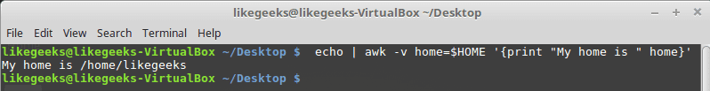

### FILENAME

It represents the current file name.

**Example**

```
[jerry]$ awk 'END {print FILENAME}' marks.txt
```

On executing this code, you get the following result −

**Output**

```
marks.txt
```

Please note that FILENAME is undefined in the BEGIN block.

### FS

It represents the (input) field separator and its default value is space. You can also change this by using **-F** command line option.

**Example**

```
[jerry]$ awk 'BEGIN {print "FS = " FS}' | cat -vte
```

On executing this code, you get the following result −

**Output**

```
FS =  $
```

### NF

It represents the number of fields in the current record. For  instance, the following example prints only those lines that contain  more than two fields.

**Example**

```
[jerry]$ echo -e "One Two\nOne Two Three\nOne Two Three Four" | awk 'NF > 2'
```

On executing this code, you get the following result −

**Output**

```
One Two Three
One Two Three Four
```

### NR

**Awk RS** defines a line. Awk reads line by line by default.

Let us take students marks are stored in a file, each records are  separated by double new line, and each fields are separated by a new  line character.

```
$cat student.txt
Jones
2143
78
84
77

Gondrol
2321
56
58
45

RinRao
2122
38
37
65

Edwin
2537
78
67
45

Dayan
2415
30
47
20
```

Now the below Awk script prints the Student name and Rollno from the above input file.

```
$cat student.awk
BEGIN {
	RS="\n\n";
	FS="\n";

}
{
	print $1,$2;
}

$ awk -f student.awk  student.txt
Jones 2143
Gondrol 2321
RinRao 2122
Edwin 2537
Dayan 2415
```

In the script student.awk, it reads each student detail as a single  record,because awk RS has been assigned to double new line character and each line in a record is a field, since FS is newline character.

It represents the number of the current record. For instance, the  following example prints the record if the current record contains less  than three fields.

**Example**

```
[jerry]$ echo -e "One Two\nOne Two Three\nOne Two Three Four" | awk 'NR < 3'
```

On executing this code, you get the following result −

**Output**

```
One Two
One Two Three
```

### FNR

It is similar to NR, but relative to the current file. It is useful  when AWK is operating on multiple files. Value of FNR resets with new  file.

### OFMT

It represents the output format number and its default value is **%.6g**.

**Example**

```
[jerry]$ awk 'BEGIN {print "OFMT = " OFMT}'
```

On executing this code, you get the following result −

**Output**

```
OFMT = %.6g
```

### OFS

It represents the output field separator and its default value is space.

**Example**

```
[jerry]$ awk 'BEGIN {print "OFS = " OFS}' | cat -vte
```

On executing this code, you get the following result −

**Output**

```
OFS =  $
```

### ORS

It represents the output record separator and its default value is newline.

**Example**

```
[jerry]$ awk 'BEGIN {print "ORS = " ORS}' | cat -vte
```

On executing the above code, you get the following result −

**Output**

```
ORS = $
$
```

### RLENGTH

It represents the length of the string matched by **match** function. AWK’s match function searches for a given string in the input-string.

**Example**

```
[jerry]$ awk 'BEGIN { if (match("One Two Three", "re")) { print RLENGTH } }'
```

On executing this code, you get the following result −

**Output**

```
2
```

### RS

It represents (input) record separator and its default value is newline.

**Example**

```
[jerry]$ awk 'BEGIN {print "RS = " RS}' | cat -vte
```

On executing this code, you get the following result −

**Output**

```
RS = $
$
```

Suppose that your data are distributed on different lines like the following:

```
Person Name
123 High Street
(222) 466-1234

Another person
487 High Street
(523) 643-8754
```

In the above example, awk fails to process fields properly because the fields are separated by newlines and not spaces.

You need to set the `FS` to the `newline (\n) `and the `RS` to a `blank` text, so empty lines will be considered separators.

```
$ awk 'BEGIN{FS="\n"; RS=""} {print $1,$3}' addresses
```

### RSTART

It represents the first position in the string matched by **match** function.

**Example**

```
[jerry]$ awk 'BEGIN { if (match("One Two Three", "Thre")) { print RSTART } }'
```

On executing this code, you get the following result −

**Output**

```
9
```

### SUBSEP

It represents the separator character for array subscripts and its default value is **\034**.

**Example**

```
[jerry]$ awk 'BEGIN { print "SUBSEP = " SUBSEP }' | cat -vte
```

On executing this code, you get the following result −

**Output**

```
SUBSEP = ^\$
```

### $0

It represents the entire input record.

**Example**

```
[jerry]$ awk '{print $0}' marks.txt
```

On executing this code, you get the following result −

**Output**

```
1) Amit     Physics   80
2) Rahul    Maths     90
3) Shyam    Biology   87
4) Kedar    English   85
5) Hari     History   89
```

### $n

It represents the nth field in the current record where the fields are separated by FS.

**Example**

```
[jerry]$ awk '{print $3 "\t" $4}' marks.txt
```

On executing this code, you get the following result −

**Output**

```
Physics   80
Maths     90
Biology   87
English   85
History   89
```

## GNU AWK Specific Variables

GNU AWK specific variables are as follows −

### ARGIND

It represents the index in ARGV of the current file being processed.

**Example**

```
[jerry]$ awk '{ 
   print "ARGIND   = ", ARGIND; print "Filename = ", ARGV[ARGIND] 
}' junk1 junk2 junk3
```

On executing this code, you get the following result −

**Output**

```
ARGIND   =  1
Filename =  junk1
ARGIND   =  2
Filename =  junk2
ARGIND   =  3
Filename =  junk3
```

### BINMODE

It is used to specify binary mode for all file I/O on non-POSIX  systems. Numeric values of 1, 2, or 3 specify that input files, output  files, or all files, respectively, should use binary I/O. String values  of **r** or **w** specify that input files or output files, respectively, should use binary I/O. String values of **rw** or **wr** specify that all files should use binary I/O.

### ERRNO

A string indicates an error when a redirection fails for **getline** or if **close** call fails.

**Example**

```
[jerry]$ awk 'BEGIN { ret = getline < "junk.txt"; if (ret == -1) print "Error:", ERRNO }'
```

On executing this code, you get the following result −

**Output**

```
Error: No such file or directory
```

### FIELDWIDTHS

A space separated list of field widths variable is set, GAWK parses  the input into fields of fixed width, instead of using the value of the  FS variable as the field separator.

### IGNORECASE

When this variable is set, GAWK becomes case-insensitive. The following example demonstrates this −

**Example**

```
[jerry]$ awk 'BEGIN{IGNORECASE = 1} /amit/' marks.txt
```

On executing this code, you get the following result −

**Output**

```
1) Amit  Physics   80
```

### LINT

It provides dynamic control of the **–lint** option from the GAWK  program. When this variable is set, GAWK prints lint warnings. When  assigned the string value fatal, lint warnings become fatal errors,  exactly like **–lint=fatal**.

**Example**

```
[jerry]$ awk 'BEGIN {LINT = 1; a}'
```

On executing this code, you get the following result −

**Output**

```
awk: cmd. line:1: warning: reference to uninitialized variable `a'
awk: cmd. line:1: warning: statement has no effect
```

### PROCINFO

This is an associative array containing information about the  process, such as real and effective UID numbers, process ID number, and  so on.

**Example**

```
[jerry]$ awk 'BEGIN { print PROCINFO["pid"] }'
```

On executing this code, you get the following result −

**Output**

```
4316
```

### TEXTDOMAIN

It represents the text domain of the AWK program. It is used to find the localized translations for the program’s strings.

**Example**

```
[jerry]$ awk 'BEGIN { print TEXTDOMAIN }'
```

On executing this code, you get the following result −

**Output**

```
messages
```

The above output shows English text due to **en_IN** locale

# AWK – Operators

Like other programming languages, AWK also provides a large set of  operators. This chapter explains AWK operators with suitable examples.

| S.No. |                   Operators & Description                    |
| ----- | :----------------------------------------------------------: |
| 1     | [Arithmetic Operators](https://sysadmin.lk/awk/awk_arithmetic_operators.htm) AWK supports the following arithmetic operators. |
| 2     | [Increment and Decrement Operators](https://sysadmin.lk/awk/awk_increment_decrement_operators.htm) AWK supports the following increment and decrement operators. |
| 3     | [Assignment Operators](https://sysadmin.lk/awk/awk_assignment_operators.htm) AWK supports the following assignment operators. |
| 4     | [Relational Operators](https://sysadmin.lk/awk/awk_relational_operators.htm) AWK supports the following relational operators. |
| 5     | [Logical Operators](https://sysadmin.lk/awk/awk_logical_operators.htm) AWK supports the following logical operators. |
| 6     | [Ternary Operator](https://sysadmin.lk/awk/awk_ternary_operators.htm) We can easily implement a condition expression using ternary operator. |
| 7     | [Unary Operators](https://sysadmin.lk/awk/awk_unary_operators.htm) AWK supports the following unary operators. |
| 8     | [Exponential Operators](https://sysadmin.lk/awk/awk_exponential_operators.htm) There are two formats of exponential operators. |
| 9     | [String Concatenation Operator](https://sysadmin.lk/awk/awk_string_concatenation_operator.htm) Space is a string concatenation operator that merges two strings. |
| 10    | [Array Membership Operator](https://sysadmin.lk/awk/awk_array_membership_operator.htm) It is represented by **in**. It is used while accessing array elements. |
| 11    | [Regular Expression Operators](https://sysadmin.lk/awk/awk_regular_expression_operators.htm) This example explains the two forms of regular expressions operators. |

# AWK – Regular Expressions

`awk` is very powerful and efficient in handling regular expressions. A number of complex tasks can be solved with simple regular expressions.  Any command-line expert knows the power of regular expressions.

This chapter covers standard regular expressions with suitable examples.

## Dot

It matches any single character except the end of line character. For instance, the following example matches **fin, fun, fan** etc.

**Example**

```
[jerry]$ echo -e "cat\nbat\nfun\nfin\nfan" | awk '/f.n/'
```

On executing the above code, you get the following result −

**Output**

```
fun
fin
fan
```

## Start of line

It matches the start of line. For instance, the following example prints all the lines that start with pattern **The**.

**Example**

```
[jerry]$ echo -e "This\nThat\nThere\nTheir\nthese" | awk '/^The/'
```

On executing this code, you get the following result −

**Output**

```
There
Their
```

## End of line

It matches the end of line. For instance, the following example prints the lines that end with the letter **n**.

**Example**

```
[jerry]$ echo -e "knife\nknow\nfun\nfin\nfan\nnine" | awk '/n$/'
```

**Output**

On executing this code, you get the following result −

```
fun
fin
fan
```

## Match character set

It is used to match only one out of several characters. For instance, the following example matches pattern **Call** and **Tall** but not **Ball**.

**Example**

```
[jerry]$ echo -e "Call\nTall\nBall" | awk '/[CT]all/'
```

**Output**

On executing this code, you get the following result −

```
Call
Tall
```

## Exclusive set

In exclusive set, the carat negates the set of characters in the  square brackets. For instance, the following example prints only **Ball**.

**Example**

```
[jerry]$ echo -e "Call\nTall\nBall" | awk '/[^CT]all/'
```

On executing this code, you get the following result −

**Output**

```
Ball
```

## Alteration

A vertical bar allows regular expressions to be logically ORed. For instance, the following example prints **Ball** and **Call**.

**Example**

```
[jerry]$ echo -e "Call\nTall\nBall\nSmall\nShall" | awk '/Call|Ball/'
```

On executing this code, you get the following result −

**Output**

```
Call
Ball
```

## Zero or One Occurrence

It matches zero or one occurrence of the preceding character. For instance, the following example matches **Colour** as well as **Color**. We have made **u** as an optional character by using **?**.

**Example**

```
[jerry]$ echo -e "Colour\nColor" | awk '/Colou?r/'
```

On executing this code, you get the following result −

**Output**

```
Colour
Color
```

## Zero or More Occurrence

It matches zero or more occurrences of the preceding character. For instance, the following example matches **ca, cat, catt,** and so on.

**Example**

```
[jerry]$ echo -e "ca\ncat\ncatt" | awk '/cat*/'
```

On executing this code, you get the following result −

**Output**

```
ca
cat
catt
```

## One or More Occurrence

It matches one or more occurrence of the preceding character. For instance below example matches one or more occurrences of the **2**.

**Example**

```
[jerry]$ echo -e "111\n22\n123\n234\n456\n222"  | awk '/2+/'
```

On executing the above code, you get the following result −

**Output**

```
22
123
234
222
```

## Grouping

**Parentheses ()** are used for grouping and the character | is  used for alternatives. For instance, the following regular expression  matches the lines containing either **Apple Juice or Apple Cake**.

**Example**

```
[jerry]$ echo -e "Apple Juice\nApple Pie\nApple Tart\nApple Cake" | awk 
   '/Apple (Juice|Cake)/'
```

On executing this code, you get the following result −

**Output**

```
Apple Juice
Apple Cake
```

# AWK – Arrays

AWK has associative arrays and one of the best thing about it is –  the indexes need not to be continuous set of number; you can use either  string or number as an array index. Also, there is no need to declare  the size of an array in advance – arrays can expand/shrink at runtime.

Its syntax is as follows −

**Syntax**

```
array_name[index] = value
```

Where **array_name** is the name of array, **index** is the array index, and **value** is any value assigning to the element of the array.

## Creating Array

To gain more insight on array, let us create and access the elements of an array.

**Example**

```
[jerry]$ awk 'BEGIN {
   fruits["mango"] = "yellow";
   fruits["orange"] = "orange"
   print fruits["orange"] "\n" fruits["mango"]
}'
```

On executing this code, you get the following result −

**Output**

```
orange
yellow
```

In the above example, we declare the array as **fruits** whose index is fruit name and the value is the color of the fruit. To access array elements, we use **array_name[index]** format.

## Deleting Array Elements

For insertion, we used assignment operator. Similarly, we can use **delete** statement to remove an element from the array. The syntax of delete statement is as follows −

**Syntax**

```
delete array_name[index]
```

The following example deletes the element **orange**. Hence the command does not show any output.

**Example**

```
[jerry]$ awk 'BEGIN {
   fruits["mango"] = "yellow";
   fruits["orange"] = "orange";
   delete fruits["orange"];
   print fruits["orange"]
}'
```

## Multi-Dimensional arrays

AWK only supports one-dimensional arrays. But you can easily simulate a multi-dimensional array using the one-dimensional array itself.

For instance, given below is a 3×3 three-dimensional array −

```
100   200   300
400   500   600
700   800   900
```

In the above example, array[0][0] stores 100, array[0][1] stores 200, and so on. To store 100 at array location [0][0], we can use the  following syntax −

**Syntax**

```
array["0,0"] = 100
```

Though we gave **0,0** as index, these are not two indexes. In reality, it is just one index with the string **0,0**.

The following example simulates a 2-D array −

**Example**

```
[jerry]$ awk 'BEGIN {
   array["0,0"] = 100;
   array["0,1"] = 200;
   array["0,2"] = 300;
   array["1,0"] = 400;
   array["1,1"] = 500;
   array["1,2"] = 600;

   # print array elements
   print "array[0,0] = " array["0,0"];
   print "array[0,1] = " array["0,1"];
   print "array[0,2] = " array["0,2"];
   print "array[1,0] = " array["1,0"];
   print "array[1,1] = " array["1,1"];
   print "array[1,2] = " array["1,2"];
}'
```

On executing this code, you get the following result −

**Output**

```
array[0,0] = 100
array[0,1] = 200
array[0,2] = 300
array[1,0] = 400
array[1,1] = 500
array[1,2] = 600
```

You can also perform a variety of operations on an array such as sorting its elements/indexes. For that purpose, you can use **assort** and **asorti** functions

# AWK – Control Flow

Like other programming languages, AWK provides conditional statements to control the flow of a program. This chapter explains AWK’s control  statements with suitable examples.

## If statement

It simply tests the condition and performs certain actions depending upon the condition. Given below is the syntax of **if** statement −

**Syntax**

```
if (condition)
   action
```

We can also use a pair of curly braces as given below to execute multiple actions −

**Syntax**

```
if (condition) {
   action-1
   action-1
   .
   .
   action-n
}
```

For instance, the following example checks whether a number is even or not −

**Example**

```
[jerry]$ awk 'BEGIN {num = 10; if (num % 2 == 0) printf "%d is even number.\n", num }'
```

On executing the above code, you get the following result −

**Output**

```
10 is even number.
```

## If Else Statement

In **if-else** syntax, we can provide a list of actions to be performed when a condition becomes false.

The syntax of **if-else** statement is as follows −

**Syntax**

```
if (condition)
   action-1
else
   action-2
```

In the above syntax, action-1 is performed when the condition  evaluates to true and action-2 is performed when the condition evaluates to false. For instance, the following example checks whether a number  is even or not −

**Example**

```
[jerry]$ awk 'BEGIN {
   num = 11; if (num % 2 == 0) printf "%d is even number.\n", num; 
      else printf "%d is odd number.\n", num 
}'
```

On executing this code, you get the following result −

**Output**

```
11 is odd number.
```

## If-Else-If Ladder

We can easily create an **if-else-if** ladder by using multiple **if-else** statements. The following example demonstrates this −

**Example**

```
[jerry]$ awk 'BEGIN {
   a = 30;
   
   if (a==10)
   print "a = 10";
   else if (a == 20)
   print "a = 20";
   else if (a == 30)
   print "a = 30";
}'
```

On executing this code, you get the following result −

**Output**

```
a = 30
```

# AWK – Loops

This chapter explains AWK’s loops with suitable example. Loops are  used to execute a set of actions in a repeated manner. The loop  execution continues as long as the loop condition is true.

## For Loop

The syntax of **for** loop is −

**Syntax**

```
for (initialisation; condition; increment/decrement)
   action
```

Initially, the **for** statement performs initialization action,  then it checks the condition. If the condition is true, it executes  actions, thereafter it performs increment or decrement operation. The  loop execution continues as long as the condition is true. For instance, the following example prints 1 to 5 using **for** loop −

**Example**

```
[jerry]$ awk 'BEGIN { for (i = 1; i <= 5; ++i) print i }'
```

On executing this code, you get the following result −

**Output**

```
1
2
3
4
5
```

## While Loop

The **while** loop keeps executing the action until a particular logical condition evaluates to true. Here is the syntax of **while** loop −

**Syntax**

```
while (condition)
   action
```

AWK first checks the condition; if the condition is true, it executes the action. This process repeats as long as the loop condition  evaluates to true. For instance, the following example prints 1 to 5  using **while** loop −

**Example**

```
[jerry]$ awk 'BEGIN {i = 1; while (i < 6) { print i; ++i } }'
```

On executing this code, you get the following result −

**Output**

```
1
2
3
4
5
```

## Do-While Loop

The **do-while** loop is similar to the while loop, except that the test condition is evaluated at the end of the loop. Here is the syntax of **do-while**loop −

**Syntax**

```
do
   action
while (condition)
```

In a **do-while** loop, the action statement gets executed at  least once even when the condition statement evaluates to false. For  instance, the following example prints 1 to 5 numbers using **do-while** loop −

**Example**

```
[jerry]$ awk 'BEGIN {i = 1; do { print i; ++i } while (i < 6) }'
```

On executing this code, you get the following result −

**Output**

```
1
2
3
4
5
```

## Break Statement

As its name suggests, it is used to end the loop execution. Here is  an example which ends the loop when the sum becomes greater than 50.

**Example**

```
[jerry]$ awk 'BEGIN {
   sum = 0; for (i = 0; i < 20; ++i) { 
      sum += i; if (sum > 50) break; else print "Sum =", sum 
   } 
}'
```

On executing this code, you get the following result −

**Output**

```
Sum = 0
Sum = 1
Sum = 3
Sum = 6
Sum = 10
Sum = 15
Sum = 21
Sum = 28
Sum = 36
Sum = 45
```

## Continue Statement

The **continue** statement is used inside a loop to skip to the  next iteration of the loop. It is useful when you wish to skip the  processing of some data inside the loop. For instance, the following  example uses **continue** statement to print the even numbers between 1 to 20.

**Example**

```
[jerry]$ awk 'BEGIN {
   for (i = 1; i <= 20; ++i) {
      if (i % 2 == 0) print i ; else continue
   } 
}'
```

On executing this code, you get the following result −

**Output**

```
2
4
6
8
10
12
14
16
18
20
```

## Next Statement

The `next` statement forces `awk` to immediately stop processing the current record and go on to the next record.  This means that no further rules are executed for the current record, and the rest of the current rule’s action isn’t executed.

Contrast this with the effect of the `getline` function (see section [Explicit Input with `getline`](https://www.gnu.org/software/gawk/manual/html_node/Getline.html)).  That also causes `awk` to read the next record immediately, but it does not alter the flow of control in any way (i.e., the rest of the current action executes with a new input record).

At the highest level, `awk` program execution is a loop that reads an input record and then tests each rule’s pattern against it.  If you think of this loop as a `for` statement whose body contains the rules, then the `next` statement is analogous to a `continue` statement. It skips to the end of the body of this implicit loop and executes the increment (which reads another record).

## Exit Statement

It is used to stop the execution of the script. It accepts an integer as an argument which is the exit status code for AWK process. If no  argument is supplied, **exit** returns status zero. Here is an example that stops the execution when the sum becomes greater than 50.

**Example**

```
[jerry]$ awk 'BEGIN {
   sum = 0; for (i = 0; i < 20; ++i) {
      sum += i; if (sum > 50) exit(10); else print "Sum =", sum 
   } 
}'
```

**Output**

On executing this code, you get the following result −

```
Sum = 0
Sum = 1
Sum = 3
Sum = 6
Sum = 10
Sum = 15
Sum = 21
Sum = 28
Sum = 36
Sum = 45
```

Let us check the return status of the script.

**Example**

```
[jerry]$ echo $?
```

On executing this code, you get the following result −

**Output**

```
10
```

# AWK – Built-in Functions

AWK has a number of functions built into it that are always available to the programmer. This chapter describes Arithmetic, String, Time, Bit manipulation, and other miscellaneous functions with suitable examples.

| S.No. |               Built in functions & Description               |
| ----- | :----------------------------------------------------------: |
| 1     | [Arithmetic Functions](https://sysadmin.lk/awk/awk_arithmetic_functions.htm) AWK has the following built-in arithmetic functions. |
| 2     | [String Functions](https://sysadmin.lk/awk/awk_string_functions.htm) AWK has the following built-in String functions. |
| 3     | [Time Functions](https://sysadmin.lk/awk/awk_time_functions.htm) AWK has the following built-in time functions. |
| 4     | [Bit Manipulation Functions](https://sysadmin.lk/awk/awk_bit_manipulation_functions.htm) AWK has the following built-in bit manipulation functions. |
| 5     | [Miscellaneous Functions](https://sysadmin.lk/awk/awk_miscellaneous_functions.htm) AWK has the following miscellaneous functions. |

# AWK – User Defined Functions

Functions are basic building blocks of a program. AWK allows us to  define our own functions. A large program can be divided into functions  and each function can be written/tested independently. It provides  re-usability of code.

Given below is the general format of a user-defined function −

**Syntax**

```
function function_name(argument1, argument2, ...) { 
   function body
}
```

In this syntax, the **function_name** is the name of the  user-defined function. Function name should begin with a letter and the  rest of the characters can be any combination of numbers, alphabetic  characters, or underscore. AWK’s reserve words cannot be used as  function names.

Functions can accept multiple arguments separated by comma. Arguments are not mandatory. You can also create a user-defined function without  any argument.

**function body** consists of one or more AWK statements.

Let us write two functions that calculate the minimum and the maximum number and call these functions from another function called **main**. The **functions.awk** file contains −

**Example**

```
# Returns minimum number
function find_min(num1, num2){
   if (num1 < num2)
   return num1
   return num2
}
# Returns maximum number
function find_max(num1, num2){
   if (num1 > num2)
   return num1
   return num2
}
# Main function
function main(num1, num2){
   # Find minimum number
   result = find_min(10, 20)
   print "Minimum =", result
  
   # Find maximum number
   result = find_max(10, 20)
   print "Maximum =", result
}
# Script execution starts here
BEGIN {
   main(10, 20)
}
```

On executing this code, you get the following result −

**Output**

```
Minimum = 10
Maximum = 20
```

You can define your function and use them like this:

```
$ awk '
function myfunc()
{
printf "The user %s has home path at %s\n", $1,$6
}

BEGIN{FS=":"}
{
myfunc()
}' /etc/passwd
```

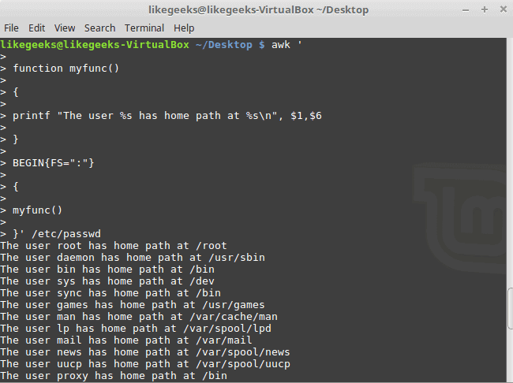

Here we define a function called myprint, then we use it in our script to print output using printf function.

# AWK – Output Redirection

So far, we displayed data on standard output stream. We can also redirect data to a file. A redirection appears after the **print** or **printf** statement. Redirections in AWK are written just like redirection in  shell commands, except that they are written inside the AWK program.  This chapter explains redirection with suitable examples.

## Redirection Operator

The syntax of the redirection operator is −

**Syntax**

```
print DATA > output-file
```

It writes the data into the **output-file**. If the output-file  does not exist, then it creates one. When this type of redirection is  used, the output-file is erased before the first output is written to  it. Subsequent write operations to the same output-file do not erase the output-file, but append to it. For instance, the following example  writes **Hello, World !!!** to the file.

Let us create a file with some text data.

**Example**

```
[jerry]$ echo "Old data" > /tmp/message.txt
[jerry]$ cat /tmp/message.txt
```

On executing this code, you get the following result −

**Output**

```
Old data
```

Now let us redirect some contents into it using AWK’s redirection operator.

**Example**

```
[jerry]$ awk 'BEGIN { print "Hello, World !!!" > "/tmp/message.txt" }'
[jerry]$ cat /tmp/message.txt
```

On executing this code, you get the following result −

**Output**

```
Hello, World !!!
```

## Append Operator

The syntax of append operator is as follows −

**Syntax**

```
print DATA >> output-file
```

It appends the data into the **output-file**. If the output-file  does not exist, then it creates one. When this type of redirection is  used, new contents are appended at the end of file. For instance, the  following example appends **Hello, World !!!** to the file.

Let us create a file with some text data.

**Example**

```
[jerry]$ echo "Old data" > /tmp/message.txt 
[jerry]$ cat /tmp/message.txt
```

On executing this code, you get the following result −

**Output**

```
Old data
```

Now let us append some contents to it using AWK’s append operator.

**Example**

```
[jerry]$ awk 'BEGIN { print "Hello, World !!!" >> "/tmp/message.txt" }'
[jerry]$ cat /tmp/message.txt
```

On executing this code, you get the following result −

**Output**

```
Old data
Hello, World !!!
```

## Pipe

It is possible to send output to another program through a pipe  instead of using a file. This redirection opens a pipe to command, and  writes the values of items through this pipe to another process to  execute the command. The redirection argument command is actually an AWK expression. Here is the syntax of pipe −

**Syntax**

```
print items | command
```

Let us use **tr** command to convert lowercase letters to uppercase.

**Example**

```
[jerry]$ awk 'BEGIN { print "hello, world !!!" | "tr [a-z] [A-Z]" }'
```

On executing this code, you get the following result −

**Output**

```
HELLO, WORLD !!!
```

## Two way communication ??

AWK can communicate to an external process using **|&**, which is two-way communication. For instance, the following example uses **tr** command to convert lowercase letters to uppercase. Our **command.awk** file contains −

**Example**

```
BEGIN {
   cmd = "tr [a-z] [A-Z]"
   print "hello, world !!!" |& cmd
   close(cmd, "to")
   
   cmd |& getline out
   print out;
   close(cmd);
}
```

On executing this code, you get the following result −

**Output**

```
HELLO, WORLD !!!
```

Does the script look cryptic? Let us demystify it.

- The first statement, **cmd = “tr [a-z] [A-Z]”**, is the command to which we establish the two-way communication from AWK.
- The next statement, i.e., the print command provides input to the **tr** command. Here **&|** indicates two-way communication.
- The third statement, i.e., **close(cmd, “to”)**, closes the **to** process after competing its execution.
- The next statement **cmd |& getline out** stores the **output** into out variable with the aid of getline function.
- The next print statement prints the output and finally the **close** function closes the command.

# AWK – Pretty Printing

So far we have used AWK’s **print** and **printf** functions to display data on standard output. But printf is much more powerful than  what we have seen before. This function is borrowed from the C language  and is very helpful while producing formatted output. Below is the  syntax of the printf statement −

**Syntax**

```
printf fmt, expr-list
```

In the above syntax **fmt** is a string of format specifications and constants. **expr-list** is a list of arguments corresponding to format specifiers.

## Escape Sequences

Similar to any string, format can contain embedded escape sequences. Discussed below are the escape sequences supported by AWK −

### New Line

The following example prints **Hello** and **World** in separate lines using newline character −

**Example**

```
[jerry]$ awk 'BEGIN { printf "Hello\nWorld\n" }'
```

On executing this code, you get the following result −

**Output**

```
Hello
World
```

### Horizontal Tab

The following example uses horizontal tab to display different field −

**Example**

```
[jerry]$ awk 'BEGIN { printf "Sr No\tName\tSub\tMarks\n" }'
```

On executing the above code, you get the following result −

**Output**

```
Sr No   Name    Sub Marks
```

### Vertical Tab

The following example uses vertical tab after each filed −

**Example**

```
[jerry]$ awk 'BEGIN { printf "Sr No\vName\vSub\vMarks\n" }'
```

On executing this code, you get the following result −

**Output**

```
Sr No
   Name
      Sub
         Marks
```

### Backspace

The following example prints a backspace after every field except the last one. It erases the last number from the first three fields. For  instance, **Field 1** is displayed as **Field**, because the last character is erased with backspace. However, the last field **Field 4** is displayed as it is, as we did not have a **\b** after **Field 4**.

**Example**

```
[jerry]$ awk 'BEGIN { printf "Field 1\bField 2\bField 3\bField 4\n" }'
```

On executing this code, you get the following result −

**Output**

```
Field Field Field Field 4
```

### Carriage Return

In the following example, after printing every field, we do a **Carriage Return** and print the next value on top of the current printed value. It means, in the final output, you can see only **Field 4**, as it was the last thing to be printed on top of all the previous fields.

**Example**

```
[jerry]$ awk 'BEGIN { printf "Field 1\rField 2\rField 3\rField 4\n" }'
```

On executing this code, you get the following result −

**Output**

```
Field 4
```

### Form Feed

The following example uses form feed after printing each field.

**Example**

```
[jerry]$ awk 'BEGIN { printf "Sr No\fName\fSub\fMarks\n" }'
```

On executing this code, you get the following result −

**Output**

```
Sr No
   Name
      Sub
         Marks
```

## Format Specifier

As in C-language, AWK also has format specifiers. The AWK version of  the printf statement accepts the following conversion specification  formats −

### %c

It prints a single character. If the argument used for **%c** is  numeric, it is treated as a character and printed. Otherwise, the  argument is assumed to be a string, and the only first character of that string is printed.

**Example**

```
[jerry]$ awk 'BEGIN { printf "ASCII value 65 = character %c\n", 65 }'
```

**Output**

On executing this code, you get the following result −

```
ASCII value 65 = character A
```

### %d and %i

It prints only the integer part of a decimal number.

**Example**

```
[jerry]$ awk 'BEGIN { printf "Percentags = %d\n", 80.66 }'
```

On executing this code, you get the following result −

**Output**

```
Percentags = 80
```

### %e and %E

It prints a floating point number of the form [-]d.dddddde[+-]dd.

**Example**

```
[jerry]$ awk 'BEGIN { printf "Percentags = %E\n", 80.66 }'
```

On executing this code, you get the following result −

**Output**

```
Percentags = 8.066000e+01
```

The **%E** format uses **E** instead of e.

**Example**

```
[jerry]$ awk 'BEGIN { printf "Percentags = %e\n", 80.66 }'
```

On executing this code, you get the following result −

**Output**

```
Percentags = 8.066000E+01
```

### %f

It prints a floating point number of the form [-]ddd.dddddd.

**Example**

```
[jerry]$ awk 'BEGIN { printf "Percentags = %f\n", 80.66 }'
```

On executing this code, you get the following result −

**Output**

```
Percentags = 80.660000
```

### %g and %G

Uses %e or %f conversion, whichever is shorter, with non-significant zeros suppressed.

**Example**

```
[jerry]$ awk 'BEGIN { printf "Percentags = %g\n", 80.66 }'
```

**Output**

On executing this code, you get the following result −

```
Percentags = 80.66
```

The **%G** format uses **%E** instead of %e.

**Example**

```
[jerry]$ awk 'BEGIN { printf "Percentags = %G\n", 80.66 }'
```

On executing this code, you get the following result −

**Output**

```
Percentags = 80.66
```

### %o

It prints an unsigned octal number.

**Example**

```
[jerry]$ awk 'BEGIN { printf "Octal representation of decimal number 10 = %o\n", 10}'
```

On executing this code, you get the following result −

**Output**

```
Octal representation of decimal number 10 = 12
```

### %u

It prints an unsigned decimal number.

**Example**

```
[jerry]$ awk 'BEGIN { printf "Unsigned 10 = %u\n", 10 }'
```

On executing this code, you get the following result −

**Output**

```
Unsigned 10 = 10
```

### %s

It prints a character string.

**Example**

```
[jerry]$ awk 'BEGIN { printf "Name = %s\n", "Sherlock Holmes" }'
```

On executing this code, you get the following result −

**Output**

```
Name = Sherlock Holmes
```

### %x and %X

It prints an unsigned hexadecimal number. The **%X** format uses uppercase letters instead of lowercase.

**Example**

```
[jerry]$ awk 'BEGIN { 
   printf "Hexadecimal representation of decimal number 15 = %x\n", 15
}'
```

On executing this code, you get the following result −

**Output**

```
Hexadecimal representation of decimal number 15 = f
```

Now let use %X and observe the result −

**Example**

```
[jerry]$ awk 'BEGIN { 
   printf "Hexadecimal representation of decimal number 15 = %X\n", 15
}'
```

On executing this code, you get the following result −

**Output**

```
Hexadecimal representation of decimal number 15 = F
```

### %%

It prints a single **%** character and no argument is converted.

**Example**

```
[jerry]$ awk 'BEGIN { printf "Percentags = %d%%\n", 80.66 }'
```

On executing this code, you get the following result −

**Output**

```
Percentags = 80%
```

## Optional Parameters with %

With **%** we can use following optional parameters −

### Width

The field is padded to the **width**. By default, the field is padded with spaces but when 0 flag is used, it is padded with zeroes.

**Example**

```
[jerry]$ awk 'BEGIN { 
   num1 = 10; num2 = 20; printf "Num1 = %10d\nNum2 = %10d\n", num1, num2 
}'
```

On executing this code, you get the following result −

**Output**

```
Num1 =         10
Num2 =         20
```

### Leading Zeros

A leading zero acts as a flag, which indicates that the output should be padded with zeroes instead of spaces. Please note that this flag  only has an effect when the field is wider than the value to be printed. The following example describes this −

**Example**

```
[jerry]$ awk 'BEGIN { 
   num1 = -10; num2 = 20; printf "Num1 = %05d\nNum2 = %05d\n", num1, num2 
}'
```

On executing this code, you get the following result −

**Output**

```
Num1 = -0010
Num2 = 00020
```

### Left Justification

The expression should be left-justified within its field. When the  input-string is less than the number of characters specified, and you  want it to be left justified, i.e., by adding spaces to the right, use a minus symbol (–) immediately after the % and before the number.

In the following example, output of the AWK command is piped to the cat command to display the END OF LINE($) character.

**Example**

```
[jerry]$ awk 'BEGIN { num = 10; printf "Num = %-5d\n", num }' | cat -vte
```

On executing this code, you get the following result −

**Output**

```
Num = 10   $
```

### Prefix Sign

It always prefixes numeric values with a sign, even if the value is positive.

**Example**

```
[jerry]$ awk 'BEGIN { 
   num1 = -10; num2 = 20; printf "Num1 = %+d\nNum2 = %+d\n", num1, num2 
}'
```

On executing this code, you get the following result −

**Output**

```
Num1 = -10
Num2 = +20
```

### Hash

For %o, it supplies a leading zero. For %x and %X, it supplies a  leading 0x or 0X respectively, only if the result is non-zero. For %e,  %E, %f, and %F, the result always contains a decimal point. For %g and  %G, trailing zeros are not removed from the result. The following  example describes this −

**Example**

```
[jerry]$ awk 'BEGIN { 
   printf "Octal representation = %#o\nHexadecimal representaion = %#X\n", 10, 10
}'
```

On executing this code, you get the following result −

**Output**

```
Octal representation = 012
Hexadecimal representation = 0XA
```


```
awk '{
   if((/^`define/) && (NF == 3))
	{gsub(/"/,"",$3);print "set_global_assignment -name VERILOG_MACRO \x22"$2"="$3\x22"}
else if ((/^`define/) && (NF == 2))
	{print "set_global_assignment -name VERILOG_MACRO \x22"$2"=1\x22"}
}' file_input > file_output
```

## Split a file using a pattern as a delimiterSplit a file using a pattern as a delimiter
**split file with END**
```
ATOM 1
ATOM 3
ATOM 25
END 
ATOM 2
ATOM 36
ATOM 22
ATOM 12 
END 
ATOM 1
ATOM 87
END 
```

**solution**
```
$ awk 'BEGIN {f="file."(++c)".txt"} 
       /END/ {close(f); f="file"(++c)".txt"; next} 
             {print > f}' file
```

